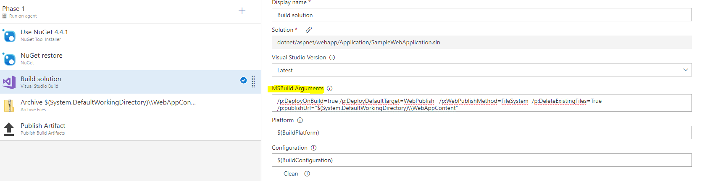
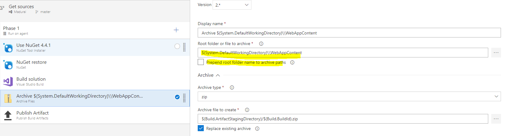

### Error: No package found with specified pattern

Check if the package mentioned in the task is published as an artifact in the build or a previous stage and downloaded in the current job.

### Error: Publish using zip deploy option is not supported for msBuild package type

Web packages created using MSBuild task (with default arguments) have a nested folder structure that can only be deployed correctly by Web Deploy. Publish to zip deploy option can not be used to deploy those packages. To convert the packaging structure, follow the below steps. 

* In Build Solution task, change the MSBuild Arguments to
/p:DeployOnBuild=true /p:DeployDefaultTarget=WebPublish /p:WebPublishMethod=FileSystem /p:DeleteExistingFiles=True /p:publishUrl="$(System.DefaultWorkingDirectory)\\WebAppContent"

* Add Archive Task and change the inputs as follows:
  * Change *Root folder or file to archive* to
    $(System.DefaultWorkingDirectory)\\WebAppContent
    
 
   * Disable *Prepend root folder name to archive paths* option
    
