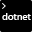
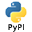

# Build and release tasks

**VSTS | TFS 2018 | TFS 2017 | TFS 2015 | [Previous versions (XAML builds)](https://msdn.microsoft.com/library/ms400688%28v=vs.120%29.aspx)**

## Build

| Task | Versions |
| ---- | -------- |
|  Android Build - deprecated. Use [Gradle](build/gradle.md) | VSTS, TFS 2015 RTM and newer |
|  [Android Signing](build/android-signing.md). Sign and align Android APK files | VSTS, TFS 2015 RTM and newer |
|  [Ant](build/ant.md). Build with Apache Ant | VSTS, TFS 2015 RTM and newer |
|  [CMake](build/cmake.md). Build with the CMake cross-platform build system | VSTS, TFS 2015 RTM and newer |
|  [Docker](build/docker.md). Build, tag, push, or run Docker images, or run a Docker command. | VSTS |
|  [Docker Compose](build/docker-compose.md). Build, push or run multi-container Docker applications. | VSTS |
|  [Go](build/go.md). Get, build, test a go application, or run a custom go command. | VSTS |
|  [Gradle](build/gradle.md). Build using a Gradle wrapper script | VSTS, TFS 2015 RTM and newer |
|  [Grunt](build/grunt.md). The JavaScript Task Runner | VSTS, TFS 2015.3 and newer |
|  [Gulp](build/gulp.md). Node.js streaming task based build system | VSTS, TFS 2015 RTM and newer |
|  [Index Sources & Publish Symbols](build/index-sources-publish-symbols.md). Index your source code and publish symbols to a file share | VSTS, TFS 2015 RTM and newer |
|  [Jenkins Queue Job](build/jenkins-queue-job.md). Queue a job on a Jenkins server | VSTS, TFS 2017 RTM and newer |
|  [Maven](build/maven.md). Build with Apache Maven | VSTS, TFS 2015 RTM and newer |
|  [MSBuild](build/msbuild.md). Build with MSBuild | VSTS, TFS 2015 RTM and newer |
|  [.NET Core CLI](build/dotnet-core-cli.md). Build, test, package, or publish a dotnet application, or run a custom dotnet command. | VSTS, TFS 2018 |
|  [Publish Build Artifacts](utility/copy-and-publish-build-artifacts.md). Publish Build artifacts to the server or a file share | TFS 2015 RTM. Deprecated on VSTS and newer versions of TFS. |
| [SonarQube - Begin Analysis](https://docs.sonarqube.org/display/SCAN/Analyzing+with+SonarQube+Extension+for+VSTS-TFS). Fetch the Quality Profile from SonarQube to configure the analysis | VSTS, TFS 2015.3 and newer |
| [SonarQube - End Analysis](https://docs.sonarqube.org/display/SCAN/Analyzing+with+SonarQube+Extension+for+VSTS-TFS). Finish the analysis and upload the results to SonarQube | VSTS, TFS 2015.3 and newer |
|  [Visual Studio Build](build/visual-studio-build.md). Build with MSBuild and set the Visual Studio version property | VSTS, TFS 2015 RTM and newer |
|  [Xamarin.Android](build/xamarin-android.md). Build an Android app with Xamarin | VSTS, TFS 2015 RTM and newer |
|  [Xamarin.iOS](build/xamarin-ios.md). Build an iOS app with Xamarin on macOS | VSTS, TFS 2015 RTM and newer |
|  [Xcode](build/xcode.md). Build an Xcode workspace on macOS | VSTS, TFS 2015 RTM and newer |
|  [Xcode Package iOS](build/xcode-package-ios.md). Generate an .ipa file from Xcode build output | VSTS, TFS 2015 RTM and newer |

## Utility

| Task | Versions |
| ---- | -------- |
|  [Archive Files](utility/archive-files.md). Archive files using a variety of compression formats such as .7z, .rar, .tar.gz, and .zip. | VSTS, TFS 2017 and newer |
|  [Azure Function](utility/azure-function.md). Invoke a HTTP triggered function in an Azure function app and parse the response. | VSTS |
|  [Azure Network Load Balancer](utility/azure-nlb-management.md).Connect/Disconnect an Azure virtual machine's network interface to a Load Balancer's backend address pool | VSTS |
|  [Bash](utility/bash.md). Run a Bash script on macOS, Linux, or Windows | VSTS |
|  [Batch Script](utility/batch-script.md). Run a windows cmd or bat script and optionally allow it to change the environment | VSTS, TFS 2015 RTM and newer |
|  [Command Line](utility/command-line.md). Run a command line with arguments | VSTS, TFS 2015 RTM and newer |
|  [Copy and Publish Build Artifacts](utility/copy-and-publish-build-artifacts.md). Copy Build artifacts to staging folder then publish Build artifacts to the server or a file share | TFS 2015 RTM. Deprecated on VSTS and newer versions of TFS. |
|  [Copy Files](utility/copy-files.md). Copy files from source folder to target folder using minimatch patterns (The minimatch patterns will only match file paths, not folder paths). | VSTS, TFS 2015.3 and newer |
|  [cURL Upload Files](utility/curl-upload-files.md). Use cURL to upload files with supported protocols. (FTP, FTPS, SFTP, HTTP, and more) | VSTS, TFS 2015 RTM and newer |
|  [Decrypt File](utility/decrypt-file.md). A thin utility task for file decryption using OpenSSL. | VSTS |
|  [Delay](utility/delay.md). Pause execution of the process for a fixed delay time. | VSTS |
|  [Delete Files](utility/delete-files.md). Delete files or folders. | VSTS, TFS 2015.3 and newer |
|  [Download Build Artifacts](utility/download-build-artifacts.md). Download build artifacts. | VSTS |
|  [Download Package](utility/download-package.md). Download a package from a Package Management feed in VSTS or TFS.  Requires the Package Management extension. | VSTS |
|  [Download Secure File](utility/download-secure-file.md). Download a secure file to a temporary location on the build or release agent. | VSTS |
|  [Extract Files](utility/extract-files.md). Extract files from archives (.zip, .jar, .war, .ear, .tar, .7z., and others) to a target folder. | VSTS, TFS 2017 and newer |
|  [FTP Upload](utility/ftp-upload.md). Upload files to a remote machine using the File Transfer Protocol (FTP), or securely with FTPS. | VSTS, TFS 2017 and newer |
|  [Install Apple Certificate](utility/install-apple-certificate.md). Install an Apple certificate required to build on a macOS agent. | VSTS, TFS 2018 |
|  [Install Apple Provisioning Profile](utility/install-apple-provisioning-profile.md). Install an Apple provisioning profile required to build on a macOS agent. | VSTS, TFS 2018 |
|  [Install SSH Key](utility/install-ssh-key.md). Install an SSH key prior to a build or release | VSTS |
|  [Invoke HTTP REST API](utility/http-rest-api.md). Invoke an HTTP API and parse the response. | VSTS |
|  [Jenkins Download Artifacts](utility/jenkins-download-artifacts.md). Download artifacts produced by a Jenkins job | VSTS |
|  [Manual Intervention](utility/manual-intervention.md). Pause an active deployment within an environment, typically to perform some manual steps or actions, and then continue the automated deployment tasks. | VSTS |
|  [PowerShell](utility/powershell.md). Run a PowerShell script | VSTS, TFS 2015 RTM and newer |
|  [Publish Build Artifacts](utility/publish-build-artifacts.md). Publish Build artifacts to the server or a file share | VSTS, TFS 2015.3 and newer |
|  [Publish To Azure Service Bus](utility/publish-to-azure-service-bus.md). Send a message to an Azure Service Bus using a service connection and without using an agent. | VSTS |
|  [Python Script](utility/python-script.md). Run a Python script. | VSTS |
|  [Query Azure Monitor Alerts](utility/azure-monitor.md). Observe the configured Azure monitor rules for active alerts. | VSTS |
|  [Query Work Items](utility/work-item-query.md). Ensure the number of matching items returned by a work item query in within the configured thresholds. | VSTS |
|  [Service Fabric PowerShell](utility/service-fabric-powershell.md). Runs any PowerShell command or script in a PowerShell session that has a Service Fabric cluster connection initialized. | VSTS |
|  [Shell Script](utility/shell-script.md). Run a shell script using bash | VSTS, TFS 2015 RTM and newer |
|  [Update Service Fabric App Versions](utility/service-fabric-versioning.md). Automatically updates the versions of a packaged Service Fabric application | VSTS, TFS 2017 and newer |

## Test

| Task | Versions |
| ---- | -------- |
|  [App Center Test](test/app-center-test.md). Test mobile app packages with Visual Studio App Center | VSTS, TFS 2015.3 and newer |
|  [Cloud-based Apache JMeter Load Test](test/run-jmeter-load-test.md). Runs the Apache JMeter load test in cloud | VSTS, TFS 2015 RTM and newer |
|  [Cloud-based Load Test](test/cloud-based-load-test.md). Runs the load test in cloud, with VSTS | VSTS, TFS 2015 RTM and newer |
|  [Cloud-based Web Performance Test](test/cloud-based-web-performance-test.md). Runs the quick web performance test in cloud, with VSTS | VSTS, TFS 2015 RTM and newer |
|  [Publish Code Coverage Results](test/publish-code-coverage-results.md). Publish code coverage results to VSTS/TFS | VSTS, TFS 2015.3 and newer |
|  [Publish Test Results](test/publish-test-results.md). Publish Test Results to VSTS/TFS | VSTS, TFS 2015 RTM and newer |
|  [Run Functional Tests](test/run-functional-tests.md). Run Coded UI/Selenium/Functional tests on a set of machines (using Test Agent) | VSTS, TFS 2015.3 and newer |
|  [Visual Studio Test version 2](test/vstest.md). [Visual Studio Test version 1](https://github.com/Microsoft/vsts-tasks/blob/releases/m109/Tasks/VsTest/README.md) Run unit and functional tests (Selenium, Appium, Coded UI test, etc.) using the Visual Studio Test runner. Test frameworks that have a Visual Studio test adapter such as xUnit, NUnit, Chutzpah, etc. can also be run. | VSTS, TFS 2015 RTM and newer |
|  [Visual Studio Test Agent Deployment](test/visual-studio-test-agent-deployment.md). Deploy and configure Test Agent to run tests on a lab machine group | VSTS, TFS 2015 RTM and newer |

## Package

| Task | Versions |
| ---- | -------- |
|  [Conda Environment](package/conda-environment.md). Create and activate a Conda environment | VSTS |
|  [CocoaPods](package/cocoapods.md). CocoaPods is the dependency manager for Swift and Objective-C Cocoa projects. Runs pod install | VSTS, TFS 2015 RTM and newer |
|  [npm](package/npm.md). Install npm packages | VSTS, TFS 2015 RTM and newer |
|  [npm Authenticate](package/npm-authenticate.md). Don't use this task if you're also using the npm task. Provides npm credentials to an .npmrc file in your repository for the scope of the build. | VSTS, TFS 2015 RTM and newer |
|  [NuGet Installer](package/nuget.md). Installs and updates missing NuGet packages | VSTS, TFS 2015 RTM and newer |
|  [NuGet Packager](package/nuget.md)Creates nupkg outputs from csproj or nuspec files | VSTS, TFS 2015.3 and newer |
|  [NuGet Publisher](package/nuget.md). Uploads nupkg files to a nuget server | VSTS, TFS 2015.3 and newer |
|  [PyPI Publisher](package/pypi-publisher.md). Publish a Python package to PyPI | VSTS |
|  Xamarin Component Restore. - deprecated. See [Updating component references to NuGet](https://docs.microsoft.com/xamarin/cross-platform/troubleshooting/component-nuget) | VSTS, TFS 2015 RTM and newer | VSTS, TFS 2017 and newer |

## Deploy

| Task | Versions |
| ---- | -------- |
|  [App Center Distribute](deploy/app-center-distribute.md). Distribute app builds to testers and users via App Center | VSTS, TFS 2017 and newer |
|  [Azure App Service Deploy](deploy/azure-rm-web-app-deployment.md). Update Azure App Service using Web Deploy / Kudu REST APIs | VSTS, TFS 2017 and newer |
|  [Azure App Service Manage](deploy/azure-app-service-manage.md). Start, Stop, Restart or Slot swap for an Azure App Service | VSTS, TFS 2017 and newer|
|  [Azure CLI](deploy/azure-cloud-powershell-deployment.md). Run a shell or batch script containing Azure CLI commands against an Azure subscription | VSTS, TFS 2017 and newer |
|  [Azure File Copy](deploy/azure-file-copy.md). Copy files to Azure blob or VM(s) | VSTS, TFS 2015.3 and newer |
|  [Azure Key Vault](deploy/azure-key-vault.md). Incorporate secrets from an Azure Key Vault into a release definition | VSTS |
|  [Azure Monitor Alerts](deploy/azure-monitor-alerts.md). Configure alerts on available metrics for an Azure resource | VSTS |
|  [Azure MySQL Deployment](deploy/azure-mysql-deployment.md). Run your scripts and make changes to your Azure DB for MySQL. | VSTS |
|  [Azure PowerShell](deploy/azure-powershell.md). Run a PowerShell script within an Azure environment | VSTS, TFS 2015 RTM and newer |
|  [Azure Resource Group Deployment](deploy/azure-resource-group-deployment.md). Deploy, start, stop, delete Azure Resource Groups | VSTS, TFS 2015.3 and newer |
|  [Azure SQL Database Deployment](deploy/sql-azure-dacpac-deployment.md). Deploy an Azure SQL database using DACPAC or run scripts using SQLCMD | VSTS, TFS 2015.3 and newer |
|  [Azure VMSS Deployment](deploy/azure-vmss-deployment.md). Deploy a virtual machine scale set image. | VSTS |
|  [Chef](deploy/chef.md). Deploy to Chef environments by editing environment attributes | VSTS |
|  [Chef Knife](deploy/chef-knife.md). Run Scripts with knife commands on your chef workstation | VSTS |
|  [Copy Files Over SSH](deploy/copy-files-over-ssh.md). Copy files from source folder to target folder on a remote machine over SSH | VSTS, TFS 2017 and newer |
|  [Docker](build/docker.md). Build, tag, push, or run Docker images, or run a Docker command. Task can be used with Docker or Azure Container registry | VSTS, TFS 2017 and newer |
|  [Docker Compose](build/docker-compose.md). Build, push or run multi-container Docker applications. | VSTS |
|  [Helm Deploy](deploy/helm-deploy.md). Deploy, configure, update your Kubernetes cluster in Azure Container Service by running helm commands. | VSTS |
|  [IIS Web App Deploy](deploy/iis-web-app-deployment-on-machine-group.md). Deploy a Website or Web Application using WebDeploy | VSTS |
|  [IIS Web App Manage](deploy/iis-web-app-management-on-machine-group.md). Create or update a Website, Web App, Virtual Directories, and Application Pool | VSTS |
|  [Kubernetes](deploy/kubernetes.md). Deploy, configure, update your Kubernetes cluster in Azure Container Service by running kubectl commands. | VSTS |
|  [Packer Build](deploy/packer-build.md). Build a machine image using Packer. | VSTS |
|  [PowerShell on Target Machines](deploy/powershell-on-target-machines.md). Execute PowerShell scripts on remote machine(s) | VSTS, TFS 2015 RTM and newer |
|  [Service Fabric Application Deployment](deploy/service-fabric-deploy.md). Deploy a Service Fabric application to a cluster | VSTS, TFS 2017 and newer |
|  [Service Fabric Compose Deploy](deploy/service-fabric-compose-deploy.md). Deploy a Service Fabric application to a cluster using a compose file | VSTS |
|  [SSH](deploy/ssh.md). Run shell commands or a script on a remote machine using SSH | VSTS, TFS 2017 and newer |
|  [SQL Server Database Deploy](deploy/sql-dacpac-deployment-on-machine-group.md). Deploy a SQL Server database using DACPAC or SQL scripts | VSTS |
|  [Windows Machine File Copy](deploy/windows-machine-file-copy.md). Copy files to remote machine(s) | VSTS, TFS 2015 RTM and newer |

## Tool

| Task | Versions |
|------|----------|
|  [Go Tool Installer](tool/go-tool.md). Finds or downloads a specific version of the Go tool into the tools cache and adds it to the PATH | VSTS |
|  [Helm Tool Installer](tool/helm-installer.md). Install Helm and Kubernetes on agent machine. | VSTS |
|  [Java Tool Installer](tool/java-tool-installer.md). Acquires a specific version of Java from a user supplied Azure blob, a location in the souce or on the agent, or the tools cache and sets JAVA_HOME. Use this task to change the version of Java used in Java tasks. | VSTS |
|  [.NET Core Tool Installer](tool/dotnet-core-tool-installer.md). Acquires a specific version of .NET Core and adds it to the PATH. Use the task to change the Core version for subsequent tasks. | VSTS, TFS 2018 |
|  [Node Tool Installer](tool/node-js.md). Finds or downloads and caches the specified version of [Node.js](https://nodejs.org/) and adds it to the PATH | VSTS |
|  [Use Python Version](tool/use-python-version.md). Selects a version of Python to run on an agent.  Optionally adds it to PATH. | VSTS |
|  [Use Ruby Version](tool/use-ruby-version.md). Selects a version of Ruby to run on an agent.  Optionally adds it to PATH. | VSTS |
|  [Visual Studio Test Platform Installer](tool/vstest-platform-tool-installer.md). Acquires the Visual Studio Test Platform from nuget.org or the tools cache. | VSTS |

To learn more about tool installer tasks, see [Tool installers](../process/tasks.md#tool-installers).

## Open source

These tasks are open source [on GitHub](https://github.com/Microsoft/vsts-tasks). Feedback and contributions are welcome.

## Q & A  

<!-- BEGINSECTION class="md-qanda" -->

### Where can I learn step-by-step how to build my app?

[Build your app](../apps/index.md)

### Can I add my own build tasks?

Yes: [Add a build task](../../extend/develop/add-build-task.md)

[!INCLUDE [temp](../_shared/qa-agents.md)]

::: moniker range="< vsts"
[!INCLUDE [temp](../_shared/qa-versions.md)]
::: moniker-end

<!-- ENDSECTION -->
