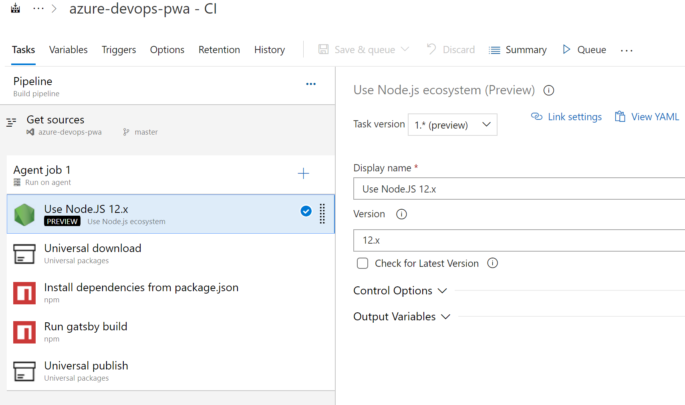
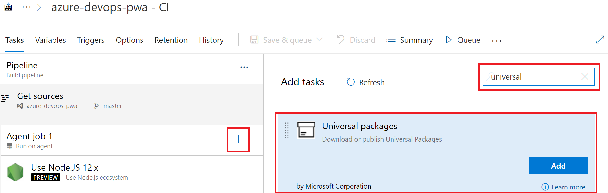
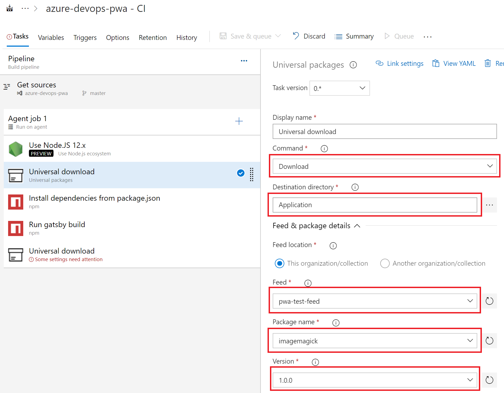
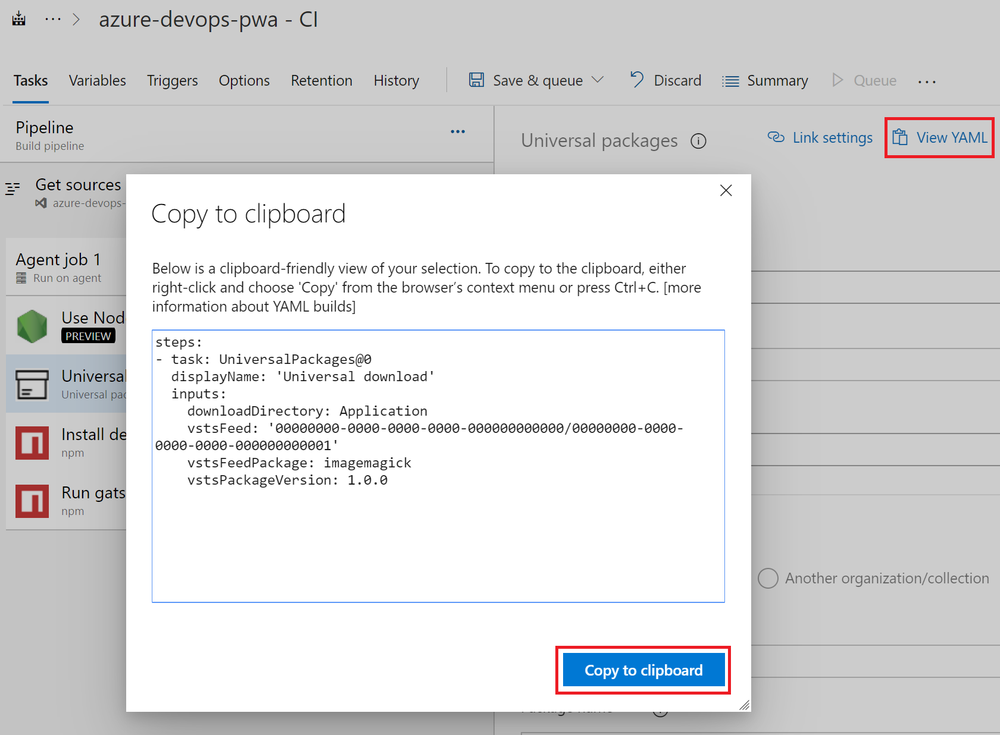
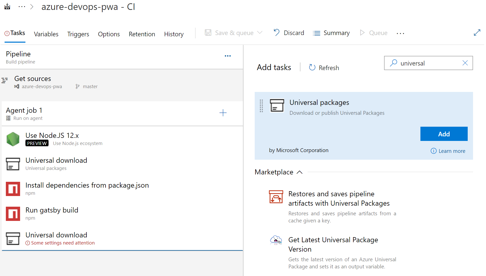
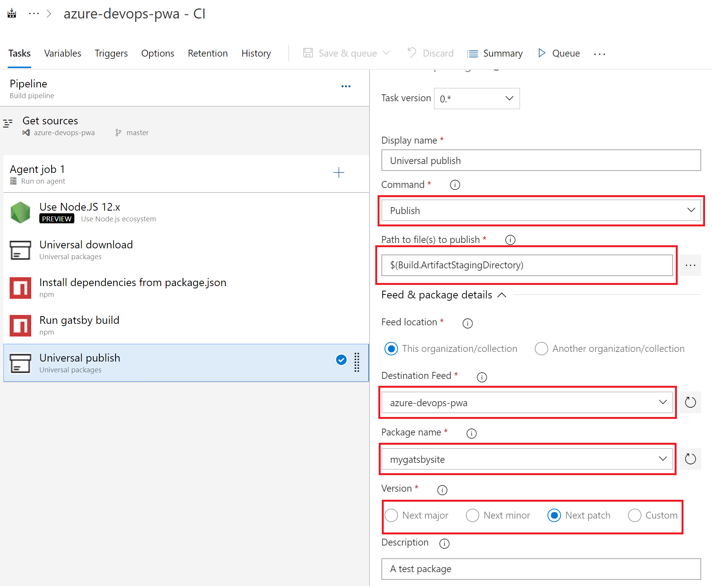

# Universal Package task

[!INCLUDE [version-tfs-2018](../../includes/version-tfs-2018.md)]

Use this task to download, or package and publish Universal Packages.

::: moniker range="<= tfs-2018"

[!INCLUDE [temp](../../includes/concept-rename-note.md)]

::: moniker-end

::: moniker range="> tfs-2018"

## YAML snippet

[!INCLUDE [temp](../includes/yaml/UniversalPackagesV0.md)]

::: moniker-end

## Arguments

| Argument | Description |
| -------- | ----------- |
| `command`<br/>Command | The NuGet command to run.<br/>Options: `download`, `publish` |
| `downloadDirectory`<br/>Destination directory | Folder path where the package's contents download. |
| `feedsToUse`<br/>Feed location | You can select a feed from either this collection or any other collection in Azure Artifacts.<br/>Options: `internal`, `external` |
| `externalFeedCredentials`<br/>Credentials for feeds outside this organization (collection) | Credentials to use for external registries located in the selected NuGet.config. For feeds in this organization (collection), leave this blank; the build's credentials are used automatically. |
| `vstsFeed`<br/>Use packages from this Azure Artifacts/TFS feed | Include the selected feed. You must have Azure Artifacts installed and licensed to select a feed here. |
| `vstsFeedPackage`<br/>Package name | Name of package to download. |
| `vstsPackageVersion`<br/>Package version | Select the package version or use a variable containing the version to download. This entry can also be a wildcard expression such as `*` to get the highest version, `1.*` to get the highest version with major version 1, or `1.2.*` to get the highest patch release with major version 1 and minor version 2. |
| `feedDownloadExternal`<br/>Feed | Specifies the name of an external feed from which to download. |
| `packageDownloadExternal`<br/>Package name | Specifies the package name to download. |
| `versionDownloadExternal`<br/>Package version | Select the package version or use a variable containing the version to download. This entry can also be a wildcard expression, such as `*`, to get the highest version, `1.*` to get the highest version with major version 1, or `1.2.*` to get the highest patch release with major version 1 and minor version 2. |
| `publishDirectory`<br/>Path to files to publish | Specifies the path to list of files to be published. |
| `feedsToUsePublish`<br/>Feed location | You can select a feed from either this collection or any other collection in Azure Artifacts.<br/>Options: `internal`, `external` |
| `publishFeedCredentials`<br/>organization/collection connection | Credentials to use for external feeds. |
| `vstsFeedPublish`<br/>Destination Feed | Specifies the project and feed's name/GUID to publish to. |
| `publishPackageMetadata`<br/>Publish pipeline metadata | Associate this build and release pipeline's metadata (run #, source code information) with the package. |
| `vstsFeedPackagePublish`<br/>Package name | Select a package ID to publish or type a new package ID, if you've never published a version of this package before. Package names must be lower case and can only use letters, numbers, and dashes(-). |
| `feedPublishExternal`<br/>Feed | External feed name to publish to. |
| `packagePublishExternal`<br/>Package name | Package name. |
| `versionOption`<br/>Version | Select a version increment strategy, or select Custom to input your package version manually. For new packages, the first version is 1.0.0 if you select \"Next major\". The first version is 0.1.0 if you select \"Next minor\". The first version is 0.0.1 if you select \"Next patch\". For more information, see the [Semantic Versioning spec](https://semver.org/).<br/>Options: `major`, `minor`, `patch`, `custom` |
| `versionPublish`<br/>Custom version | Select the custom package version. |
| `packagePublishDescription`<br/>Description | Description of the contents of this package and the changes made in this version of the package. |
| `verbosity`<br/>Verbosity | Specifies the amount of detail displayed in the output.<br/>Options: `None`, `Trace`, `Debug`, `Information`, `Warning`, `Error`, `Critical` |
| `publishedPackageVar`<br/>Package Output Variable | Provide a name for the variable that contains the published package name and version. |
| [!INCLUDE [control-options-arguments-md](../includes/control-options-arguments-md.md)] | |

## Example

The simplest way to get started with the Universal Package task is to use the Pipelines task editor to generate the YAML. You can then copy the generated code into your project's `azure-pipelines.yml` file. In this example, the sample demonstrates how to quickly generate the YAML using a pipeline that builds a GatsbyJS progressive web app (PWA).  

Universal Packages are a useful way to both encapsulate and version a web app.  Packaging a web app into a Universal Package enables quick rollbacks to a specific version of your site and eliminates the need to build the site in the deployment pipeline.

This example pipeline demonstrates how to fetch a tool from a feed within your project. The Universal Package task is used to download the tool, run a build, and again uses the Universal Package task to publish the entire compiled GatsbyJS PWA to a feed as a versioned Universal Package.




### Download a package with the Universal Package task

The second task in the sample project uses the Universal Package task to fetch a tool, imagemagick, from a feed that is within a different project in the same organization. The tool, imagemagick, is required by the subsequent build step to resize images. 

1. Add the Universal Package task by clicking the plus icon, typing "universal" in the search box, and clicking the "Add" button to add the task to your pipeline.



2. Click the newly added **Universal Package** task and the **Command** to `Download`. 
3. Choose the **Destination directory** to use for the tool download. 
4. Select a source **Feed** that contains the tool, set the **Package name**, and choose **Version** of the imagemagick tool from the source *Feed**.



5. After completing the fields, click **View YAML** to see the generated YAML.  



6.  The **Universal Package** task builder generates simplified YAML that contains non-default values. Copy the generated YAML into your `azure-pipelines.yml` file at the root of your project's git repo as defined [here](../../customize-pipeline.md#understand-the-azure-pipelinesyml-file).
```YAML
# Download Universal Package
steps:
- task: UniversalPackages@0
  displayName: 'Universal download'
  inputs:
    downloadDirectory: Application
    vstsFeed: '00000000-0000-0000-0000-000000000000/00000000-0000-0000-0000-000000000001'
    vstsFeedPackage: imagemagick
    vstsPackageVersion: 1.0.0
```

### Publish a package with the Universal Package task

The last step in this sample pipeline uses the Universal Package task to upload the production-ready Gatsby PWA that was produced by the `Run gatsby build` step to a feed as a versioned Universal Package.  Once in a feed, you have a permanent copy of your complete site that can be deployed to hosting provider and started with `gatsby serve`.  

1. Add another Universal Package task to the end of the pipeline by clicking the plus icon, typing "universal" in the search box, and clicking the "Add" button to add the task to your pipeline.  This task gathers all of the production-ready assets produced by the `Run gatsby build` step, produce a versioned Universal Package, and publish the package to a feed.  

 

2. Set the **Command** to `Publish`.  
3. Set **Path to file(s) to publish** to the directory containing your GatsbyJS project's `package.json`.  
4. Choose a destination feed, a package name, and set your versioning strategy.



5. After completing the required fields, click **View YAML**. 
6. Copy the resulting YAML into you your `azure-pipelines.yml` file as before. The YAML for this sample project displays below.

```YAML
# Publish Universal Package
steps:
- task: UniversalPackages@0
  displayName: 'Universal publish'
  inputs:
    command: publish
    publishDirectory: Application
    vstsFeedPublish: '00000000-0000-0000-0000-000000000000/00000000-0000-0000-0000-000000000002'
    vstsFeedPackagePublish: mygatsbysite
    packagePublishDescription: 'A test package'
```

This example demonstrated how to use the Pipelines task builder to quickly generate the YAML for the Universal Package task, which can then be placed into your `azure-pipelines.yml` file. The Universal Package task builder supports all of the advanced configurations that can be created with **Universal Package** task's arguments.

> [!NOTE]
> All feeds created through the classic user interface are project-scoped feeds. For the `vstsFeedPublish` parameter, you can also use the project and feed's names instead of their GUIDs like the following: `'<projectName>/<feedName>'`. See [Publish your Universal packages](../../artifacts/universal-packages.md) for more details.

## Open-source on GitHub

These tasks are open source [on GitHub](https://github.com/Microsoft/azure-pipelines-tasks). Feedback and contributions are welcome.

### My Pipeline needs to access a feed in a different project

If the pipeline is running in a different project than the project hosting the feed, you must set up the other project to grant read/write access to the build service. See [Package permissions in Azure Pipelines](../../../artifacts/feeds/feed-permissions.md#pipelines-permissions) for more details.
