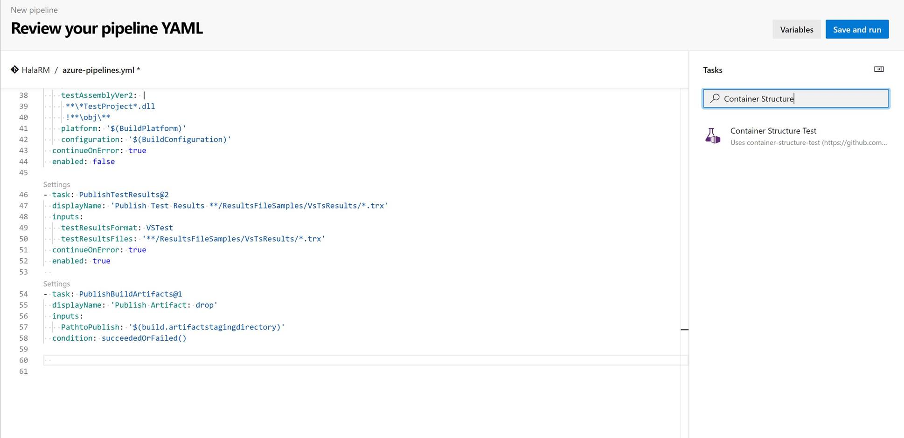
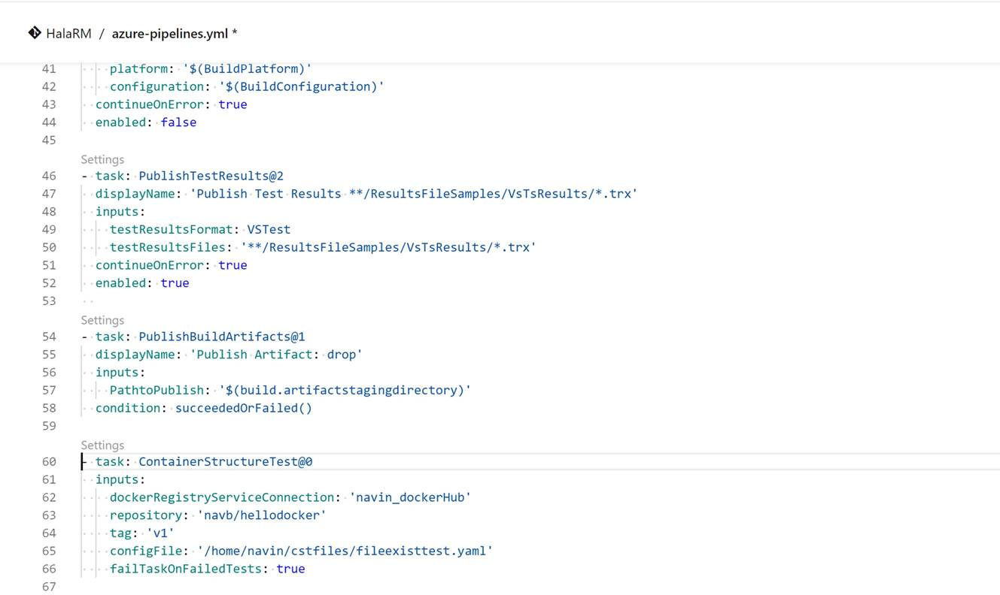
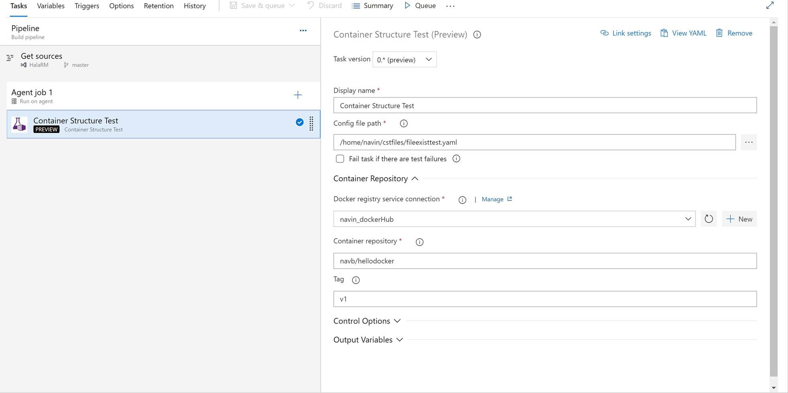
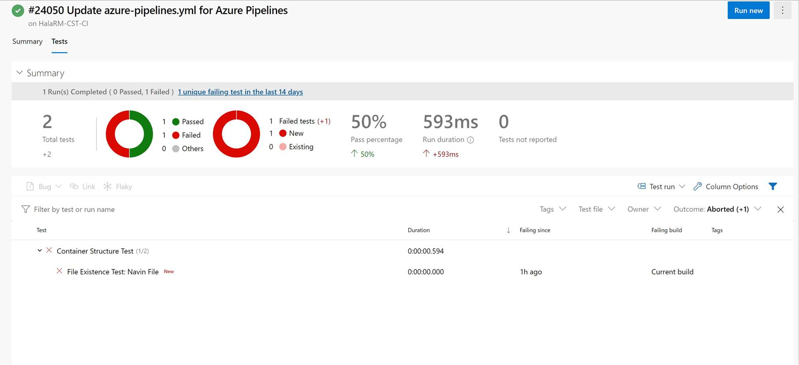

# Container Structure Tests

The Container Structure Tests provide a powerful framework to validate the structure of a container image. These tests can be used to check the output of commands in an image, as well as verify metadata and contents of the filesystem. Tests can be run either through a standalone binary, or through a Docker image. 

Tests within this framework are specified through a YAML or JSON config file. Multiple config files may be specified in a single test run. The config file will be loaded in by the test runner, which will execute the tests in order. Within this config file, four types of tests can be written:

* Command Tests (testing output/error of a specific command issued)
* File Existence Tests (making sure a file is, or isn't, present in the file system of the image)
* File Content Tests (making sure files in the file system of the image contain, or do not contain, specific contents)
* Metadata Test, singular (making sure certain container metadata is correct)

## Container Structure Test Task

This task helps you run conatiner structure tests and publish test results to Azure Pipelines and provides a comprehensive test reporting and analytics experience. 

> [!NOTE]
> This is an early preview feature. More upcoming features will be rolled out in upcoming sprints. 

## Build, Test and Publish Test

The container structure test task can be added in the classic pipeline as well as in unified pipeline (multi-stage) & YAML based pipelines.

# [YAML](#tab/yaml)

In the new YAML based unified pipeline, you can search for task in the window.

Once the task is added, you need to set the config file path, docker registory service connection, container repository and tag, if required. Task input in the yaml based pipeline is created.

### YAML file

> [!div class="mx-imgBorder"]
> 

Sample YAML
[!INCLUDE [temp](../_shared/yaml/ContainerStructureTestV1.md)]

# [Classic](#tab/classic)

In the classic pipeline, you can add this task from the designer view. 

> [!div class="mx-imgBorder"]
> 

* * *

## View test report

Once the task is executed, you can directly go to test tab to view the full report. The published test results are displayed in the [Tests tab](../../test/review-continuous-test-results-after-build.md)
in the pipeline summary and help you to measure pipeline quality, review traceability,
troubleshoot failures, and drive failure ownership. 

> [!div class="mx-imgBorder"]
> 

