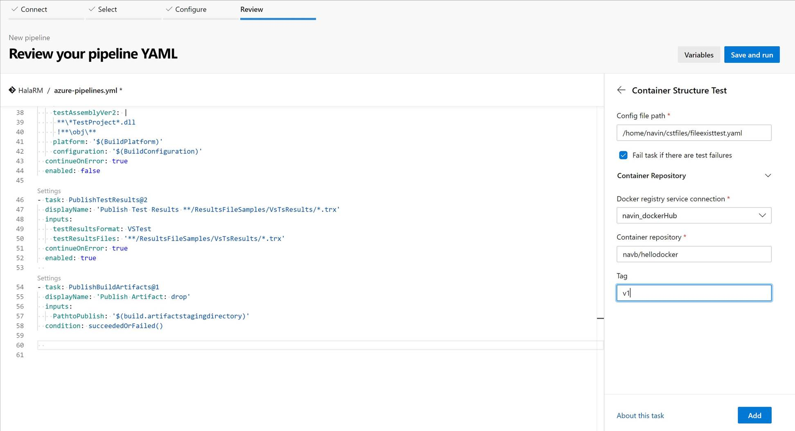

This is a placeholder for container structure test task preview. 
This is how it looks in the old pipeline creation: [Container Repository and Tag uniquely identify the image.] 

This is how it appears in the new pipeline creation:

Task input in the new yaml based pipeline creation flow:

This is how the yaml looks.
[!INCLUDE [temp](../../_shared/yaml/ContainerStructureTestV1.md)]

This Is the results page.

