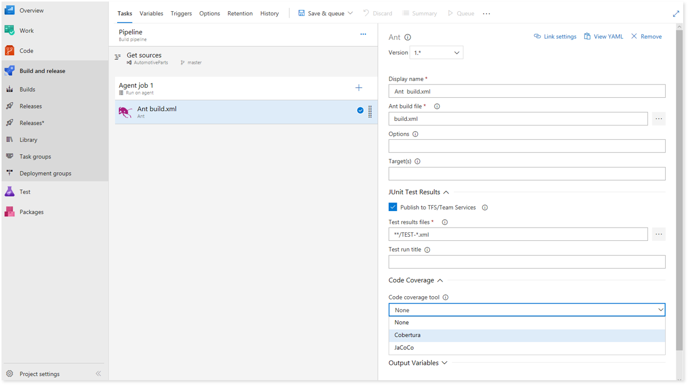

# Publish Code Coverage Results task

[!INCLUDE [temp](../../_shared/version-tfs-2015-rtm.md)]

Use this task in a build pipeline to publish code coverage results to Azure Pipelines or TFS,
which were produced by a build in [Cobertura](http://cobertura.github.io/cobertura/) or [JaCoCo](http://www.eclemma.org/jacoco/) format.
In addition, there are built-in tasks such as [Visual Studio Test](vstest.md), [.NET Core](../build/dotnet-core.md), [Ant](../build/ant.md),
[Maven](../build/maven.md), [Gulp](../build/gulp.md), [Grunt](../build/grunt.md) and [Gradle](../build/gradle.md)
that provide the option to publish code coverage data to the pipeline.

The example below shows the **Ant** task with the option to publish code coverage data in Cobertura or JaCoCo format.

## Demands

[none]

::: moniker range="> tfs-2018"
## YAML snippet
[!INCLUDE [temp](../_shared/yaml/PublishCodeCoverageResultsV1.md)]

The **codeCoverageTool** and **summaryFileLocation** parameters are mandatory. 

To publish code coverage results for Javascript with istanbul using YAML, see [JavaScript](../../languages/javascript.md) in the Languages section of these topics, which also includes examples for other languages. 

::: moniker-end

## Arguments

<table><thead><tr><th>Argument</th><th>Description</th></tr></thead>
<tr><td>Code coverage tool</td><td>(Required) The tool with which code coverage results are generated. The supported formats include Cobertura and JaCoCo.</td></tr>
<tr><td>Summary file</td><td>(Required) Path of the summary file containing code coverage statistics, such as line, method, and class coverage. The value may contain minimatch patterns. For example: `$(System.DefaultWorkingDirectory)/MyApp/**/site/cobertura/coverage.xml`</td></tr>
<tr><td>Report directory</td><td>(Optional) Path of the code coverage HTML report directory. The report directory is published for later viewing as an artifact of the build. The value may contain minimatch patterns. For example: `$(System.DefaultWorkingDirectory)/MyApp/**/site/cobertura`</td></tr>
<tr><td>Additional files</td><td>(Optional) File path pattern specifying any additional code coverage files to be published as artifacts of the build. The value may contain minimatch patterns. For example: `$(System.DefaultWorkingDirectory)/**/*.exec`</td></tr>
<tr><td>Fail when code coverage results are missing</td><td>(Optional) Available only on Azure Pipelines and TFS 2018 and later. Fail the task if code coverage did not produce any results to publish.</td></tr>
[!INCLUDE [temp](../_shared/control-options-arguments.md)]
</table>

## Docker
For apps using docker, build and tests may run inside the container, generating code coverage results within the container. In order to publish the results to  the pipeline, the resulting artifacts should be to be made available to the **Publish Code Coverage Results** task. For reference you can see a similar example for publishing test results under [Build, test, and publish results with a Docker file](publish-test-results.md) section for **Docker**.

## View results
In order to view the code coverage results in the pipeline, see [Review code coverage results](../../test/review-code-coverage-results.md)

## Related tasks

* [Publish Test Results](publish-test-results.md)

## Open source

This task is open source [on GitHub](https://github.com/Microsoft/azure-pipelines-tasks). Feedback and contributions are welcome.

## Q & A
<!-- BEGINSECTION class="md-qanda" -->

::: moniker range="< vsts"
[!INCLUDE [qa-versions](../../_shared/qa-versions.md)]
::: moniker-end

<!-- ENDSECTION -->

[!INCLUDE [test-help-support-shared](../../_shared/test-help-support-shared.md)]

