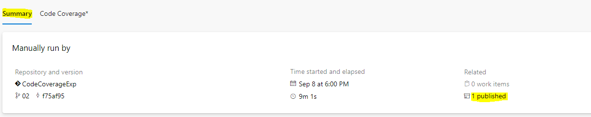
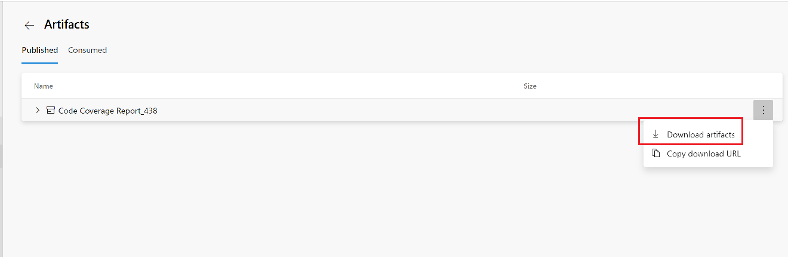

# Publish Code Coverage Results task

[!INCLUDE [temp](../../includes/version-tfs-2015-rtm.md)]

Use this task in a build pipeline to publish code coverage results produced when
running tests to Azure Pipelines or TFS in order to obtain coverage reporting.
The task supports popular coverage result formats such as
[Cobertura](https://cobertura.github.io/cobertura/) and [JaCoCo](https://www.eclemma.org/jacoco/).

This task can only be used in Build pipelines and is not supported in Release pipelines.

Tasks such as [Visual Studio Test](vstest.md), [.NET Core](../build/dotnet-core-cli.md),
[Ant](../build/ant.md), [Maven](../build/maven.md), [Gulp](../build/gulp.md), [Grunt](../build/grunt.md)
also provide the option to publish code coverage data to the pipeline.
If you are using these tasks, you do not need a separate [Publish Code Coverage Results task](publish-code-coverage-results.md)
in the pipeline.

## Demands

To generate the HTML code coverage report you need dotnet 2.0.0 or later on the agent. The dotnet folder needs to be in the environment path. If there are multiple folders containing dotnet, the one with version 2.0.0 must be before any others in the path list.

::: moniker range="> tfs-2018"

## YAML snippet

[!INCLUDE [temp](../includes/yaml/PublishCodeCoverageResultsV1.md)]

The **summaryFileLocation** parameter is mandatory. 

To publish code coverage results for JavaScript with Istanbul using YAML, see [JavaScript](../../ecosystems/javascript.md) in the Ecosystems section of these topics, which also includes examples for other languages. 

::: moniker-end

## Arguments

|Argument|Description|
|--- |--- |
|`summaryFileLocation`  Path to summary files|(Required) Path of the summary file containing code coverage statistics, such as line, method, and class coverage. Multiple summary files will be merged into a single report. The value may contain minimatch patterns.  For example: `$(System.DefaultWorkingDirectory)/MyApp/**/site/cobertura/coverage.xml`|
|`codeCoverageTool`  The format of the coverage report|(Optional) Specify the format of the coverage report.  Options: `JaCoCo (Default), Cobertura`|
|`pathToSources`  Path to Source files|(Optional) Path to source files is required when coverage XML reports do not contain absolute path to source files.  For example, JaCoCo reports do not use absolute paths and when publishing JaCoCo coverage for Java apps, the pattern would be similar to `$(System.DefaultWorkingDirectory)/MyApp/src/main/java/`.  This input is also needed if tests are run in a docker container. This input should point to absolute path to source files on the host.  For example, `$(System.DefaultWorkingDirectory)/MyApp/`|
|`failIfCoverageEmpty` Fail if code coverage results are missing|(Optional) Fail the task if code coverage did not produce any results to publish.|

## Docker
For apps using docker, build and tests may run inside the container, generating code coverage results within the container. In order to publish the results to  the pipeline, the resulting artifacts should be to be made available to the **Publish Code Coverage Results** task. For reference you can see a similar example for publishing test results under [Build, test, and publish results with a Docker file](publish-test-results.md) section for **Docker**.

## View results
In order to view the code coverage results in the pipeline, see [Review code coverage results](../../test/review-code-coverage-results.md)

## Related tasks

* [Publish Test Results](publish-test-results.md)

## Open source

This task is open source [on GitHub](https://github.com/Microsoft/azure-pipelines-tasks). Feedback and contributions are welcome.

## FAQ

### Is code coverage data merged when multiple files are provided as input to the task or multiple tasks are used in the pipeline? 
At present, the code coverage reporting functionality provided by this task is limited and it does not merge coverage data. If you provide multiple files as input to the task, only the first match is considered. 
If you use multiple publish code coverage tasks in the pipeline, the summary and report is shown for the last task. Any previously uploaded data is ignored.

[!INCLUDE [test-help-support-shared](../../includes/test-help-support-shared.md)]

## Known issues

The publish code coverage results task generates and publishes the HTML report, a set of HTML files that are linked from the main *index.html* file. If the code coverage tab fails to show the code coverage report, check whether the size of the *index.html* file is close to or larger than 7 MB. Complete the following steps to check the size of the file. Then, if the file size is close to or larger than 7 MB, you can use the following workaround to view the coverage report:

1. Select the build **Summary** tab, and then select the **published** link:

   

2. Next to the *Code Coverage Report_\** artifact, select **Download artifacts**:

   

3. When the code coverage report is downloaded, extract the .zip file.
4. In the code coverage report, check the size of *index.html* to help determine whether the file size is causing the issue described here.
5. Open *index.html* in a browser to view the code coverage report.
