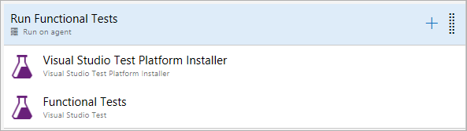
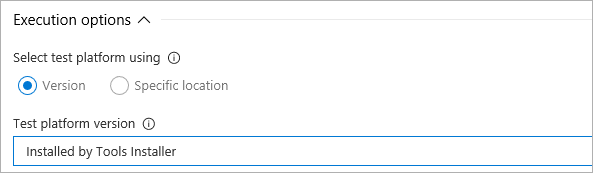

# Visual Studio Test Platform Installer task

**Azure DevOps Services | TFS 2018 Update 2**

Use this task in a build or release pipeline to acquire the [Microsoft test platform](https://www.nuget.org/packages/Microsoft.TestPlatform/)
from nuget.org or a specified feed, and add it to the tools cache. The installer task satisfies the 'vstest'
demand and a subsequent [Visual Studio Test task](../test/vstest.md)
in a build or release pipeline can run without needing a full Visual Studio install on the agent machine. 

## Demands

[none]

::: moniker range="> tfs-2018"
## YAML snippet
[!INCLUDE [temp](../_shared/yaml/VsTestPlatformToolInstallerV1.md)]
::: moniker-end

## Arguments

| Argument | Description | 
| --- | --- | 
| Package Feed | (Required) Can be:  **Official NuGet** - Use this option to acquire the [test platform package from NuGet](https://www.nuget.org/packages/Microsoft.TestPlatform/). This option requires internet connectivity on the agent machine. **Custom feed** - Use this option to acquire the test platform package from a custom feed or a package management feed in Azure DevOps or TFS. **Network path** - Use this option to install the test platform from a network share. The desired version of Microsoft.TestPlatform.nupkg file must be downloaded from NuGet and placed on a network share that the build/release agent can access.  |
| Version | (Required) Select whether to install the latest version (including any pre-release versions), the latest stable version, or a specific version of the Visual Studio Test Platform. | 
| Test Platform Version | (Required) Specify the version of Visual Studio Test Platform to install on the agent. Available versions can be viewed on [NuGet](https://www.nuget.org/packages/Microsoft.TestPlatform/). |
| Package Source | (Required) Specify the URL of a custom feed or a package management feed in Azure DevOps or TFS that contains the test platform package. Public as well as private feeds can be specified. | 
| Username | Specify the user name to authenticate with the feed specified in the **Package Source** argument. If using a personal access token (PAT) in the password argument, this input is not required. |
| Password | Specify the password or personal access token (PAT) to authenticate with the feed specified in the **Package Source** argument. |
| UNC Path | (Required) Specify the full UNC path to the Microsoft.TestPlatform.nupkg file. The desired version of Microsoft.TestPlatform.nupkg must be downloaded from [NuGet](https://www.nuget.org/packages/Microsoft.TestPlatform/) and placed on a network share that the build/release agent can access. | 
 
**NOTE:**

* The **Visual Studio Test Platform Installer** task must appear before the **Visual Studio Test** task in the build or release pipeline.

  

* The **Test platform version** option in the **Visual Studio Test** task must be set to **Installed by Tools Installer**. 

  

See [Run automated tests from test plans](../../../test/run-automated-tests-from-test-hub.md)

## Open source

This task is open source [on GitHub](https://github.com/Microsoft/azure-pipelines-tasks). Feedback and contributions are welcome.
