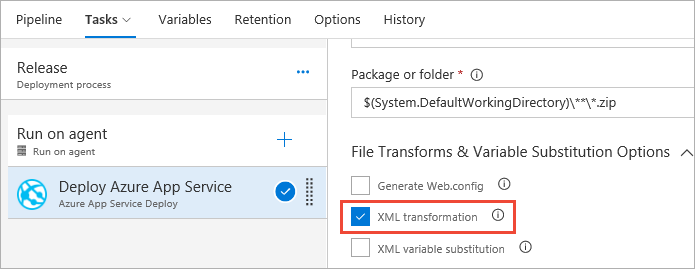
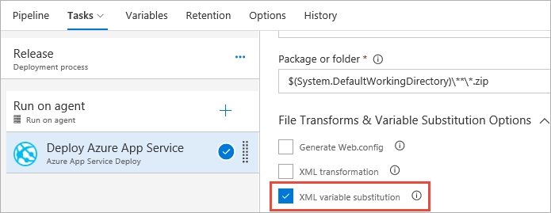
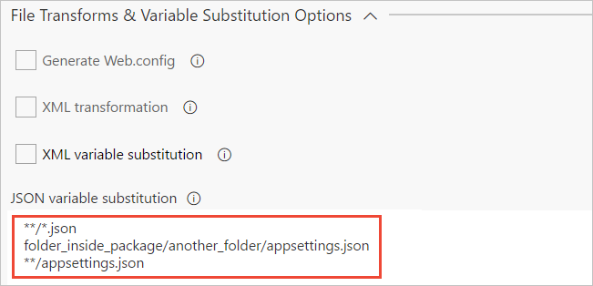

# File transforms and variable substitution reference

[!INCLUDE [version-tfs-2017-rtm](../_shared/version-tfs-2017-rtm.md)]

::: moniker range="<= tfs-2018"
[!INCLUDE [temp](../_shared/concept-rename-note.md)]
::: moniker-end

Some tasks, such as the [Azure App Service Deploy](https://github.com/Microsoft/azure-pipelines-tasks/tree/master/Tasks/AzureRmWebAppDeploymentV3) task
version 3 and later and the [IIS Web App Deploy](deploy/iis-web-app-deployment-on-machine-group.md) task, allow users to configure the package based on the environment specified.
These tasks use **msdeploy.exe**, which supports the overriding of values in the **web.config** file with values from the **parameters.xml** file.
However, file transforms and variable substitution are **not confined to web app files**. You can use these techniques with any XML or JSON files. 

::: moniker range="> tfs-2018"
> [!NOTE]  
> File transforms and variable substitution are also supported by the separate [File Transform task](utility/file-transform.md) for use in Azure Pipelines.
  You can use the File Transform task to apply file transformations and variable substitutions on any configuration and parameters files.
::: moniker-end

Configuration substitution is specified in the **File Transform and Variable Substitution Options**
section of the settings for the tasks. The transformation and substitution options are:

* [XML transformation](#xmltransform)
* [XML variable substitution](#xmlvarsubs)
* [JSON variable substitution](#jsonvarsubs)

When the task runs, it first performs XML transformation, XML variable substitution, and JSON variable substitution 
on configuration and parameters files. Next, it invokes **msdeploy.exe**, which uses
the **parameters.xml** file to substitute values in the **web.config** file.

<a name="xmltransform"></a> 
## XML Transformation

XML transformation supports transforming the configuration files (`*.config` files)
by following [Web.config Transformation Syntax](https://msdn.microsoft.com/library/dd465326.aspx)
and is based on the environment to which the web package will be deployed.
This option is useful when you want to add, remove or modify configurations for different environments.
Transformation will be applied for other configuration files including Console or Windows service application
configuration files (for example, **FabrikamService.exe.config**).
  
### Configuration transform file naming conventions
 
XML transformation will be run on the `*.config` file for
transformation configuration files named `*.Release.config` or `*.<stage>.config`
and will be executed in the following order:

1. `*.Release.config` (for example, **fabrikam.Release.config**)
1. `*.<stage>.config` (for example, **fabrikam.Production.config**)

For example, if your package contains the following files:

* Web.config
* Web.Debug.config
* Web.Release.config
* Web.Production.config

and your stage name is **Production**, the transformation is applied
for `Web.config` with `Web.Release.config` followed by `Web.Production.config`.  

### XML transformation example

1. Create a Web Application package with the necessary configuration and transform files.
   For example, use the following configuration files:

   **Configuration file**
 
   ```xml
   <?xml version="1.0" encoding="utf-8"?>
   <configuration>
     <connectionStrings>
       <add name="DefaultConnection"
            connectionString="Data Source=(LocalDb)\\MSDB;DbFilename=aspcore-local.mdf;" />
     </connectionStrings>
     <appSettings>
       <add key="webpages:Version" value="3.0.0.0" />
       <add key="webpages:Enabled" value="false" />
     </appSettings>
     <system.web>
       <authentication mode="None" />
       <compilation targetFramework="4.5" debug="true" />
     </system.web>
   </configuration>
   ```
<p />

   **Transform file**
 
   ```xml
   <?xml version="1.0"?>
   <configuration xmlns:xdt="http://schemas.microsoft.com/XML-Document-Transform">
       <connectionStrings>
         <add name="MyDB"
              connectionString="Data Source=ReleaseSQLServer;Initial Catalog=MyReleaseDB;Integrated Security=True"
              xdt:Transform="Insert" />
       </connectionStrings>
     <appSettings>
       <add xdt:Transform="Replace" xdt:Locator="Match(key)" key="webpages:Enabled" value="true" />
     </appSettings>
     <system.web>
       <compilation xdt:Transform="RemoveAttributes(debug)" />
     </system.web>
   </configuration>
   ```
<p />
 
   This example transform configuration file does three things:

   * It adds a new database connection string inside the `ConnectionStrings` element.
   * It modifies value of `Webpages:Enabled`  inside the `appSettings` element.
   * It removes the `debug` attribute from the `compilation` element inside the `System.Web` element.

   >For more information, see [Web.config Transformation Syntax for Web Project Deployment Using Visual Studio](https://msdn.microsoft.com/library/dd465326.aspx)

1. Create a release pipeline with an stage named **Release**.
 
1. Add an **Azure App Service Deploy** task and set (tick) the **XML transformation** option.

   
 
1. Save the release pipeline and start a new release.

1. Open the `Web.config` file to see the transformations from `Web.Release.config`.

   ```xml
   <?xml version="1.0" encoding="utf-8"?>
   <configuration>
     <connectionStrings>
       <add name="DefaultConnection"
            connectionString="Data Source=(LocalDb)\\MSDB;DbFilename=aspcore-local.mdf;" />
     <add name="MyDB"
          connectionString="Data Source=ReleaseSQLServer;Initial Catalog=MyReleaseDB;Integrated Security=True" />
     </connectionStrings>
     <appSettings>
       <add key="webpages:Version" value="3.0.0.0" />
       <add key="webpages:Enabled" value="true" />
     </appSettings>
     <system.web>
       <authentication mode="None" />
       <compilation targetFramework="4.5" />
     </system.web>
   </configuration>
   ```

### XML transformation notes

* You can use this technique to create a default package and deploy it to multiple stages.

* XML transformation takes effect only when the configuration file and transform file
  are in the same folder within the specified package.

* By default, MSBuild applies the transformation as it generates the web package if the `<DependentUpon>` element
  is already present in the transform file in the `*.csproj` file. In such cases, the **Azure App Service Deploy**
  task will fail because there is no further transformation applied on the `Web.config` file. Therefore, it is
  recommended that the `<DependentUpon>` element is removed from all the transform files to disable any build-time
  configuration when using XML transformation.
  
* Set the **Build Action** property for each of the transformation files (`Web.config`) to **Content** so that the files are copied to the root folder.

  ```xml
  ...
  <Content Include="Web.Debug.config">
     <DependentUpon>Web.config</DependentUpon>
  </Content>
  <Content Include="Web.Release.config">
     <DependentUpon>Web.config</DependentUpon>
  </Content>
  ...
  ```
 
<a name="xmlvarsubs"></a> 
## XML variable substitution

This feature enables you to modify configuration settings in configuration files (`*.config` files)
inside web packages and XML parameters files (`parameters.xml`).
In this way, the same package can be configured based on the environment to which it will be deployed.
 
Variable substitution takes effect only on the `applicationSettings`, `appSettings`, `connectionStrings`,
and `configSections` elements of configuration files. If you are looking to substitute values outside of these elements you can use a (`parameters.xml`) file, however you will need to use a 3rd party pipeline task to handle the variable substitution.
 
### XML variable substitution example

As an example, consider the task of changing the following values in `Web.config`:
 
```xml
<?xml version="1.0" encoding="utf-8"?>
<configuration>
    <configSection>
        <section name="entityFramework" />
    </configSection>
    <connectionStrings>
        <!-- Change connectionString in this line: --> 
        <add name="DefaultConnection"
             connectionString="Data Source=(LocalDB)\LocalDB;FileName=Local.mdf" />
    </connectionStrings>
    <appSettings>
        <add key="ClientValidationEnabled" value="true" />
        <add key="UnobstructiveJavascriptEnabled" value="true" />
        <!-- Change AdminUserName in this line: --> 
        <add key="AdminUserName" value="__AdminUserName__" />
        <!-- Change AdminPassword in this line: --> 
        <add key="AdminPassword" value="__AdminPassword__" />
    </appSettings>
    <entityFramework>
        <defaultConnectionFactory type="System.Data.Entity.LocalDbConnectionFactory">
            <parameters></parameters>
        </defaultConnectionFactory>
        <providers>
            <!-- Change invariantName in this line: --> 
            <provider invariantName="System.Data.SqlClient" type="System.Data.Entity.SqlServer" />
        </providers>
    </entityFramework>
</configuration>
```
<p />

1. Create a release pipeline with a stage named **Release**.
 
1. Add an **Azure App Service Deploy** task and set (tick) the **XML variable substitution** option.

   

1. Define the required values in release pipeline variables:
 
   | Name | Value | Secure | Scope |
   | ---- | ----- | ------ | ----- |
   | DefaultConnection | Data Source=(ProdDB)\\MSSQLProdDB;AttachFileName=Local.mdf | No | Release |
   | AdminUserName | ProdAdminName | No | Release |
   | AdminPassword | [your-password] | Yes | Release |
   | invariantName | System.Data.SqlClientExtension | No | Release |
 
1. Save the release pipeline and start a new release.

1. Open the `Web.config` file to see the variable substitutions.
 
   ```xml
   <?xml version="1.0" encoding="utf-8"?>
   <configuration>
       <configSection>
           <section name="entityFramework" />
       </configSection>
       <connectionStrings>
           <add name="DefaultConnection"
                connectionString="Data Source=(ProdDB)\MSSQLProdDB;AttachFileName=Local.mdf" />
       </connectionStrings>
       <appSettings>
           <add key="ClientValidationEnabled" value="true" />
           <add key="UnobstructiveJavascriptEnabled" value="true" />
           <add key="AdminUserName" value="ProdAdminName" />
           <add key="AdminPassword" value="*password_masked_for_display*" />
       </appSettings>
       <entityFramework>
           <defaultConnectionFactory type="System.Data.Entity.LocalDbConnectionFactory">
               <parameters></parameters>
           </defaultConnectionFactory>
           <providers>
               <provider invariantName="System.Data.SqlClientExtension"
                         type="System.Data.Entity.SqlServer" />
           </providers>
       </entityFramework>
   </configuration>
   ```
 
### XML variable substitution notes

* By default, ASP.NET applications have a default parameterized connection attribute.
  These values are overridden only in the `parameters.xml` file inside the web package.

* Because substitution occurs before deployment, the user can override the
  values in `Web.config` using `parameters.xml` (inside the web package) or
  a `setparameters` file.
 
<a name="jsonvarsubs"></a> 
## JSON variable substitution
 
This feature substitutes values in the JSON configuration files.
It overrides the values in the specified JSON configuration files
(for example, `appsettings.json`) with the values matching names of release pipeline
and stage variables.

To substitute variables in specific JSON files, provide newline-separated
list of JSON files. File names must be specified relative to the root folder.
For example, if your package has this structure:

```Folders
/WebPackage(.zip)
  /---- content
    /----- website
      /---- appsettings.json
      /---- web.config
      /---- [other folders] 
  /--- archive.xml
  /--- systeminfo.xml
```

and you want to substitute values in **appsettings.json**, enter the relative
path from the root folder; for example `content/website/appsettings.json`.
Alternatively, use wildcard patterns to search for specific JSON files.
For example, `**/appsettings.json` returns the relative path and name of files
named **appsettings.json**.

### JSON variable substitution example

As an example, consider the task of overriding values in this JSON file:
 
```json
{
  "Data": {
    "DefaultConnection": {
      "ConnectionString": "Data Source=(LocalDb)\\MSDB;AttachDbFilename=aspcore-local.mdf;"
    },
    "DebugMode": "enabled",
    "DBAccess": {
      "Administrators": ["Admin-1", "Admin-2"],
      "Users": ["Vendor-1", "vendor-3"]
    },
    "FeatureFlags": {
      "Preview": [
        {
          "newUI": "AllAccounts"
        },
        {
          "NewWelcomeMessage": "Newusers"
        }
      ]
    }
  }
}

```
<p />

The task is to override the values of **ConnectionString**, **DebugMode**,
the first of the **Users** values, and **NewWelcomeMessage** at the respective places within the JSON file hierarchy.

1. Create a release pipeline with a stage named **Release**.
 
1. Add an **Azure App Service Deploy** task and enter a newline-separated
   list of JSON files to substitute the variable values in the **JSON variable substitution** textbox.
   Files names must be relative to the root folder.
   You can use wildcards to search for JSON files. For example:
   `**/*.json` means substitute values in all the JSON files within the package.

   

1. Define the required substitution values in release pipeline or stage variables.
 
   | Name | Value | Secure | Scope |
   | ---- | ----- | ------ | ----- |
   | Data.DebugMode | disabled | No | Release |
   | Data.DefaultConnection.ConnectionString | Data Source=(prodDB)\\MSDB;AttachDbFilename=prod.mdf; | No | Release |
   | Data.DBAccess.Users.0 | Admin-3 | Yes | Release |
   | Data.FeatureFlags.Preview.1.NewWelcomeMessage | AllAccounts | No | Release |
   
1. Save the release pipeline and start a new release.

1. After the transformation, the JSON will contain the following:

   ```json
   {
     "Data": {
       "DefaultConnection": {
         "ConnectionString": "Data Source=(prodDB)\MSDB;AttachDbFilename=prod.mdf;"
       },
       "DebugMode": "disabled",
       "DBAccess": {
         "Administrators": ["Admin-1", "Admin-2"],
         "Users": ["Admin-3", "vendor-3"]
       },
       "FeatureFlags": {
         "Preview": [
           {
             "newUI": "AllAccounts"
           },
           {
             "NewWelcomeMessage": "AllAccounts"
           }
         ]
       }
     }
   }
'''

### JSON variable substitution notes
 
* To substitute values in nested levels of the file, concatenate the names with
  a period (`.`) in hierarchical order.

* A JSON object may contain an array whose values can be referenced by their index.
  For example, to substitute the first value in the **Users** array shown above,
  use the variable name `DBAccess.Users.0`. To update the value in **NewWelcomeMessage**,
  use the variable name `FeatureFlags.Preview.1.NewWelcomeMessage`.

* Only **String** substitution is supported for JSON variable substitution.

* Substitution is supported for only UTF-8 and UTF-16 LE encoded files.

* If the file specification you enter does not match any file, the task will fail.

* Variable name matching is case-sensitive.

* Variable substitution is applied for only the JSON keys predefined in the object hierarchy. It does not create new keys. 

* If a variable name includes periods ("."), the transformation will attempt to locate the item within the hierarchy.
  For example, if the variable name is `first.second.third`, the transformation process will search for:

  ```json
  "first" : {
    "second": {
      "third" : "value"
    }
  }
  ```

  as well as `"first.second.third" : "value"`.

