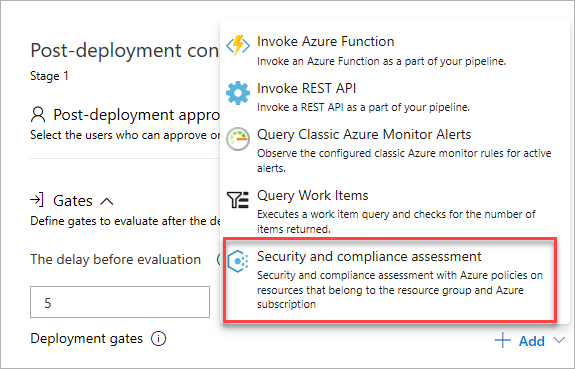

# Security and Compliance Assessment task

[Azure Policy](https://docs.microsoft.com/en-us/azure/governance/policy/) allows you to assess and enforce resource compliance against defined IT policies.
Use this task in a gate to identify, analyse and evaluate the security risks,
and determine the mitigation measures required to reduce the risks.

## Demands

Can be used only as a [gate](../../release/approvals/gates.md).
This task is not supported in a build or release pipeline.

## Arguments

<table><thead><tr><th>Parameters</th><th>Description</th></tr></thead>
<tr><td>Azure subscription<td>(Required) Select the Azure Resource Manager subscription on which to enforce the policies.</td></tr>
<tr><td>Resource group</td><td>(Required) Select the Resource Group or specify a variable name.</td></tr>
<tr><td>Resource name</td><td>Select the name of the Azure resources for which you want to check policy compliance.</td></tr>
</table>
