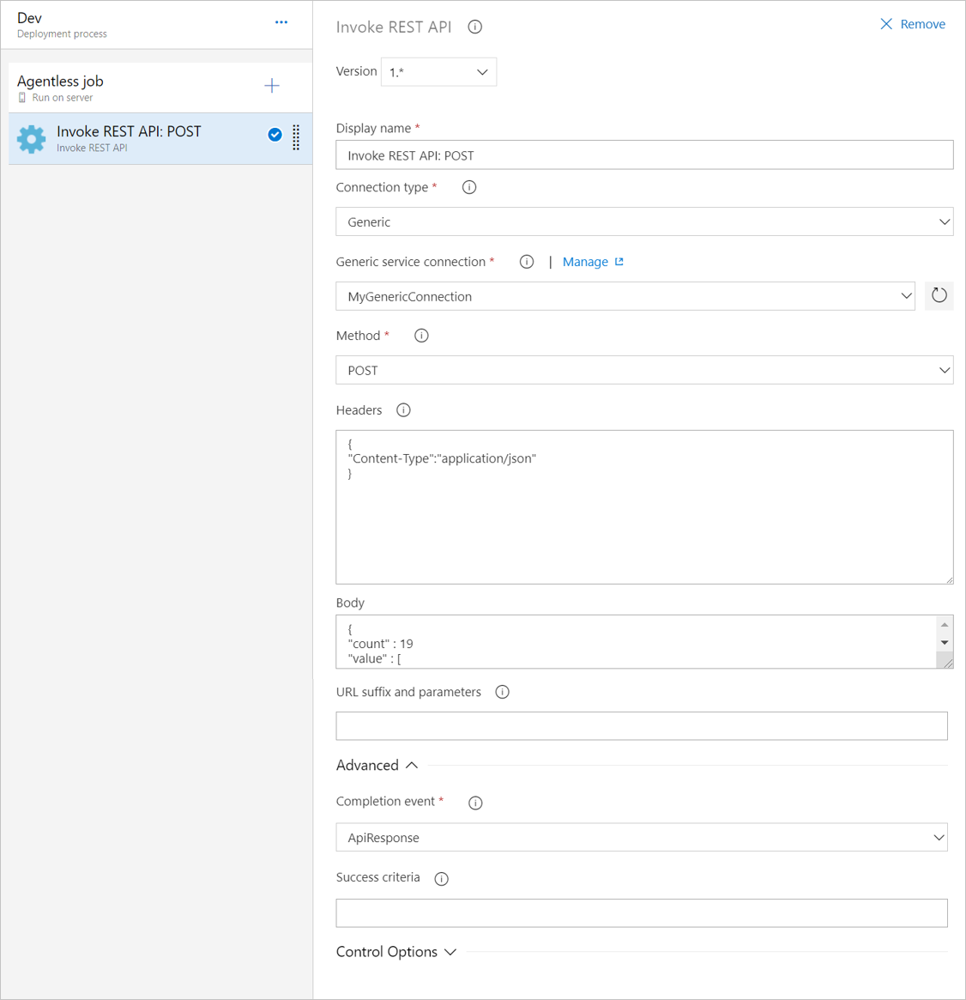

# Invoke REST API task

[!INCLUDE [version-tfs-2018](../../_shared/version-tfs-2018.md)]

Use this task in a build or release pipeline to invoke an HTTP API and parse the response.

::: moniker range="<= tfs-2018"
[!INCLUDE [temp](../../_shared/concept-rename-note.md)]
::: moniker-end

::: moniker range="tfs-2018"

This task is available in both builds and releases in TFS 2018.2 In TFS 2018 RTM, this task is available only in releases.

::: moniker-end

## Demands

This task can be used in only an [agentless job](../../process/server-phases.md).

::: moniker range="azure-devops"
## YAML snippet
[!INCLUDE [temp](../_shared/yaml/InvokeRestApiV1.md)]
::: moniker-end

## Arguments

| Parameter | Comments |
| --- | --- | --- |
| **Connection type** | Required. Select **Azure Resource Manager** to invoke an Azure managment API or **Generic** for all other APIs. |
| **Generic service connection** | Required. Generic service connection that provides the baseUrl for the call and the authorization to use. |
| **Azure subscription** | Required. Azure Resource Manager subscription to configure and use for invoking Azure management APIs. |
| **Method** | Required. The HTTP method with which the API will be invoked; for example, **GET**, **PUT**, or **UPDATE**. |
| **Headers** | Optional. The header in JSON format to be attached to the request sent to the API. |
| **Body** | Optional. The request body for the function call in JSON format. |
| **URL suffix and parameters** | The string to append to the baseUrl from the Generic service connection while making the HTTP call | 
| **Completion event** | Required. How the task reports completion. Can be **API response** (the default) - completion is when the function returns success within 20 seconds and the success criteria evaluates to true, or **Callback** - the external service makes a callback to update the timeline record.   |
| **Success criteria** | Optional. How to parse the response body for success. By default, the task passes when 200 OK is returned from the call. Additionally, the success criteria - if specified - is evaluated. |
| **Control options** | See [Control options](../../process/tasks.md#controloptions) |

Succeeds if the API returns success and the response body parsing is successful, or when the API updates the timeline record with success.

The **Invoke REST API task** does not perform deployment actions directly.
Instead, it allows you to invoke any generic HTTP REST API as part of the automated
pipeline and, optionally, wait for it to be completed.



For more information about using this task, see [Approvals and gates overview](../../release/approvals/index.md).

## Open source

Also see [this task on GitHub](https://github.com/Microsoft/azure-pipelines-tasks/tree/master/Tasks/InvokeRestApiV1).

## Q&A

### What base URLs are used when invoking Azure Management APIs?

Azure management APIs are invoked using *ResourceManagerEndpoint* of the selected environment. For example `https://management.Azure.com` is used when the subscription is in **AzureCloud** environment.

### Where should a task signal completion when **Callback** is chosen as the completion event?

To signal completion, the external service should POST completion data to the following pipelines REST endpoint.
```
{planUri}/{projectId}/_apis/distributedtask/hubs/{hubName}/plans/{planId}/events?api-version=2.0-preview.1

**Request Body**
 { "name": "TaskCompleted", "taskId": "taskInstanceId", "jobId": "jobId", "result": "succeeded" }
 ```
 
See [this simple cmdline application](https://github.com/Microsoft/azure-pipelines-extensions/tree/master/ServerTaskHelper/HttpRequestSampleWithoutHandler) for specifics. 
 
In addition, a C# helper library is available to enable live logging and managing task status for agentless tasks. [Learn more](https://blogs.msdn.microsoft.com/aseemb/2017/12/18/async-http-agentless-task/) 
 
 
