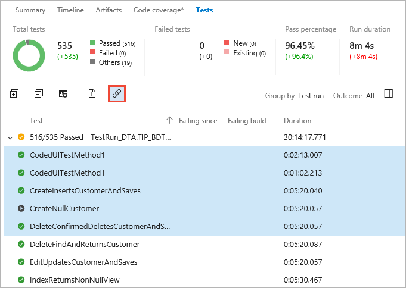
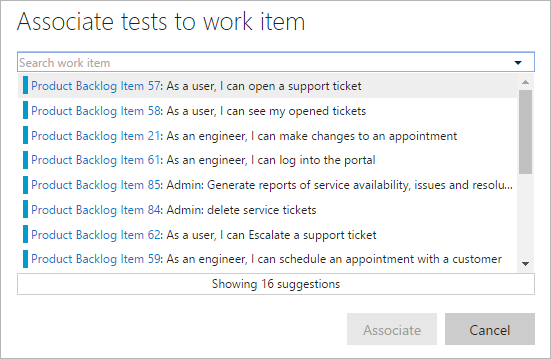
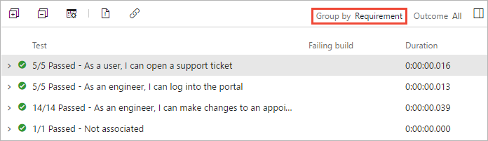
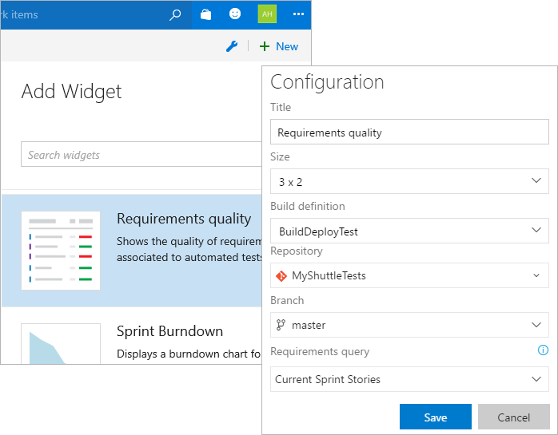

# Associate automated test results with requirements

[!INCLUDE [version-header-ts-tfs](_shared/version-header-ts-tfs.md)]

If your test suites include **requirements**, link these to your test results
and view the results on your team's dashboard. This enables end-to-end 
traceability of requirements for agile teams. For example, when teams do not use
[planned testing](associate-automated-test-with-test-case.md) (by creating test plans or test case work items),
and instead choose to simply write automated tests that run in the CD/CI
pipeline, associating test results with requirements provides an easy way to 
monitor test results and ensure requirements are met. 

To associate automated test results with requirements: 

1. On the test results page, select the tests you want to link to requirements
and choose the **Associate tests to work item** (link) icon.

   

1. Select the requirements from the list of suggested work items and choose **Associate**. 

   

1. To see the related test results, select **Requirements** in the **Group by** list.  

   

1. On your team's dashboard, add the **Requirements quality** widget and configure
   it for the appropriate build definition and work item query.  

   

1. This shows the pass rate for each of your requirements.
   Use the links to view the results in more detail, and the **Expand** link to see more.

   

## See Also

* [Associate automated tests with test cases](associate-automated-test-with-test-case.md)
* [Run automated tests from test plans in the Test hub](run-automated-tests-from-test-hub.md)
* [Test with unified agents and phases](test-with-unified-agent-and-phases.md)
* [Continuous testing scenarios and capabilities](index.md)

[!INCLUDE [help-and-support-footer](_shared/help-and-support-footer.md)] 
