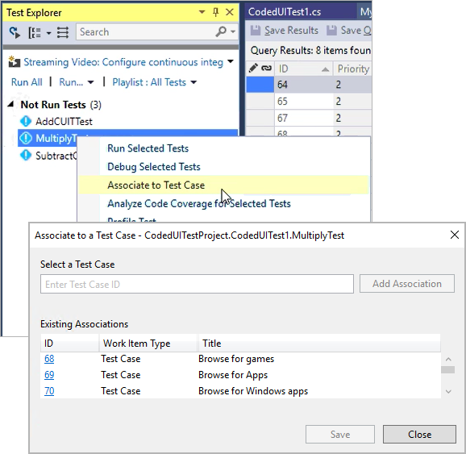

# Associate automated tests with test cases

**Visual Studio 2017 | [Previous version](https://msdn.microsoft.com/en-us/library/dd380741%28v=vs.110%29.aspx)**

Consider using Visual Studio to associate automated tests with a test case when:

* You created a manual test case that you later decide is a good test
  to automate, but you still want to be able to run that test as part of a test plan.
  Tests can be run in the CI/CD pipeline by choosing the test plan or test suite
  in the settings of the [Visual Studio Test](https://github.com/Microsoft/vsts-tasks/blob/master/Tasks/VsTestV2/README.md) task.
  Automated tests can also be run from the **Test** hub in VSTS and TFS.
  If you are using [XAML builds](reference-qa.md#xaml-build) you can also
  [run these automated tests by using Microsoft Test Manager](run-automated-tests-with-microsoft-test-manager.md).

* You want to enable end-to-end traceability of requirements.
  If your test cases are linked to requirements or user stories,
  the results of the test execution can be used to establish the quality of those requirements. 

> **NOTE**: At present you cannot use this procedure to associate MSTest V2 tests or tests written in NUnit and XUnit.
> Adding this capability is planned for a future release. 

The process to associate an automated test with a test case is:

1. Create a test project containing your automated test.
   [What types of tests are supported?](reference-qa.md#test-types)

1. Check your test project into a VSTS or Team
   Foundation Server (TFS) repository.

1. Create a build definition for your project, ensuring that it
   contains the automated test.
   [What are the differences if I am still using a XAML build?](reference-qa.md#xaml-build)

1. Use Visual Studio Enterprise, Visual Studio Professional,
   or Visual Studio Test Professional to associate the automated
   test with a test case as shown [below](#add-test). The test case must have
   been added to a test plan that uses the build you just defined. 

If you are using Team Foundation Build and Release Management in
VSTS or TFS (not a [XAML build](reference-qa.md#xaml-build)), you can run associated tests in the 
Build and Release pipeline by using the
[Visual Studio Test](https://github.com/Microsoft/vsts-tasks/blob/master/Tasks/VsTestV2/README.md) task.
You _cannot_ run tests on-demand using Microsoft Test Manager (MTM) unless you are using a [XAML build](reference-qa.md#xaml-build). 

The parameters in a test case are not used by any automated test that
you associate with a test case. Iterations of a test case that use these
parameters are for manual tests only.

>For more information about checking in your test project and team build, see
[Add files to the server](../../tfvc/add-files-server.md)
and [Continuous integration on any platform](../../pipelines/overview.md).
For more information about action recordings and coded UI tests, see 
[Recording and Playing Back Manual Tests](../../test/mtm/record-play-back-manual-tests.md)
and [Use UI Automation To Test Your Code](https://docs.microsoft.com/visualstudio/test/use-ui-automation-to-test-your-code).

## Associate your test  

1. Open your solution in Visual Studio.

1. If you don't know the identifier of the work item for the test case,
   locate the test case in the **Test** hub or [query for the work item](../../work/track/using-queries.md) in the **Work** hub. 

1. When you know the identifier of the work item for the test case:

   **If you are using Visual Studio 2017 or later**, follow these steps to associate your tests.

   - If the **Test Explorer** window is not displayed, open it from the **Test | Windows** menu.

   - If your tests are not displayed in **Test Explorer**, build the solution.

   - In **Test Explorer**, select the test method you want to associate and choose **Associate to Test Case**.

   - In the dialog that opens, type the test case identifier and choose **Add Association**, then choose **Save**.

   

   > The dialog shows a list of test cases currently associated with the selected test method.
   You cannot associate more than one test method with a test case, but you can associate a
   test method with more than one test case. 

   **If you are using Visual Studio 2015 or earlier**, follow these steps to associate your tests.

   - In **Team Explorer** open the **Work Items** tab. If the **Team Explorer**
     window is not displayed, open it from the **View** menu.

   - Expand the list of **Queries** in the **Work Items** tab to find one that displays your test cases, 
     for example the default **My Test Cases** query. 
   
   - Execute the query by choosing **View Results** on the shortcut menu
     (or double-click the query name).

   - Open the test case you want to associate by choosing **Open**
     on the shortcut menu (or double-click the test case name).

   - In the work item, open the **ASSOCIATED AUTOMATION** tab. 
     All the tests in the solution are shown in the list together
     with their associated test projects.

   - Choose the ellipsis (**...**) and, in the **Choose Test** dialog,
     select the test and then choose **OK**. The value in 
     **Automation Status** is automatically changed to **Automated**.

   - Choose **Save Work Item** to save the changes to the test case.

   > If a test case already has an automated test associated with it, you
   must first remove this association before you can add a different automated test.
   Choose **Remove association** to remove the existing automation.

## See Also

* [Associate automated test results with requirements](associate-automated-results-with-requirements.md)
* [Run automated tests from test plans in the Test hub](run-automated-tests-from-test-hub.md)
* [Run automated tests with Microsoft Test Manager](run-automated-tests-with-microsoft-test-manager.md)
* [Test with unified agents and phases](test-with-unified-agent-and-phases.md)
* [Continuous testing scenarios and capabilities](index.md)

[!INCLUDE [help-and-support-footer](_shared/help-and-support-footer.md)] 
