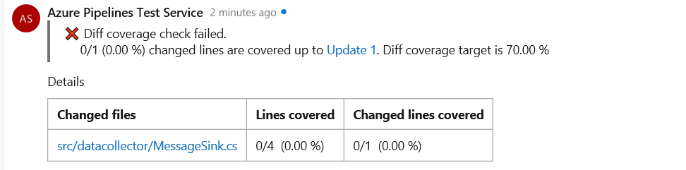
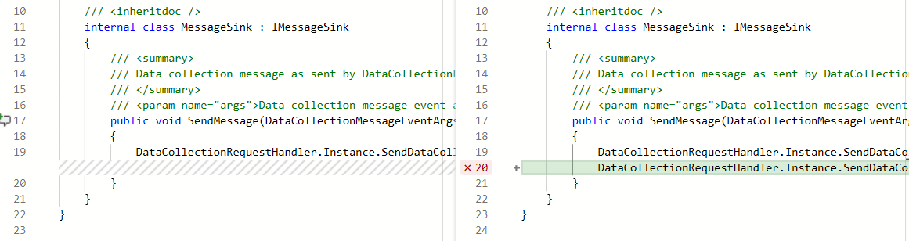

# Code coverage for pull requests

[!INCLUDE [version-team-services](../_shared/version-team-services.md)]

Code coverage is an important quality metric and helps you measure the percentage of your project's code that is being tested. To ensure that quality for your project improves over time (or at the least, does not regress), it is essential that new code being brought into the system is well tested. This means that when developers raise pull requests, knowing whether their changes are covered by tests would help plug any testing holes before the changes are merged into the target branch. Repo owners may also want to set policies to prevent merging large untested changes.

### Full coverage, diff coverage

Typically, coverage gets measured for the entire codebase of a project. This is **full coverage**.
However, in the context of pull requests, developers are focused on the changes they are making and want to know whether the specific lines of code they have added or changed are covered. This is **diff coverage**.

## Pre-requisites

In order to get coverage metrics for a pull request, first configure a pipeline that validates pull requests. In this pipeline, configure the test tool you are using to collect code coverage metrics. Coverage results must then be published to the server for reporting. 

To learn more about collecting and publishing code coverage results for the language of your choice, see the [Ecosystems](../ecosystems/index.md) section. For example, collect and publish code coverage for [.NET core apps](../ecosystems/dotnet-core.md).

> [!NOTE] 
> While you can collect and publish code coverage results for many different languages using Azure Pipelines, the 'code coverage for pull requests' feature discussed in this document is currently available only for .NET and .NET core projects using the Visual Studio code coverage results format (file extension .coverage). Support for other languages and coverage formats will be added in future milestones.

## Coverage status, details and indicators

Once you have configured a pipeline that collects and publishes code coverage, it posts a code coverage status when a pull request is raised. By default, the server checks for atleast 70% of changed lines being covered by tests. The diff coverage threshold target can be changed to a value of your choice. See the settings configuration section below to learn more about this. 

> [!div class="mx-imgBorder"]
> 

The status check evaluates the diff coverage value for all the code files in the pull request. If you would like to view the % diff coverage value for each of the files, you can turn on details as mentioned in the configuration section. Turning on details posts details as a comment in the pull request.

> [!div class="mx-imgBorder"]
> 

In the changed files view of a pull request, lines that are changed are also annotated with coverage indicators to show whether those lines are covered.

> [!div class="mx-imgBorder"]
> 

> [!NOTE] 
> While you can build code from a wide variety of version control systems that Azure Pipelines supports, the **code coverage for pull requests** feature discussed in this document is currently available only for Azure Repos.

## Configuring coverage settings

If you would like to change the default settings of the code coverage experience for pull requests, you must include a configuration YAML file named azurepipelines-coverage.yml at the root of your repo. Set the desired values in this file and it will be used automatically the next time the pipeline runs.

The settings that can be changed are: 

| Setting | Description | Default | Permissible values
|:---:|:---:||:---:|:---:|
| status | Indicates whether code coverage status check should be posted on pull requests.   Turning this off will not post any coverage checks and coverage annotations will not appear in the changed files view. | on | on, off |
| target | Target threshold value for diff coverage must be met for a successful coverage status to be posted. | 70% | Desired % number | 
| comments | Indicates whether a comment containing coverage details for each code file should be posted in the pull request | off | on, off

Sample YAML files for different coverage settings can be found in the [code coverage YAML samples repo](https://github.com/microsoftdocs/codecoverage-yaml-samples).

> [!NOTE] 
> Coverage indicators light up in the changed files view regardless of whether the pull request comment details are turned on.

> [!TIP] 
> The coverage settings YAML is different from a YAML pipeline. This is because the coverage settings apply to your repo and will be used regardless of which pipeline builds your code. This separation also means that if you are using the classic designer-based build pipelines, you will get the code coverage status check for pull requests.

## Protect a branch using a code coverage policy

Code coverage status check for pull requests is only a suggestion for developers and it does not prevent pull requests with low code coverage from being merged into the target branch. If you maintain a repo where you would like to prevent developers from merging changes that do not meet a coverage threshold, you must configure a [branch policy using the coverage status check](../../repos/git/pr-status-policy.md).

> [!TIP] 
> Code coverage status posted from a pipeline follows the naming convention `{name-of-your-pipeline/codecoverage}`. 

> [!NOTE] 
> Branch policies in Azure Repos (even optional policies) prevent pull requests from completing automatically if they fail. This behavior is not specific to code coverage policy.

## Q&A

### Which coverage tools and result formats can be used for validating code coverage in pull requests?

Code coverage for pull requests capability is currently only available for Visual Studio code coverage (.coverage) formats. This can be used if you publish code coverage using the Visual Studio Test task, the test verb of dotnet core task and the TRX option of the publish test results task.
Support for other coverage tools and result formats will be added in future milestones.

### If multiple pipelines are triggered when a pull request is raised, will coverage be merged across the pipelines?

If multiple pipelines are triggered when a pull request is raised, code coverage will not be merged. The capability is currently designed for a single pipeline that collects and publishes code coverage for pull requests. 
If you need the ability to merge coverage data across pipelines, please file a feature request on [developer community](https://developercommunity.visualstudio.com/spaces/21/index.html). 

[!INCLUDE [help-and-support-footer](_shared/help-and-support-footer.md)]
