# Continuous integration, test, and deployment tutorial

[!INCLUDE [version-header-vs-vsts-tfs](_shared/version-header-vs-vsts-tfs.md)]

This tutorial demonstrates how you can use the continuous integration and
continuous deployment features of Visual Studio Team Services (VSTS) and
Microsoft Team Foundation Server (TFS) to build, test, and deploy
applications quickly and efficiently to Azure App Services; and
run a simple load test after deploying every update.

In this tutorial, you will learn how to:

> [!div class="checklist"]
> * [Create the Azure app service instance for your sample app](#create-service).
> * [Create and check in a sample ASP.NET MVC web app containing unit tests](#create-app).
> * [Configure continuous integration (CI) to build the app and run the unit tests](#configure-ci).
> * [Configure continuous deployment (CD) to deploy the app and run a quick performance test](#configure-cd).
> * [Modify the sample app to explore behavior when a test fails](#test-failure).
> * [Fix the test failure and view the complete CI/CD process](#view-process).

It will take around 45 minutes to complete all of the steps.

> For information about deploying to targets other than Azure App Service, see
[Build and deploy your app](../../pipelines/apps/index.md).

<a name="create-service"></a>
[!INCLUDE [create-azure-web-app-portal](../apps/cd/azure/_shared/create-azure-web-app-portal.md)]

<a name="create-app"></a>
## Create the sample web app

In this section, you will create a simple ASP.NET MVC web app containing 
unit tests that you can execute as part of the build process. 

1. In Visual Studio, create a new **ASP.NET Web Application** project from
   the **Web** section of the list of installed templates.

   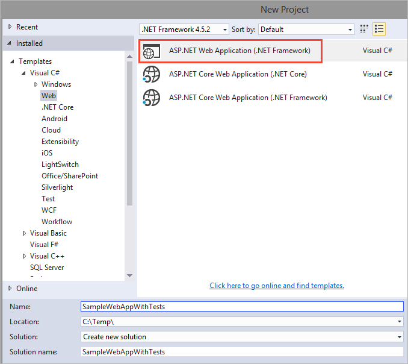

1. When prompted, select **MVC** template and make sure to set (tick) the **Add unit tests** checkbox. 

   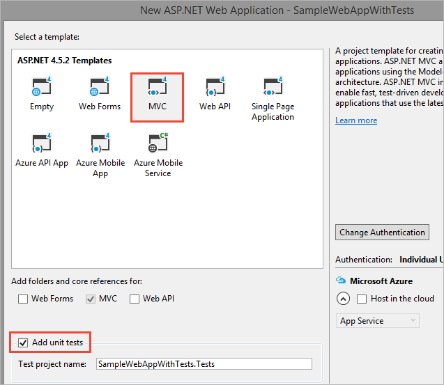

1. Save and close the new project, then check it into your VSTS or TFS repository. 

   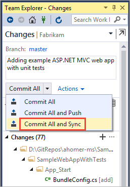

>For more details about creating apps in Visual Studio, see
[Solutions and Projects in Visual Studio](https://docs.microsoft.com/visualstudio/ide/solutions-and-projects-in-visual-studio).
For more details about using VSTS code repositories, see
[Share your code with Visual Studio and VSTS Git](../../git/share-your-code-in-git-vs.md).

<a name="configure-ci"></a>
## Configure continuous integration

In this section, you will create a build definition that is configured to
run automatically when you check in any changes to the sample app, and it
will automatically execute the unit tests it contains.

1. Sign into your VSTS account (**https://**_your-acccount_**.visualstudio.com**)
   and open the project where you checked in the sample app.

1. Open the **Build &amp; Release** hub and, in the **Builds** tab, choose
   **+ New definition**. Or, if you already have build definitions, choose the **+ New** button. 

   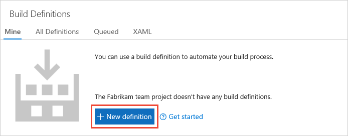

1. If prompted, select the **VSTS Git** source type; then select the project, repository, and branch where your code is located.
   Choose **Continue**.

   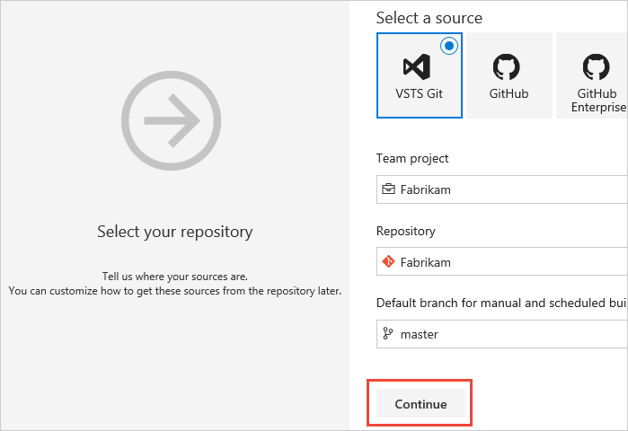

1. Choose the **ASP.NET** template for the new build definition.

   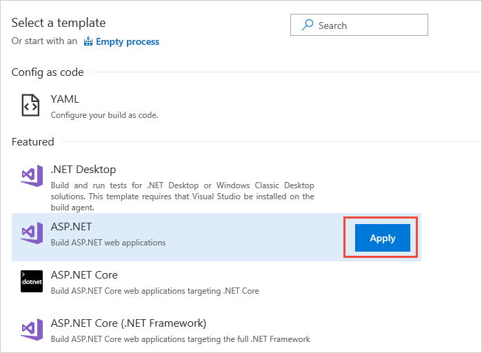

   > This example does not work with an ASP.NET Core app. If you need to build and test ASP.NET Core apps,
   you must use the **ASP.NET Core** template, which adds multiple instances of the
   [.NET Core task](../tasks/build/dotnet-core.md) instead of the tasks shown in this example.

1. In the new build definition, select the **Process** item and then select the **Hosted VS2017** agent queue. 

   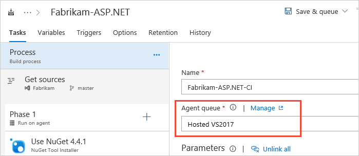

1. Open the **Triggers** tab and turn on the **Continuous integration** trigger. Make sure the branch containing your app is included. 

   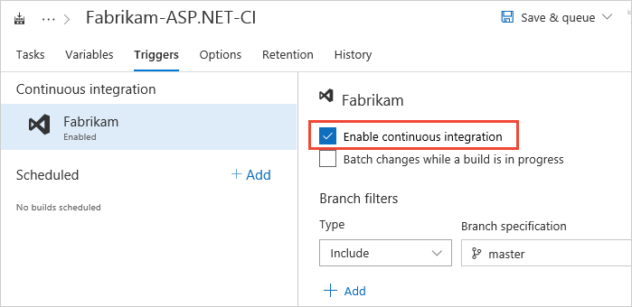

1. Save the new build definition and queue a new build.

   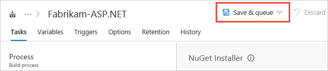

1. Choose the link to the build in the message bar that appears.

   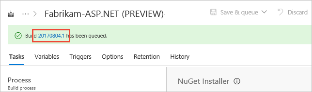
 
1. After the build has finished, you see the summary for each task and the results in the live log file.
   Choose the **Tests** link.

   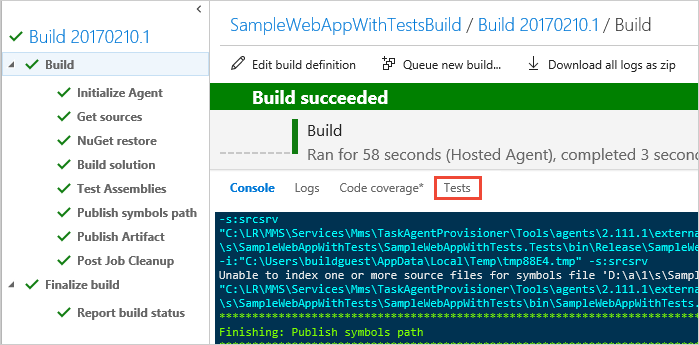

   [How can I pass parameters to my test code from a build pipeline?](reference-qa.md#pass-params)

1. The **Tests** tab provides comprehensive results of executing the unit tests defined in the
   solution. Use the filters lists to show the tests that passed (the default is to show just tests that failed).

   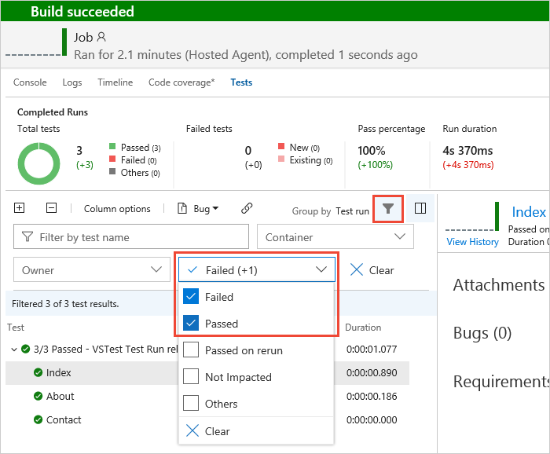

   [What are the typical types of tests I can use to validate my app?](reference-qa.md#qa-more-tests)

1. Choose the test summary item at the top of the list of tests and then choose the corresponding link
   in the right-hand pane to open the run summary in a new browser window.

   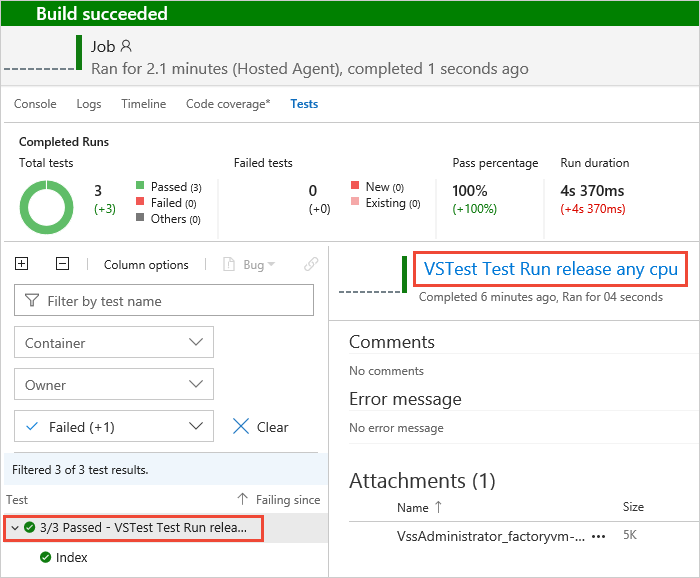

1. The **Run summary** page shows a summary and charts for this test run, and you can use the links to dive deeper into the results.

   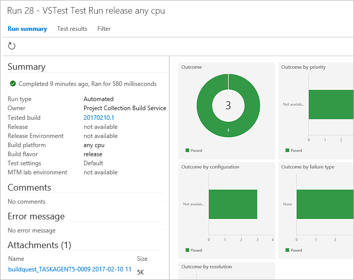

>For more details about build definitions in VSTS, see
[Continuous integration on any platform](../../pipelines/overview.md). For more details about unit tests and the results, see 
[Get started with unit testing](https://docs.microsoft.com/visualstudio/test/getting-started-with-unit-testing).
For information about reducing test running time, see
[Speed up testing with Test Impact Analysis](test-impact-analysis.md) and [Run tests in parallel](run-tests-in-parallel.md).

<a name="configure-cd"></a>
## Configure continuous deployment

In this section, you will create a release definition that is configured to
start a release that deploys the app automatically when a successful build
occurs. After successful deployment, the release will automatically execute
a simple load test to validate the deployment.

1. Close the **Test** hub browser window and, in the build summary page in
   the **Builds** hub, choose the **Release** icon.

   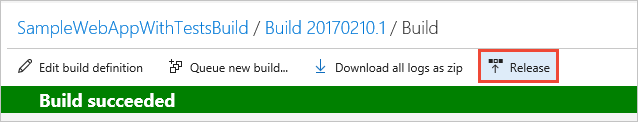

1. Select the **Azure App Service Deployment with Performance Test** template.

1. In the new release definition, choose the "pencil" edit icon next to the default
   name and enter some meaningful name. Press _RETURN_ to save it.

   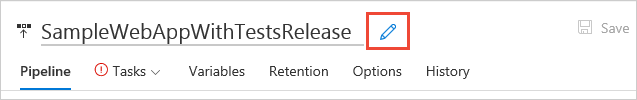

1. In the new release definition, open the **Tasks** tab and select the **Environment1** item.
   In the parameters pane, select your Azure subscription from the drop-down list.
   Then select your App Service name from the drop-down list. Finally, enter the full URL of your Azure App Service instance.

   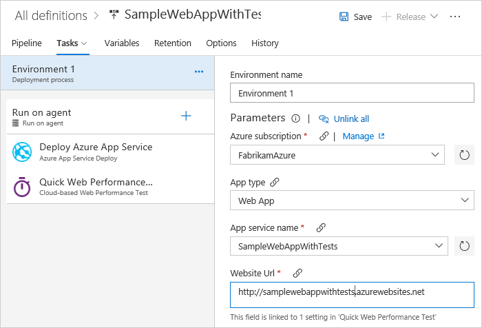

   You can get the full URL from the **Overview** page for your App Service instance
   in the Azure portal. The URL will be in the form **http://**_your-app-service-name_.**azurewebsites.net**.

   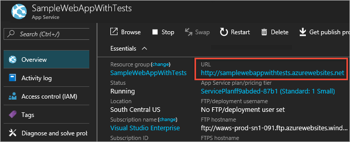
   
   If you don't see any subscriptions listed, choose the  icon and, in the 
   **Services** page, create a new **Azure Resource Manager** service endpoint. If you
   have problems creating the connection, see 
   [Troubleshoot Azure Resource Manager service endpoints](../../pipelines/release/azure-rm-endpoint.md).

   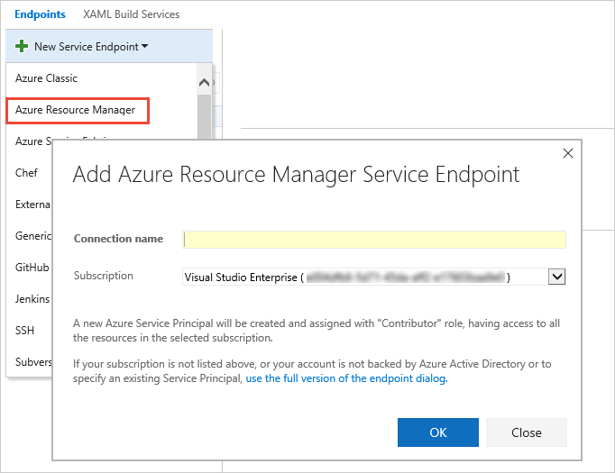

   [Can I deploy to a staging slot first, and then to production?](reference-qa.md#qa-stagingslot)

   [What other tests can I run to validate my deployment?](reference-qa.md#qa-more-tests)

1. Save the new release definition.

   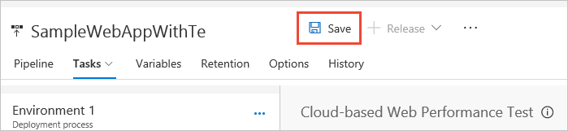

1. Create a release from your definition using the **Release** icon in the toolbar.

   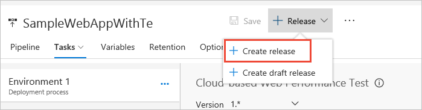

   [How do I pass parameters to my test code from a release pipeline?](reference-qa.md#pass-params)

1. After the release starts, choose the **Release-**_x_ link just below the toolbar.

   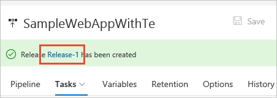

1. This shows a summary of the release, with the Deployment status as **IN PROGRESS**. Choose
   the **Logs** link above the toolbar.

   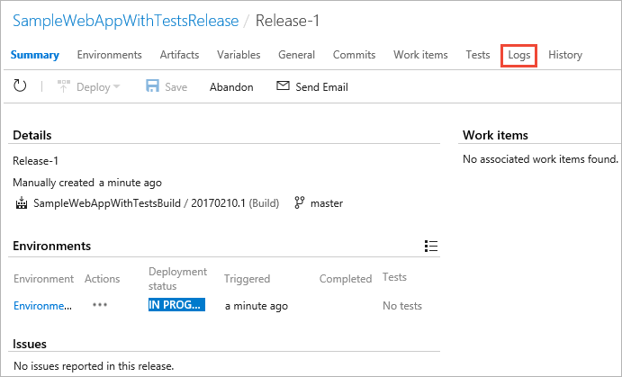

1. The **Logs** page shows the status of each step in the release, and a live log. 
   When  the release has successfully completed, choose the **Summary** link above the toolbar.

   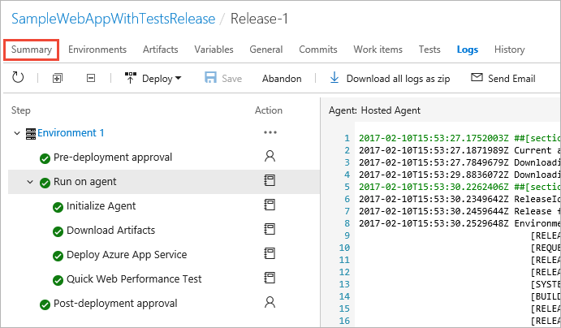

1. The **Summary** page shows the final release summary, and the load test results
   ("No thresholds violated").

   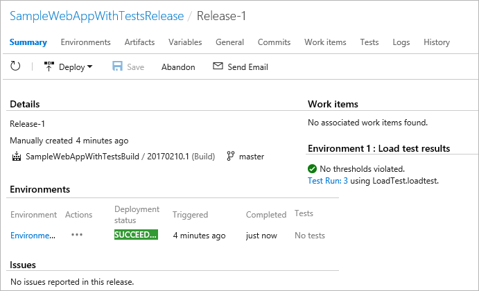

1. Open the **Load test** tab of the **Test** hub. This shows a summary of all 
   the load test runs you have executed. Open the **LoadTest.loadtest** run that
   was just completed.

   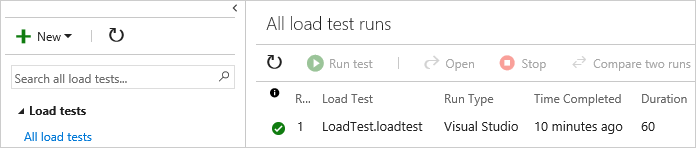

1. As well as the **Summary** page for the load test run, you can open the
   **Charts**, **Diagnostics**, and **Logs** tabs to see more information about the test run.

   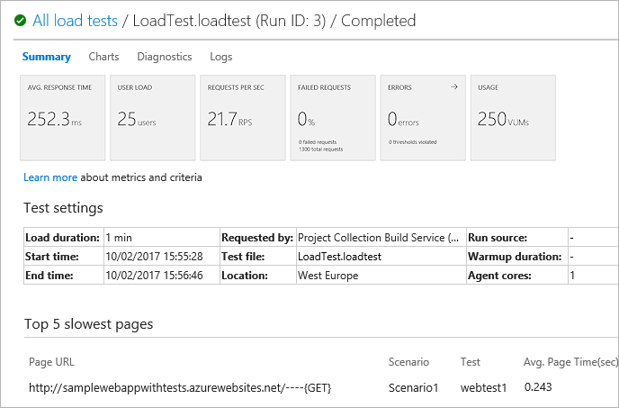

   >For more details about release definitions, see
   [Release Management in VSTS](../../pipelines/release/index.md).
   For more details about load tests and the results, see 
   [Run URL-based load tests with VSTS](../../test/load-test/get-started-simple-cloud-load-test.md).

<a name="test-failure"></a>
## Explore behavior when a test fails

In this section, you will modify the sample app so that one of the unit tests
will fail, and see how the CI/CD process is halted when the test fails during
the build process.

1. In Visual Studio, open the source solution for your app and open the
   **HomeController.cs** file from the **Controllers** folder of your main 
   app project (in this example, it's SampleWebAppWithTests\Controllers\HomeController.cs).

1. Change the line in the **About** method to show a different message, such as: 

   ```csharp
   public ActionResult About()
   {
     ViewBag.Message = "My super new web app.";
     return View();
   }
   ```

1. Save the change and check in the change to your VSTS repository.

1. Open the **Builds** tab of the **Build &amp; Release** hub. You'll see
   a build of your build definition in "_in progress_". Choose the build number link 
   next to this to open the build summary.

   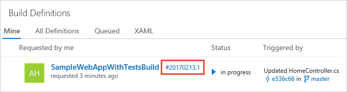

1. In the build summary, you can see the message that one of the unit tests failed,
   and that there was no deployment from this build. Because the test failed, Team 
   Services did not automatically create a CD release.

   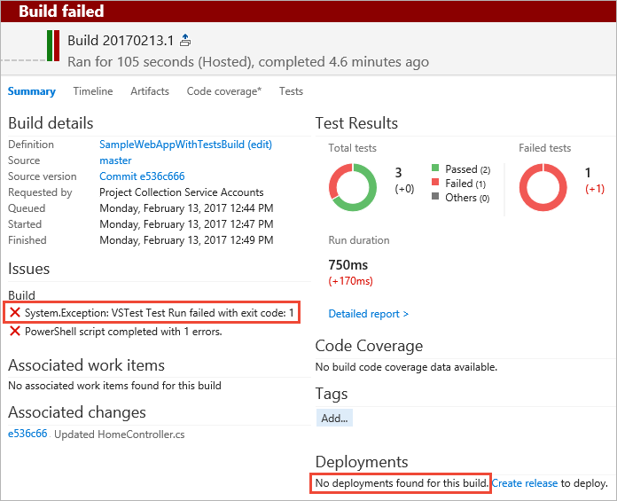

1. Choose the **Test** link to open the test details tab. You can see a summary
   of the test run, and - by default - a list of the failed tests. Choose the one
   failed test to see details. The error message shows that the description for the
   **About** method (which you edited) does not match the expected value.

   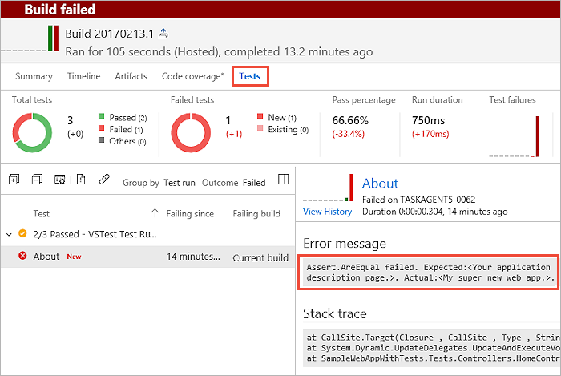

1. Verify that the new build did not start a CD release by opening the
   **Releases** tab of the **Build &amp; Release** hub. You can see that there is
   only the first release you created manually earlier in this example.

   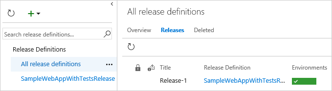

<a name="view-process"></a>
## View the complete CI/CD process

In this section, you will fix the failing test, check in the updates, and
see the complete CI/CD process execute; finishing with the results of the
post-deployment load test.

1. Go back to your source solution in Visual Studio and open the
   **HomeControllerTest.cs** file from the **Controllers** folder of the
   **Tests** project (in this example, it's SampleWebAppWithTests.Tests\Controllers\HomeControllerTest.cs).

1. Change the line in the **About** test method so that it matches the
   message you specified when you edited the main project earlier. In this example: 

   ```csharp
   [TestMethod]
   public void About()
   {
     // Arrange
     HomeController controller = new HomeController();

     // Act
     ViewResult result = controller.About() as ViewResult;

     // Assert
     Assert.AreEqual("My super new web app.", result.ViewBag.Message);
   }

   ```

1. Save the change and check in the change to your VSTS repository.

1. Open the **Builds** tab of the **Build &amp; Release** hub. You'll see
   a build of your build definition in "_in progress_". Choose the build number link 
   next to this to open the build summary and check that it succeeds.

1. Choose the **Test** link to open the test details tab. You'll see
   that all the tests passed.

1. Verify that the new build did start a CD release by opening the
   **Releases** tab of the **Build &amp; Release** hub. This time you
   see a new release in progress.

   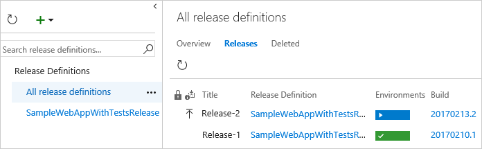

1. In your web browser, open your new ASP.NET website. The URL will be in 
   the form **http://**_your-app-service-name_.**azurewebsites.net**.

   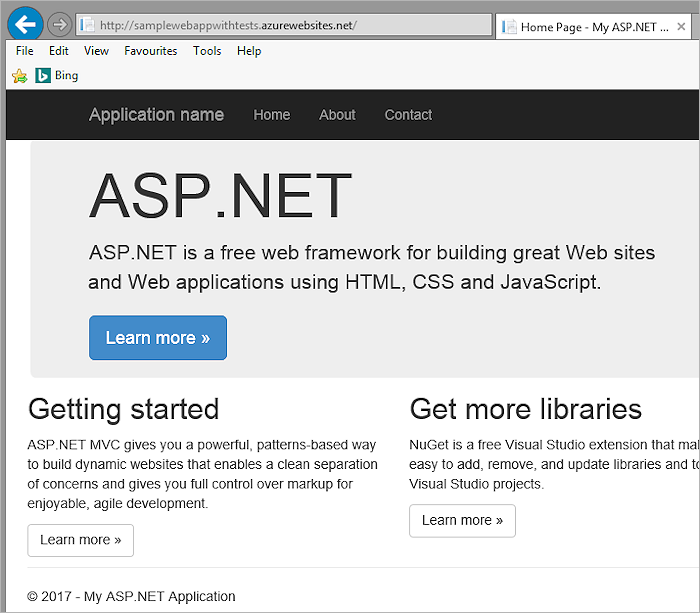

## Next step

> [!div class="nextstepaction"]
> [CI/CD in depth](../../pipelines/overview.md)
