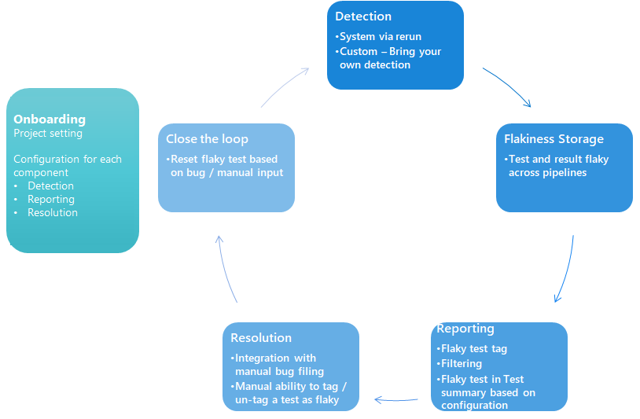
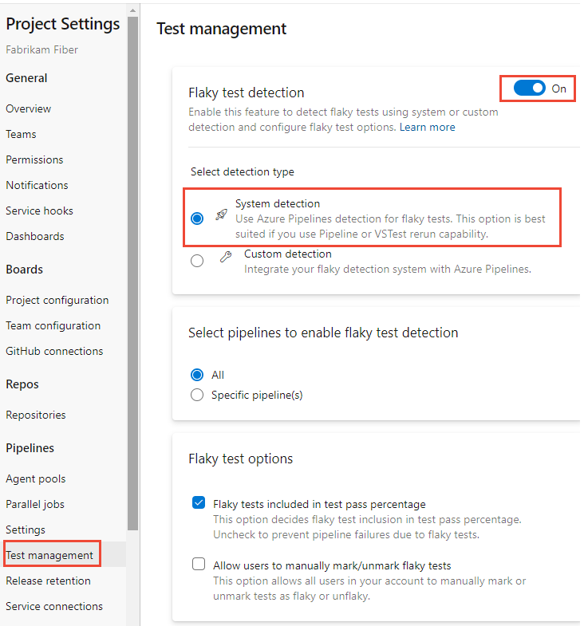
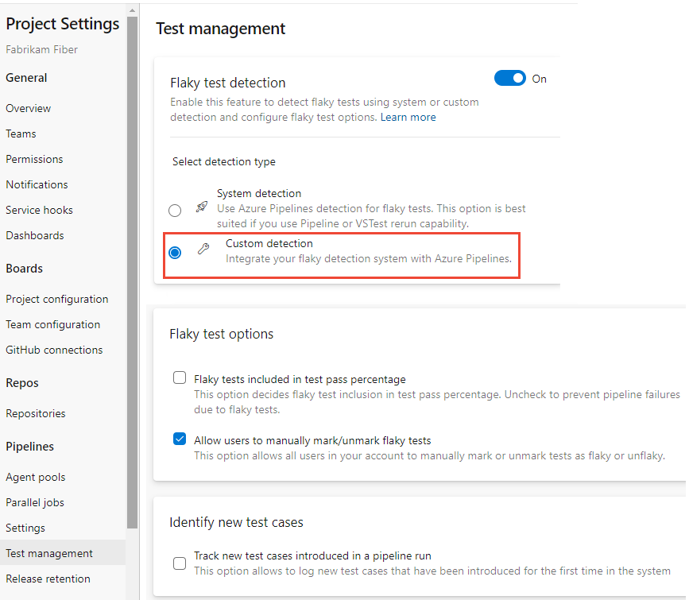
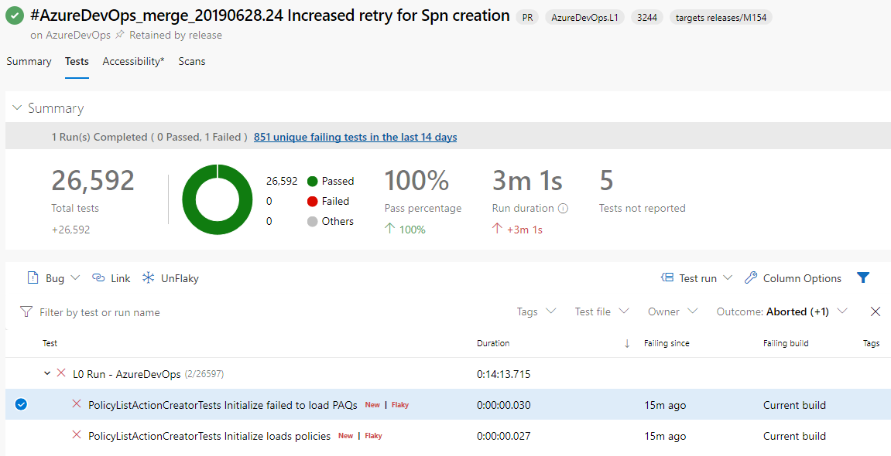
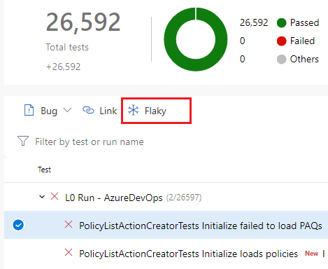

# Manage flaky tests

[!INCLUDE [version-eq-azure-devops](../../includes/version-eq-azure-devops.md)]

Productivity for developers relies on the ability of tests to find real problems with the code under development or update in a timely and reliable fashion. Flaky tests present a barrier to finding real problems, since the failures often don't relate to the changes being tested. A flaky test is a test that provides different outcomes, such as pass or fail, even when there are no changes in the source code or execution environment. Flaky tests also impact the quality of shipped code. 

[!INCLUDE [temp](../../includes/feature-support-cloud-only.md)] 

The goal of bringing flaky test management in-product is to reduce developer pain cause by flaky tests and cater to the whole workflow. Flaky test management provides the following benefits.

* **Detection** - Auto detection of flaky test with rerun or extensibility to plug in your own custom detection method

* **Management of flakiness** - Once a test is marked as flaky, the data is available for all pipelines for that branch 

* **Report on flaky tests** - Ability to choose if you want to prevent build failures caused by flaky tests, or use the flaky tag only for troubleshooting 

* **Resolution** - Manual bug-creation or manual marking and unmarking test as flaky based on your analysis

* **Close the loop** - Reset flaky test as a result of bug resolution / manual input

## Enable flaky test management

To configure flaky test management, choose **Project settings**, and select **Test management** in the **Pipelines** section. 

Slide the On/Off button to **On**. 

> [!div class="mx-imgBorder"]
> 

The default setting for all projects is to use flaky tests for troubleshooting. 

### Flaky test detection

Flaky test management supports system and custom detection.

- **System detection**: Azure DevOps has a built-in mechanism for detecting flaky tests. This involves rerunning failed tests within the same pipeline execution. If a test case fails initially but passes on a rerun, it is marked as flaky. This detection is tightly coupled with the **VSTest** task, which reruns failed tests within the same task execution. Another method involves rerunning failed jobs in the pipeline (manually by clicking on "rerun failed jobs" in any pipeline run). If a test passes in the rerun, it is marked as flaky.

   > [!Note]
   > Once a test is marked as flaky, the data is available for all pipelines for that branch to assist with troubleshooting in every pipeline. 

- **Custom detection**: This approach allows external systems to integrate their own logic for detecting flaky tests and communicate this to ADO via an API, for consistent tracking and management. The API expects a test result ID and a test ID, along with a flag indicating whether the test is flaky. This information is sent to ADO, which then stores and propagates the flakiness information for that test case in subsequent pipeline runs. Once a test is marked as flaky, ADO will continue to recognize it as such until it is manually unmarked. For details, see [Test Results, Result Meta Data - Update REST API](/rest/api/azure/devops/testresults/result-meta-data/update). 

> [!div class="mx-imgBorder"]
>  

### Flaky test options

The  **Flaky test options** specify how flaky tests are available in test reporting as well as resolution capabilities, as described in the following sections. 

## Flaky test management and reporting

On the Test management page under **Flaky test options**, you can set options for how flaky tests are included in the Test Summary report. Flaky test data for both passed and failed test is available in [Test results](review-continuous-test-results-after-build.md). The **Flaky** tag helps you identify flaky tests. By default, flaky tests are included in the Test Summary. However, if you want to ensure flaky test failures don't fail your pipeline, you can choose to not include them in your test summary and suppress the test failure. This option ensures flaky tests (both passed and failed) are removed from the pass percentage and shown in **Tests not reported**, as shown in the following screenshot. 

> [!div class="mx-imgBorder"]
> 

> [!NOTE]
> The Test summary report is updated only for [Visual Studio Test task](/azure/devops/pipelines/tasks/reference/vstest-v2) and [Publish Test Results task](../tasks/test/publish-test-results.md?tabs=yaml). You may need to add a custom script to suppress flaky test failure for other scenarios. 

## Tests marked as flaky

You can mark or unmark a test as flaky based on analysis or context, by choosing **Flaky** (or **UnFlaky**, depending on whether the test is already marked as flaky.)

> [!div class="mx-imgBorder"]
> 

When a test is marked flaky or unflaky in a pipeline, no changes are made in the current pipeline. Only on future executions of that test is the changed flaky setting evaluated. 
Tests marked as flaky have the *Marked flaky* tag in the user interface. 

> [!div class="mx-imgBorder"]
> 

<!---### Integration with manual bug creation
You can create bugs to manage flaky test debt. If you create or add to bug for a flaky test, *flaky* tag is added and then on resolution of the bug the test is unmarked as flaky. 

-->

[!INCLUDE [help-and-support-footer](includes/help-and-support-footer.md)] 

## Related articles

- [Review test results](review-continuous-test-results-after-build.md)
- [Visual Studio Test task](/azure/devops/pipelines/tasks/reference/vstest-v2)
- [Publish Test Results task](../tasks/test/publish-test-results.md?tabs=yaml)
- [Test Results, Result Meta Data - Update REST API](/rest/api/azure/devops/testresults/result-meta-data/update)
