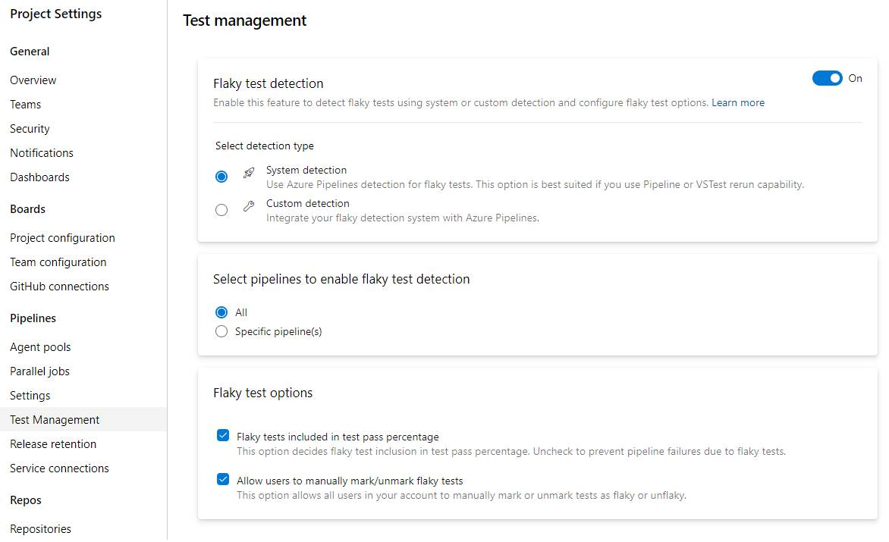

# Flaky test management

[!INCLUDE [version-team-services](../_shared/version-team-services.md)]

Productivity for developers relies on the ability of tests to find real problems with the code being developed or modified, in a timely and reliable fashion. Flaky tests are a barrier to finding real problems, since those failures often are not related to the changes being tested. Flaky tests also impact the quality of shipped code. 

A flaky test is a test that provides different outcomes, such as pass or fail, even when there are no changes in the source code or execution environment. 
The goal of bringing flaky test management in-product is to reduce developer pain cause by flaky tests and cater to the whole workflow. Flaky test management provides the following benefits.

* **Detection** - Auto detection of flaky test with rerun or extensibility to plug in your own custom detection method

* **Management of flakiness** - Once a test is marked as flaky, the data is available for all pipelines for that branch 

* **Report on flaky tests** - Ability to choose if you want to prevent build failures caused by flaky tests, or use the flaky tag only for troubleshooting 

* **Resolution** - Manual bug-creation or manual marking and unmarking test as flaky based on your analysis

* **Close the loop** - Reset flaky test as a result of bug resolution / manual input

## Enable flaky test management

To configure flaky test management, choose **Project settings**, and select **Test Management** in the **Pipelines** section.

> [!div class="mx-imgBorder"]
> 

The default setting for all projects is to use flaky tests for troubleshooting. 

### Flaky test detection

Flaky test management supports system and custom detection.

* System detection - The in-product flaky detection uses test rerun data. The detection is via VSTest task rerunning of failed tests capability or retry of stage in the pipeline. You can select specific pipelines in the project for which you would like to detect flaky tests. 

   > [!Note]
   > Once a test is marked as flaky, the data is available for all pipelines for that branch aiding troubleshooting in every pipeline. 

* Custom detection - You can integrate your own flaky detection mechanism with Azure Pipelines and utilize the reporting capability. <!---API details are available -->

### Flaky test options

The settings in **Flaky test options** allow you to configure how flaky tests should be available in test reporting as well resolution capabilities, as described in the following sections. 

## Flaky test management and reporting

Flaky test data for both passed and failed test is available in [Test reporting](review-continuous-test-results-after-build.md). The **Flaky** tag helps you identify flaky tests.  
By default, flaky tests are included in the Test Summary. However, if you want to ensure flaky test failures don't fail your pipeline, you can choose to not include them in your test summary and suppress the test failure. This will ensure flaky tests (both passed and failed) are removed from the pass percentage and shown in **Tests not reported**, as shown in the screenshot below. 
This setting is available in **Project settings** under *Flaky test options*. 
Note: Test summary will be updated only for [Visual Studio Test task](../tasks/test/vstest.md) and [Publish Test Results task](../tasks/test/publish-test-results.md?view=azure-devops&tabs=yaml). You might need to add a custom script to suppress flaky test failure for other scenarios. 

> [!div class="mx-imgBorder"]
> 

## Resolution

### Manual mark and unmark test as flaky

You can mark or unmark a test as flaky based on analysis or context, by choosing **Flaky** (or **UnFlaky**, depending on whether the test is already marked as flaky.)

> [!div class="mx-imgBorder"]
> 

When a test is marked flaky or unflaky in a pipeline, no changes are made in the current pipeline. Only on future executions of that test will the changed flaky setting be evaluated. 
Tests marked as flaky have the *Marked flaky* tag in the UI. 

> [!div class="mx-imgBorder"]
> 

<!---### Integration with manual bug creation
You can create bugs to manage flaky test debt. If you create or add to bug for a flaky test, *flaky* tag is added and then on resolution of the bug the test is unmarked as flaky. 

-->

[!INCLUDE [help-and-support-footer](_shared/help-and-support-footer.md)] 

