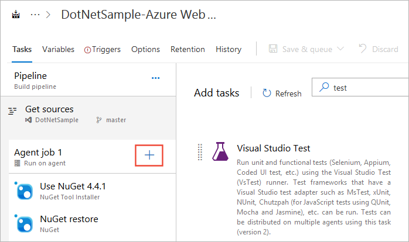
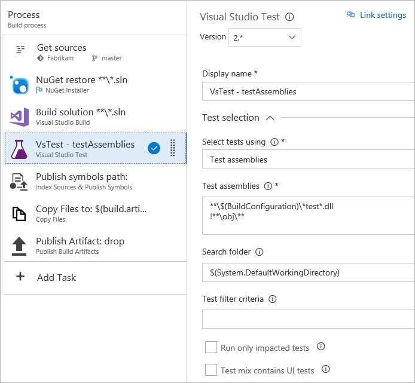
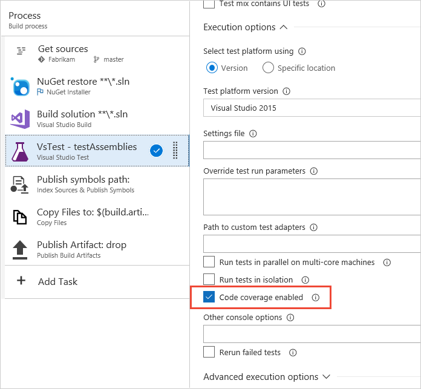
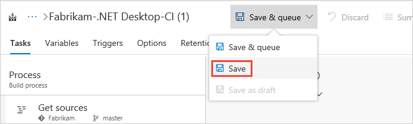
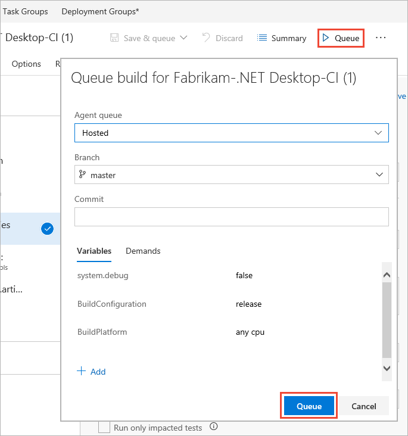
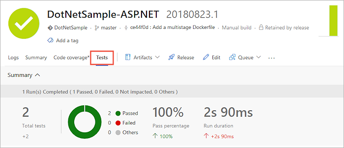

# Run unit tests with your builds

[!INCLUDE [version-header-vs-vsts-tfs](_shared/version-header-vs-vsts-tfs.md)]

::: moniker range="<= tfs-2018"
[!INCLUDE [temp](../_shared/concept-rename-note.md)]
::: moniker-end

Make sure that your app still works after every
check-in and build using Azure Pipelines or Team Foundation Server (TFS) by using test automation.
Find problems earlier by running tests 
automatically with each build. When your build is 
done, review your test results to start resolving 
the problems that you find.

Typically you will run unit tests in your build workflow,
and functional tests in your release workflow after your
app is deployed (usually to a QA environment).
Code coverage is available only in the build workflow.

> [!NOTE]
> This example shows how to run unit tests with your build
  for .NET and ASP.NET apps. It uses the
  [Visual Studio Test](test-with-unified-agent-and-phases.md) task.
  For information about running test for other app types such as
  [.NET Core](../languages/dotnet-core.md) and
  [Python](../languages/python.md), see the topics in the
  **Languages** section of the Azure Pipelines documentation.

## Before you start

* [Check in your solution](../../repos/git/overview.md) 
  to Azure Pipelines. Include your test projects.

## Create a build pipeline

Your build pipeline must include a test task that runs unit tests.
For example, if you're building a Visual Studio solution in Azure Pipelines,
your build pipeline should include a **Visual Studio Test** task. After your 
build starts, this task automatically runs all the unit tests in your 
solution - on the same build machine.

1. If your build pipeline does not contain a test task, add one to it.

   

1. Edit the Visual Studio Test task. You can add filter criteria to run specific tests, enable code coverage, 
   run tests from [other unit test frameworks](reference-qa.md), and so on.

   

   The Visual Studio Test task version 2 supports [Test Impact Analysis](test-impact-analysis.md).
   For information about all the task settings, see [Visual Studio Test task](../tasks/test/vstest.md).

   [How do I pass parameters to my test code from a build pipeline?](../../test/run-automated-tests-from-test-hub.md#pass-params)

1. If you also want to test code coverage, set the **Code coverage enabled** checkbox in the
   **Execution options** section.

   

   When tests are run with this option, code coverage information is collected dynamically and assemblies
   do not need to be instrumented. By default, all assemblies are profiled for collecting coverage information. If you need to
   [exclude specific assemblies and customize code coverage](https://docs.microsoft.com/visualstudio/test/customizing-code-coverage-analysis),
   use a [.runsettings file](https://docs.microsoft.com/visualstudio/test/configure-unit-tests-by-using-a-dot-runsettings-file).

   > Use the [Publish Code Coverage Results task](../tasks/test/publish-code-coverage-results.md) to collect and publish code coverage data if you are not using the Visual Studio Test task.

1. When you're done, save your build pipeline.

   

## Start the build

1. Start the build by adding it to the build queue.

    

1. After the build finishes, you can review the test results to resolve any problems that happened.
   Go to the build summary and open the **Tests** page.

   

## Next step

> [!div class="nextstepaction"]
> [Review your test results](review-continuous-test-results-after-build.md) 
