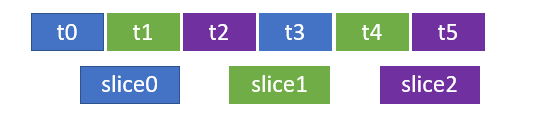

# Run tests in parallel for any test runner

[!INCLUDE [include](../_shared/version-server-2019-rtm.md)]

Running tests to validate changes to code is key to maintaining quality.
For continuous integration practice to be successful, it is essential you have a good test suite
that is run with every build. However, as the codebase grows, the regression test suite tends to
grow as well and running a full regression test can take a long time.
Sometimes, tests themselves may be long running - this is typically the case if you write
end-to-end tests. This reduces the speed with which customer value can be delivered as pipelines
cannot process builds quickly enough.

Running tests in parallel is a great way to improve the efficiency of CI/CD pipelines.
This can be done easily by employing the additional capacity offered by the cloud.
This article discusses how you can parallelize tests by using multiple agents to process jobs.

## Pre-requisite

Familiarize yourself with the concepts of [agents](../agents/agents.md) and [jobs](../process/phases.md).
Each agent can run only one job at a time. To run multiple jobs in parallel, you must configure multiple agents.
You also need sufficient [parallel jobs](../licensing/concurrent-jobs.md).


## Setting up parallel jobs

Specify 'parallel' strategy in the YAML and indicate how many jobs should be dispatched.
The variables `System.JobPositionInPhase` and `System.TotalJobsInPhase` are added to each job.

```yaml
jobs:
- job: ParallelTesting
  strategy:
    parallel: 2
```

> [!TIP]
> You can specify as many as 99 agents to scale up testing for large test suites.

## Slicing the test suite

To run tests in parallel you must first slice (or partition) the test suite so that
each slice can be run independently. For example, instead of running a large suite of 1000 tests on a single agent,
you can use two agents and run 500 tests in parallel on each agent.
Or you can reduce the amount of time taken to run the tests even further by using 8 agents and running 125 tests in parallel on each agent.

The step that runs the tests in a job needs to know which test slice should be
run. The variables `System.JobPositionInPhase` and `System.TotalJobsInPhase` can be used for this purpose:

* `System.TotalJobsInPhase` indicates the total number of slices (you can think of this as "totalSlices")
* `System.JobPositionInPhase` identifies a particular slice (you can think of this as "sliceNum") 

If you represent all test files as a single dimensional array, each job can run a test file indexed at
[sliceNum + totalSlices], until all the test files are run. 
For example, if you have six test files and two parallel jobs, the first job (slice0) will run test files
numbered 0, 2, and 4, and second job (slice1) will run test files numbered 1, 3, and 5.


If you use three parallel jobs instead, the first job (slice0) will run test files numbered 0 and 3,
the second job (slice1) will run test files numbered 1 and 4, and the third job (slice2) will run
test files numbered 2 and 5.



## Sample code

This .NET Core sample uses `--list-tests` and `--filter` parameters of `dotnet test` to slice the tests.
The tests are run using the NUnit. Test results created by `DotNetCoreCLI@2` test task are then published to the server.
Import (into Azure Repos or Azure DevOps Server) or fork (into GitHub) this repo:

```
https://github.com/idubnori/ParallelTestingSample-dotnet-core
```

This Python sample uses a PowerShell script to slice the tests.
The tests are run using pytest. JUnit-style test results created by pytest are then published to the server.
Import (into Azure Repos or Azure DevOps Server) or fork (into GitHub) this repo:

```
https://github.com/PBoraMSFT/ParallelTestingSample-Python
```

This JavaScript sample uses a bash script to slice the tests.
The tests are run using the mocha runner. JUnit-style test results created by mocha are then published to the server.
Import (into Azure Repos or Azure DevOps Server) or fork (into GitHub) this repo:

```
https://github.com/PBoraMSFT/ParallelTestingSample-Mocha
```

The sample code includes a file `azure-pipelines.yml` at the root of the repository
that you can use to create a pipeline. Follow all the instructions in
[Create your first pipeline](../create-first-pipeline.md) to create a pipeline and see test slicing in action.

## Combine parallelism for massively parallel testing

When parallel jobs are used in a pipeline, the pipeline employs multiple machines to run each job in parallel.
Most test runners provide the capability to run tests in parallel on a single machine
(typically by creating multiple processes or threads that are run in parallel).
The two types of parallelism can be combined for massively parallel testing,
which makes testing in pipelines extremely efficient.

[!INCLUDE [help-and-support-footer](_shared/help-and-support-footer.md)] 
