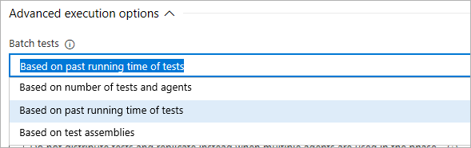
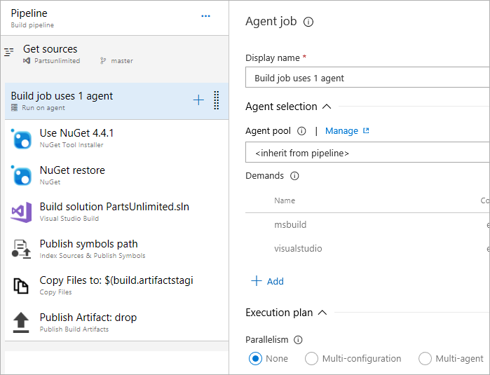
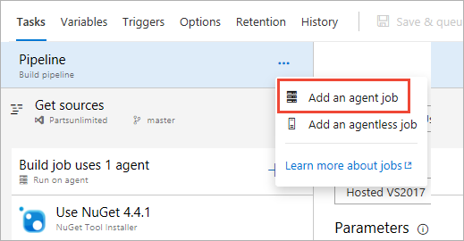
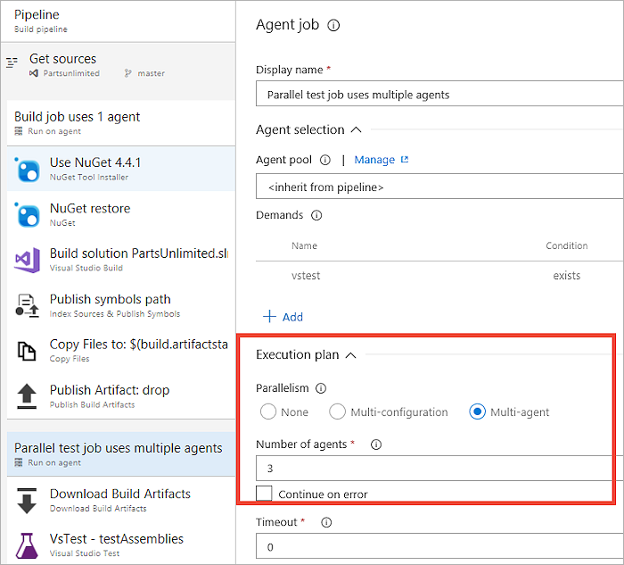
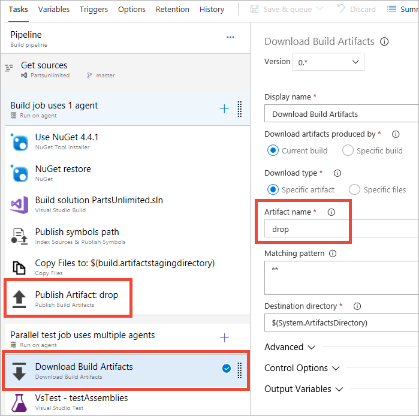
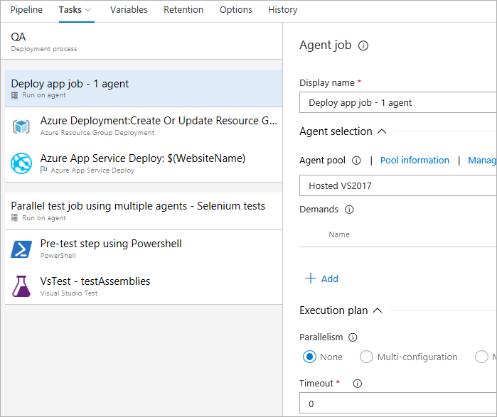
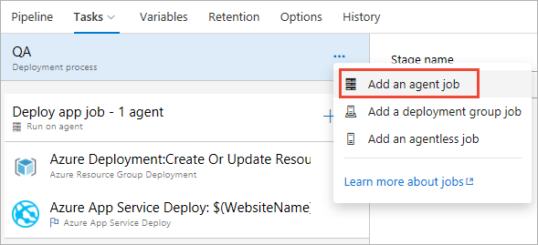
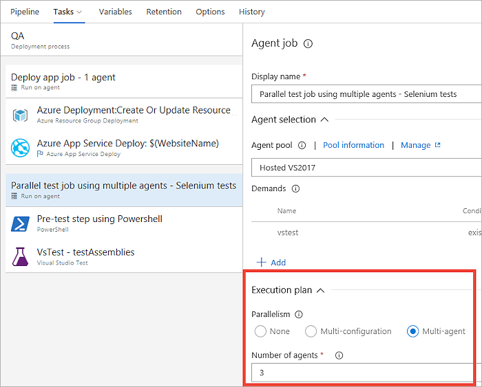

# Run tests in parallel using the Visual Studio Test task

[!INCLUDE [version-tfs-2017-rtm](../_shared/version-tfs-2017-rtm.md)]

::: moniker range="< tfs-2018"
> [!NOTE]
> For TFS, this topic applies to only TFS 2017 Update 1 and later.
::: moniker-end

Running tests to validate changes to code is key to maintaining quality.
For continuous integration practice to be successful, it is essential you have a good test suite
that is run with every build. However, as the codebase grows, the regression test suite tends to
grow as well and running a full regression test can take a long time.
Sometimes, tests themselves may be long running - this is typically the case if you write
end-to-end tests. This reduces the speed with which customer value can be delivered as pipelines
cannot process builds quickly enough.

Running tests in parallel is a great way to improve the efficiency of CI/CD pipelines.
This can be done easily by employing the additional capacity offered by the cloud.
This article discusses how you can configure the
[Visual Studio Test task](../tasks/test/vstest.md) to run tests in parallel by using multiple agents.

::: moniker range="<= tfs-2018"

[!INCLUDE [temp](../_shared/concept-rename-note.md)]

::: moniker-end

## Pre-requisite

Familiarize yourself with the concepts of [agents](../agents/agents.md) and [jobs](../process/phases.md).
To run multiple jobs in parallel, you must configure multiple agents.
You also need sufficient [parallel jobs](../licensing/concurrent-jobs.md).

## Test slicing

The Visual Studio Test task (version 2) is designed to work seamlessly with parallel job settings.
When a pipeline job that contains the Visual Studio Test task (referred to as the "VSTest task" for simplicity)
is configured run on multiple agents in parallel, it automatically detects that multiple agents are involved
and creates test slices that can be run in parallel across these agents.

The task can be configured to create test slices to suit different requirements such as
batching based on the number of tests and agents, the previous test running times, or the location
of tests in assemblies.

These options are explained in the following sections.

### Simple slicing based on the number of tests and agents

This setting uses a simple slicing algorithm to divide up the number of tests 'T' across 'N' agents
so that each agent runs T/N tests. For example, if your test suite contains 1000 tests, and you use
two agents for parallel jobs, each agent will run 500 tests. Or you can reduce the amount of time taken
to run the tests even further by using eight agents, in which case each agent runs 125 tests in parallel.

This option is typically used when all tests have similar running times.
If test running times are not similar, agents may not be utilized effectively because some agents may
receive slices with several long-running tests, while other agents may receive slices with short-running tests
and finish much earlier than the rest of the agents.

### Slicing based on the past running time of tests

This setting considers past running times to create slices of tests so that each slice has approximately
the same running time. Short-running tests will be batched together, while long-running tests will be allocated
to separate slices.

This option should be used when tests within an assembly do not have dependencies, and do not need to run on the same agent.
This option results in the most efficient utilization of agents because every agent gets the same amount of 'work'
and all finish at approximately the same time.

### Slicing based on test assemblies

This setting uses a simple slicing algorithm that divides up the number of test assemblies (or files) 'A' across 'N'
agents, so that each agent runs tests from A/N assemblies. The number of tests within an assembly is not taken into
account when using this option. For example, if your test suite contains ten test assemblies and you use two agents for parallel jobs,
each agent will receive five test assemblies to run. You can reduce the amount of time taken to run the tests even further
by using five agents, in which case each agent gets two test assemblies to run.

This option should be used when tests within an assembly have dependencies
or utilize `AssemblyInitialize` and `AssemblyCleanup`, or `ClassInitialize` and `ClassCleanup` methods,
to manage state in your test code. 

## Run tests in parallel in build pipelines
If you have a large test suite or long-running integration tests to run in your build pipeline,
use the following steps.

> [!NOTE]
> To use the multi-agent capability in build pipelines with on-premises TFS server, you must use TFS 2018 Update 2 or a later version.

1. **Build job using a single agent**.
   Build Visual Studio projects and publish build artifacts using the tasks shown in the following image.
   This uses the default job settings (single agent, no parallel jobs).

   

1. **Run tests in parallel using multiple agents**:

   * Add an **agent job**

     

   * Configure the job to use **multiple agents in parallel**. The example here uses three agents.

     

     > [!TIP]
     > For massively parallel testing, you can specify as many as 99 agents.

   * Add a **Download Build Artifacts** task to the job.
     This step is the link between the build job and the test job, and is necessary to ensure that the binaries
     generated in the build job are available on the agents used by the test job to run tests.
     Ensure that the task is set to download artifacts produced by the 'Current build' and the artifact name
     is the same as the artifact name used in the **Publish Build Artifacts** task in the build job.

     

   * Add the **Visual Studio Test** task and configure it to use the required [slicing strategy](#strategy).

## Run tests in parallel in release pipelines

Use the following steps if you have a large test suite or long-running functional tests
to run after deploying your application.
For example, you may want to deploy a web-application and run Selenium tests in a browser
to validate the app functionality.

> [!NOTE]
> To use the multi-agent capability in release pipelines with on-premises TFS server, you must use TFS 2017 Update 1 or a later version.

1. **Deploy app using a single agent**. Use the tasks shown in the image below to deploy a web app to Azure App Services.
   This uses the default job settings (single agent, no parallel jobs).

   

1. **Run tests in parallel using multiple agents**:

   * Add an **agent job**

     

   * Configure the job to use **multiple agents in parallel**. The example here uses three agents.

     

     > [!TIP]
     > For massively parallel testing, you can specify as many as 99 agents.

   * Add any **additional tasks** that must run before the Visual Studio test task is run.
     For example, run a PowerShell script to set up any data required by your tests.

     > [!TIP]
     > Jobs in release pipelines download all artifacts linked to the release pipeline by default.
     > To save time, you can configure the job to download only the test artifacts required by the job.
     > For example, web app binaries are not required to run Selenium tests and downloading these can be
     > skipped if the app and test artifacts are published separately by your build pipeline.

   *  Add the **Visual Studio Test** task and configure it to use the required [slicing strategy](#strategy).

     > [!TIP]
     > If the test machines do not have Visual Studio installed, you can use the
     > [Visual Studio Test Platform Installer task](../tasks/tool/vstest-platform-tool-installer.md) to
     > acquire the required version of the test platform.

## Massively parallel testing by combining parallel pipeline jobs with parallel test execution

When parallel jobs are used in a pipeline, it employs multiple machines (agents) to run each job in parallel.
Test frameworks and runners also provide the capability to run tests in parallel on a single machine,
typically by creating multiple processes or threads that are run in parallel.
Parallelism features can be combined in a layered fashion to achieve massively parallel testing.
In the context of the [Visual Studio Test task](../tasks/test/vstest.md), parallelism can be combined in the following ways:

1. **Parallelism offered by test frameworks**.
   All modern test frameworks such as MSTest v2, NUnit, xUnit, and others provide the ability to run tests in parallel.
   Typically, tests in an assembly are run in parallel. These test frameworks interface with the Visual Studio Test platform
   using a test adapter and the test framework, together with the corresponding adapter, and work within a test host process
   that the Visual Studio Test Platform creates when tests are run. Therefore, parallelization at this layer is within a process
   for all frameworks and adapters.

2. **Parallelism offered by the Visual Studio Test Platform (vstest.console.exe)**. Visual Studio Test Platform can run
   test assemblies in parallel. Users of vstest.console.exe will recognize this as the
   [/parallel switch](https://docs.microsoft.com/visualstudio/test/vstest-console-options?view=vs-2017).
   It does so by launching a test host process on each available core, and handing it tests in an assembly to execute.
   This works for any framework that has a test adapter for the Visual Studio test platform because the unit of parallelization
   is a test assembly or test file. This, when combined with the parallelism offered by test frameworks (described above),
   provides the maximum degree of parallelization when tests run on a single agent in the pipeline.

3. **Parallelism offered by the Visual Studio Test (VSTest) task**. The VSTest task supports running tests in parallel across
   multiple agents (or machines). Test slices are created, and each agent executes one slice at a time.
   The three different [slicing strategies](#strategy), when combined with the parallelism offered by the test platform and
   test framework (as described above), result in the following:

   * Slicing based on the number of tests and agents. Simple slicing where tests are grouped in equally sized slices.
     A slice contains tests from one or more assemblies.
     Test execution on the agent then conforms to the parallelism described in **1** and **2** above.

   * Slicing based on past running time. Based on the previous timings for running tests, and the number of available agents,
     tests are grouped into slices such that each slice requires approximately equal execution time.
     A slice contains tests from one or more assemblies.
     Test execution on the agent then conforms to the parallelism described in **1** and **2** above.

   * Slicing based on assemblies. A slice is a test assembly, and so contains tests that all belong to the same assembly.
     Execution on the agent then conforms to the parallelism described in **1** and **2** above.
     However, **2** may not occur if an agent receives only one assembly to run.

[!INCLUDE [help-and-support-footer](_shared/help-and-support-footer.md)]
