# Trace test requirements

[!INCLUDE [version-tfs-2015-rtm](../_shared/version-tfs-2015-rtm.md)]

**Requirements traceability** is the ability to relate and document two or more phases of 
a development process, which can then be traced both forward or backward from its origin.
Requirements traceability help teams to get insights into indicators such as
**quality of requirements** or **readiness to ship the requirement**.
A fundamental aspect of requirements traceability is association of the requirements to test cases, bugs and code changes.

> Read the [glossary](./test-glossary.md) to understand test report terminology.

::: moniker range="<= tfs-2018"
[!INCLUDE [temp](../_shared/concept-rename-note.md)]
::: moniker-end

## Agile teams running automated tests 

Agile teams have characteristics including, but not limited to the following 

* Faster release cycles 
* Continuous testing in a pipeline
* Negligible manual testing footprint; limited to exploratory testing
* High degree of automation

The following sections explore traceability from **Quality**, **Bug** and **Source** standpoints for Agile teams.

### Quality traceability

To ensure user requirements meet the quality goals, the requirements
in a project can be linked to test results, which can then be viewed on the
team's dashboard. This enables end-to-end traceability with a simple way to monitor test results.
To link automated tests with requirements, visit [test report](review-continuous-test-results-after-build.md) in build or release.

1. In the results section under **Tests** tab of a build or release summary,
   select the test(s) to be linked to requirements and choose **Link**. 

   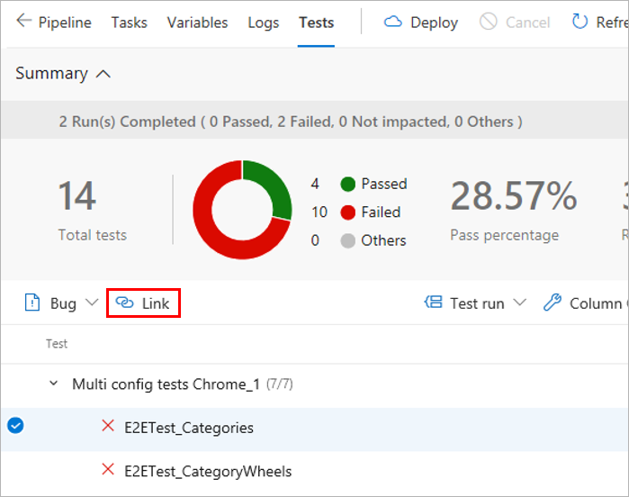

2. Choose a work item to be linked to the selected test(s) in one of the specified way:

   * Choose an applicable work item from the list of suggested work items. The list is based on the most recently viewed and updated work items.
   * Specify a work item ID.
   * Search for a work item based on the title text.

   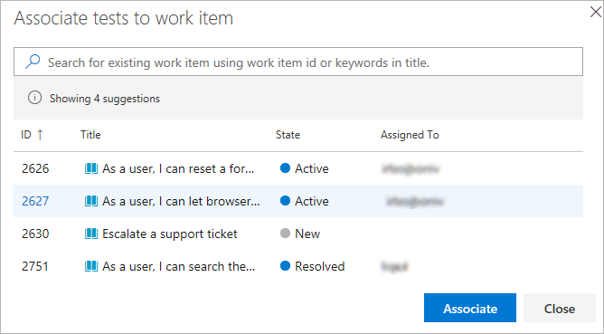

   > The list shows only work items belonging to the Requirements category. 

3. After the requirements have been linked to the test results you can view the test
   results grouped by requirement. Requirement is one of the many "Group by" options provided
   to make it easy to navigate the test results.

   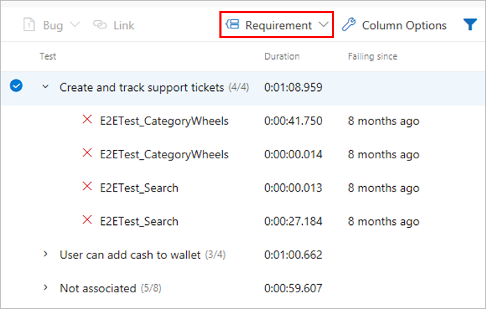

4. Teams often want to pin the summarized view of requirements traceability to a dashboard.
   Use the [Requirements quality](../../report/dashboards/widget-catalog.md#requirements-quality-widget) widget for this.

   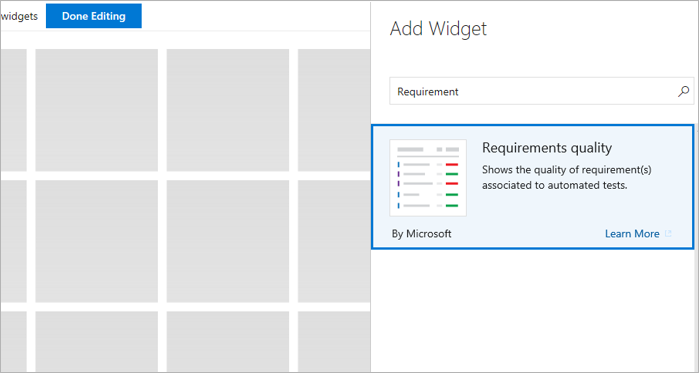

5. Configure the **Requirements quality** widget with the required options and save it.

   * **Requirements query**: Select a work item query that captures the requirements, such as the user stories in the current iteration.
   * **Quality data**: Specify the stage of the pipeline for which the requirements quality should be traced.

   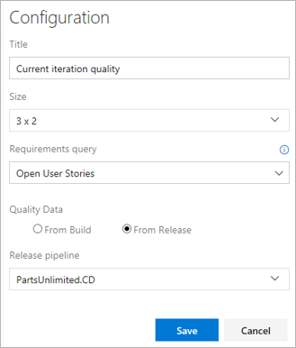

6. View the widget in the team's dashboard. It lists all the **Requirements** in scope,
   along with the **Pass Rate** for the tests and count of Failed tests. Selecting a **Failed** test
   count opens the **Tests** tab for the selected build or release.
   The widget also helps to track the requirements without any associated test(s).

   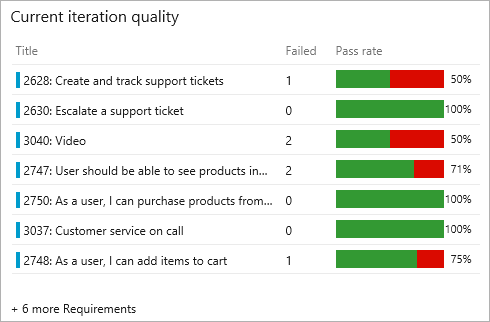

### Bug traceability

Testing gives a measure of the confidence to ship a change to users. A test  failure signals an issues with the change.
Failures can happen for many reasons such as errors in the source under test, bad test code, environmental issues,
[flaky tests](test-glossary.md), and more.
Bugs provide a robust way to track test failures and drive accountability in the team to take the required remedial actions.
To associate bugs with test results, visit [test report](review-continuous-test-results-after-build.md) in build or release.

1. In the results section of the **Tests** tab select the tests against which the bug should be created
   and choose **Bug**. Multiple test results can be mapped to a single bug.
   This is typically done when the reason for the failures is attributable to a single cause such as
   the unavailability of a dependent service, a database connection failure, or similar issues.

   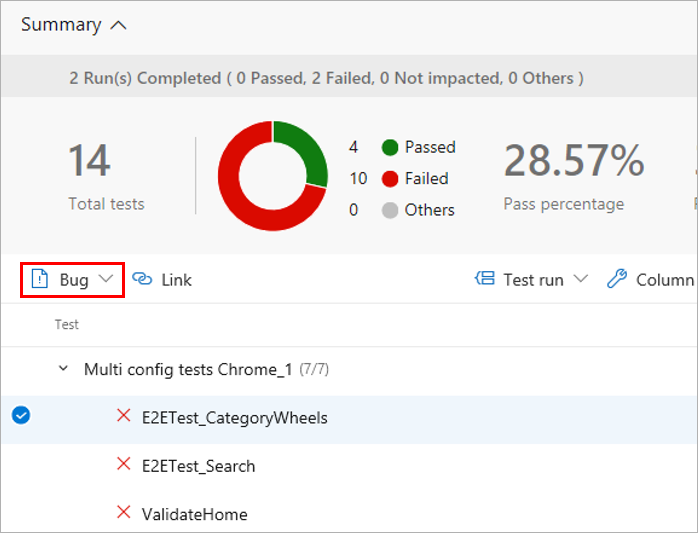

2. Open the work item to see the bug. It captures the complete context of the test results including key information
   such as the error message, stack trace, comments, and more.

   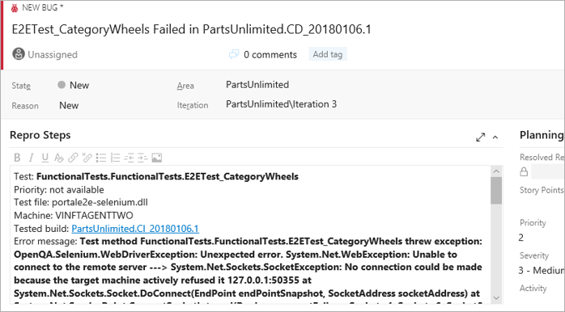

3. View the bug with the test result, directly in context, within the **Tests** tab.
   The **Work Items** tab also lists any linked requirements for the test result.

   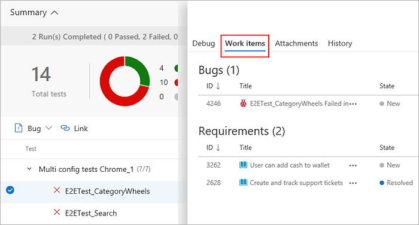

4. From a work item, navigate directly to the associated test results.
   Both the [test case](test-glossary.md) and the specific [test result](test-glossary.md) are linked to the bug.

   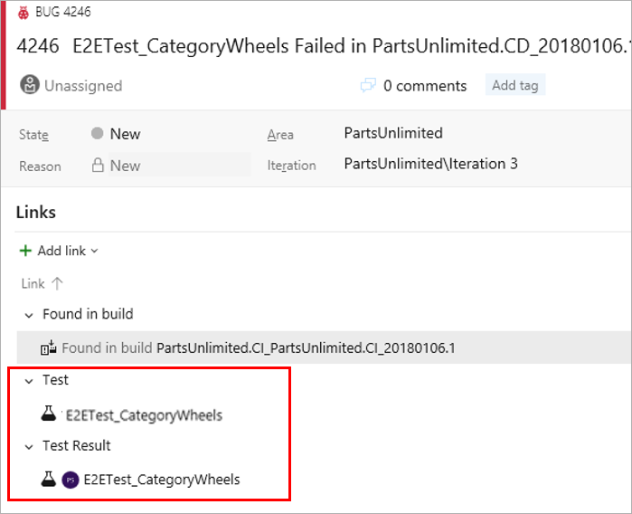

5. In the work item, select **Test case** or **Test result** to go directly to the **Tests** page
   for the selected build or release. You can troubleshoot the failure, update your analysis
   in the bug, and make the changes required to fix the issue as applicable.
   While both the links take you to the **Tests tab**, the default section shown are **History** and **Debug** respectively.

   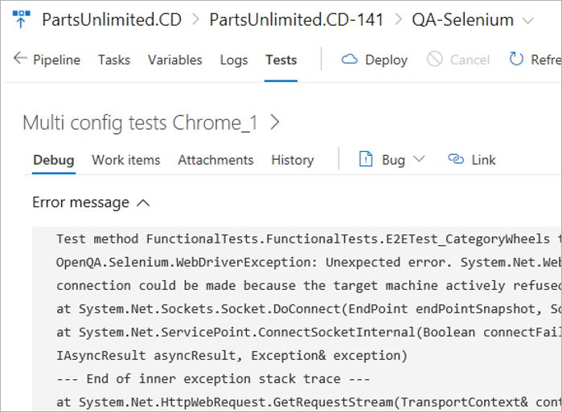

### Source traceability

When troubleshooting test failures that occur consistently over a period of time,
it is important to trace back to the initial set of changes - where the failure originated.
This can help significantly to narrow down the scope for identifying the problematic test or
source under test. To discover the first instance of test failures and trace it back to the associated code changes,
visit [Tests tab](review-continuous-test-results-after-build.md) in build or release.

1. In the **Tests** tab, select a test failure to be analyzed.
   Based on whether it's a build or release, choose the **Failing build** or **Failing release** column for the test. 

   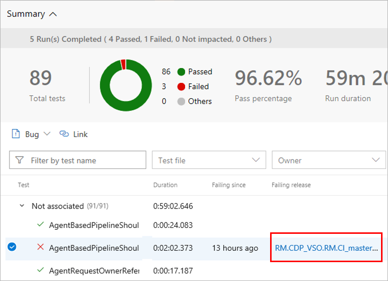

2. This opens another instance of the **Tests** tab in a new window, showing the first instance of consecutive failures for the test.

   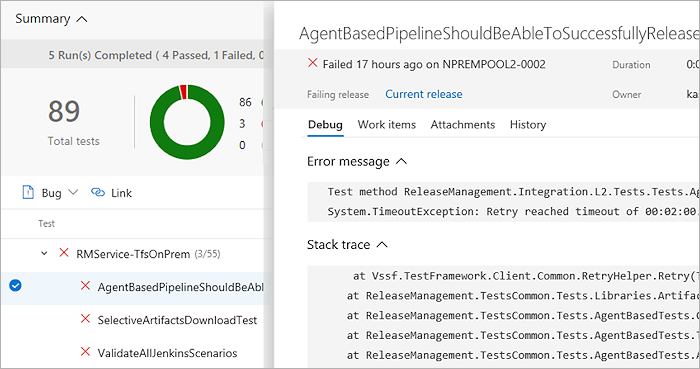

3. Based on the build or release pipeline, you can choose the timeline or pipeline view to see what code changes were committed.
   You can analyze the code changes to identify the potential root cause of the test failure.

   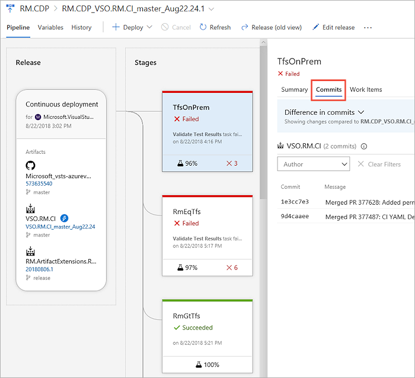

## Traditional teams using planned testing

Teams that are moving from manual testing to continuous (automated) testing, and have a subset of tests already automated,
can execute them as part of the pipeline or on demand (see [test report](review-continuous-test-results-after-build.md)).
Referred to as **Planned testing**, automated tests can be [associated to the test cases](../../test/associate-automated-test-with-test-case.md)
in a test plan and executed from **Azure Test Plans**.
Once associated, these tests contribute towards the quality metrics of the corresponding requirements.

[!INCLUDE [help-and-support-footer](_shared/help-and-support-footer.md)] 
