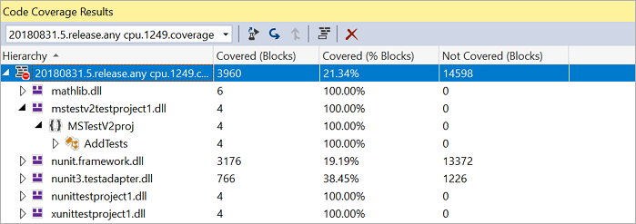

# Review code coverage results

[!INCLUDE [version-tfs-2015-rtm](../_shared/version-tfs-2015-rtm.md)]

  

Code coverage helps you determine the proportion of your project's code that is
actually being tested by tests such as unit tests. To increase your confidence
of the code changes, and guard effectively against bugs, your tests should
exercise - or cover - a large proportion of your code. 

Reviewing the code coverage result helps to identify code path(s) that are not
covered by the tests. This information is important to improve the test collateral
over time by reducing the test debt.

::: moniker range="<= tfs-2018"

[!INCLUDE [temp](../_shared/concept-rename-note.md)]

::: moniker-end

## Example

To view an example of publishing code coverage results for your choice of language,
see the **Languages** section of the Pipelines topics. For example, collect and publish
code coverage for [JavaScript](../languages/javascript.md) using Istanbul.

## View results 

The code coverage summary can be viewed in the build timeline view.
The summary shows the overall percentage of line coverage. 

> [!NOTE]
> Merging code coverage results from multiple [test runs](test-glossary.md) is
> limited to .NET and .NET Core at present. This will be supported for other formats in a future release.

## Artifacts

The code coverage artifacts published during the build can be viewed under the
**Build artifacts published** milestone in the timeline view.

* If you use the [Visual Studio Test](../tasks/test/vstest.md) task to collect coverage for .NET and .NET Core apps, the artifact contains
  **.coverage** files that can be downloaded and used for further analysis in Visual Studio.

  

* If you publish code coverage using Cobertura or JaCoCo coverage formats, the code coverage artifact contains
  an HTML file that can be viewed offline for further analysis.

  

> [!NOTE]
> For .NET and .NET Core, the link to download the artifact is available by choosing the code coverage milestone in the build summary.

## Tasks

* [Publish Code Coverage Results](../tasks/test/publish-code-coverage-results.md) publishes code coverage results to Azure Pipelines or TFS,
  which were produced by a build in [Cobertura](http://cobertura.github.io/cobertura/) or [JaCoCo](http://www.eclemma.org/jacoco/) format. 
* Built-in tasks such as [Visual Studio Test](../tasks/test/vstest.md),
  [.NET Core](../tasks/build/dotnet-core.md), [Ant](../tasks/build/ant.md), [Maven](../tasks/build/maven.md),
  [Gulp](../tasks/build/gulp.md), [Grunt](../tasks/build/grunt.md), and [Gradle](../tasks/build/gradle.md)
  provide the option to publish code coverage data to the pipeline.

[!INCLUDE [help-and-support-footer](_shared/help-and-support-footer.md)] 
