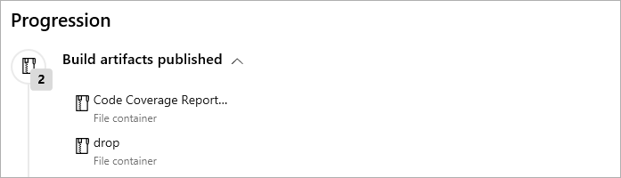

# Review code coverage results

  

Code coverage helps you determine the proportion of your project's code that is
actually being tested by tests such as unit tests. To increase your confidence
of the code changes, and guard effectively against bugs, your tests should
exercise - or cover - a large proportion of your code.

::: moniker range="<= tfs-2018"

[!INCLUDE [temp](../_shared/concept-rename-note.md)]

::: moniker-end

## Example

For an example of publishing code coverage results for JavaScript with Istanbul
using YAML, see [JavaScript](../languages/javascript.md) in the Languages section of these topics,
which also includes examples for other languages.

## View results 

The code coverage summary can be viewed in the build timeline view.

> [!NOTE]
> Merging of code coverage from multiple [test runs](test-glossary.md) is
> limited to .NET and .NET Core at present. This will be supported for other
> formats in future.

## Artifacts

The code coverage artifacts published during the build can be viewed under the
**Build artifacts published** milestone in the timeline view.

> [!NOTE]
> For .NET and .NET Core the link to download the artifact is availble on
> click of the Code coverage milestone

## Tasks

* [**Publish Code Coverage Results**](): publishes code coverage results to Azure Pipelines or TFS,
  which were produced by a build in [Cobertura] (http://cobertura.github.io/cobertura/) or [JaCoCo](http://www.eclemma.org/jacoco/) format. 
* **Other Tasks**: Built-in tasks such as [Visual Studio Test](../tasks/test/vstest.md),
  [.NET Core](../tasks/build/dotnet-core.md), [Ant](../tasks/build/ant.md), [Maven](../tasks/build/maven.md),
  [Gulp](../tasks/build/gulp.md), [Grunt](../tasks/build/grunt.md), and [Gradle](../tasks/build/gradle.md)
  provide the option to publish code coverage data to the pipeline.

[!INCLUDE [help-and-support-footer](_shared/help-and-support-footer.md)] 
