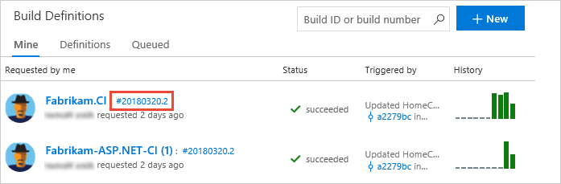
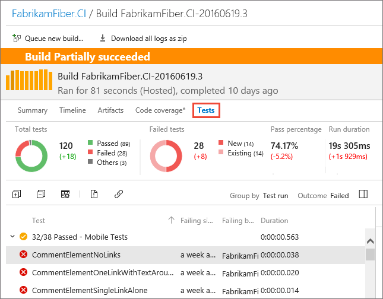
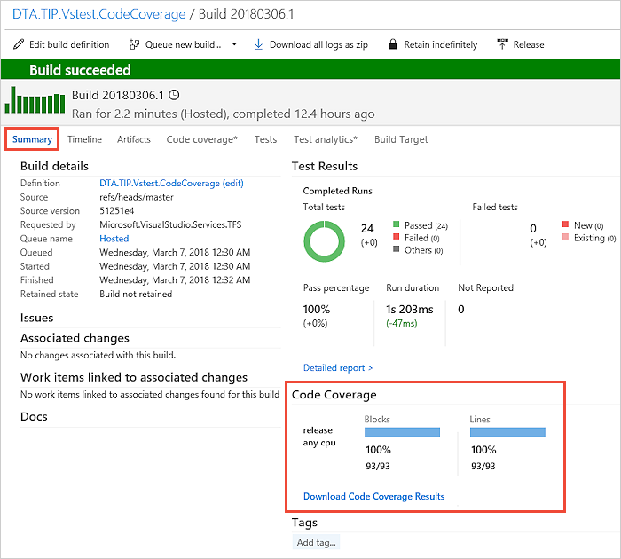
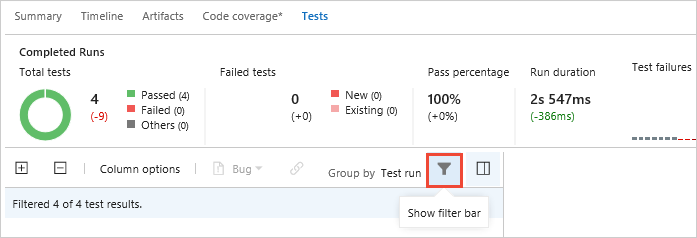
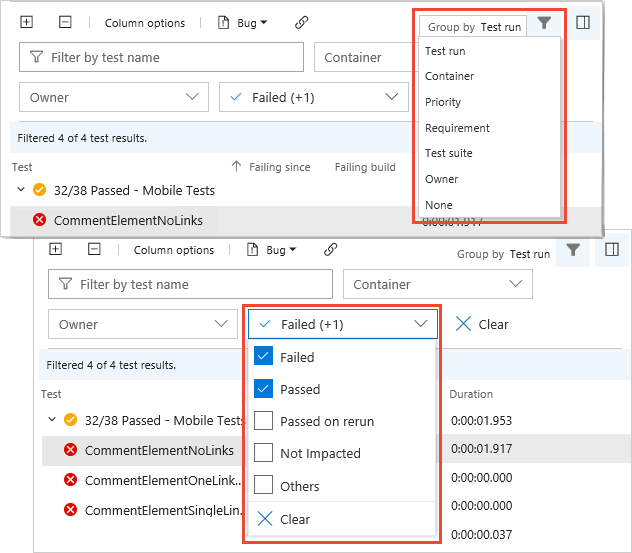
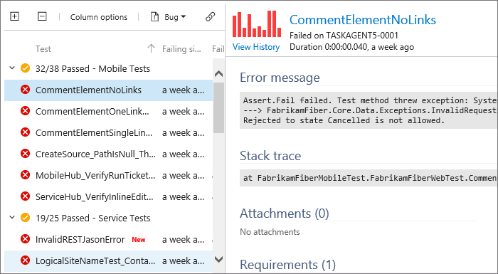
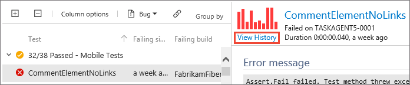
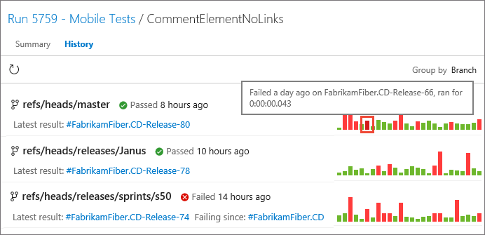
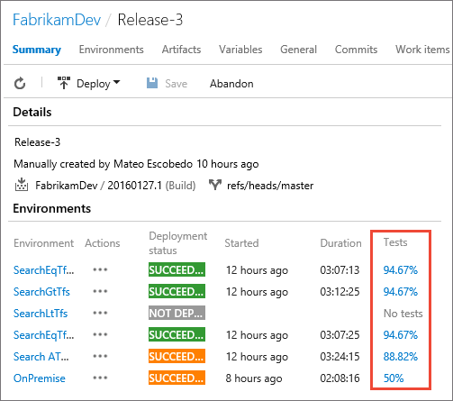

# Review continuous test results after a build

[!INCLUDE [version-header-vs-vsts-tfs](_shared/version-header-vs-vsts-tfs.md)]

After your build finishes running continuous tests using Visual Studio Team Services (VSTS) or Team Foundation Server (TFS),
review your test results to start analyzing any problems that you found.

::: moniker range="<= tfs-2018"
[!INCLUDE [temp](../_shared/concept-rename-note.md)]
::: moniker-end

  
## Review your test results

1. In VSTS or TFS, go to your project.

1. Find your build and open the build summary.

   

1. Review the summary for your test run results.
   Here you'll find changes in new, failed, and passed tests, 
   how long these tests took to run, how long these tests have been failing, and more.

   

1. If you collected code coverage information, the build **Summary** page displays an overview of the blocks and lines covered.
   You can download the code coverage results for a drill-down analysis in Visual Studio.

   

  
## Organize your test results

1. Choose the **Show filter bar** icon.

   

1. Organize your test results using the group and outcome lists.

   

  
## Debug failed tests

1. To start debugging a failed test, review the resulting error and stack trace.

   

1. To trace the results of a test across builds, view the test history.

   

1. In the history page, review when a test started to pass or fail.

   

   Group the list of results using the drop-down list.
   Mouse over a bar in the chart to see a pop-up summary, or select
   a bar to view the detailed test results for that build.
 
  
## View tests in the Release hub

* Test results are also summarized in the release summaries in the **Release** hub.
  Choose any of the percentage values to see the full summary in the **Test** hub. 

  

## Next step

> [!div class="nextstepaction"]
> [Run automated tests from test plans in the Test hub](run-automated-tests-from-test-hub.md)
