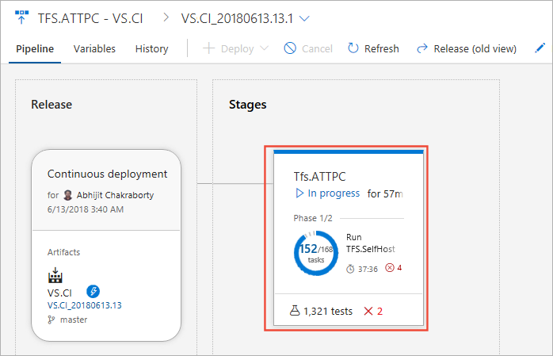

# Review test results

[!INCLUDE [version-tfs-2015-rtm](../_shared/version-tfs-2015-rtm.md)]

  

Automated tests can be configured to run as part of a build or release for various [languages](../languages/javascript.md).
Test reports provide an effective and consistent way to view the tests results executed using different test frameworks,
in order to measure pipeline quality, review traceability, troubleshoot failures and drive failure ownership.
In addition, it provides many advanced reporting capabilities explored in the following sections.

::: moniker range=">= azure-devops-2019"

You can also perform deeper analysis of test results by using the
[Analytics Service](../../report/powerbi/what-is-analytics.md).
For an example of using this with your build and deploy pipelines, see [Analyze test results](test-analytics.md).

::: moniker-end

Read the [glossary](./test-glossary.md) to understand test report terminology.

::: moniker range="< azure-devops-2019"

> [!NOTE]
> Test report is available in TFS 2015 and above, however the new experience
> described in this topic is currently available only in Azure Pipelines.

::: moniker-end

::: moniker range="<= tfs-2018"

[!INCLUDE [temp](../_shared/concept-rename-note.md)]

::: moniker-end

Published test results can be viewed in the **Tests** tab in a build or release summary.

## Surface test results in the Tests tab 

Tests results can be surfaced in the **Tests** tab using one of the following options:

* **Automatically  inferred  test  results**.  By default, your pipeline can automatically infer the test output for a few popular test runners.
  This is done by parsing the error logs generated during the build operation and then checking for signatures of test failures.
  Currently, Azure DevOps supports the following languages and test runners for automatically inferring the test results: 

  - Javascript - Mocha,  Jest  and  Jasmine
  - Python- Unittest
 
  **Note**: This inferred test report is a limited experience. Some features available in fully-formed test reports are not present here
  [(more details)](#automatically_inferred_tests). Also see:  

  - [Publishing fully-formed test reports for JavaScript test runners](../languages/javascript.md#run-unit-tests)
  - [Publishing fully-formed test reports for Python test runners](../languages/python.md#test)

* **Test execution tasks**. Built-in test execution tasks such as [Visual Studio Test](../tasks/test/vstest.md)
  that automatically publish test results to the pipeline, or others such as [Ant](../tasks/build/ant.md),
  [Maven](../tasks/build/maven.md), [Gulp](../tasks/build/gulp.md), [Grunt](../tasks/build/grunt.md), and
  [Xcode](../tasks/build/xcode.md) that provide this capability as an option within the task.  

* **Publish Test Results task**. Task that publishes test results to Azure Pipelines or TFS when tests are executed using
  your choice of runner, and results are available in any of the [supported test result formats](../tasks/test/publish-test-results.md). 

* **API(s)**. Test results published directly by using the [Test Management API(s)](https://docs.microsoft.com/rest/api/vsts/test/results?view=vsts-rest-5.0).

## Surface test information beyond the Tests tab

The **Tests** tab provides a detailed summary of the test execution.
This is helpful in tracking the quality of the pipeline, as well as for troubleshooting failures.
Azure DevOps also provides other ways to surface the test information: 

* The [Dashboard](../../report/dashboards/dashboards.md) provides visibility of your team's progress.
  Add one or more widgets that surface test related information:

  - [Requirements quality](../../report/dashboards/widget-catalog.md#requirements-quality-widget)
  - [Test results trend](../../report/dashboards/widget-catalog.md#test-results-widget)
  - [Deployment status](../../report/dashboards/widget-catalog.md#deployment-status-widget)
  
* [Test analytics](test-analytics.md) provides rich insights into test results measured over a period of time.
  It can help identify problematic areas in your test by providing data such as the top failing tests, and more.

  

## View test results in build

The build summary provides a timeline view of the key steps executed in the build.
If tests were executed and reported as part of the build, a test milestone appears
in the timeline view. The test milestone provides a summary of the
test results as a measure of **pass percentage** along with indicators for **failures** and **aborts** if these exist.

  

## View test results in release

In the pipeline view you can see all the stages and associated tests.
The view provides a summary of the test results as a measure of **pass percentage** along with indicators for
**failures** and **aborts** if these exist. These indicators are same as in the build timeline view, giving
a consistent experience across build and release.

 

## Tests tab

Both the build and release summaries provide details of test execution. Choose **Test summary** to view the details in the **Tests** tab.
This page has the following sections

* **Summary**: provides key quantitative metrics for the test execution such as the total test count, failed tests, pass percentage, and more.
  It also provides differential indicators of change compared to the previous execution.

* **Results**: lists all tests executed and reported as part of the current build or release.
  The default view shows only the failed and aborted tests in order to focus on tests that require attention.
  However, you can choose other outcomes using the filters provided. 

* **Details**: A list of tests that you can sort, group, search, and filter to find the test results you need.

Select any test run or result to view the details pane that displays additional information required for troubleshooting
such as the error message, stack trace, attachments, work items, historical trend, and more.

> [!TIP]
> If you use the Visual Studio Test task to run tests, diagnostic output logged from tests (using any of Console.WriteLine, Trace.WriteLine or TestContext.WriteLine methods), will appear as an attachment for a failed test.

The following capabilities of the **Tests** tab help to improve productivity and troubleshooting experience.

### Filter large test results

Over time, tests accrue and, for large applications, can easily grow to tens of thousands of tests.
For these applications with very many tests, it can be hard to navigate through the results to identify test failures,
associate root causes, or get ownership of issues. Filters make it easy to quickly navigate to the test results of your interest.
You can filter on **Test Name**, **Outcome** (failed, passed, and more), **Test Files** (files holding tests) and **Owner** (for test files).
All of the filter criteria are cumulative in nature.

Additionally, with multiple **Grouping** options such as **Test run**, **Test file**, **Priority**, **Requirement**, and more,
you can organize the **Results** view exactly as you require.

### Immersive troubleshooting experience

Error messages and stack traces are lengthy in nature and need enough real estate to view the details during troubleshooting.
To provide an immersive troubleshooting experience, the **Details** view can be expanded to full page view while still being
able to perform the required operations in context, such as bug creation or requirement association for the selected test result.

### Test trends with historical data

History of test execution can provide meaningful insights into reliability or performance of tests.
When troubleshooting a failure, it is valuable to know how a test has performed in the past.
The **Tests** tab provides test history in context with the test results.
The test history information is exposed in a progressive manner starting with the current build pipeline to other branches,
or the current stage to other stages, for build and release respectively.

### View execution of in-progress tests

Tests, such as integration and functional tests, can run for a long time.
Therefore, it is important to see the current or near real-time status of test execution at any given time.
Even for cases where tests run quickly, it's useful to know the status of the relevant test result(s) as early as possible;
especially when failures occur. The **in-progress** view eliminates the need to wait for test execution to finish.
Results are available in near real-time as execution progresses, helping you to take actions faster.
You can debug a failure, file a bug, or abort the pipeline. 

> [!NOTE]
> The feature is currently available for both build and release, using
> [Visual Studio Test](../tasks/test/vstest.md) task in a Multi Agent job. 
> It will be available for Single Agent jobs in a future release.

The view below shows the **in-progress** test summary in a release, reporting the total test count and the number of test failures
at a given point in time. The test failures are available for troubleshooting, creating bug(s), or to take any other appropriate action. 

### View summarized test results

During test execution, a test might spawn multiple instances or tests that contribute to the overall outcome.
Some examples are, tests that are rerun, tests composed of an ordered combination of other tests (ordered tests)
or tests having different instances based on an input parameter (data driven tests).

<!-- see also [rerun](./test-reliability.md) -->

As these tests are related, they must be reported together with the overall outcome derived from the individual instances or tests.
These test results are reported as a summarized test result in the **Tests** tab:

* **Rerun failed tests**: The ability to rerun failed tests is available in the latest version of the [Visual Studio Test](../tasks/test/vstest.md) task.
  During a rerun, multiple attempts can be made for a failed test, and each failure could have a different root cause due to the non-deterministic behavior of the test.
  Test reports provide a combined view for all the attempts of a rerun, along with the overall test outcome as a summarized unit.
  Additionally the [Test Management API(s)](https://docs.microsoft.com/rest/api/vsts/test/results?view=vsts-rest-5.0)
  now support the ability to publish and query summarized test results.

  

* **Data driven tests**: Similar to the rerun of failed tests, all iterations of data driven tests are reported under that test.
  The summarized result view for data driven tests depends on the behavior of the test framework.
  If the framework produces a hierarchy of results (for example, MSTest v1 and v2) they will be reported in a summarized view.
  If the framework produces individual results for each iteration (for example, xUnit) they will not be grouped together.
  The summarized view is also available for ordered tests (**.orderedtest** in Visual Studio).

  

> [!NOTE]
> Metrics in the test summary section, such as the total number of tests, passed, failed, or other are
> computed using the root level of the summarized test result.

### View aborted tests

Test execution can abort due to several reasons such as bad test code, errors in the source under test, or environmental issues.
Irrespective of the reason for the abort, it is important to be able to diagnose the behavior and identify the root cause.
The aborted tests and test runs can be viewed alongside the completed runs in the **Tests** tab. 

> [!NOTE]
> The feature is currently available for both build and release, using the
> [Visual Studio Test](../tasks/test/vstest.md) task in a Multi Agent job 
> or publishing test results using the
> [Test Management API(s)](https://docs.microsoft.com/rest/api/vsts/test/results?view=vsts-rest-5.0). 
> It will be available for Single Agent jobs in a future release.

### Automatically inferred test results

Azure DevOps can automatically infer the output of tests that are running in your pipelines for a few supported test frameworks.
These automatically inferred test reports require no specific configuration of your pipelines, and are a zero-effort way to get
started using Test Reporting. 

See the [list of runners for which test results are automatically inferred](#inferred_runners_list).

As only limited test metadata is present in such inferred reports, they are limited in features and capabilities.
The following features are not available for inferred test reports:

* Group the test results by test file, owner, priority, and other fields
* Search and filter the test results
* Check details of passed tests
* Preview any attachments generated during the tests within the web UI itself
* Associate a test failure with a new bug, or see list of associated work items for this failure
* See build-on-build [analytics for testing in Pipelines](test-analytics.md)

> [!NOTE]
> Some runners such as Mocha have multiple built-in console reporters such as [dot-matrix](https://mochajs.org/#dot-matrix) and [progress-bar](https://mochajs.org/#progress). 
> If you have configured a non-default console output for your test runner, or you are using a custom reporter,
> Azure DevOps will not be able to infer the test results. It can only infer the results from the [default](https://mochajs.org/#spec) reporter. 

## See also

* [Analyze test results](test-analytics.md)
* [Trace test requirements](requirements-traceability.md)
* [Review code coverage results](review-code-coverage-results.md)

[!INCLUDE [help-and-support-footer](_shared/help-and-support-footer.md)] 
