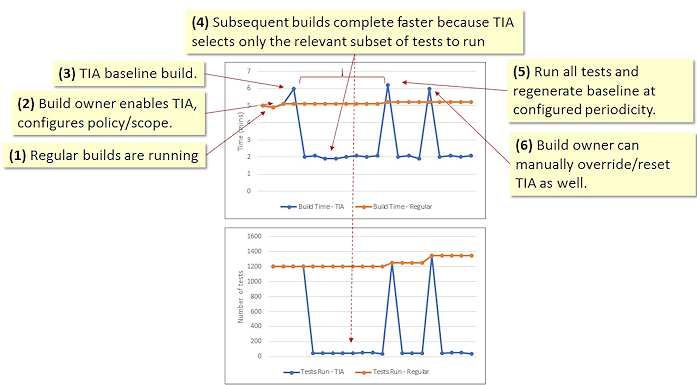
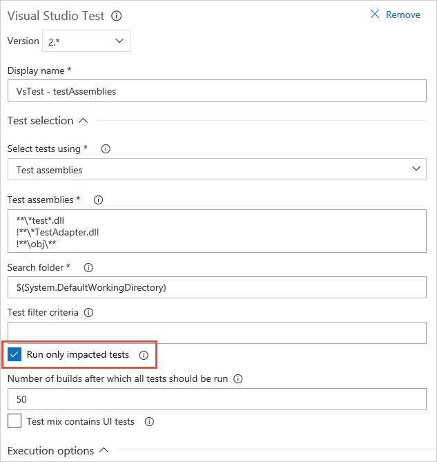
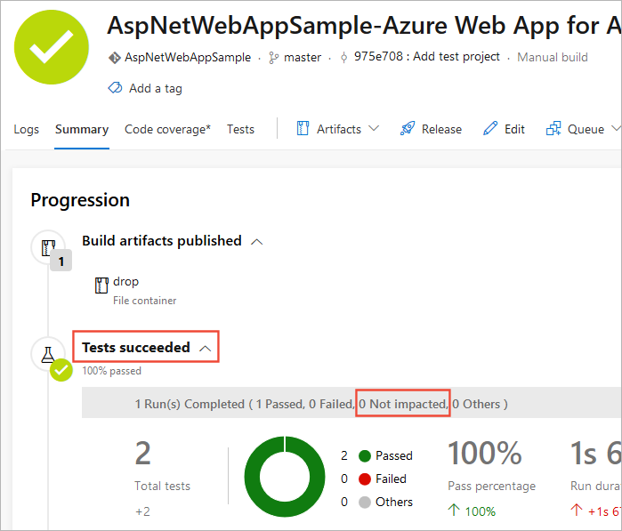
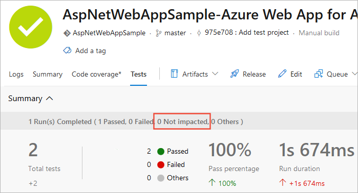

# Speed up testing by using Test Impact Analysis (TIA)

[!INCLUDE [version-header-vs-vsts-tfs](../_shared/version-header-test-vs-vsts-tfs.md)]

::: moniker range="<= tfs-2018"
> [!NOTE] 
> Applies only to TFS 2017 Update 1 and later, and Visual Studio 2015 Update 3 and later.
::: moniker-end

Continuous Integration (CI) is a key practice in the industry.
Integrations are frequent, and verified with an automated build that runs regression tests to detect integration errors as soon as possible.
However, as the codebase grows and matures, its regression test suite tends to grow as well - to the extent that running a full regression test might require hours.
This slows down the frequency of integrations, and ultimately defeats the purpose of continuous integration.
In order to have a CI pipeline that completes quickly, some teams defer the execution of their longer running tests to a separate stage in the pipeline.
However, this only serves to further defeat continuous integration.

Instead, [enable Test Impact Analysis (TIA)](#enabletia) when using the [Visual Studio Test](../tasks/test/vstest.md)
task in a build pipeline. TIA performs incremental validation by automatic test selection.
It will automatically select only the subset of tests required to validate the code being committed.
For a given code commit entering the CI/CD pipeline, TIA will select and run only the relevant tests required to validate that commit.
Therefore, that test run will complete more quickly, if there is a failure you will get to know about it sooner, and because it is all scoped by relevance, analysis will be faster as well.



Test Impact Analysis has:

* **A robust test selection mechanism**. It includes existing impacted tests, previously failing tests, and newly added tests.
* **Safe fallback**. For commits and scenarios that TIA cannot understand, it will fall back to running all tests. TIA is currently scoped to only managed code, and single machine topology. So, for example, if the code commit contains changes to HTML or CSS files, it cannot reason about them and will fall back to running all tests.
* **Configurable overrides**. You can run all tests at a configured periodicity.

However, be aware of the following caveats when using TIA with Visual Studio 2015:

* **Running tests in parallel**. In this case, tests will run serially.
* **Running tests with code coverage enabled**. In this case, code coverage data will not get collected.

::: moniker range="<= tfs-2018"
[!INCLUDE [temp](../_shared/concept-rename-note.md)]
::: moniker-end

## Test Impact Analysis supported scenarios

At present, TIA is supported for:

* TFS 2017 Update 1 onwards, and Azure Pipelines
* Version 2.* of the [Visual Studio Test](../tasks/test/vstest.md) task in the build pipeline
* Build vNext, with multiple VSTest Tasks
* VS2015 Update 3 onwards on the build agent
* Local and hosted build agents
* CI and in PR workflows
* Git, GitHub, Other Git, TFVC repos (including partially mapped TFVC repositories with a [workaround](../../articles/test-impact-for-partially-mapped-tfvc-repositories.md))
* IIS interactions (over REST, SOAP APIs), using HTTP/HTTPS protocols
* Automated Tests
* Single machine topology. Tests and app (SUT) must be running on the same machine.
* Managed code (any .NET Framework app, any .NET service)

At present, TIA is **not** supported for:

* Multi-machine topology (where the test is exercising an app deployed to a different machine)
* Data driven tests
* Test Adapter-specific parallel test execution
* .NET Core
* UWP

[More information about TIA scope and applications](https://blogs.msdn.microsoft.com/devops/2017/05/16/accelerated-continuous-testing-with-test-impact-analysis-part-2/)

<a name="enabletia"></a>

## Enable Test Impact Analysis

TIA is supported through Version 2.* of the [Visual Studio Test](../tasks/test/vstest.md) task.
If your app is a single tier application, all you need to do is to check **Run only impacted tests** in the task UI.
The Test Impact data collector is automatically configured. No additional steps are required.



If your application interacts with a service in the context of IIS, you must also configure the Test Impact data collector to run in the context of IIS by using a **.runsettings** file.
Here is a sample that creates this configuration:

```xml
<?xml version="1.0" encoding="utf-8"?>
<RunSettings>
  <DataCollectionRunSettings>
    <DataCollectors>
      <!-- This is the TestImpact data collector.-->
      <DataCollector uri="datacollector://microsoft/TestImpact/1.0" assemblyQualifiedName="Microsoft.VisualStudio.TraceCollector.TestImpactDataCollector, Microsoft.VisualStudio.TraceCollector, Version=15.0.0.0, Culture=neutral, PublicKeyToken=b03f5f7f11d50a3a" friendlyName="Test Impact">
        <Configuration>
          <!-- enable IIS data collection-->
          <InstrumentIIS>True</InstrumentIIS>
          <!-- file level data collection -->
          <ImpactLevel>file</ImpactLevel>
          <!-- any job agent related executable or any other service that the test is using needs to be profiled. -->
          <ServicesToInstrument>
            <Name>TeamFoundationSshService</Name>
          </ServicesToInstrument>
        </Configuration>
      </DataCollector>
    </DataCollectors>
  </DataCollectionRunSettings>
</RunSettings>
```

<a name="tiareports"></a>

## View Test Impact Analysis outcome

TIA is integrated into existing test reporting at both the summary and details levels, including notification emails.





[More information about TIA and Azure Pipelines integration](https://blogs.msdn.microsoft.com/devops/2017/03/02/accelerated-continuous-testing-with-test-impact-analysis-part-1/)

## Manage Test Impact Analysis behavior

You can influence the way that tests are either included or ignored during a test run:

* **Through the VSTest task UI**. TIA can be conditioned to run all tests at a configured periodicity. Setting this option is recommended, and is the means to regulate test selection.
* **By setting a build variable**. Even after TIA has been enabled in the VSTest task, it can be disabled for a specific build by setting the variable **DisableTestImpactAnalysis** to **true**. This override will force TIA to run all tests for that build. In subsequent builds, TIA will go back to optimized test selection.

When TIA opens a commit and sees an unknown file type, it falls back to running all tests. While this is good from a safety perspective, tuning this behavior might be useful in some cases. For example:

* Set the **TI\_IncludePathFilters** variable to specific paths to include only these paths in a repository for which you want TIA to apply. This is useful when teams use a shared repository. Setting this variable disables TIA for all other paths not included in the setting.
* Set the **TIA\_IncludePathFilters** variable to specify file types that do not influence the outcome of tests and for which changes should be ignored. For example, to ignore changes to .csproj files set the variable to the value **!\*\*\\\*.csproj**.

> Use the [minimatch pattern](../tasks/file-matching-patterns.md) when setting variables, and separate multiple items with a semicolon.

To evaluate whether TIA is selecting the appropriate tests:

* Manually validate the selection. A developer who knows how the SUT and tests are architected could manually validate the test selection using the [TIA reporting capabilities](#tiareports).
* Run TIA selected tests and then all tests in sequence. In a build pipeline, use two test tasks - one that runs only impacted Tests (T1) and one that runs all tests (T2). If T1 passes, check that T2 passes as well. If there was a failing test in T1, check that T2 reports the same set of failures.

[More information about TIA advanced configuration](https://blogs.msdn.microsoft.com/devops/2017/06/13/accelerated-continuous-testing-with-test-impact-analysis-part-3/)

## Provide custom dependency mappings

TIA uses dependency maps of the following form.

``` map
TestMethod1
  dependency1
  dependency2
TestMethod2
  dependency1
  dependency3
```

TIA can generate such a dependencies map for managed code execution.
Where such dependencies reside in **.cs** and **.vb** files, TIA can automatically watch for commits into such files and then run tests that had these source files in their list of dependencies.

You can extend the scope of TIA by explicitly providing the dependencies map as an XML file.
For example, you might want to support code in other languages such as JavaScript or C++,
or support the scenario where tests and product code are running on different machines.
The mapping can even be approximate, and the set of tests you want to run can be specified in terms of a test case filter such as you would typically provide in the VSTest task parameters.

The XML file should be checked into your repository, typically at the root level. Then set the build variable **TIA.UserMapFile** to point to it.
For example, if the file is named **TIAmap.xml**,
set the variable to **$(System.DefaultWorkingDirectory)/TIAmap.xml**.

For an example of the XML file format, see [TIA custom dependency mapping](https://blogs.msdn.microsoft.com/devops/2017/08/04/accelerated-continuous-testing-with-test-impact-analysis-part-4/).

## See Also

* [TIA overview and VSTS integration](https://blogs.msdn.microsoft.com/devops/2017/03/02/accelerated-continuous-testing-with-test-impact-analysis-part-1/)
* [TIA scope and applications](https://blogs.msdn.microsoft.com/devops/2017/05/16/accelerated-continuous-testing-with-test-impact-analysis-part-2/)
* [TIA advanced configuration](https://blogs.msdn.microsoft.com/devops/2017/06/13/accelerated-continuous-testing-with-test-impact-analysis-part-3/)
* [TIA custom dependency mapping](https://blogs.msdn.microsoft.com/devops/2017/08/04/accelerated-continuous-testing-with-test-impact-analysis-part-4/)

[!INCLUDE [help-and-support-footer](_shared/help-and-support-footer.md)] 
