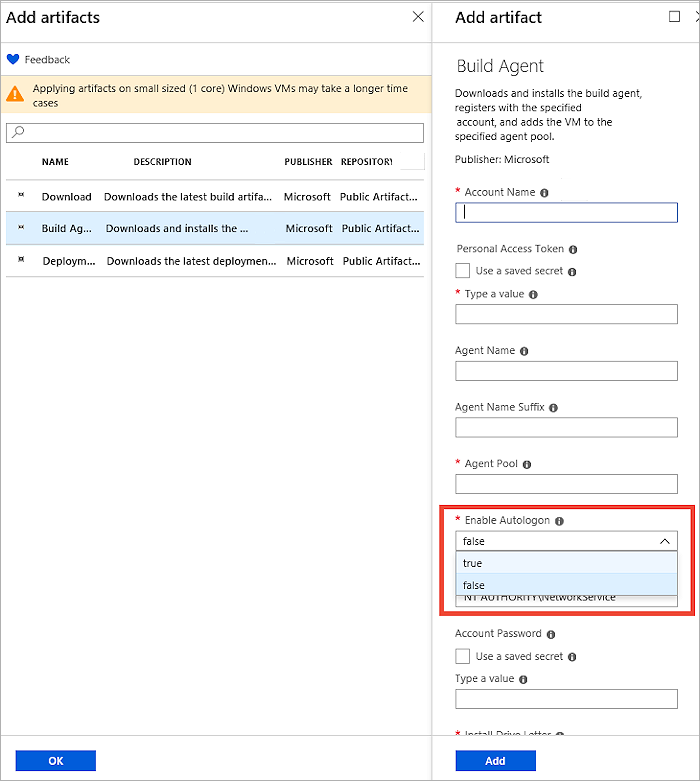
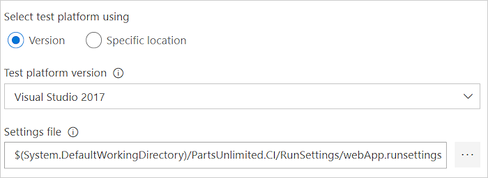

# UI testing considerations

[!INCLUDE [version-header-vsts-tfs2017](../_shared/version-tfs-2017-rtm.md)]

When running automated tests in the CI/CD pipeline, you may need a special configuration
in order to run UI tests such as Selenium, Appium or Coded UI tests. This topic describes
the typical considerations for running UI tests. 

::: moniker range="<= tfs-2018"

> [!NOTE] 
> Applies only to TFS 2017 Update 1 and later.

[!INCLUDE [temp](../_shared/concept-rename-note.md)]

::: moniker-end

## Pre-requisites

Familiarize yourself with [agents](../agents/agents.md) and [deploying an agent on Windows](../agents/v2-windows.md). 

## Headless mode or visible UI mode?

When running Selenium tests for a web app, you can launch the browser in two ways:

1. **Headless mode**. In this mode, the browser runs as normal but without any UI
   components being visible. While this mode is obviously not useful for browsing the web,
   it is useful for running automated tests in an unattended manner in a CI/CD pipeline.
   [Chrome](https://chromium.googlesource.com/chromium/src/+/lkgr/headless/README.md)
   and [Firefox](https://developer.mozilla.org/docs/Mozilla/Firefox/Headless_mode) browsers can be run in headless mode.
	
   This mode generally consumes less resources on the machine because the UI is not
   rendered and tests run faster. As a result, potentially more tests can be run in
   parallel on the same machine to reduce the total test execution time. 

   [Screenshots can be captured](#capture-screenshot) in this mode and used for troubleshooting failures.

   > [!NOTE] 
   > Microsoft Edge browser currently cannot be run in the headless mode.
   > To follow developments in this space, see [this user voice item](https://wpdev.uservoice.com/forums/257854-microsoft-edge-developer/suggestions/6545168-headless-browser-for-testing).
	
1. **Visible UI mode**. In this mode, the browser runs normally and the UI components are visible.
   When running tests in this mode on Windows, [special configuration of the agents](#visible-ui-mode) is required.

If you are running UI tests for a desktop application, such as
[Appium tests using WinAppDriver](https://github.com/Microsoft/WinAppDriver) or Coded UI tests,
a [special configuration of the agents](#visible-ui-mode) is required.

> [!TIP]
> End-to-end UI tests generally tend to be long-running. When using the visible UI mode,
> depending on the test framework, you may not be able to run tests in parallel on the
> same machine because the app must be in focus to receive keyboard and mouse events.
> In this scenario, you can speed up testing cycles by running tests in parallel on _different_
> machines. See [run tests in parallel for any test runner](./parallel-testing-any-test-runner.md)
> and [run tests in parallel using Visual Studio Test task](./parallel-testing-vstest.md).

<a name="visible-ui-mode"></a>

## UI testing in visible UI mode

A special configuration is required for agents to run UI tests in visible UI mode.

<a name="ms-hosted-agents"></a>

### Visible UI testing using Microsoft-hosted agents

Microsoft-hosted agents are pre-configured for UI testing and UI tests for both
web apps and desktop apps. Microsoft-hosted agents are also
pre-configured with [popular browsers and matching web-driver versions](https://github.com/Microsoft/azure-pipelines-image-generation/blob/master/images/win/Vs2017-Server2016-Readme.md)
that can be used for running Selenium tests.
The browsers and corresponding web-drivers are updated on a periodic basis.
To learn more about running Selenium tests, see [UI test with Selenium](continuous-test-selenium.md)

<a name="self-hosted-agents"></a>

### Visible UI testing using self-hosted Windows agents

Agents that are configured to run as service can run Selenium tests only with headless browsers.
If you are not using a headless browser, or if you are running UI tests for desktop apps,
Windows agents _must_ be configured to run as an interactive process with auto-logon enabled.

When configuring agents, select 'No' when prompted to run as a service.
Subsequent steps then allow you to configure the agent with auto-logon.
When your UI tests run, applications and browsers are launched in the
context of the user specified in the auto-logon settings.

If you use Remote Desktop to access the computer on which an agent is running
with auto-logon, simply disconnecting the Remote Desktop causes the computer
to be locked and any UI tests that run on this agent may fail.
To avoid this, use the [tscon](https://docs.microsoft.com/windows-server/administration/windows-commands/tscon)
command on the remote computer to disconnect from Remote Desktop. For example: 

`%windir%\System32\tscon.exe 1 /dest:console`

In this example, the number '1' is the ID of the remote desktop session.
This number may change between remote sessions, but can be viewed in Task Manager. 
Alternatively, to automate finding the current session ID, create a batch file
containing the following code:

```batch
for /f "skip=1 tokens=3" %%s in ('query user %USERNAME%') do (
  %windir%\System32\tscon.exe %%s /dest:console
)
```

Save the batch file and create a desktop shortcut to it, then change the shortcut properties to 'Run as administrator'.
Running the batch file from this shortcut disconnects from the remote desktop but preserves the UI session and allows UI tests to run.

## Provisioning agents in Azure VMs for UI testing 

If you are provisioning virtual machines (VMs) on Azure, agent configuration for UI testing is available
through the [Agent artifact for DevTest Labs](https://github.com/Azure/azure-devtestlab/tree/master/Artifacts/windows-vsts-build-agent).



## Setting screen resolution

Before running UI tests you may need to adjust the screen resolution so that apps render correctly.
For this, a [screen resolution utility task](https://marketplace.visualstudio.com/items?itemName=ms-autotest.screen-resolution-utility-task)
is available from Marketplace. Use this task in your pipeline to set the screen resolution
to a value that is supported by the agent machine. By default, this utility sets the resolution to
the optimal value supported by the agent machine.

If you encounter failures using the screen resolution task, ensure that the agent is configured
to run with auto-logon enabled and that all remote desktop sessions are safely disconnected using
the **tscon** command as described above.

> [!NOTE]
> The screen resolution utility task runs on the unified build/release/test agent, and cannot be used with
> the deprecated [Run Functional Tests task](../tasks/test/run-functional-tests.md).

## Troubleshooting failures in UI tests

When you run UI tests in an unattended manner, capturing diagnostic data such as
[screenshots](#capture-screenshot) or [video](#capture-video) is useful for discovering the state
of the application when the failure was encountered. 

<a name="capture-screenshot"></a>

### Capture screenshots

Most UI testing frameworks provide the ability to capture screenshots.
The screenshots collected are available as an attachment to the test results
when these results are published to the server. 

If you use the [Visual Studio test task](../tasks/test/vstest.md) to run tests,
captured screenshots must be added as a result file in order to be available
in the test report. For this, use the following code:

# [MSTest](#tab/mstest)

First, ensure that TestContext is defined in your test class. For example:
`public TestContext TestContext { get; set; }`

Add the screenshot file using
`TestContext.AddResultFile(fileName); //Where fileName is the name of the file.`

# [NUnit](#tab/nunit)

Use the `TestContext.AddTestAttachment()` method available in NUnit 3.7 or higher.

---

> [!NOTE]
> If you use the [Publish Test Results task](../tasks/test/publish-test-results.md)
> to publish results, test result attachments can only be published if you are using
> the VSTest (TRX) results format or the [NUnit 3.0 results](https://github.com/nunit/docs/wiki/Test-Result-XML-Format)
> format. Result attachments cannot be published if you use JUnit or xUnit test results.

<a name="capture-video"></a>

### Capture video

If you use the [Visual Studio test task](../tasks/test/vstest.md) to run tests,
video of the test can be captured and is automatically available as an attachment
to the test result. For this, you must configure the
[video data collector in a **.runsettings** file](https://docs.microsoft.com/visualstudio/test/configure-unit-tests-by-using-a-dot-runsettings-file)
and this file must be specified in the task settings.



[!INCLUDE [help-and-support-footer](_shared/help-and-support-footer.md)]
