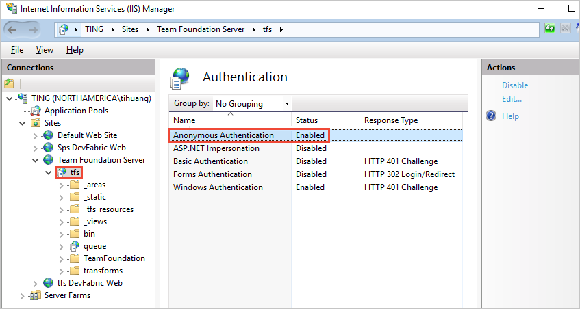

# Troubleshoot Build and Release

[!INCLUDE [temp](_shared/version.md)]

This topic provides general troubleshooting guidance. For specific troubleshooting about .NET Core, see [.NET Core troubleshooting](languages/dotnet-core.md#troubleshooting)

::: moniker range="<= tfs-2018"
[!INCLUDE [temp](_shared/concept-rename-note.md)]
::: moniker-end

## Run commands locally at the command prompt
It is helpful to narrow whether a build or release failure is the result of an Azure Pipelines/TFS product issue (agent or tasks). Build and release failures may also result from external commands.

Check the logs for the exact command-line executed by the failing task. Attempting to run the command locally from the command line may reproduce the issue. It can be helpful to run the command locally from your own machine, and/or log-in to the machine and run the command as the service account.

For example, is the problem happening during the MSBuild part of your build pipeline (for example, are you using either the [MSBuild](tasks/build/msbuild.md) or [Visual Studio Build](tasks/build/visual-studio-build.md) task)? If so, then try running the same [MSBuild command](https://msdn.microsoft.com/library/ms164311.aspx) on a local machine using the same arguments.  If you can reproduce the problem on a local machine, then your next steps are to investigate the [MSBuild](https://msdn.microsoft.com/library/dd393574.aspx) problem.

### Differences between local command prompt and agent
Keep in mind, some differences are in effect when executing a command on a local machine and when a build or release is running on an agent. If the agent is configured to run as a service on Linux, macOS, or Windows, then it is not running within an interactive logged-on session. Without an interactive logged-on session, UI interaction and other limitations exist.


## Get logs to diagnose problems


### Build and Release logs

Start by looking at the logs in your completed build or release. If they don't provide enough detail, you can make them more verbose:

0. On the **Variables** tab, add ```system.debug``` and set it to ```true```. Select to allow at queue time.

0. Queue the build or release.

0. In the explorer tab, view your completed build or release and click the failing task to view its output.

0. If you need a copy of all the logs, click **Download all logs as zip**.

### Diagnostic logs

0. On the build summary page, find the **Queue new build** button, next to it there is a drop down. Click the down arrow and choose **Queue new build with diagnostic logs**.

0. Queue the build.

0. On the build summary page, there will now be a **Diagnostic logs** section. You can download your diagnostic logs per job. If you would like to download everything you can also choose to **Download all logs as zip**.

> Diagnostic logs are not yet available for releases.

#### Worker diagnostic logs

You can get the diagnostic log of the completed build that was generated by the worker process on the build agent. Look for the `worker` log file that has the date and time stamp of your completed build. For example, `worker_20160623-192022-utc_6172.log`.

#### Agent diagnostic logs

Agent diagnostic logs provide a record of how the agent was configured and what happened when it ran. Look for the `agent` log files. For example, `agent_20160624-144630-utc.log`. There are two kinds of agent log files:

* The log file generated when you ran `config.cmd`. This log:

 - Includes this line near the top: `Adding Command: configure`

 - Shows the configuration choices made.

* The log file generated when you ran `run.cmd`. This log:

 - Cannot be opened until the process is terminated.

 - Attempts to connect to your Azure DevOps organization or Team Foundation Server.

 - Shows when each job was run, and how it completed

Both logs show how the agent capabilities were detected and set.

#### Other logs

Inside the diagnostic logs you will find environment.txt and capabilities.txt.

The environment.txt file has various information about the environment within which your build ran. This includes information like what Tasks are run, whether or not the firewall is enabled, Powershell version info, and some other items. We continually add to this data to make it more useful.

The capabilities file provides a clean way to see all capabilities installed on the build machine
that ran your build.

### HTTP trace logs

> **Important:** HTTP traces and trace files can contain passwords and other secrets. Do **not** post them on a public sites.

#### Use built-in HTTP tracing

If your agent is version 2.114.0 or newer, you can trace the HTTP traffic headers and write them into the diagnostic log. Set the `VSTS_AGENT_HTTPTRACE` environment variable before you launch the agent.listener.

```bash
Windows:
    set VSTS_AGENT_HTTPTRACE=true

macOS/Linux:
    export VSTS_AGENT_HTTPTRACE=true
```

#### Use full HTTP tracing

##### Windows

0. Start [Fiddler](http://www.telerik.com/fiddler).

0. We recommend you listen only to agent traffic.  File > Capture Traffic off (F12)  

0. Enable decrypting HTTPS traffic.  Tools > Fiddler Options > HTTPS tab. Decrypt HTTPS traffic

0. Let the agent know to use the proxy:

 ```cmd
set VSTS_HTTP_PROXY=http://127.0.0.1:8888
 ```

0. Run the agent interactively.  If you're running as a service, you can set as the environment variable in control panel for the account the service is running as.

0. Restart the agent.


##### macOS and Linux

Use Charles Proxy (similar to Fiddler on Windows) to capture the HTTP trace of the agent.

0. Start Charles Proxy.

0. Charles: Proxy > Proxy Settings > SSL Tab.  Enable.  Add URL.  

0. Charles: Proxy > Mac OSX Proxy.  Recommend disabling to only see agent traffic.

 ```bash
export VSTS_HTTP_PROXY=http://127.0.0.1:8888
 ```

0. Run the agent interactively.  If it's running as a service, you can set in the .env file.  See [nix service](https://github.com/Microsoft/azure-pipelines-agent/blob/master/docs/start/nixsvc.md)

0. Restart the agent.

## File- and folder-in-use errors
File or folder in use errors are often indicated by error messages such as:
> Access to the path [...] is denied.  
> The process cannot access the file [...] because it is being used by another process.  
> Access is denied.  
> Can't move [...] to [...]

### Detect files and folders in use
On Windows, tools like [Process Monitor](https://technet.microsoft.com/sysinternals/processmonitor.aspx) can be to capture a trace of file events under a specific directory. Or, for a snapshot in time, tools like [Process Explorer](https://technet.microsoft.com/sysinternals/processexplorer.aspx) or [Handle](https://technet.microsoft.com/sysinternals/handle.aspx) can be used.

### Anti-virus exclusion
Anti-virus software scanning your files can cause file or folder in use errors during a build or release. Adding an anti-virus exclusion for your agent directory and configured "work folder" may help to identify anti-virus software as the interfering process.

### MSBuild and /nodeReuse:false
If you invoke MSBuild during your build, make sure to pass the argument `/nodeReuse:false` (short form `/nr:false`). Otherwise MSBuild process(es) will remain running after the build completes. The process(es) remain for some time in anticipation of a potential subsequent build.

This feature of MSBuild can interfere with attempts to delete or move a directory - due to a conflict with the working directory of the MSBuild process(es).

The MSBuild and Visual Studio Build tasks already add `/nr:false` to the arguments passed to MSBuild. However, if you invoke MSBuild from your own script, then you would need to specify the argument.

<!-- This header is linked internally from this document. Any changes to the header text must be made to the link as well. -->
### MSBuild and /maxcpucount:[n]

By default the build tasks such as [MSBuild](tasks/build/msbuild.md) and [Visual Studio Build](tasks/build/visual-studio-build.md) run MSBuild with the `/m` switch. In some cases this can cause problems such as multiple process file access issues.

Try adding the `/m:1` argument to your build tasks to force MSBuild to run only one process at a time.

File-in-use issues may result when leveraging the concurrent-process feature of MSBuild. Not specifying the argument `/maxcpucount:[n]` (short form `/m:[n]`) instructs MSBuild to use a single process only. If you are using the MSBuild or Visual Studio Build tasks, you may need to specify "/m:1" to override the "/m" argument that is added by default.

## Intermittent or inconsistent MSBuild failures

If you are experiencing intermittent or inconsistent MSBuild failures, try instructing MSBuild to use a single-process only. Intermittent or inconsistent errors may indicate that your target configuration is incompatible with the concurrent-process feature of MSBuild. See [MSBuild and /maxcpucount:[n]](#msbuild-and-maxcpucountn)

## Process hang

### Waiting for Input
A process hang may indicate that a process is waiting for input.

Running the agent from the command line of an interactive logged on session may help to identify whether a process is prompting with a dialog for input.

Running the agent as a service may help to eliminate programs from prompting for input. For example in .Net, programs may rely on the System.Environment.UserInteractive Boolean to determine whether to prompt. When running as a Windows service, the value is false.

### Process dump
Analyzing a dump of the process can help to identify what a deadlocked process is waiting on.

### WiX project
Building a WiX project when custom MSBuild loggers are enabled, can cause WiX to deadlock waiting on the output stream. Adding the additional MSBuild argument `/p:RunWixToolsOutOfProc=true` will workaround the issue.

## Line endings for multiple platforms

When you run pipelines on multiple platforms, you can sometimes encounter problems with different line endings.
Historically, Linux and macOS used linefeed (LF) characters while Windows used a carriage return plus a linefeed (CRLF).
Git tries to compensate for the difference by automatically making lines end in LF in the repo but CRLF in the working directory on Windows.

Most Windows tools are fine with LF-only endings, and this automatic behavior can cause more problems than it solves.
If you encounter issues based on line endings, we recommend you configure Git to prefer LF everywhere.
To do this, add a [`.gitattributes`](https://www.git-scm.com/docs/gitattributes) file to the root of your repository.
In that file, add the following line:

```
* text eol=lf
```

## Variables having ' (single quote) appended

If your pipeline includes a Bash script that sets variables using the `##vso` command, you may see an additional `'` appended to the value of the variable you set.
This occurs because of an interaction with `set -x`.
The solution is to disable `set -x` temporarily before setting a variable.
The Bash syntax for doing that is `set +x`.
```bash
set +x
echo ##vso[task.setvariable variable=MY_VAR]my_value
set -x
```

### Why does this happen?
Many Bash scripts include the `set -x` command to assist with debugging.
Bash will trace exactly what command was executed and echo it to stdout.
This will cause the agent to see the `##vso` command twice, and the second time, Bash will have added the `'` character to the end.

For instance, consider this pipeline:
```yaml
steps:
- bash: |
    set -x
    echo ##vso[task.setvariable variable=MY_VAR]my_value
```

On stdout, the agent will see two lines:
```bash
##vso[task.setvariable variable=MY_VAR]my_value
+ echo '##vso[task.setvariable variable=MY_VAR]my_value'
```

When the agent sees the first line, `MY_VAR` will be set to the correct value, "my_value".
However, when it sees the second line, the agent will process everything to the end of the line.
`MY_VAR` will be set to "my_value'".


## Agent connection issues

### Config fails while testing agent connection (on-premises TFS only)

```
Testing agent connection.
VS30063: You are not authorized to access http://<SERVER>:8080/tfs
```

If the above error is received while configuring the agent, log on to your TFS machine. Start the Internet Information Services (IIS) manager. Make sure **Anonymous Authentication** is enabled.



<!-- https://go.microsoft.com/fwlink/?linkid=846610 -->
<h3 id="renew-lock">Agent lost communication</h3>

This issue is characterized by the error message:
```
The job has been abandoned because agent did not renew the lock. Ensure agent is running, not sleeping, and has not lost communication with the service.
```

This error may indicate the agent lost communication with the server for a span of several minutes. Check the following to rule out network or other interruptions on the agent machine:

* Verify automatic updates are turned off. A machine reboot from an update will cause a build or release to fail with the above error. Apply updates in a controlled fashion to avoid this type of interruption. Before rebooting the agent machine, the agent should first be marked disabled in the pool administration page and let any running build finish.
* Verify the sleep settings are turned off.
* If the agent is running on a virtual machine, avoid any live migration or other VM maintenance operation that may severely impact the health of the machine for multiple minutes.
* If the agent is running on a virtual machine, the same operating-system-update recommendations and sleep-setting recommendations apply to the host machine. And also any other maintenance operations that several impact the host machine.
* Performance monitor logging or other health metric logging can help to correlate this type of error to constrained resource availability on the agent machine (disk, memory, page file, processor, network).
* Another way to correlate the error with network problems is to ping a server indefinitely and dump the output to a file, along with timestamps. Use a healthy interval, for example 20 or 30 seconds. If you are using Azure Pipelines, then you would want to ping an internet domain, for example bing.com. If you are using an on-premises TFS server, then you would want to ping a server on the same network.
* Verify the network throughput of the machine is adequate. You can perform an online speed test to check the throughput.
* If you use a proxy, verify the agent is configured to use your proxy. Refer to the agent deployment topic.

### Builds or releases not starting

#### TFS Job Agent not started
This may be characterized by a message in the web console "Waiting for an agent to be requested". Verify the TFSJobAgent (display name: *Visual Studio Team Foundation Background Job Agent*) Windows service is started.

#### Misconfigured notification URL (1.x agent version)
This may be characterized by a message in the web console "Waiting for console output from an agent", and the process eventually times out.

A mismatching notification URL may cause the worker to process to fail to connect to the server. See *Team Foundation Administration Console*, *Application Tier*. The 1.x agent listens to the message queue using the URL that it was configured with. However, when a job message is pulled from the queue, the worker process uses the notification URL to communicate back to the server.

## Team Foundation Version Control (TFVC)

### Get sources not downloading some files
This may be characterized by a message in the log "All files up to date" from the *tf get* command. Verify the built-in service identity has permission to download the sources. Either the identity *Project Collection Build Service* or *Project Build Service* will need permission to download the sources, depending on the selected authorization scope on General tab of the build pipeline. In the version control web UI, you can browse the project files at any level of the folder hierarchy and check the security settings.

### Get sources through Team Foundation Proxy
The easiest way to configure the agent to get sources through a Team Foundation Proxy is set environment variable `TFSPROXY` that point to the TFVC proxy server for the agent's run as user.

Windows:
```cmd
    set TFSPROXY=http://tfvcproxy:8081
    setx TFSPROXY=http://tfvcproxy:8081 // If the agent service is running as NETWORKSERVICE or any service account you can't easily set user level environment variable
```
macOS/Linux:
```bash
    export TFSPROXY=http://tfvcproxy:8081
```

## I need more help. I found a bug. I've got a suggestion. Where do I go?

[Get subscription, billing, and technical support](https://visualstudio.microsoft.com/support-overview-vs)

Report any problems on [Developer Community](https://developercommunity.visualstudio.com/).

We welcome your suggestions:

* Send feedback and report problems through the [Developer Community](https://developercommunity.visualstudio.com/).
