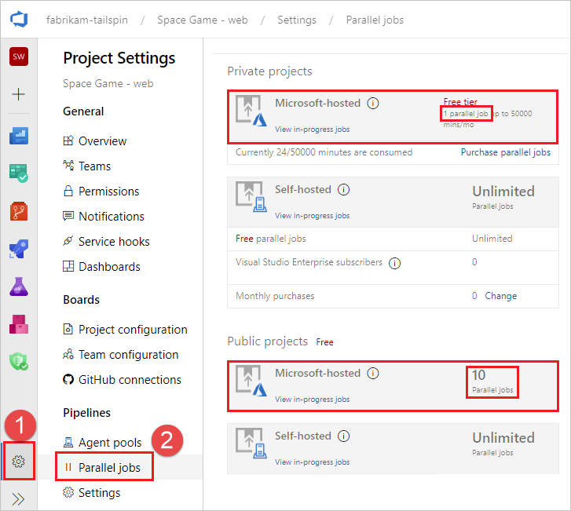

# Troubleshoot pipeline failure to start

[!INCLUDE [version-lt-eq-azure-devops](../../includes/version-lt-eq-azure-devops.md)]

If your pipeline queues but never starts, check the following items.

::: moniker range="azure-devops"

* [Parallel job limits - no available agents or you have hit your free limits](#parallel-job-limits---no-available-agents-or-you-have-hit-your-free-limits)
* [Can't access Azure Key Vault behind firewall from Azure DevOps](#cant-access-azure-key-vault-behind-firewall-from-azure-devops)
* [You don't have enough concurrency](#you-dont-have-enough-concurrency)
* [Your job might be waiting for approval](#your-job-might-be-waiting-for-approval)
* [All available agents are in use](#all-available-agents-are-in-use)
* [Demands that don't match the capabilities of an agent](#demands-that-dont-match-the-capabilities-of-an-agent)
* [Check Azure DevOps status for a service degradation](#check-azure-devops-status-for-a-service-degradation)

> [!NOTE]
> The following scenarios won't consume a parallel job:
> * If you use release pipelines or multi-stage YAML pipelines, then a run consumes a parallel job only when it's being actively deployed to a stage. While the release is waiting for an approval or a manual intervention, it does not consume a parallel job.
> * When you run a server job or deploy to a deployment group using release pipelines, you don't consume any parallel jobs.
> 
> Learn more:
> [How a parallel job is consumed by a pipeline](../licensing/concurrent-jobs.md),
> [Add Pre-deployment approvals](../release/define-multistage-release-process.md#add-approvals),
> [Server jobs](../process/phases.md#server-jobs),
> [Deployment groups](../release/deployment-groups/index.md)

::: moniker-end

::: moniker range="< azure-devops"

* [Parallel job limits - no available agents or you have hit your free limits](#parallel-job-limits---no-available-agents-or-you-have-hit-your-free-limits)
* [Demands that don't match the capabilities of an agent](#demands-that-dont-match-the-capabilities-of-an-agent)
* [TFS agent connection issues](#tfs-agent-connection-issues)

::: moniker-end


## Parallel job limits - no available agents or you have hit your free limits

::: moniker range="azure-devops"

If you're currently running other pipelines, you might not have any remaining parallel jobs, or you might have hit your [free limits](../licensing/concurrent-jobs.md).

### Check for available parallel jobs

> [!NOTE]
> Azure Pipelines has temporarily disabled the automatic free grant of Microsoft-hosted parallel jobs in new organizations for public projects and for certain private projects. If you don't have any parallel jobs, your pipelines will fail with the following error: `##[error]No hosted parallelism has been purchased or granted. To request a free parallelism grant, please fill out the following form https://aka.ms/azpipelines-parallelism-request`.  Check your Microsoft-hosted parallel jobs as described in the following section, and if you have zero parallel jobs, you can request a free grant of parallel jobs. To request the free grant of parallel jobs for your organization, submit [a request](https://aka.ms/azpipelines-parallelism-request). Please allow 2-3 business days to respond to your grant request.

To check your limits, navigate to **Project settings**, **Parallel jobs**.



If you're using [Microsoft-hosted](../agents/hosted.md) agents, check the parallel job limits for **Microsoft-hosted** for **Private projects** or **Public projects**, depending on whether your Azure DevOps project is a [private project (default) or public project](../../organizations/projects/make-project-public.md).

After reviewing the limits, check concurrency to see how many jobs are currently running and how many are available.

::: moniker-end

::: moniker range="< azure-devops"

If you're currently running other pipelines, you might not have any remaining parallel jobs, or you might have hit your [free limits](../licensing/concurrent-pipelines-tfs.md).

::: moniker-end

::: moniker range="azure-devops"

## Can't access Azure Key Vault behind firewall from Azure DevOps

If you can't access Azure Key Vault from your pipeline, the firewall might be blocking the Azure DevOps Services agent IP address. The IP addresses published in the [weekly JSON file](https://www.microsoft.com/download/details.aspx?id=56519) must be allowlisted. For more information, see [Microsoft-hosted agents: Networking](../agents/hosted.md#networking).

## You don't have enough concurrency
 
To check how much concurrency you have:

1. To check your limits, navigate to **Project settings**, **Parallel jobs**.

    

    You can also reach this page by navigating to `https://dev.azure.com/{org}/_settings/buildqueue?_a=concurrentJobs`, or choosing **manage parallel jobs** from the logs.

      
        
2. Determine which pool you want to check concurrency on (Microsoft hosted or self hosted pools), and choose **View in-progress jobs**.

3. You'll see text that says **Currently running X/X jobs**. If both numbers are the same, pending jobs will wait until currently running jobs complete.

    
 
    You can view all jobs, including queued jobs, by selecting **Agent pools** from the **Project settings**.

    

    In this example, the concurrent job limit is one, with one job running and one queued up. When all agents are busy running jobs, as in this example, the following message is displayed when additional jobs are queued: `The agent request is not running because all potential agents are running other requests. Current position in queue: 1`. In this example the job is next in the queue so its position is one.

## Your job might be waiting for approval
 
Your pipeline might not move to the next stage because it's waiting on approval. For more information, see [Define approvals and checks](../process/approvals.md).
 
## All available agents are in use 
 
Jobs might wait if all your agents are currently busy. To check your agents:
1. Navigate to `https://dev.azure.com/{org}/_settings/agentpools`
2. Select the agent pool to check, in this example **FabrikamPool**, and choose **Agents**.

    

    This page shows all the agents currently online/offline and in use. You can also add additional agents to the pool from this page. 

::: moniker-end

## Demands that don't match the capabilities of an agent

If your pipeline has demands that don't meet the capabilities of any of your agents, your pipeline won't start. If only some of your agents have the desired capabilities and they're currently running other pipelines, your pipeline will be stalled until one of those agents becomes available.

To check the capabilities and demands specified for your agents and pipelines, see [Capabilities](../agents/agents.md#capabilities).

::: moniker range="azure-devops"

> [!NOTE]
> Capabilities and demands are typically used only with self-hosted agents. If your pipeline has demands that don't match the system capabilities of the agent, unless you have explicitly labelled the agents with matching capabilities, your pipelines won't get an agent.

::: moniker-end

::: moniker range="< azure-devops"

## TFS agent connection issues

* [Config fails while testing agent connection (on-premises TFS only)](#config-fails-while-testing-agent-connection-on-premises-tfs-only)
* [Agent lost communication](#agent-lost-communication)
* [TFS Job Agent not started](#tfs-job-agent-not-started)
* [Misconfigured notification URL (1.x agent version)](#misconfigured-notification-url-1x-agent-version)

#### Config fails while testing agent connection (on-premises TFS only)

```
Testing agent connection.
VS30063: You are not authorized to access http://<SERVER>:8080/tfs
```

If the above error is received while configuring the agent, log on to your TFS machine. Start the Internet Information Services (IIS) manager. Make sure **Anonymous Authentication** is enabled.


<!-- https://go.microsoft.com/fwlink/?linkid=846610 -->
<a name="renew-lock" />

### Agent lost communication

This issue is characterized by the error message:
```
The job has been abandoned because agent did not renew the lock. Ensure agent is running, not sleeping, and has not lost communication with the service.
```

This error might indicate the agent lost communication with the server for a span of several minutes. Check the following to rule out network or other interruptions on the agent machine:

* Verify automatic updates are turned off. A machine reboot from an update will cause a build or release to fail with the above error. Apply updates in a controlled fashion to avoid this type of interruption. Before rebooting the agent machine, mark the agent as disabled in the pool administration page and let any running build finish.
* Verify the sleep settings are turned off.
* If the agent is running on a virtual machine, avoid any live migration or other VM maintenance operation that might severely impact the health of the machine for multiple minutes.
* If the agent is running on a virtual machine, the same operating-system-update recommendations and sleep-setting recommendations apply to the host machine. And also any other maintenance operations that several impact the host machine.
* Performance monitor logging or other health metric logging can help to correlate this type of error to constrained resource availability on the agent machine (disk, memory, page file, processor, network).
* Another way to correlate the error with network problems is to ping a server indefinitely and dump the output to a file, along with timestamps. Use a healthy interval, for example 20 or 30 seconds. If you're using Azure Pipelines, then you would want to ping an internet domain, for example bing.com. If you're using an on-premises TFS server, then you would want to ping a server on the same network.
* Verify the network throughput of the machine is adequate. You can perform an online speed test to check the throughput.
* If you use a proxy, verify the agent is configured to use your proxy. Refer to the agent deployment topic.

### TFS Job Agent not started

This might be characterized by a message in the web console "Waiting for an agent to be requested". Verify the TFSJobAgent (display name: *Visual Studio Team Foundation Background Job Agent*) Windows service is started.

### Misconfigured notification URL (1.x agent version)

This might be characterized by a message in the web console "Waiting for console output from an agent", and the process eventually times out.

A mismatching notification URL might cause the worker to process to fail to connect to the server. See *Team Foundation Administration Console*, *Application Tier*. The 1.x agent listens to the message queue using the URL that it was configured with. However, when a job message is pulled from the queue, the worker process uses the notification URL to communicate back to the server.

::: moniker-end

::: moniker range="azure-devops"

## Check Azure DevOps status for a service degradation

Check the [Azure DevOps Service Status Portal](https://status.dev.azure.com/) for any issues that might cause a service degradation, such as increased queue time for agents. For more information, see [Azure DevOps Service Status](../../user-guide/service-status-info.md).

::: moniker-end

## I need more help. I found a bug. I've got a suggestion. Where do I go?

[Get subscription, billing, and technical support](https://azure.microsoft.com/support/devops/)

Report any problems or submit feedback at [Developer Community](https://developercommunity.visualstudio.com/).

We welcome your suggestions:
