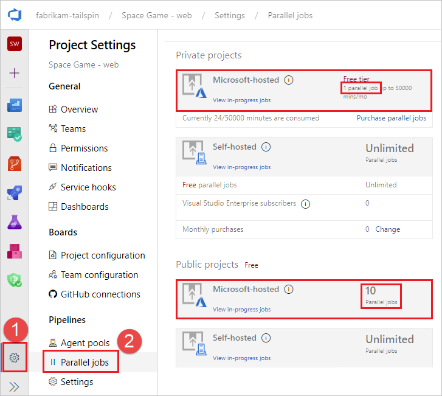
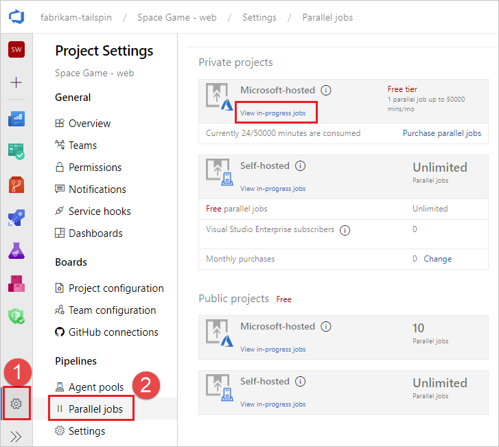
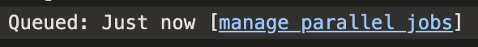
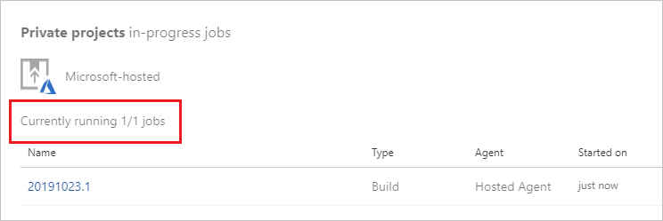
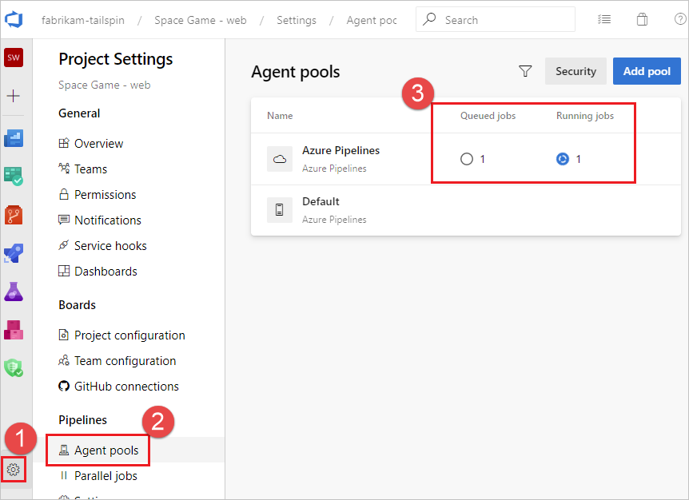
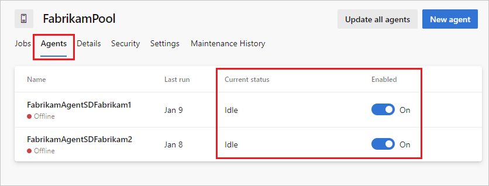
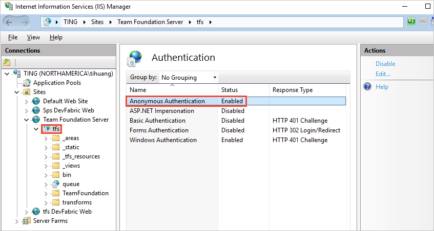

# Troubleshoot pipeline runs

[!INCLUDE [temp](../includes/version.md)]

This topic provides general troubleshooting guidance. For specific troubleshooting about .NET Core, see [.NET Core troubleshooting](../ecosystems/dotnet-core.md#troubleshooting).

::: moniker range="<= tfs-2018"

[!INCLUDE [temp](../includes/concept-rename-note.md)]

::: moniker-end

You can use the following troubleshooting sections to help diagnose issues with your pipeline. Most pipeline failures fall into one of these categories.

* [Pipeline won't trigger](#pipeline-wont-trigger)
* [Pipeline queues but never gets an agent](#pipeline-queues-but-never-gets-an-agent)
* [Pipeline fails to complete](#pipeline-fails-to-complete)

<a name="my-pipeline-isnt-triggering" />

## Pipeline won't trigger

If a pipeline doesn't start at all, check the following common trigger related issues. 

* [UI settings override YAML trigger setting](#ui-settings-override-yaml-trigger-setting)
* [Pull request triggers not supported with Azure Repos](#pull-request-triggers-not-supported-with-azure-repos)
* [Branch filters misconfigured in CI and PR triggers](#branch-filters-misconfigured-in-ci-and-pr-triggers)
* [Scheduled trigger time zone conversions](#scheduled-trigger-time-zone-conversions)
* [UI settings override YAML scheduled triggers](#ui-settings-override-yaml-scheduled-triggers)

::: moniker range="azure-devops"

> [!NOTE]
> An additional reason that runs may not start is that your organization goes dormant five minutes after the last user signs out of Azure DevOps. After that, each of your build pipelines will run one more time. For example, while your organization is dormant:
> * A nightly build of code in your organization will run only one night until someone signs in again.
> * CI builds of an Other Git repo will stop running until someone signs in again.

::: moniker-end

<a name="overridden-yaml-trigger-setting" />

### UI settings override YAML trigger setting

YAML pipelines can have their `trigger` and `pr` trigger settings overridden in the pipeline settings UI. If your `trigger` or `pr` triggers don't seem to be firing, check that setting. While editing your pipeline, choose **...** and then **Triggers**.


Check the **Override the YAML trigger from here** setting for the types of trigger (**Continuous integration** or **Pull request validation**) available for your repo.


<a name="using-pull-request-triggers-with-azure-repos" />

### Pull request triggers not supported with Azure Repos

If your `pr` trigger isn't firing, and you are using Azure Repos, it is because `pr` triggers aren't supported for Azure Repos. In Azure Repos Git, branch policies are used to implement pull request build validation. For more information, see [Branch policy for pull request validation](../repos/azure-repos-git.md#pr-triggers).

<a name="branch-filters-in-ci-and-pr-triggers" />

### Branch filters misconfigured in CI and PR triggers

::: moniker range="<= azure-devops-2019"

When you define a YAML PR or CI trigger, you can specify both `include` and `exclude` clauses for branches and paths. Ensure that the `include` clause matches the details of your commit and that the `exclude` clause doesn't exclude them.

> [!IMPORTANT]
> When you define a YAML PR or CI trigger, only branches explicitly configured to be included will trigger a run. Includes are processed first, and then excludes are removed from the list. If you specify an exclude but don't specify any includes, nothing will trigger. For more information, see [Triggers](../yaml-schema.md#triggers).

::: moniker-end

::: moniker range="> azure-devops-2019"

When you define a YAML PR or CI trigger, you can specify both `include` and `exclude` clauses for branches, tags, and paths. Ensure that the `include` clause matches the details of your commit and that the `exclude` clause doesn't exclude them. For more information, see [Triggers](../yaml-schema.md#triggers).

> [!NOTE]
> If you specify an `exclude` clause without an `include` clause, it is equivalent to specifying `*` in the `include` clause.

::: moniker-end

<a name="#scheduled-triggers" />

### Scheduled trigger time zone conversions

YAML scheduled triggers are set using UTC time zone. If your scheduled triggers don't seem to be firing at the right time, confirm the conversions between UTC and your local time zone, taking into account the day setting as well. For more information, see [Scheduled triggers](../process/scheduled-triggers.md).

### UI settings override YAML scheduled triggers

If your YAML pipeline has both YAML scheduled triggers and UI defined scheduled triggers, only the UI defined scheduled triggers are run. To run the YAML defined scheduled triggers in your YAML pipeline, you must remove the scheduled triggers defined in the pipeline settings UI. 

To access the pipeline settings UI from a YAML pipeline, edit your pipeline, choose **...** and then **Triggers**.


Remove all scheduled triggers. 

:::image type="content" source="../process/media/triggers/delete-ui-scheduled-trigger.png" alt-text="Delete scheduled triggers in the Pipeline settings UI.":::

Once all UI scheduled triggers are removed, a push must be made in order for the YAML scheduled triggers to start running. For more information, see [Scheduled triggers](../process/scheduled-triggers.md).

<a name="my-pipeline-tries-to-start-but-never-gets-an-agent" />

## Pipeline queues but never gets an agent

If your pipeline queues but never gets an agent, check the following items.

::: moniker range="azure-devops"

* [Parallel job limits - no available agents or you have hit your free limits](#parallel-job-limits---no-available-agents-or-you-have-hit-your-free-limits)
* [Can't access Azure Key Vault behind firewall from Azure DevOps](#cant-access-azure-key-vault-behind-firewall-from-azure-devops)
* [You don't have enough concurrency](#you-dont-have-enough-concurrency)
* [Your job may be waiting for approval](#your-job-may-be-waiting-for-approval)
* [All available agents are in use](#all-available-agents-are-in-use)
* [Demands that don't match the capabilities of an agent](#demands-that-dont-match-the-capabilities-of-an-agent)
* [Check Azure DevOps status for a service degradation](#check-azure-devops-status-for-a-service-degradation)

> [!NOTE]
> The following scenarios won't consume a parallel job:
> * If you use release pipelines or multi-stage YAML pipelines, then a run consumes a parallel job only when it's being actively deployed to a stage. While the release is waiting for an approval or a manual intervention, it does not consume a parallel job.
> * When you run a server job or deploy to a deployment group using release pipelines, you don't consume any parallel jobs.
> 
> Learn more:
> [How a parallel job is consumed by a pipeline](../licensing/concurrent-jobs.md),
> [Add Pre-deployment approvals](../release/define-multistage-release-process.md#add-approvals),
> [Server jobs](../process/phases.md#server-jobs),
> [Deployment groups](../release/deployment-groups/index.md)

::: moniker-end

::: moniker range="< azure-devops"

* [Parallel job limits - no available agents or you have hit your free limits](#parallel-job-limits---no-available-agents-or-you-have-hit-your-free-limits)
* [Demands that don't match the capabilities of an agent](#demands-that-dont-match-the-capabilities-of-an-agent)
* [TFS agent connection issues](#tfs-agent-connection-issues)

::: moniker-end


### Parallel job limits - no available agents or you have hit your free limits

::: moniker range="azure-devops"

If you are currently running other pipelines, you may not have any remaining parallel jobs, or you may have hit your [free limits](../licensing/concurrent-jobs.md).

To check your limits, navigate to **Project settings**, **Parallel jobs**.



After reviewing the limits, check concurrency to see how many jobs are currently running and how many are available.

::: moniker-end

::: moniker range="< azure-devops"

If you are currently running other pipelines, you may not have any remaining parallel jobs, or you may have hit your [free limits](../licensing/concurrent-pipelines-tfs.md).

::: moniker-end

::: moniker range="azure-devops"

### Can't access Azure Key Vault behind firewall from Azure DevOps

If you can't access Azure Key Vault from your pipeline, the firewall might be blocking the Azure DevOps Services agent IP address. The IP addresses published in the [weekly JSON file](https://www.microsoft.com/download/details.aspx?id=56519) must be allowlisted. For more information, see [Microsoft-hosted agents: Networking](../agents/hosted.md#networking).

### You don't have enough concurrency
 
To check how much concurrency you have:

1. To check your limits, navigate to **Project settings**, **Parallel jobs**.

    

    You can also reach this page by navigating to `https://dev.azure.com/{org}/_settings/buildqueue?_a=concurrentJobs`, or choosing **manage parallel jobs** from the logs.

      
        
2. Determine which pool you want to check concurrency on (Microsoft hosted or self hosted pools), and choose **View in-progress jobs**.

3. You'll see text that says **Currently running X/X jobs**. If both numbers are the same then jobs will wait until currently running jobs complete.

    
 
    You can view all jobs, including queued jobs, by selecting **Agent pools** from the **Project settings**.

    

    In this example, the concurrent job limit is one, with one job running and one queued up. When all agents are busy running jobs, as in this example, the following message is displayed when additional jobs are queued: `The agent request is not running because all potential agents are running other requests. Current position in queue: 1`. In this example the job is next in the queue so its position is one.

### Your job may be waiting for approval
 
Your pipeline may not move to the next stage because it is waiting on approval. For more information, see [Define approvals and checks](../process/approvals.md).
 
### All available agents are in use 
 
Jobs may wait if all your agents are currently busy. To check your agents:
1. Navigate to `https://dev.azure.com/{org}/_settings/agentpools`
2. Select the agent pool to check, in this example **FabrikamPool**, and choose **Agents**.

    

    This page shows all the agents currently online/offline and in use. You can also add additional agents to the pool from this page. 

::: moniker-end

### Demands that don't match the capabilities of an agent

If your pipeline has demands that don't meet the capabilities of any of your agents, your pipeline won't start. If only some of your agents have the desired capabilities and they are currently running other pipelines, your pipeline will be stalled until one of those agents becomes available.

To check the capabilities and demands specified for your agents and pipelines, see [Capabilities](../agents/agents.md#capabilities).

::: moniker range="azure-devops"

> [!NOTE]
> Capabilities and demands are typically used only with self-hosted agents. If your pipeline has demands that don't match the system capabilities of the agent, unless you have explicitly labelled the agents with matching capabilities, your pipelines won't get an agent.

::: moniker-end

::: moniker range="< azure-devops"

### TFS agent connection issues

* [Config fails while testing agent connection (on-premises TFS only)](#config-fails-while-testing-agent-connection-on-premises-tfs-only)
* [Agent lost communication](#agent-lost-communication)
* [TFS Job Agent not started](#tfs-job-agent-not-started)
* [Misconfigured notification URL (1.x agent version)](#misconfigured-notification-url-1x-agent-version)

#### Config fails while testing agent connection (on-premises TFS only)

```
Testing agent connection.
VS30063: You are not authorized to access http://<SERVER>:8080/tfs
```

If the above error is received while configuring the agent, log on to your TFS machine. Start the Internet Information Services (IIS) manager. Make sure **Anonymous Authentication** is enabled.



<!-- https://go.microsoft.com/fwlink/?linkid=846610 -->
<a name="renew-lock" />

#### Agent lost communication

This issue is characterized by the error message:
```
The job has been abandoned because agent did not renew the lock. Ensure agent is running, not sleeping, and has not lost communication with the service.
```

This error may indicate the agent lost communication with the server for a span of several minutes. Check the following to rule out network or other interruptions on the agent machine:

* Verify automatic updates are turned off. A machine reboot from an update will cause a build or release to fail with the above error. Apply updates in a controlled fashion to avoid this type of interruption. Before rebooting the agent machine, the agent should first be marked disabled in the pool administration page and let any running build finish.
* Verify the sleep settings are turned off.
* If the agent is running on a virtual machine, avoid any live migration or other VM maintenance operation that may severely impact the health of the machine for multiple minutes.
* If the agent is running on a virtual machine, the same operating-system-update recommendations and sleep-setting recommendations apply to the host machine. And also any other maintenance operations that several impact the host machine.
* Performance monitor logging or other health metric logging can help to correlate this type of error to constrained resource availability on the agent machine (disk, memory, page file, processor, network).
* Another way to correlate the error with network problems is to ping a server indefinitely and dump the output to a file, along with timestamps. Use a healthy interval, for example 20 or 30 seconds. If you are using Azure Pipelines, then you would want to ping an internet domain, for example bing.com. If you are using an on-premises TFS server, then you would want to ping a server on the same network.
* Verify the network throughput of the machine is adequate. You can perform an online speed test to check the throughput.
* If you use a proxy, verify the agent is configured to use your proxy. Refer to the agent deployment topic.

#### TFS Job Agent not started

This may be characterized by a message in the web console "Waiting for an agent to be requested". Verify the TFSJobAgent (display name: *Visual Studio Team Foundation Background Job Agent*) Windows service is started.

#### Misconfigured notification URL (1.x agent version)

This may be characterized by a message in the web console "Waiting for console output from an agent", and the process eventually times out.

A mismatching notification URL may cause the worker to process to fail to connect to the server. See *Team Foundation Administration Console*, *Application Tier*. The 1.x agent listens to the message queue using the URL that it was configured with. However, when a job message is pulled from the queue, the worker process uses the notification URL to communicate back to the server.

::: moniker-end

::: moniker range="azure-devops"

### Check Azure DevOps status for a service degradation

Check the [Azure DevOps Service Status Portal](https://status.dev.azure.com/) for any issues that may cause a service degradation, such as increased queue time for agents. For more information, see [Azure DevOps Service Status](../../user-guide/service-status-info.md).

::: moniker-end

<a name="my-pipeline-starts-but-fails-to-complete-successfully" />

## Pipeline fails to complete

If your pipeline gets an agent but fails to complete, check the following common issues. If your issue doesn't seem to match one of these, see [Get logs to diagnose problems](#get-logs-to-diagnose-problems).

* [Job time-out](#job-time-out)
* [Issues downloading code](#issues-downloading-code)
* [My pipeline is failing on a command-line step such as MSBUILD](#my-pipeline-is-failing-on-a-command-line-step-such-as-msbuild)
* [File or folder in use errors](#file-or-folder-in-use-errors)
* [Intermittent or inconsistent MSBuild failures](#intermittent-or-inconsistent-msbuild-failures)
* [Process stops responding](#process-stops-responding)
* [Line endings for multiple platforms](#line-endings-for-multiple-platforms)
* [Variables having ' (single quote) appended](#variables-having--single-quote-appended)
* [Service Connection related issues](#service-connection-related-issues)

### Job time-out

A pipeline may run for a long time and then fail due to job time-out. 
Job timeout closely depends on the agent being used. Free Microsoft hosted agents have a max timeout of 60 minutes per job for a private repository and 360 minutes for a public repository.
To increase the max timeout for a job, you can opt for any of the following.
* Buy a Microsoft hosted agent which will give you 360 minutes for all jobs, irrespective of the repository used
* Use a self-hosted agent to rule out any timeout issues due to the agent

Learn more about job [timeout](../process/phases.md#timeouts).

> [!NOTE]
> If your Microsoft-hosted agent jobs are timing out, ensure that you haven't specified a pipeline timeout that is less than the max timeout for a job. To check, see [Timeouts](../process/phases.md#timeouts).

### Issues downloading code

* [My pipeline is failing on a checkout step](#my-pipeline-is-failing-on-a-checkout-step)
* [Team Foundation Version Control (TFVC) issues](#team-foundation-version-control-tfvc-issues)

#### My pipeline is failing on a checkout step

If you are using a `checkout` step on an Azure Repos Git repository in your organization that is in a different project than your pipeline, ensure that the **Limit job authorization scope to current project** setting is disabled, or follow the steps in [Scoped build identities](../build/options.md) to ensure that your pipeline has access to the repository.

When your pipeline can't access the repository due to limited job authorization scope, you will receive the error `Git fetch failed with exit code 128` and your logs will contain an entry similar to `Remote: TF401019: The Git repository with name or identifier <your repo name> does not exist or you do not have permissions for the operation you are attempting.`

If your pipeline is failing immediately with `Could not find a project that corresponds with the repository`, ensure that your project and repository name are correct in the `checkout` step or the repository resource declaration.

#### Team Foundation Version Control (TFVC) issues

* [Get sources not downloading some files](#get-sources-not-downloading-some-files)
* [Get sources through Team Foundation Proxy](#get-sources-through-team-foundation-proxy)

##### Get sources not downloading some files

This may be characterized by a message in the log "All files up to date" from the *tf get* command. Verify the built-in service identity has permission to download the sources. Either the identity *Project Collection Build Service* or *Project Build Service* will need permission to download the sources, depending on the selected authorization scope on General tab of the build pipeline. In the version control web UI, you can browse the project files at any level of the folder hierarchy and check the security settings.

##### Get sources through Team Foundation Proxy

The easiest way to configure the agent to get sources through a Team Foundation Proxy is set environment variable `TFSPROXY` that point to the TFVC proxy server for the agent's run as user.

Windows:
```cmd
    set TFSPROXY=http://tfvcproxy:8081
    setx TFSPROXY=http://tfvcproxy:8081 // If the agent service is running as NETWORKSERVICE or any service account you can't easily set user level environment variable
```
macOS/Linux:
```bash
    export TFSPROXY=http://tfvcproxy:8081
```


### My pipeline is failing on a command-line step such as MSBUILD

It is helpful to narrow whether a build or release failure is the result of an Azure Pipelines/TFS product issue (agent or tasks). Build and release failures may also result from external commands.

Check the logs for the exact command-line executed by the failing task. Attempting to run the command locally from the command line may reproduce the issue. It can be helpful to run the command locally from your own machine, and/or log-in to the machine and run the command as the service account.

For example, is the problem happening during the MSBuild part of your build pipeline (for example, are you using either the [MSBuild](../tasks/build/msbuild.md) or [Visual Studio Build](../tasks/build/visual-studio-build.md) task)? If so, then try running the same [MSBuild command](/visualstudio/msbuild/msbuild-command-line-reference) on a local machine using the same arguments. If you can reproduce the problem on a local machine, then your next steps are to investigate the [MSBuild](/visualstudio/msbuild/msbuild) problem.


::: moniker range="azure-devops"

#### File layout

The location of tools, libraries, headers, and other things needed for a build may be different on the hosted agent than from your local machine.
If a build fails because it can't find one of these files, you can use the below scripts to inspect the layout on the agent.
This may help you track down the missing file.

Create a new YAML pipeline in a temporary location (e.g. a new repo created for the purpose of troubleshooting).
As written, the script searches directories on your path.
You may optionally edit the `SEARCH_PATH=` line to search other places.

```yaml
# Script for Linux and macOS
pool: { vmImage: ubuntu-latest } # or whatever pool you use
steps:
- checkout: none
- bash: |
    SEARCH_PATH=$PATH  # or any colon-delimited list of paths
    IFS=':' read -r -a PathDirs <<< "$SEARCH_PATH"
    echo "##[debug] Found directories"
    for element in "${PathDirs[@]}"; do
        echo "$element"
    done;
    echo;
    echo;  
    echo "##[debug] Found files"
    for element in "${PathDirs[@]}"; do
        find "$element" -type f
    done
```

```yaml
# Script for Windows
pool: { vmImage: windows-2019 } # or whatever pool you use
steps:
- checkout: none
- powershell: |
    $SEARCH_PATH=$Env:Path
    Write-Host "##[debug] Found directories"
    ForEach ($Dir in $SEARCH_PATH -split ";") {
      Write-Host "$Dir"
    }
    Write-Host ""
    Write-Host ""
    Write-Host "##[debug] Found files"
    ForEach ($Dir in $SEARCH_PATH -split ";") {
      Get-ChildItem $Dir -File -ErrorAction Continue | ForEach-Object -Process {
        Write-Host $_.FullName
      }
    }
```

::: moniker-end

#### Differences between local command prompt and agent

Keep in mind, some differences are in effect when executing a command on a local machine and when a build or release is running on an agent. If the agent is configured to run as a service on Linux, macOS, or Windows, then it is not running within an interactive logged-on session. Without an interactive logged-on session, UI interaction and other limitations exist.


### File or folder in use errors

File or folder in use errors are often indicated by error messages such as: 

* `Access to the path [...] is denied.`
* `The process cannot access the file [...] because it is being used by another process.`
* `Access is denied.`
* `Can't move [...] to [...]`

Troubleshooting steps:

* [Detect files and folders in use](#detect-files-and-folders-in-use)
* [Anti-virus exclusion](#anti-virus-exclusion)
* [MSBuild and /nodeReuse:false](#msbuild-and-nodereusefalse)
* [MSBuild and /maxcpucount:[n]](#msbuild-and-maxcpucountn)

#### Detect files and folders in use

On Windows, tools like [Process Monitor](/sysinternals/downloads/procmon) can be to capture a trace of file events under a specific directory. Or, for a snapshot in time, tools like [Process Explorer](/sysinternals/downloads/process-explorer) or [Handle](/sysinternals/downloads/handle) can be used.

#### Anti-virus exclusion

Anti-virus software scanning your files can cause file or folder in use errors during a build or release. Adding an anti-virus exclusion for your agent directory and configured "work folder" may help to identify anti-virus software as the interfering process.

#### MSBuild and /nodeReuse:false

If you invoke MSBuild during your build, make sure to pass the argument `/nodeReuse:false` (short form `/nr:false`). Otherwise MSBuild process(es) will remain running after the build completes. The process(es) remain for some time in anticipation of a potential subsequent build.

This feature of MSBuild can interfere with attempts to delete or move a directory - due to a conflict with the working directory of the MSBuild process(es).

The MSBuild and Visual Studio Build tasks already add `/nr:false` to the arguments passed to MSBuild. However, if you invoke MSBuild from your own script, then you would need to specify the argument.

<!-- This header is linked internally from this document. Any changes to the header text must be made to the link as well. -->
#### MSBuild and /maxcpucount:[n]

By default the build tasks such as [MSBuild](../tasks/build/msbuild.md) and [Visual Studio Build](../tasks/build/visual-studio-build.md) run MSBuild with the `/m` switch. In some cases this can cause problems such as multiple process file access issues.

Try adding the `/m:1` argument to your build tasks to force MSBuild to run only one process at a time.

File-in-use issues may result when leveraging the concurrent-process feature of MSBuild. Not specifying the argument `/maxcpucount:[n]` (short form `/m:[n]`) instructs MSBuild to use a single process only. If you are using the MSBuild or Visual Studio Build tasks, you may need to specify "/m:1" to override the "/m" argument that is added by default.

### Intermittent or inconsistent MSBuild failures

If you are experiencing intermittent or inconsistent MSBuild failures, try instructing MSBuild to use a single-process only. Intermittent or inconsistent errors may indicate that your target configuration is incompatible with the concurrent-process feature of MSBuild. See [MSBuild and /maxcpucount:[n]](#msbuild-and-maxcpucountn).

### Process stops responding

Process stops responding causes and troubleshooting steps:

* [Waiting for Input](#waiting-for-input)
* [Process dump](#process-dump)
* [WiX project](#wix-project)

#### Waiting for Input

A process that stops responding may indicate that a process is waiting for input.

Running the agent from the command line of an interactive logged on session may help to identify whether a process is prompting with a dialog for input.

Running the agent as a service may help to eliminate programs from prompting for input. For example in .NET, programs may rely on the System.Environment.UserInteractive Boolean to determine whether to prompt. When running as a Windows service, the value is false.

#### Process dump

Analyzing a dump of the process can help to identify what a deadlocked process is waiting on.

#### WiX project

Building a WiX project when custom MSBuild loggers are enabled, can cause WiX to deadlock waiting on the output stream. Adding the additional MSBuild argument `/p:RunWixToolsOutOfProc=true` will workaround the issue.

### Line endings for multiple platforms

When you run pipelines on multiple platforms, you can sometimes encounter problems with different line endings.
Historically, Linux and macOS used linefeed (LF) characters while Windows used a carriage return plus a linefeed (CRLF).
Git tries to compensate for the difference by automatically making lines end in LF in the repo but CRLF in the working directory on Windows.

Most Windows tools are fine with LF-only endings, and this automatic behavior can cause more problems than it solves.
If you encounter issues based on line endings, we recommend you configure Git to prefer LF everywhere.
To do this, add a [`.gitattributes`](https://www.git-scm.com/docs/gitattributes) file to the root of your repository.
In that file, add the following line:

```
* text eol=lf
```

### Variables having ' (single quote) appended

If your pipeline includes a Bash script that sets variables using the `##vso` command, you may see an additional `'` appended to the value of the variable you set.
This occurs because of an interaction with `set -x`.
The solution is to disable `set -x` temporarily before setting a variable.
The Bash syntax for doing that is `set +x`.

```bash
set +x
echo ##vso[task.setvariable variable=MY_VAR]my_value
set -x
```

#### Why does this happen?

Many Bash scripts include the `set -x` command to assist with debugging.
Bash will trace exactly what command was executed and echo it to stdout.
This will cause the agent to see the `##vso` command twice, and the second time, Bash will have added the `'` character to the end.

For instance, consider this pipeline:

```yaml
steps:
- bash: |
    set -x
    echo ##vso[task.setvariable variable=MY_VAR]my_value
```

On stdout, the agent will see two lines:
```bash
##vso[task.setvariable variable=MY_VAR]my_value
+ echo '##vso[task.setvariable variable=MY_VAR]my_value'
```

When the agent sees the first line, `MY_VAR` will be set to the correct value, "my_value".
However, when it sees the second line, the agent will process everything to the end of the line.
`MY_VAR` will be set to "my_value'".

### Libraries aren't installed for Python application when script executes 

When a Python application is deployed, in some cases, a CI/CD pipeline runs and the code is deployed successfully, but the *requirements.txt* file that's responsible for installing all dependency libraries doesn't execute. 

To install the dependencies, use a post-deployment script in the App Service deployment task. The following example shows the command you must use in the post-deployment script. You can update the script for your scenario.

```
D:\home\python364x64\python.exe -m pip install -r requirements.txt
```


### Service Connection related issues

To troubleshoot issues related to service connections, see [Service connection troubleshooting](../release/azure-rm-endpoint.md).

### Enable Storage Explorer to deploy static content like .css and .js to a static website from Azure DevOps via Azure Pipelines

In this scenario, you can use the [Azure File Copy task](../tasks/deploy/azure-file-copy.md) to upload content to the website. You can use any of the tools described in [Uploading content](/azure/storage/blobs/storage-blob-static-website#uploading-content) to upload content to the web container.

## Get logs to diagnose problems

If none of the previous suggestions match your problem, you can use the information in the logs to diagnose your failing pipeline.

Start by looking at the logs in your completed build or release. You can view logs by navigating to the pipeline run summary and selecting the job and task. If a certain task is failing, check the logs for that task.

In addition to viewing logs in the pipeline build summary, you can download complete logs which include additional diagnostic information, and you can configure more verbose logs to assist with your troubleshooting.

For detailed instructions for configuring and using logs, see [Review logs to diagnose pipeline issues](review-logs.md).

## I need more help. I found a bug. I've got a suggestion. Where do I go?

[Get subscription, billing, and technical support](https://azure.microsoft.com/support/devops/)

Report any problems or submit feedback at [Developer Community](https://developercommunity.visualstudio.com/).

We welcome your suggestions:
