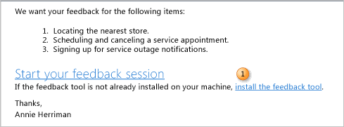
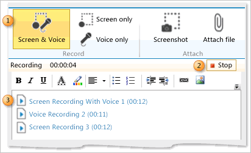
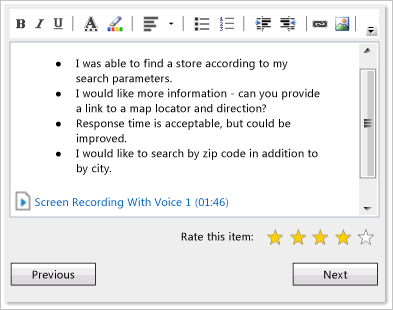

# Give feedback using Microsoft Feedback Client

[!INCLUDE [temp](../../_shared/version-vsts-tfs-all-versions.md)]

You can respond to a request for feedback using the Microsoft Feedback Client. This tool allows you to launch an application, capture your interaction with it as video and capture your verbal or type-written comments as well. To support traceability, your feedback is stored in the data store for Azure DevOps Services or an on-premises Team Foundation Server (TFS).  

The Microsoft Feedback Client is installed automatically with the latest versions of Visual Studio, or you can download for free from the following page on the Microsoft website: [Microsoft Feedback Client Download](https://www.microsoft.com/download/details.aspx?id=48142). 

## Initiate a feedback session

When you receive an email request for feedback, it contains a link to launch Microsoft Feedback Client, and a link to install the feedback tool if it is not already installed. 

### To install Microsoft Feedback Client

You can skip this procedure if you already have Microsoft Feedback Client installed or if you will access the feedback tool on a remote machine.  

1. Open your email request, and then choose the Install the feedback tool link to install Microsoft Feedback Client.

	
	
	If you are viewing the email from an internet-based email client, you might need to copy the address behind the link and paste it into the address bar of your browser.

2. Restart your computer.

### To initiate a feedback session from an email request

1. Open your email request, and then choose the **Start your local feedback session** link

	> [!NOTE]   
	> If you are viewing the email from an internet-based email client, you might need to copy the address behind the link and paste it into the address bar of your browser. 

	If you're accessing the feedback tool on a remote computer, open the shortcut menu for the **Start your local feedback session** link, and then choose **Copy Hyperlink**. On the remote computer, choose **Start**, choose **Run**, paste the hyperlink into the box, and then choose the **OK** button.
	
	The Feedback Client launches and the Windows Security dialog box appears.

1. Enter the credentials provided to you for connecting with Team Foundation Server, and then choose the **OK** button.

## Launch the application
 
The feedback tool opens to the Start page. Launch the application by following the instructions provided. 

1. From the Start page, choose the **Application** link to open, start, or install the application for which you have been requested to provide feedback.

3. Follow any additional instructions provided to login or access the application.

	For example, you would choose the `http://staging.fabrikamfiber.com/customer.aspx` link and then enter the user name and password provided. 

## Provide feedback on requested items

You can record your interactions with the application, record verbal comments, enter text, clip and annotate a screen, or attach a file. Recordings appear as images within the feedback tool's text box.

### To review descriptions of items submitted for feedback

On the **Provide** page, one or more items appear for you to provide feedback. For each item, you can get context on what's being asked and then you can give feedback free form through video or audio recordings, text, screenshot, or file attachments. When finished with one item, choose the **Next** button to move to the next item. 

1. On the toolbar, choose the number of the ITEM that you want to review. 

1. Review the information provided. 
 
1. Interact with the application, and determine what feedback you want to provide, based on the instructions for each item's request.

### To start, stop, or delete a screen or voice recording

You can change settings defined for the audio device and annotation tool at any time. For more information, see Change the audio device or annotation tool.  

1. **To start recording:** Choose one of the icons:**  Screen & Voice**, **Screen only**, or  **Voice only**.   

	> [!IMPORTANT]   
	> **Security Note:** Unless you stop recording, all steps that you take and remarks that you make while recording screen and voice will be recorded. If you provide sensitive data such as user names and passwords, you will capture this information in the recording. However, you can always delete a recording by deleting the image for the recording session that appears in the feedback tool's text box. 

1. **To stop recording**: Choose the **Stop** button.

	The recording stops, and an image appears in the text box that indicates the type of recording and the length of the recording session. 

1. **To delete a recording**: Choose the image for the recording that you want to delete, and then press the **Delete** key.

###To add text, capture a screenshot, or attach a file
 
You can add text, capture a screenshot, annotate a screenshot, or attach a file as part of your feedback. You can perform these operations while you continue to record your feedback. 

By annotating screenshots, you can indicate corrections or improvements by adding text or images to the screenshot that you captured. By default, Microsoft Paint opens automatically when you open a screenshot image that you captured within the feedback tool. You can also configure another annotation tool to open automatically whenever you capture a screenshot. For more information, see [Change the audio device or annotation tool](change-audio-device-annotation-tool.md).

1. **To add text**: In the tool's rich-text box, enter the information that you want to include when you submit your feedback.  

	You can use the toolbar to format your comment, add a hyperlink, and insert an image.  

2. **To capture a screenshot**: Choose the camera icon, and then select the rectangular area that you want to capture.  

	The image appears in the rich-text box.  

3. **To annotate the screenshot**: Double-click the image. 

	Microsoft Paint, or whichever annotation tool you have configured, opens with the image displayed. To specify corrections or improvements, perform the following steps:  

	a. Draw or enter text onto the image.  
	b. Choose the  **Save** icon, and close the annotation tool.  

	The image appears within the feedback tool with the changes that you made.  

4. **To attach a file**: Choose the attachment icon, and in the **Open** dialog box, browse to the file that you want to attach, and then choose the **Open** button.

### To rate an item and move to the next item

  

1. (Optional) Choose one or more stars to indicate your overall rating of the item that you have just reviewed.  

3. Choose the **Next** button to move to the next item to review.  

## Review and submit your feedback
 
After you enter your feedback for each item, you can review, make corrections or additions, and then submit your feedback. 

1. Choose the **Submit** button, which also stops any recordings that you may have started.  
 
2. (Optional) On the **Submit** page, choose the **review feedback** link to return to the **Provide** page for the first feedback item. Review your feedback for each item and choose the **Next** button to advance to the next item.  
 
 	You can delete or modify any content within the text box for any item.
 
3. On the **Submit** page, choose the **Submit and close** button.
 
 	Microsoft Feedback Client closes, and the system creates a feedback response work item which contains the feedback that you submit with the title, "Feedback Response from *YourUserName* for *RequestFeedbackItemTitle*."

## Related notes

- You [Initiate a feedback request](get-feedback.md) from the home page of your web portal or using the Other links widget from a team dashboard.  
- You can [change the audio device or annotation tool](change-audio-device-annotation-tool.md) using the Settings icon change settings icon on the Microsoft Feedback Client.  
- If you access the Microsoft Feedback Client from a remote machine, you can [enable remote audio](enable-remote-audio-capture.md).  
- To record audio, you must have an audio recording device configured on your computer. If you access the feedback tool from a remote device, you might have to [enable remote audio capture](enable-remote-audio-capture.md).  

### Requirements to provide feedback 

- To provide feedback using the Microsoft Feedback Client you must have security credentials that will allow you to connect to Azure DevOps Services or an on-premises TFS and have the permissions described in [Give reviewers permissions to provide feedback](give-permissions-feedback.md).  
- Your computer must meet the system requirements for installing Microsoft Feedback Client. For more information, see the following page on the Microsoft website: [Microsoft Feedback Client Download](https://www.microsoft.com/download/details.aspx?id=48142).

