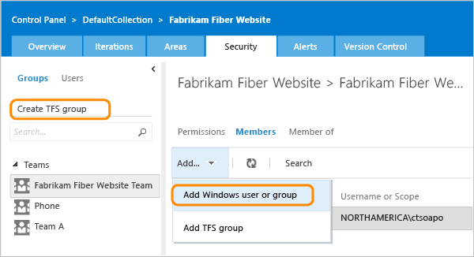
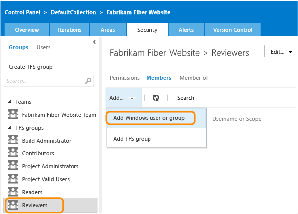
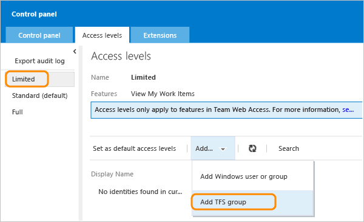

# Give reviewers permissions to provide feedback

[!INCLUDE [temp](../../_shared/version-vsts-tfs-all-versions.md)]

You provide feedback to users that you plan to [request feedback](get-feedback.md) from. Reviewers who aren't members of your team require special permissions to provide feedback using the Microsoft Feedback Client. 

## Add reviewers to your team project

1.	From the web portal of your team project home page, open the administration context.  

	  

	If you aren't a member of the **Project Administrators** or **Team Foundation Administrators** group, get added. See [Add an administrator](../../organizations/security/set-project-collection-level-permissions.md). You'll need to be a member in order to add users and groups to a team project, change permissions, and grant them access to the web portal.

2. Create a group for your reviewers.

	

	><b>Tip: </b> If you have a lot of reviewers, creating a Windows, VSO, or TFS group helps you manage permissions more efficiently.
 	
3. Name your group.  

	  
	
4. Add accounts to your group.  

	  
	
	  

## Set permissions so reviewers can provide feedback

Allow reviewers to **Create test runs**, **View project-level information**, and **View test runs**.

## Set permissions so reviewers can modify work items

Since feedback is captured in a feedback response work item, reviewers need to be able to modify work items in the product areas they will review.

1. Open security for the team project.

	

2. Add the reviews group to the **VSO Groups** or **TFS Groups**. 

	

3. Allow reviewers to Edit work items in this node and View work items in this node. 

	

## If you want, allow reviewers the ability to modify their feedback submissions

Sometimes additional ideas occur after reviewers submit their feedback. By providing access to the web portal, reviewers can revisit and further annotate their feedback submissions. 

- **Azure DevOps Services:**  [Assign the **Stakeholder** license to accounts](../../organizations/accounts/add-organization-users.md) that you add to your Reviewer group   
- **On-premises TFS:**  [Add your Reviewer group to the **Stakeholder** group on the **access levels** page](../../organizations/security/change-access-levels.md). If you don't see this tab, get administrative permissions. 

 
Your reviewers will be able to view and modify only those work items that they create, which includes feedback responses. The [Stakeholder group provides limited access](../../organizations/security/get-started-stakeholder.md) to features and data for those members of your organization who do not have a TFS client access license (CAL). 

## Related articles

- [Initiate a feedback request](get-feedback.md)  
- [Respond to a feedback request](give-feedback.md)  
- [Work as a stakeholder](../../organizations/security/get-started-stakeholder.md) 

