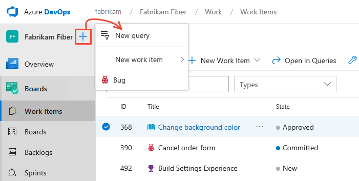
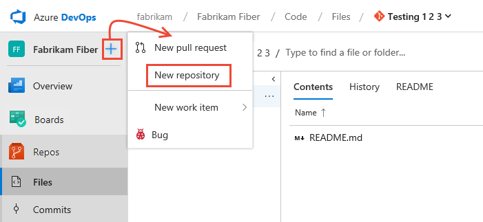
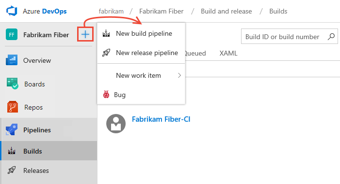
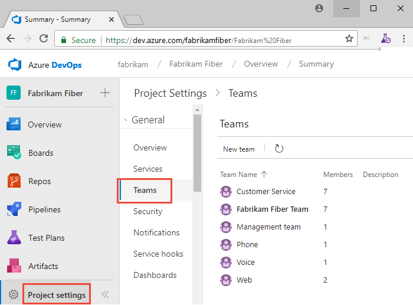

# Add an artifact or team artifacts

[!INCLUDE [temp](../../_shared/version-tfs-2017-through-vsts.md)] 

Select the service of interest to get started adding new artifacts or objects. For example, to add work items, choose **Boards** or **Work**. Some artifacts&mdash;such as a product backlog, Kanban board, portfolio backlogs&mdash;are added when you add a team.  

Prior to adding an artifact, make sure that you've [selected the project and repository](go-to-project-repo.md) that you want to work in.  

## Add work items, queries, or other work tracking artifacts 
You can quickly add a query or work item when working from a **Boards** or **Work** page. 

::: moniker range=">= azure-devops-2019"

Choose a **Boards** page&mdash;such as **Work Items**, **Boards**, or **Backlogs**. Then choose the  plus icon and select from the menu of options. 

> [!div class="mx-imgBorder"]

::: moniker-end

::: moniker range=">= tfs-2017 <= tfs-2018"

From a **Work** page, you can add a work item from the menu of options as shown in the following image.
 
> [!div class="mx-imgBorder"]

 Or, you can open one of the pages&mdash;**Boards**, **Backlogs**, **Queries**, or **Plans**&mdash;to add an artifact specific to each of these functional pages.

::: moniker-end

To add other work tracking artifacts, see one of the following articles: 

- To add a board, backlog, or sprint backlog, first [add a team](../../organizations/settings/add-teams.md) which will be associated with those artifacts 
- [Add a delivery plan](../../boards/plans/review-team-plans.md)
- [Add a managed work item query](../../boards/queries/using-queries.md) 
- [Add work items](../../boards/work-items/view-add-work-items.md).

## Add a pull request or Git repository 

You can quickly add a pull request, Git repository, or work item using the **Add** menu when working from **Code**. 

::: moniker range=">= azure-devops-2019"

Expand the **Repos** service and choose **Files**, **Commits**, or **Pull Requests** (Git repos) or **Files**, **Changesets**, or **Shelvesets** (TFVC). Then, choose the  plus icon and select from the menu of options. 

> [!div class="mx-imgBorder"]

For details on adding a Git repository, see [Git repository](../../repos/git/creatingrepo.md). 

::: moniker-end

::: moniker range=">= tfs-2017 <= tfs-2018"

From **Code**, open the context menu for the current repository and choose  **New repository**. For details on adding a Git repository, see [Git repository](../../repos/git/creatingrepo.md)

> [!div class="mx-imgBorder"]

From one of the other **Code** pages, you can add files or folders, a new branch, or a new pull request. 

::: moniker-end

Note that you can only add one TFVC repository per project, but an unlimited number of Git repositories. To learn more about Git artifacts, see one of the following articles:

- [Git repository](../../repos/git/creatingrepo.md)
- [Git branch](../../repos/git/create-branch.md)
- [Git pull request](../../repos/git/pullrequest.md) 
- [Add work items](../../boards/work-items/view-add-work-items.md)

## Add build and release pipelines 

::: moniker range=">= azure-devops-2019"

Expand  **Pipelines** and choose **Builds** or **Releases**. Then choose the  plus icon and select from the menu of options. 

> [!div class="mx-imgBorder"]

::: moniker-end

::: moniker range=">= tfs-2017 <= tfs-2018"

From **Build and Release**, choose **Builds**, **Releases**, or other page to add an artifact associated with that page.
 
> [!div class="mx-imgBorder"]
> 

::: moniker-end

To learn more about adding other pipeline related artifacts, see the following articles: 
- [Deployment groups](../../pipelines/release/deployment-groups/index.md)  
- [Task groups](../../pipelines/library/task-groups.md)  
- [Variable groups](../../pipelines/library/variable-groups.md)  
- [Secure files](../../pipelines/library/secure-files.md)  

## Add a team 

Agile tools and dashboards are typically associated with teams. You add teams to a project. To learn more about teams, see [About teams and Agile tools](../../settings/about-teams-and-settings.md). To add a team, see [Add a team and team members](../../organizations/settings/add-teams.md). 

<a id="view-teams" />
## View teams already defined 

::: moniker range=">= azure-devops-2019"

To view the set of defined teams, open **Project settings**, and choose **Overview**.  

> [!div class="mx-imgBorder"]  
> 

::: moniker-end

::: moniker range=">= tfs-2017 <= tfs-2018"

To view the set of defined teams, open the admin context for the project, and choose **Overview**.  

 

::: moniker-end

::: moniker range=">= tfs-2015"

## Add a dashboard 

Dashboards are associated with a team. Each team can create and configure a number of dashboards. To learn how, see [Add a dashboard](../../report/dashboards/dashboards.md).

::: moniker-end

::: moniker range=">= tfs-2018"
## Add a wiki 

If you don't have a wiki yet, you can add one. Once added, you can add and update pages to that wiki. 

::: moniker-end

::: moniker range=">= azure-devops-2019"

- [Create a wiki](../wiki/wiki-create-repo.md)
- [Add and edit wiki pages](../wiki/add-edit-wiki.md)
- [Publish a Git repository to a wiki](../wiki/publish-repo-to-wiki.md)

::: moniker-end

::: moniker range="tfs-2018"

- [Create a wiki](../wiki/wiki-create-repo.md)
- [Add and edit wiki pages](../wiki/add-edit-wiki.md)

::: moniker-end

## Related articles

- [Azure Artifacts](../../artifacts/index.md)  
- [Exploratory & Manual Testing](../../test/index.md)  
