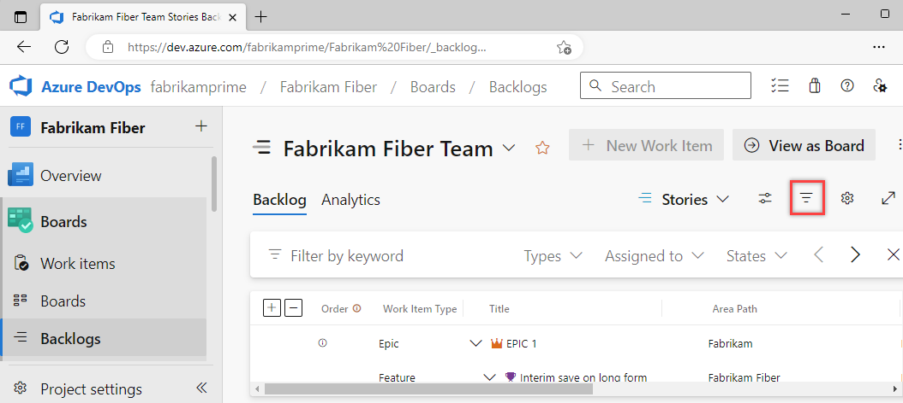

  

# Filter lists, boards, and directories 

[!INCLUDE [version-lt-eq-azure-devops](../../includes/version-lt-eq-azure-devops.md)] 

Several applications and pages support filtering, which is very useful when a large number of artifacts or items have been defined. Most directory views provide one or more filter functions. 

You can filter most items using keywords or a user name for an author of an item or where work is assigned to them. You can filter lists and boards in the following areas: 

::: moniker range=">= azure-devops-2019"  
- Git repositories: Branches, Commits, Commit history, Pull Requests, Pushes, and Repositories  
- Work tracking: Work Items, Kanban boards, Backlogs, Sprint Backlogs, and Taskboards 
- Directories: Dashboards, Boards, Backlogs, Sprints, Queries, Builds, Releases  

::: moniker-end

::: moniker range="tfs-2018"
- Git repositories: Branches, Commits, Commit history, Pull Requests, Pushes, and Repositories  
- Work tracking: Work Items, Kanban boards, Backlogs, Sprint Backlogs, and Taskboards 

::: moniker-end

> [!NOTE]   
> You may have fewer or additional filter options based on the [features you've enabled](preview-features.md) or the platform and version that you are working from.

## Filter based on keywords, tags, or fields

To turn filtering on, choose the :::image type="icon" source="../../media/icons/filter-icon.png" border="false"::: filter icon. 

You can filter work items by typing a keyword or using one or more of the fields provided, such as work item type, assigned to, state, and tags. Based on the keyword that you enter, the filter function will list work items based on any visible/displayed column or field, including tags. Also, you can enter a value for an ID, whether or not the ID field is visible.  

The filtered set is always a flat list, even if you've selected to show parents. 

### Characters ignored by keyword filter criteria

The filter criteria ignores the following characters: `,` (comma), `.` (period), `/` (forward slash), and `\` (back slash). 

::: moniker range=">= azure-devops-2019"

## Filter directories

Choose the :::image type="icon" source="../../media/icons/filter-icon.png" border="false"::: filter icon to filter a directory list by keyword, team, or other supported field. Keywords apply to titles, descriptions, and team names. 

For example, here we turn filtering on for the dashboard directory. 

> [!div class="mx-imgBorder"]  
>    

::: moniker-end

## Related articles  
- [Commit history](../../repos/git/commit-history.md)
- [Working with Git tags](../../repos/git/git-tags.md)
- [Filter backlogs and queries](../../boards/backlogs/filter-backlogs-boards-plans.md)
- [Filter your Kanban board](../../boards/backlogs/filter-backlogs-boards-plans.md)
- [Add tags to work items](../../boards/queries/add-tags-to-work-items.md)