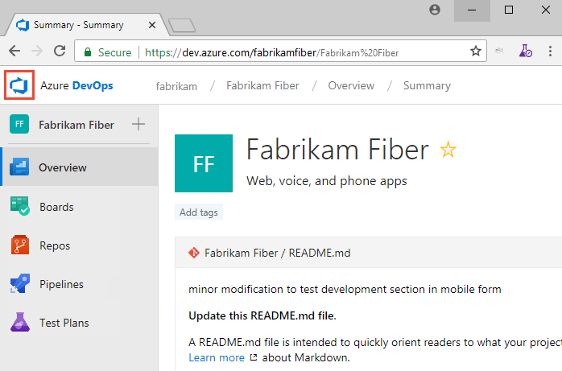
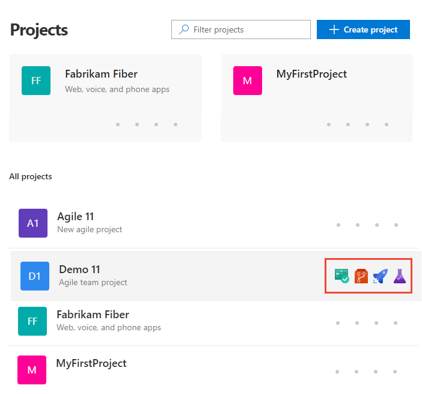
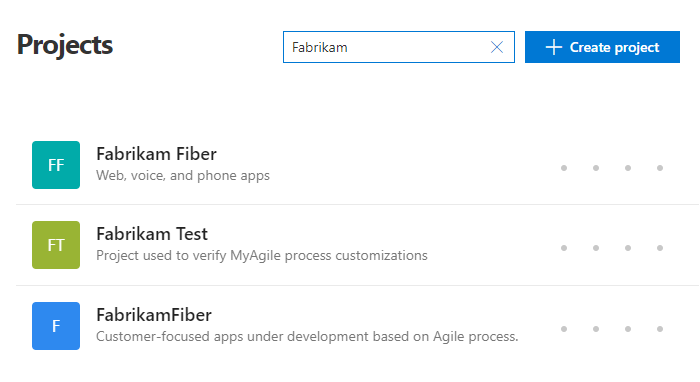
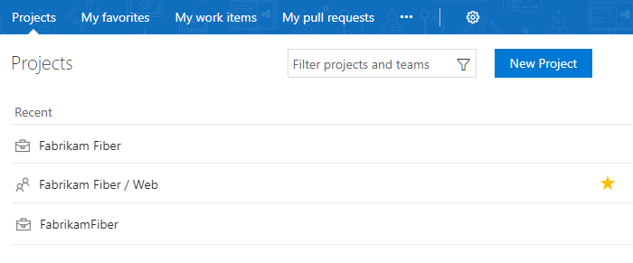
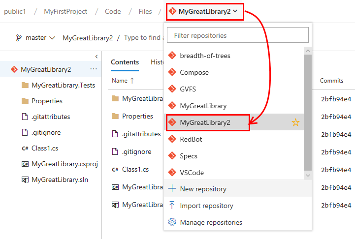
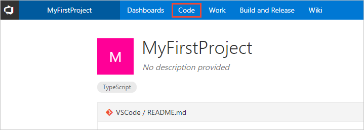
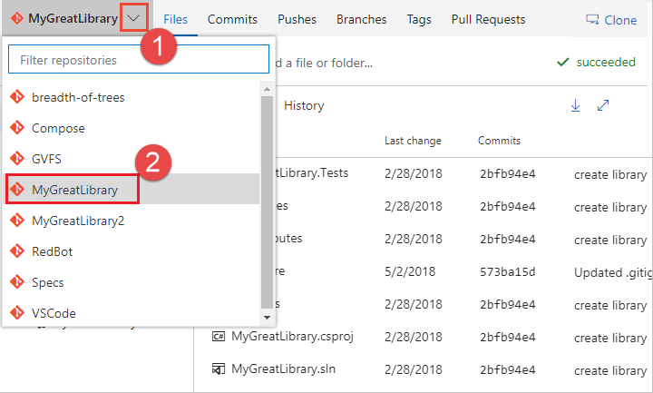

# Switch project, repository, team 

[!INCLUDE [version-lt-eq-azure-devops](../../includes/version-lt-eq-azure-devops.md)] 

Several features depend on the project, repository, or team that you have selected. For example, dashboards, backlogs, and board views will change depending on the project and team you select.

Also, when you add a work item, the system references the default area and iteration paths defined for the team context. Work items you add from the team dashboard (new work item widget) and queries page are assigned the team default iteration. Work items you add from a team backlog or board, are assigned the team default backlog iteration. To learn more, see [About teams and Agile tools](../../organizations/settings/about-teams-and-settings.md).  

## Prerequisites 
 
* You must be added to a project as a member of the **Contributors** or administrator security group. To get added, [Add users to a project or team](../../organizations/security/add-users-team-project.md). 
 
::: moniker range="azure-devops"  

> [!NOTE]  
> If the **Limit user visibility and collaboration to specific projects** preview feature is enabled for the organization, users added to the **Project-Scoped Users** group won't be able to access projects that they haven't been added to. To learn more, see [Manage your organization, Limit  user visibility for projects and more](../../user-guide/manage-organization-collection.md#project-scoped-user-group). 

::: moniker-end  

## View and open a project 

From the **Projects** page you can quickly navigate to a project that you have permissions to view. 

::: moniker range=">= azure-devops-2019"

1. Choose the :::image type="icon" source="../../media/icons/project-icon.png" border="false"::: Azure DevOps logo to open **Projects**.  

	> [!div class="mx-imgBorder"]  
	> 

	The projects you most recently viewed are displayed, followed by a list of all projects in alphabetic order. 

1. Hover over the dots and you can open the service of interest for that project. 

	> [!div class="mx-imgBorder"]  
	> 

1. You can filter the project and team list using the *Filter projects* search box. Simply type a keyword contained within the name of a project or team. Here we type **Fabrikam** to find all projects or teams with *Fabrikam* in their name. 

	> [!div class="mx-imgBorder"]  
	>  

1. Choose **Create Project** to add a project. You must be an account administrator or a member of the Project Collection Administrators group to [add a project](../../organizations/projects/create-project.md).

	> [!div class="mx-imgBorder"]  
	>  

::: moniker-end

::: moniker range="tfs-2018"

From the **Projects** page you can quickly navigate to a project or a team that you've accessed or worked in previously. Projects and teams are listed in the order you've last accessed, with the most recent five projects accessed appearing first. All projects you've accessed are listed within the **All** section. 

1. Choose the :::image type="icon" source="../../media/icons/project-icon.png" border="false"::: Azure DevOps logo to open **Projects**.  

	> [!div class="mx-imgBorder"]  
	> 

	The projects you most recently viewed are displayed, followed by a list of all projects in alphabetic order. 

	> [!div class="mx-imgBorder"]  
	> 

1. As you hover over a project or team, you can choose one of the links to go to **Home** or **Dashboards**, **Code**, **Work**, **Build and Release**, **Test**, or **Wiki** pages. Choose the  star icon to mark the project as a favorite. 

	> [!div class="mx-imgBorder"]  
	>  

2. You can filter the project and team list using the *Filter projects and teams* search box. Simply type a keyword contained within the name of a project or team. Here we type **Fabrikam** to find all projects or teams with *Fabrikam* in their name. 

	> [!div class="mx-imgBorder"]  
	>  

3. Choose **New Project** to add a project. You must be an account administrator or a member of the Project Collection Administrators group to [add a project](../../organizations/projects/create-project.md).

	> [!div class="mx-imgBorder"]  
	>  

::: moniker-end

## View and open a repository 

::: moniker range=">= azure-devops-2019"

1. Choose **Repos>Files**.

	> [!div class="mx-imgBorder"]
	>  

1. Select the repository of interest from the repository selector.  
	> [!div class="mx-imgBorder"]
	>  

::: moniker-end

::: moniker range="tfs-2018"

1. Choose **Code**.  
 
	> [!div class="mx-imgBorder"]  
	>   

1. Select the repository from the selector.  

	> [!div class="mx-imgBorder"]  
	> 
   ::: moniker-end  

## Switch to a different team 

::: moniker range=">= azure-devops-2019"

From a user page, one under&mdash;**Boards**, **Repos**, **Pipelines**, or **Test Plans**&mdash;you can't switch to a different team, you can [only select team artifacts](use-breadcrumbs-selectors.md). 

From a **Project Settings>Work>Team configuration** page, you select a team from the team selector breadcrumb. 

> [!div class="mx-imgBorder"]  
> 

::: moniker-end

::: moniker range="tfs-2018"
You can switch your team focus to one that you've recently viewed from the project/team selector. If you don't see the team or project you want, choose **Browse&hellip;** or choose the :::image type="icon" source="../../media/icons/project-icon.png" border="false"::: Azure DevOps logo to [access the **Projects** page](work-across-projects.md).  

::: moniker-end

## Related articles
- [Work across projects](work-across-projects.md)
- [Add teams](../../organizations/settings/add-teams.md?toc=/azure/devops/project/navigation/toc.json&bc=/azure/devops/project/navigation/breadcrumb/toc.json)