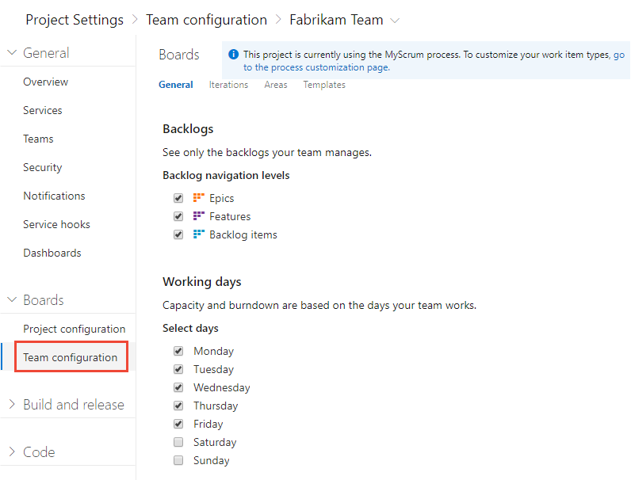
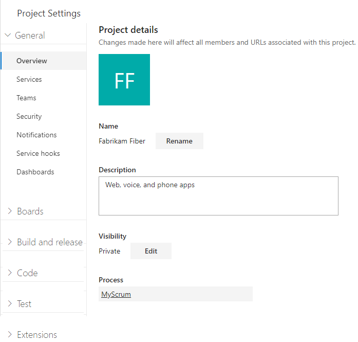

# Open a service, page, or settings 

[!INCLUDE [version-lt-eq-azure-devops](../../includes/version-lt-eq-azure-devops.md)] 

The web portal for Azure DevOps provides support for software development teams to collaborate through the planning, development, and release cycles. You can manage source code, plan and track work, define builds, run tests, and manage releases. 

::: moniker range="azure-devops"

This article shows you how to navigate to functional and administrative tasks available from the web portal. There are three levels of administrative tasks: team, project, and organization.  

If you don't have a project yet, [create one](../../user-guide/sign-up-invite-teammates.md?toc=/azure/devops/project/navigation/toc.json&bc=/azure/devops/project/navigationbreadcrumb/toc.json). If you don't have access to the project, [get invited to the team](../../organizations/security/add-users-team-project.md).

::: moniker-end

::: moniker range="< azure-devops"

This article shows you how to navigate to functional and administrative tasks available from the web portal. There are four levels of administrative tasks: team, project, collection, and server.  

If you don't have a project yet, [create one](../../organizations/projects/create-project.md). If you don't have access to the project, [get invited to the team](../../organizations/security/add-users-team-project.md).

::: moniker-end

## Open a service or functional task page

Services support getting work done&mdash;managing code, planning and tracking work, defining and managing pipelines, creating and running tests, and so on.  

::: moniker range=">= azure-devops-2019"
> [!NOTE]  
> Only those services that are enabled will appear in the user interface. For example, if **Boards** is disabled, then **Boards** or **Work** and all pages associated with that service won't appear. To enable or disable a service, see [Turn an Azure DevOps service on or off](../../organizations/settings/set-services.md).
::: moniker-end

::: moniker range=">= azure-devops-2019"
You open a service by choosing the service from the sidebar and then selecting from the available pages. 

For example, here we select **Boards>Backlogs**. 

> [!div class="mx-imgBorder"]  
> 

Within the page you may select a specific view or artifact, such as a team backlog or choose another page. 

::: moniker-end

 

## Open team settings

Select configurations are made to teams through the team settings pages. For an overview of all team settings, see [About user, team, project, and organization-level settings](../../organizations/settings/about-settings.md#team).

::: moniker range=">= azure-devops-2019"

1. Choose **Project Settings**.

	> [!div class="mx-imgBorder"]  
	>   

1. Expand **Boards** and choose **Team configuration**. 

	> [!div class="mx-imgBorder"]  
	>   

1. Choose one of the pages **General**, **Iterations**, **Areas**, or **Templates** to configure settings for the team. To learn more, see [Manage teams](../../organizations/settings/manage-teams.md). 

1. If you need to switch to a different team, use the team selector within the breadcrumbs.
   
	> [!div class="mx-imgBorder"]  
	>  

1. To add a team administrator, add team members, or change the team profile, choose **Teams** from the vertical sidebar, and then choose the name of the team you want to configure. 

::: moniker-end

 

## Open project settings

Administrators configure resources for a project and manage project-level permissions from the **Project settings** pages. Tasks performed in this context can impact the project and team functions. For an overview of all project settings, see [Project administrator role and managing projects](../../organizations/settings/about-settings.md#project).

::: moniker range=">= azure-devops-2019"

1. Choose **Project Settings**.

	> [!div class="mx-imgBorder"]  
	>   

1. From there, you can choose a page from the list. Settings are organized based on the service they support. Expand or collapse the major sections such as **Boards**, **Build and release**, **Code**, **Test**, and **Extensions** to select from the list. 

	> [!div class="mx-imgBorder"]  
	>   

::: moniker-end

 

::: moniker range="azure-devops"

## Open Organization settings 

Organization owners and members of the Project Collection Administrators group configure resources for all projects or the entire organization, including adding users, from the Organization settings pages. This includes managing permissions at the organization-level. For an overview of all organization settings, see [Project collection administrator role and managing collections of projects](../../organizations/settings/about-settings.md#admin).

::: moniker-end

::: moniker range="< azure-devops"

## Open Collection settings 

Members of the Project Collection Administrators group configure resources for all projects or the entire project collection from the Collection settings pages. This includes managing permissions at the collection-level. For an overview of all collection-level settings, see [Project collection administrator role and managing collections of projects](../../organizations/settings/about-settings.md#admin).

::: moniker-end

::: moniker range=">= azure-devops-2019 < azure-devops"

1. Choose the :::image type="icon" source="../../media/icons/project-icon.png" border="false"::: Azure DevOps logo to open **Projects**. Then choose **Admin settings**. 

	> [!div class="mx-imgBorder"]  
	>   

1. From there, you can choose a page from the list of settings. Settings are organized based on the service they support. Expand or collapse the major sections such as **Boards** and **Build and release** to select a page from the list. 

	> [!div class="mx-imgBorder"]  
	>  

::: moniker-end

## Related articles 

- [Manage projects](../../organizations/projects/about-projects.md)
- [About team, project, and admin settings](../../organizations/settings/about-settings.md)