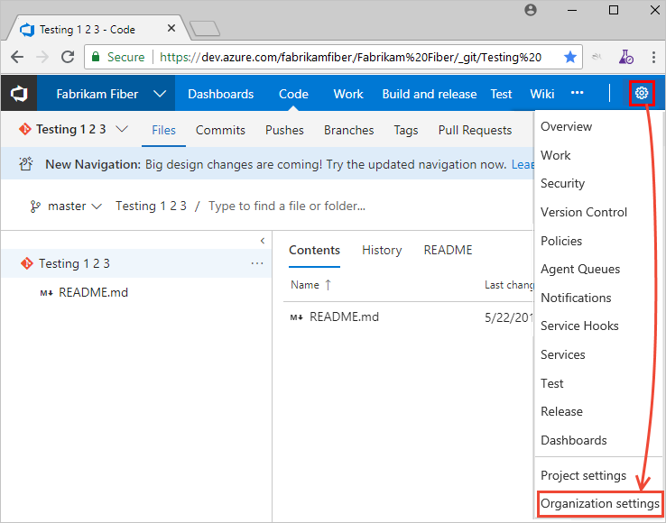

# Open a service, page, or settings 

[!INCLUDE [temp](../../_shared/version-tfs-2017-through-vsts.md)] 

The web portal for Azure DevOps provides support for software development teams to collaborate through the planning, development, and release cycles. You can manage source code, plan and track work, define builds, run tests, and manage releases. 

::: moniker range="azure-devops"

This article shows you how to navigate to functional and administrative tasks available from the web portal. There are three levels of administrative tasks: team, project, and organization.  

If you don't have a project yet, [create one](../../user-guide/sign-up-invite-teammates.md?toc=/azure/devops/project/navigation/toc.json&bc=/azure/devops/project/navigationbreadcrumb/toc.json). If you don't have access to the project, [get invited to the team](../../organizations/security/add-users-team-project.md).

::: moniker-end

::: moniker range=">= tfs-2017 <= azure-devops-2019"

This article shows you how to navigate to functional and administrative tasks available from the web portal. There are four levels of administrative tasks: team, project, collection, and server.  

If you don't have a project yet, [create one](../../organizations/projects/create-project.md). If you don't have access to the project, [get invited to the team](../../organizations/security/add-users-team-project.md).

::: moniker-end

## Open a service or functional task page

Services support getting work done&mdash;managing code, planning and tracking work, defining and managing pipelines, creating and running tests, and so on.  

::: moniker range="azure-devops"
> [!NOTE]  
> Only those services that are enabled will appear in the user interface. For example, if **Boards** is disabled, then **Boards** or **Work** and all pages associated with that service won't appear. To enable or disable a service, see [Turn an Azure DevOps service on or off](../../organizations/settings/set-services.md).
::: moniker-end

::: moniker range=">= azure-devops-2019"
You open a service by choosing the service from the sidebar and then selecting from the available pages. 

For example, here we select **Boards>Backlogs**. 

> [!div class="mx-imgBorder"]  
> 

Within the page you may select a specific view or artifact, such as a team backlog or choose another page. 

::: moniker-end

::: moniker range=">= tfs-2017 <= tfs-2018"

You open a service by choosing it from the horizontal blue bar. Then, select from the available pages.

For example, here we select **Work>Work Items**. 

::: moniker-end

<a id="team-settings" /> 

## Open team settings

Select configurations are made to teams through the team settings pages. For an overview of all team settings, see [About user, team, project, and organization-level settings](../../organizations/settings/about-settings.md#team).

::: moniker range=">= azure-devops-2019"

1. Choose **Project Settings**.

	> [!div class="mx-imgBorder"]  
	>   

0. Expand **Boards** and choose **Team configuration**. 

	> [!div class="mx-imgBorder"]  
	>   

0. Choose one of the pages **General**, **Iterations**, **Areas**, or **Templates** to configure settings for the team. To learn more, see [Manage teams](../../organizations/settings/manage-teams.md). 

0. If you need to switch to a different team, use the team selector within the breadcrumbs.
   
	> [!div class="mx-imgBorder"]  
	>  

0. To add a team administrator, add team members, or change the team profile, choose **Teams** from the vertical sidebar, and then choose the name of the team you want to configure. 

::: moniker-end

::: moniker range=">= tfs-2017 <= tfs-2018"

You open team settings from the top navigation bar. Select the team you want and then choose the  gear icon. To learn more about switching your team focus, see [Switch project, repository, team](go-to-project-repo.md#switch-team-context).

> [!div class="mx-imgBorder"]  
>   

0. Choose one of the pages **General**, **Iterations**, **Areas**, or **Templates** to configure settings for the team. To learn more, see [Manage teams](../../organizations/settings/manage-teams.md). 

0. To add a team administrator, add team members, or change the team profile, choose **Overview**. 
1. 
::: moniker-end

<a id="project-admin-context" /> 

## Open project settings

Administrators configure resources for a project and manage project-level permissions from the **Project settings** pages. Tasks performed in this context can impact the project and team functions. For an overview of all project settings, see [Project administrator role and managing projects](../../organizations/settings/about-settings.md#project).

::: moniker range=">= azure-devops-2019"

0. Choose **Project Settings**.

	> [!div class="mx-imgBorder"]  
	>   

0. From there, you can choose a page from the list. Settings are organized based on the service they support. Expand or collapse the major sections such as **Boards**, **Build and release**, **Code**, **Test**, and **Extensions** to select from the list. 

	> [!div class="mx-imgBorder"]  
	>   

::: moniker-end

::: moniker range=">= tfs-2017 <= tfs-2018"

From a user context, open **Project settings** by choosing the  gear icon. 
::: moniker-end

::: moniker range="tfs-2018"

<a id="admin-intro" />
<a id="admin-intro-team-services" /> 
 
Open any admin page by choosing it's name. Choose or hover over the  gear icon to access other administrative options. Note that you can choose any of the user-context areas&mdash;**Dashboards**, **Code**, **Work**&mdash;to return to the user context. 

 

::: moniker-end

::: moniker range="tfs-2017"

<a id="admin-intro-tfs-2017-1" />

Open any admin page by choosing it's name. Choose or hover over the  gear icon to access other administrative options. Note that you can choose any of the user-context areas&mdash;**Home** or **Dashboards**, **Code**, **Work**&mdash;to return to the user context. 

**TFS 2017.2**

  

**TFS 2017.1**  

  
 
<a id="admin-intro-tfs-2017" /> 

**TFS 2017**

::: moniker-end

<a id="collection-admin-context" /> 

::: moniker range="azure-devops"
## Open Organization settings 

Organization owners and members of the Project Collection Administrators group configure resources for all projects or the entire organization, including adding users, from the Organization settings pages. This includes managing permissions at the organization-level. For an overview of all organization settings, see [Project collection administrator role and managing collections of projects](../../organizations/settings/about-settings.md#admin).

::: moniker-end

::: moniker range=">= tfs-2017 <= azure-devops-2019"
## Open Collection settings 

Members of the Project Collection Administrators group configure resources for all projects or the entire project collection from the Collection settings pages. This includes managing permissions at the collection-level. For an overview of all collection-level settings, see [Project collection administrator role and managing collections of projects](../../organizations/settings/about-settings.md#admin).

::: moniker-end

::: moniker range="azure-devops-2019"

0. Choose the  Azure DevOps logo to open **Projects**. Then choose **Admin settings**. 

	> [!div class="mx-imgBorder"]  
	>   

0. From there, you can choose a page from the list of settings. Settings are organized based on the service they support. Expand or collapse the major sections such as **Boards** and **Build and release** to select a page from the list. 

	> [!div class="mx-imgBorder"]  
	>  

::: moniker-end

::: moniker range=">= tfs-2017 <= tfs-2018"

0. Choose the  gear icon to open **Organization settings** or **Collection settings**.

	> [!div class="mx-imgBorder"]  
	>  

0. From there, you can choose a page. Settings are organized based on the service they support. 

	> [!div class="mx-imgBorder"]  
	>  

::: moniker-end

::: moniker range=">= tfs-2017 <= tfs-2018"
## Open Server settings 

Members of the Team Foundation Server Administrators group configure resources for the server instance from the Server settings pages. <!---This includes managing permissions at the collection-level. For an overview of all collection-level settings, see [Project collection administrator role and managing collections of projects](../../organizations/settings/about-settings.md#admin). -->

1. From the web portal home page for a project, choose or hover over the  gear icon and select **Server settings**. 

	  

0. Choose **Access levels**, to set access levels for a member or group. For details, see [Change access levels](../../organizations/security/change-access-levels.md).  

	If you don't see **Access levels**, you aren't a TFS administrator and don't have permission. [Here's how to get permissions](/azure/devops/server/admin/add-administrator-tfs). 

::: moniker-end

## Related articles 

- [Manage projects](../../organizations/projects/index.md)
- [About team, project, and admin settings](../../organizations/settings/about-settings.md)