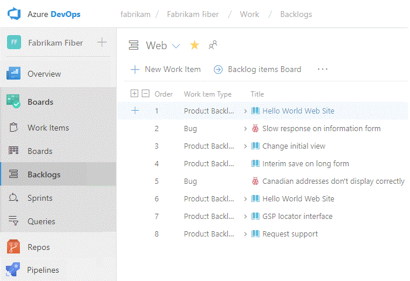

# Open a service, page, or settings 

[!INCLUDE [temp](../../_shared/version-tfs-2017-through-vsts.md)] 

From a supported web browser&mdash;such as the latest versions of Edge, Chrome, Safari, or Firefox&mdash;you access the services supported by Visual Studio Team Services (VSTS) or Team Foundation Server (TFS). The web portal provides support for teams to collaborate through the planning, development, and release cycles. You use the web portal to perform both software development and administrative tasks.  

You can manage source code, plan and track work, define builds, run tests, and manage releases. 

::: moniker range="vsts"
If you don't have a project yet, create one in [VSTS](../../user-guide/sign-up-invite-teammates.md?toc=/vsts/project/navigation/toc.json&bc=/vsts/project/navigationbreadcrumb/toc.json). If you don't have access to the project, [get invited to the team](../../organizations/security/add-users-team-project.md).

::: moniker-end

::: moniker range=">= tfs-2017 <= tfs-2018"
If you don't have a project yet, create one in your [on-premises TFS](../../organizations/projects/create-project.md). If you don't have access to the project, [get invited to the team](../../organizations/security/add-users-team-project.md).

::: moniker-end

[!INCLUDE [temp](../../_shared/new-navigation.md)] 

## Open a service or page

Services support getting work done&mdash;managing code, planning and tracking work, defining and managing pipelines, creating and running tests, and so on. 
# [New navigation](#tab/new-nav)

::: moniker range="vsts"
You open a service by choosing the service from the sidebar and then selecting from the available pages. 

For example, here we select **Work>Backlogs**. 

> [!div class="mx-imgBorder"]  
> 

Within the page you may select a specific view or artifact, such as as a team backlog or choose another page. 

::: moniker-end

::: moniker range=">= tfs-2017 <= tfs-2018"
[!INCLUDE [temp](../../_shared/new-navigation-not-supported.md)] 
::: moniker-end

# [Previous navigation](#tab/previous-nav)

You open a service by choosing it from the horizontal blue bar. Then, select from the available pages.

For example, here we select **Work>Work Items**. 

---

<a id="project-admin-context" /> 

## Open project settings

Administrators configure resources for a project and manage project-level permissions from the **Project settings** pages. Tasks performed in this context can impact the project and team functions.  For an overview of all project settings, see [Project administrator role and managing projects](../../organizations/settings/about-settings.md#project).

# [New navigation](#tab/new-nav)

::: moniker range="vsts"

0. Choose **Project Settings**.

	> [!div class="mx-imgBorder"]  
	>   

0. From there, you can choose a page from the list. Settings are organized based on the service they support. Expand or collapse the major sections such as **Work**, **CI/CD**, **Code**, **Test**, and **Extensions** to select from the list. 

	> [!div class="mx-imgBorder"]  
	>   

::: moniker-end

::: moniker range=">= tfs-2017 <= tfs-2018"
[!INCLUDE [temp](../../_shared/new-navigation-not-supported.md)] 
::: moniker-end

# [Previous navigation](#tab/previous-nav)

From a user context, open **Settings** by choosing the  gear icon. 

::: moniker range=">= tfs-2018"

<a id="admin-intro" />
<a id="admin-intro-team-services" /> 
 
Open any admin page by choosing it's name. Choose or hover over the  gear icon to access other administrative options. Note that you can choose any of the user-context areas&mdash;**Home**, **Code**, **Work**&mdash;to return to the user context. 

 

::: moniker-end

::: moniker range="tfs-2017"

<a id="admin-intro-tfs-2017-1" />

Open any admin page by choosing it's name. Choose or hover over the  gear icon to access other administrative options. Note that you can choose any of the user-context areas&mdash;**Home**, **Code**, **Work**&mdash;to return to the user context. 

**TFS 2017.2**

  

**TFS 2017.1**  

  
 
<a id="admin-intro-tfs-2017" /> 

**TFS 2017**

::: moniker-end

--- 

<a id="collection-admin-context" /> 

::: moniker range="vsts"
## Open Admin settings 

Account owners and members of the Project Collection Administators group configure resources for all projects or the entire organization, including adding users, from the Admin settings pages. This includes managing permissions at the organization-level. For an overview of all admin settings, see [Project collection administrator role and managing collections of projects](../../organizations/settings/about-settings.md#admin).

::: moniker-end

::: moniker range=">= tfs-2017 <= tfs-2018"
## Open Admin settings 

Account owners and members of the Project Collection Administators group configure resources for all projects or the entire project collection from the Admin settings pages. This includes managing permissions at the organization-level. For an overview of all admin settings, see [Project collection administrator role and managing collections of projects](../../organizations/settings/about-settings.md#admin).

::: moniker-end

# [New navigation](#tab/new-nav)

::: moniker range="vsts"

0. Choose the  VSTS icon to open **Projects**. Then choose **Admin settings**. 

	> [!div class="mx-imgBorder"]  
	>   

0. From there, you can choose a page from the list of settings. Settings are organized based on the service they support. Expand or collapse the major sections such as **Work** and **CI/CD** to select a page from the list. 

	> [!div class="mx-imgBorder"]  
	>  

::: moniker-end

::: moniker range=">= tfs-2017 <= tfs-2018"
[!INCLUDE [temp](../../_shared/new-navigation-not-supported.md)] 
::: moniker-end

# [Previous navigation](#tab/previous-nav)

0. Choose the  gear icon to open **Account Settings**.

	> [!div class="mx-imgBorder"]  
	>  

0. From there, you can choose a page. Settings are organized based on the service they support. 

	> [!div class="mx-imgBorder"]  
	>  

---

## Related articles 

- [Project Management](../../organizations/projects/index.md)
- [About team, project, and admin settings ](../../organizations/settings/about-settings.md)