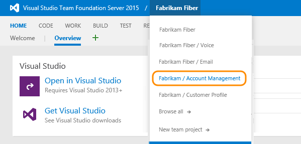

# Switch project or repository

[!INCLUDE [temp](../../_shared/version-tfs-2017-through-vsts.md)] 

Several features depend on the project or team that you have selected. For example, dashboards, backlogs, and board views will change depending on the context selected. 

For example, when you add a work item, the system references the default area and iteration paths defined for the team context. Work items you add from the team dashboard (new work item widget) and queries page are assigned the team default iteration. Work items you add from a team backlog or board, are assigned the team default backlog iteration. To change team defaults, see [Set team defaults](../../work/scale/set-team-defaults.md).  

You navigate to your team context from the top navigation bar. The method changes slightly depending on the platform/version you work from.     

## View teams   

To view a list of teams defined for a project, open the admin context for the project, and choose **Overview**.  

>[!NOTE]  
>**Feature availability**: The **Change process** link is only supported for projects that use the [Inheritance process model](../../work/customize/inheritance-process-model.md).  

 

## Projects: Navigate to a project 
From the **Projects** page you can quickly navigate to a project or a team that you've accessed or worked in previously. Projects are listed in the order you've last accessed, with the most recent five projects accessed appearing first. All projects you've accessed are listed within the **All** section.  

As you hover over the project, you can click one of the links to go to the Home (dashboards), Code, Work, Build & Release, or Test hub of the project. Click the  star icon to mark the project as a favorite. 

    

### Filter projects and teams
If a project isn't listed, you can find it by searching for it using the *Filter projects and teams* search box. Simply type a keyword contained within the name of a project or team. Here we type **Design** to find the Contoso project Design team. 

    

### Add a project
If you're an account administrator or are a member of the Project Collection Administrators group, the New Project button is shown. Click New Project to [add a project](../../accounts/create-team-project.md). 

## Switch to a different team 

>[!NOTE]  
>**Feature availability**: The Account Landing Page feature is in preview mode for VSTS and enabled for all users from web portal for TFS 2017.1 and later versions. To learn more about this feature, see [Work effectively from your account hub](../../user-guide/organization-home-pages.md). To enable or disable the feature, see [Enable preview features](preview-features.md).   

 

### VSTS
<a id="switch-context-team-services" />
 
You can switch your team focus to a project or team you've recently viewed from the project/team drop-down menu. If you don't see the team or project you want, click **Browse&hellip;** or click the  VSTS icon to [access your account hub and browse all projects and teams](../../user-guide/organization-home-pages.md?toc=/vsts/project/navigation/toc.json&bc=/vsts/project/navigation/breadcrumb/toc.json). If you haven't yet enabled the Account Landing Page, you'll be taken to the account home page. 

To go directly to the [project vision and status page](../wiki/project-vision-status.md), choose the project home icon from the drop-down menu, for example, .

 

### TFS 2017.1 
<a id="switch-context-tfs-2017-1" /> 

To switch your team focus to a project or team you've recently viewed, hover over the  VSTS icon and choose from the drop-down menu of options. If you don't see the team or project you want, choose **Browse&hellip;** to [browse all projects and teams](../../user-guide/organization-home-pages.md?toc=/vsts/project/navigation/toc.json&bc=/vsts/project/navigation/breadcrumb/toc.json). Your selection will open the [project vision and status page](../wiki/project-vision-status.md?toc=/vsts/project/navigation/toc.json&bc=/vsts/project/navigation/breadcrumb/toc.json) for the project.

To access your [account hub](../../user-guide/organization-home-pages.md?toc=/vsts/project/navigation/toc.json&bc=/vsts/project/navigation/breadcrumb/toc.json), click the  VSTS icon. If you haven't yet enabled the Account Landing Page, you'll be taken to the account home page.  

To go directly to the [project vision and status page](../wiki/project-vision-status.md?toc=/vsts/project/navigation/toc.json&bc=/vsts/project/navigation/breadcrumb/toc.json), choose the project home icon from the drop-down menu, for example, .

 

### TFS 2017
<a id="tfs-2017-switch-context" /> 

Open the project/team drop-down menu and select the project/team that you've recently visited. If you don't see the team or project you want, choose **Browse all** to browse all projects and teams. 

 

### TFS 2015
<a id="tfs-2015-switch-context" />

Open the project/team drop-down menu and select the project/team that you've recently visited. If you don't see the team or project you want, choose **Browse all** to browse all projects and teams. 

 

## Switch to a project or team from the account hub 
If you work in VSTS and TFS 2017.1, you can use your account hub to view and quickly navigate to teams, projects, branches, work items, pull requests and other objects that are relevant to you. For details, see [Work effectively from your account hub](../../user-guide/organization-home-pages.md?toc=/vsts/project/navigation/toc.json&bc=/vsts/project/navigation/breadcrumb/toc.json).  

## Related content
- [Work effectively from your account hub](../../user-guide/organization-home-pages.md?toc=/vsts/project/navigation/toc.json&bc=/vsts/project/navigation/breadcrumb/toc.json)
- [Add teams and team members](../../work/scale/multiple-teams.md?toc=/vsts/project/navigation/toc.json&bc=/vsts/project/navigation/breadcrumb/toc.json)