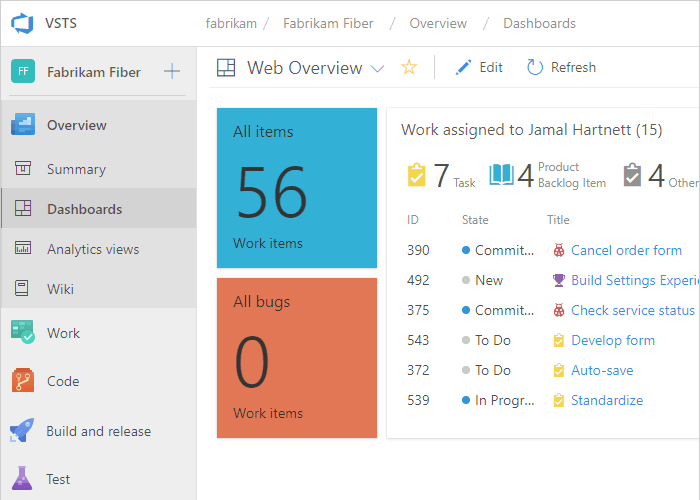

# Web portal navigation in Azure DevOps  

[!INCLUDE [temp](../../_shared/version-tfs-2017-through-vsts.md)] 

::: moniker range="azure-devops"

The web portal for Azure DevOps is organized around a set of services, as well as administrative pages and several task-specific features such as the search box.  The service labels differ depending on whether you work from Azure DevOps Services or Azure DevOps on-premises and it's version. 

[!INCLUDE [temp](../../_shared/version-selector.md)] 

Each service provides you with one or more pages which support a number of features and functional tasks. Within a page, you may then have a choice of options to select a specific artifact or add an artifact.

::: moniker-end

::: moniker range="azure-devops-2019"

The web portal for Azure DevOps Server is organized around a set of services&mdash;such as, **Overview**, **Boards**, **Repos**, **Pipelines**, **Test Plans**, and **Artifacts**&mdash; as well as administrative pages and several task-specific features such as the search box. Each service provides you with one or more pages which support a number of features and functional tasks. Within a page, you may then have a choice of options to select a specific artifact or add an artifact. 

Each service provides you with one or more pages which support a number of features and functional tasks. Within a page, you may then have a choice of options to select a specific artifact or add an artifact.

::: moniker-end

::: moniker range=">= tfs-2013 <= tfs-2018"

The web portal for Team Foundation Server (TFS) is organized around a set of applications&mdash;such as, **Dashboards**, **Code**, **Work**, **Build and Release**&mdash;as well as administrative pages and several task-specific features such as the search box. Each service provides you with one or more pages which support a number of features and functional tasks. Within a page, you may then have a choice of options to select a specific artifact or add an artifact. 
::: moniker-end

Here's what you need to know to get up and running using the web portal.  

::: moniker range=">= azure-devops-2019"
- [**Open a service, page, or settings**](go-to-service-page.md): use to switch to a different [service or functional area](../../user-guide/services.md) 
- [**Add an artifact or team**](add-artifact-team.md): use to quickly add a work item, Git repo, build or release pipelines, or a new team
- [**Open another project or repo**](work-across-projects.md): use to switch to a different project or access work items and pull requests defined in different projects, or items you've favorited 
- [**Open team artifacts, use breadcrumbs, selectors and directories**](use-breadcrumbs-selectors.md): use to navigate within a service, to open other artifacts or return to a root function
- [**Work with favorites**](set-favorites.md): favorite artifacts to support quick navigation  
- [**Search box**](search-basics.md): use to find code, work items, or wiki content  
- [**Your profile menu**](../../organizations/settings/set-your-preferences.md?toc=/azure/devops/project/navigation/toc.json&bc=/azure/devops/project/navigation/breadcrumb/toc.json): use to set personal preferences, notifications, and enable preview features  
- [**Settings**](../../organizations/settings/index.md): use to add teams, manage security, and configure other project and organization-level resources.  

::: moniker-end

::: moniker range=">= tfs-2017 <= tfs-2018"
- [**Open a service, page, or settings**](go-to-service-page.md): use to switch to a different service or functional area
- [**Add an artifact or team**](add-artifact-team.md): use to quickly add a work item, Git repo, build or release pipelines, or a new team
- [**Open another project or repo, or switch to a different team**](work-across-projects.md): use to switch to a different project or browse teams 
- [**Work across projects**](work-across-projects.md): use to quickly open work assigned to you, your active pull requests, or items you've favorited 
- [**Open team artifacts, use breadcrumbs & selectors**](use-breadcrumbs-selectors.md): use to navigate within a service, to open other artifacts or return to a root function
- [**Work with favorites**](set-favorites.md): favorite artifacts to support quick navigation   
- [**Search box**](search-basics.md): use to find code, work items, or wiki content 
- [**Your profile menu**](../../organizations/settings/set-your-preferences.md?toc=/azure/devops/project/navigation/toc.json&bc=/azure/devops/project/navigation/breadcrumb/toc.json): use to set personal preferences, notifications, and enable preview features  
- [**Settings**](../../organizations/settings/index.md): use to add teams, manage security, and configure other project and organization-level resources. 

::: moniker-end

::: moniker range=">= azure-devops-2019" 
> [!NOTE]  
> Only those services that are enabled will appear in the user interface. For example, if **Boards** is disabled, then **Boards** or **Work** and all pages associated with that service won't appear. To enable or disable a service, see [Turn an Azure DevOps service on or off](../../organizations/settings/set-services.md).
::: moniker-end

::: moniker range=">= azure-devops-2019"  
You select services&mdash;such as **Boards**, **Repos**, and **Pipelines**&mdash;from the sidebar and pages within those services. 

::: moniker-end

::: moniker range=">= tfs-2017 <= tfs-2018"
You select a service&mdash;such as **Code**, **Work**, and **Build and Release**&mdash;from the horizontal bar and pages within those services. 

::: moniker-end

Now that you have an understanding of how the user interface is structured, it's time to get started using it. As you can see, there are a lot of features and functionality.  

If all you need is a code repository and bug tracking solution, then start with the [Get started with Git](../../repos/git/gitquickstart.md) and [Manage bugs](../../boards/backlogs/manage-bugs.md).  

To start planning and tracking work, see [About Agile tools](../../boards/get-started/what-is-azure-boards.md?context=vsts/default).

## Connect to the web portal, user accounts and licensing  

::: moniker range="azure-devops"

You connect to the web portal through a supported web browser&mdash;such as the latest versions of Edge, Chrome, Safari, or Firefox. Only users who have been [added to a project](../../organizations/accounts/add-organization-users.md) can connect. This is typically done by the organization owner. 

Five account users are free as are Visual Studio subscribers and stakeholders. After that, you need to [pay for more users](../../organizations/billing/buy-basic-access-add-users.md). Find out more about licensing from [Azure DevOps pricing](https://azure.microsoft.com/pricing/details/devops/azure-devops-services/).

Limited access is available to an unlimited number of stakeholders for free. For details, see [Work as a Stakeholder](../../organizations/security/get-started-stakeholder.md). 

::: moniker-end

::: moniker range=">= tfs-2017 <= azure-devops-2019"

You connect to the web portal through a supported web browser&mdash;such as the latest versions of Edge, Chrome, Safari, or Firefox. Only users who have been [added to a project](../../organizations/security/add-users-team-project.md) can connect. This is typically done by a member of the Project Administrators group.

Limited access is available to an unlimited number of stakeholders for free. For details, see [Work as a Stakeholder](../../organizations/security/get-started-stakeholder.md). Most regular contributors must have a TFS client access license (CAL). All Visual Studio subscriptions include a TFS CAL. Find out more about licensing from [TFS pricing](https://www.visualstudio.com/team-services/tfs-pricing).

::: moniker-end

## Refresh the web portal

If data doesn't appear as expected, the first thing to try is to refresh your web browser. Refreshing your client updates the local cache with changes that were made in another client or the server. To refresh the page or object you're currently viewing, refresh the page or choose the  **Refresh** icon if available.  

[!INCLUDE [temp](../../_shared/when-to-refresh-client.md)]

## Differences between the web portal and Visual Studio  

Although you can access source code, work items, and builds from both clients, some task-specific tools are only supported in the web browser or an IDE, but not in both.

<table width="100%">
<thead>
<tr>
<th width="50%">
Web portal
</th>
<th width="50%">
Visual Studio
</th>
</tr>
</thead>
<tbody valign="top">
<tr>
<td><ul>
<li>
[Product backlog](../../boards/backlogs/create-your-backlog.md), [Portfolio backlogs](../../boards/boards/kanban-epics-features-stories.md), [Sprint backlogs](../../boards/sprints/assign-work-sprint.md), [Task boards](../../boards/sprints/task-board.md), [Capacity planning](../../boards/sprints/set-capacity.md) 
</li>
<li>
[Kanban board](../../boards/boards/kanban-basics.md)
</li>
<li>
[Dashboards](../../report/dashboards/dashboards.md), [Widgets](../../report/dashboards/widget-catalog.md), and [Charts](../../report/dashboards/charts.md)
</li>
<li>
[Team rooms](../../notifications/collaborate-in-a-team-room.md)
</li>
<li>
[Request feedback](../feedback/get-feedback.md)
</li>
<li>
Web-based Test Management
</li>
<li>
Administration pages to administer accounts, team projects, and teams
</li>
</ul></td>
<td><ul>
<li>
Task specific interfaces that integrate with Git and TFVC, such as:

<ul>
<li>
<b>Git: </b> [Changes](../../repos/git/commits.md#stage-your-changes-and-commit) |  [Branches](../../repos/git/branches.md) | [Pull Requests](../../repos/git/pullrequest.md) | [Sync](../../repos/git/pulling.md) | [Work Items](../../boards/backlogs/add-work-items.md) | [Builds](https://msdn.microsoft.com/library/ms181721.aspx) 
</li>
<li>
<b>TFVC: </b> [My Work](../../repos/tfvc/develop-code-manage-pending-changes.md#use-the-my-work-page-to-manage-your-work) | [Pending Changes](../../repos/tfvc/develop-code-manage-pending-changes.md#use-the-pending-changes-page-to-manage-your-work) | [Source Control Explorer](../../repos/tfvc/develop-code-manage-pending-changes.md#use-solution-explorer-or-source-control-explorer-to-view-what-you-changed)  | [Work Items](../../boards/backlogs/add-work-items.md) | [Builds](https://msdn.microsoft.com/library/ms181721.aspx) 
</li>
</ul>
</li>
<li>
Greater integration with work items and Office-integration clients. You can open a work item or query result in an office supported client.
</li>
</ul></td>
</tr>
</tbody>
</table>

## Resources  

- [Manage projects](../../organizations/projects/index.md) 
- [Project & Organizational Settings](../../organizations/settings/index.md) 

<!---
**Help**: use to quickly access the most relevant topics for the page you're on. 

-->