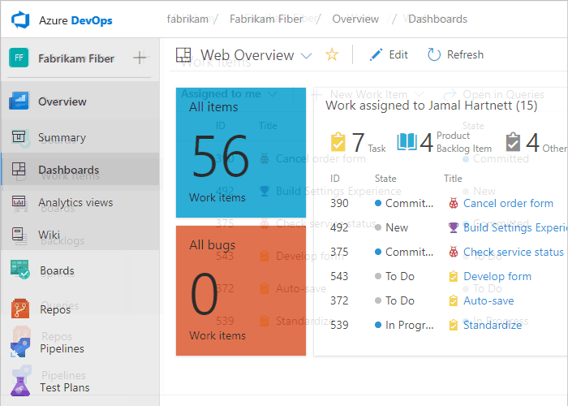

# Navigation basics  

[!INCLUDE [temp](../../_shared/version-tfs-2017-through-vsts.md)] 

::: moniker range="vsts"
The web portal for Visual Studio Team Services (VSTS) is organized around a set of services&mdash;such as, **Code**, **Work**, **Build and Release**&mdash;as well as administrative pages and several task-specific features such as the search box. Each service provides you with one or more pages which support a number of features and functional tasks. Within a page, you may then have a choice of options to select a specific artifact or add an artifact.

::: moniker-end

::: moniker range=">= tfs-2015 <= tfs-2018"
The web portal for Team Foundation Server (TFS) is organized around a set of services&mdash;such as, **Dashboard**, **Code**, **Work**, **Build and Release**&mdash;as well as administrative pages and several task-specific features such as the search box. Each service provides you with one or more pages which support a number of features and functional tasks. Within a page, you may then have a choice of options to select a specific artifact or add an artifact. 
::: moniker-end

> [!NOTE]   
> The web portal is one of several clients that can connect to a team project. Different clients support different features and functions. For a list of all clients that support connection to a team project, see [Tools and clients that connect to VSTS and TFS](../../user-guide/tools.md?toc=/vsts/project/navigation/toc.json&bc=/vsts/project/navigation/breadcrumb/toc.json). 

Here's what you need to know to get up and running using the web portal.  

[!INCLUDE [temp](../../_shared/new-navigation.md)] 

# [New navigation](#tab/new-nav)
::: moniker range="vsts"
- [**Switch service or page**](go-to-service-page.md): use to switch to a different service or functional area
- [**Add an artifact or team**](add-artifact-team.md): use to quickly add a work item, Git repo, build or release pipelines, or a new team
- [**Switch to a different project**](work-across-projects.md): use to switch to a different project
- [**Search box**](search-basics.md): use to find code, work items, or wiki content 
- [**Work across projects**](work-across-projects.md): use to quickly open work assigned to you, your active pull requests, or items you've favorited 
- [**Work with favorites**](set-favorites.md): favorite artifacts to support quick navigation   
- [**Breadcrumbs & selectors**](use-breadcrumbs-selectors.md): use to navigate within a service, to open other artifacts or return to a root function
- [**Your profile menu**](../../organizations/settings/set-your-preferences.md?toc=/vsts/project/navigation/toc.json&bc=/vsts/project/navigation/breadcrumb/toc.json): use to set personal preferences, notifications, and enable preview features  
- [**Settings**](../../organizations/settings/index.md): use to add teams, manage security, and configure other project and organization-level resources. 

::: moniker-end
::: moniker range=">= tfs-2017 <= tfs-2018"
[!INCLUDE [temp](../../_shared/new-navigation-not-supported.md)]  
::: moniker-end

# [Previous navigation](#tab/previous-nav)

- [**Switch service or page**](go-to-service-page.md): use to switch to a different service or functional area
- [**Add an artifact or team**](add-artifact-team.md): use to quickly add a work item, Git repo, build or release pipelines, or a new team
- [**Switch to a different project or team**](work-across-projects.md): use to switch to a different project or browse teams 
- [**Search box**](search-basics.md): use to find code, work items, or wiki content 
- [**Work across projects**](work-across-projects.md): use to quickly open work assigned to you, your active pull requests, or items you've favorited 
- [**Work with favorites**](set-favorites.md): favorite artifacts to support quick navigation   
- [**Your profile menu**](../../organizations/settings/set-your-preferences.md?toc=/vsts/project/navigation/toc.json&bc=/vsts/project/navigation/breadcrumb/toc.json): use to set personal preferences, notifications, and enable preview features  
- [**Settings**](../../organizations/settings/index.md): use to add teams, manage security, and configure other project and organization-level resources. 

---

# [New navigation](#tab/new-nav)
::: moniker range="vsts"
In **New navigation**, you select services&mdash;such as **Work**, **Code**, and **Build and Release**&mdash;from the sidebar and pages within those services. 

::: moniker-end
::: moniker range=">= tfs-2017  <= tfs-2018"
[!INCLUDE [temp](../../_shared/new-navigation-not-supported.md)]  
::: moniker-end

# [Previous navigation](#tab/previous-nav)

With the previous navigation enabled, you select a service&mdash;such as **Code**, **Work**, and **Build and Release**&mdash;from the horizontal bar and pages within those services. 

---

Now that you have an understanding of how the user interface is structured, it's time to get started using it. As you can see, there are a lot of features and functionality.  

If all you need is a code repository and bug tracking solution, then start with the [Get started with Git](../../repos/git/gitquickstart.md) and [Manage bugs](../../work/backlogs/manage-bugs.md).  

To start planning and tracking work, see [About Agile tools](../../work/work-items/about-agile-tools.md?context=vsts/default).

## Connect to the web portal, user accounts and licensing  

::: moniker range="vsts"

To connect to the web portal, you need your user account added to a project. This is typically done by the [organization owner](../../organizations/accounts/add-organization-users-from-user-hub.md).

Five account users are free as are Visual Studio subscribers and stakeholders. After that, you need to [pay for more users](../../organizations/billing/buy-basic-access-add-users.md). Find out more about licensing from [VSTS pricing](https://www.visualstudio.com/team-services/pricing/).

Limited access is available to an unlimited number of stakeholders for free. For details, see [Work as a Stakeholder](../../organizations/security/get-started-stakeholder.md). 

::: moniker-end

::: moniker range=">= tfs-2013 <= tfs-2018"

To connect to the web portal, you need your user account added to a project. This is typically done by the [project administrator](../../organizations/security/add-users-team-project.md).

Limited access is available to an unlimited number of stakeholders for free. For details, see [Work as a Stakeholder](../../organizations/security/get-started-stakeholder.md). Most regular contributors must have a TFS client access license (CAL). All Visual Studio subscriptions include a TFS CAL. Find out more about licensing from [TFS pricing](https://www.visualstudio.com/team-services/tfs-pricing).

::: moniker-end

## Refresh the web portal

If data doesn't appear as expected, the first thing to try is to refresh your web browser. Refreshing your client updates the local cache with changes that were made in another client or the server. To refresh the page or object you're currently viewing, refresh the page or choose the  **Refresh** icon if available.  

[!INCLUDE [temp](../../_shared/when-to-refresh-client.md)]

## Differences between the web portal and Visual Studio  

Although you can access source code, work items, and builds from both clients, some task-specific tools are only supported in the web browser or an IDE, but not in both.

<table width="100%">
<thead>
<tr>
<th width="50%">
Web portal
</th>
<th width="50%">
Visual Studio
</th>
</tr>
</thead>
<tbody valign="top">
<tr>
<td><ul>
<li>
[Product backlog](../../work/backlogs/create-your-backlog.md), [Portfolio backlogs](../../work/kanban/kanban-epics-features-stories.md), [Sprint backlogs](../../work/scrum/assign-work-sprint.md), [Task boards](../../work/scrum/task-board.md), [Capacity planning](../../work/scrum/set-capacity.md) 
</li>
<li>
[Kanban board](../../work/kanban/kanban-basics.md)
</li>
<li>
[Dashboards](../../report/dashboards/dashboards.md), [Widgets](../../report/dashboards/widget-catalog.md), and [Charts](../../report/dashboards/charts.md)
</li>
<li>
[Team rooms](../../notifications/collaborate-in-a-team-room.md)
</li>
<li>
[Request feedback](../feedback/get-feedback.md)
</li>
<li>
Web-based Test Management
</li>
<li>
Administration pages to administer accounts, team projects, and teams
</li>
</ul></td>
<td><ul>
<li>
Task specific interfaces that integrate with Git and TFVC, such as:

<ul>
<li>
<b>Git: </b> [Changes](../../repos/git/commits.md#stage-your-changes-and-commit) |  [Branches](../../repos/git/branches.md) | [Pull Requests](../../repos/git/pullrequest.md) | [Sync](../../repos/git/pulling.md) | [Work Items](../../work/backlogs/add-work-items.md) | [Builds](https://msdn.microsoft.com/library/ms181721.aspx) 
</li>
<li>
<b>TFVC: </b> [My Work](../../repos/tfvc/develop-code-manage-pending-changes.md#use-the-my-work-page-to-manage-your-work) | [Pending Changes](../../repos/tfvc/develop-code-manage-pending-changes.md#use-the-pending-changes-page-to-manage-your-work) | [Source Control Explorer](../../repos/tfvc/develop-code-manage-pending-changes.md#use-solution-explorer-or-source-control-explorer-to-view-what-you-changed)  | [Work Items](../../work/backlogs/add-work-items.md) | [Builds](https://msdn.microsoft.com/library/ms181721.aspx) 
</li>
</ul>
</li>
<li>
Greater integration with work items and Office-integration clients. You can open a work item or query result in an office supported client.
</li>
<li>
Additional text formatting options for rich-text fields in work item forms.
</li>
</ul></td>
</tr>
</tbody>
</table>

## Resources  

- [Project Management](../../organizations/projects/index.md) 
- [Project & Organizational Settings](../../organizations/settings/index.md) 

<!---

- **Help**: use to quickly access the most relevant topics for the page you're on. 

-->