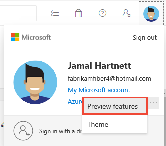
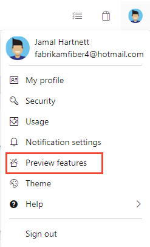
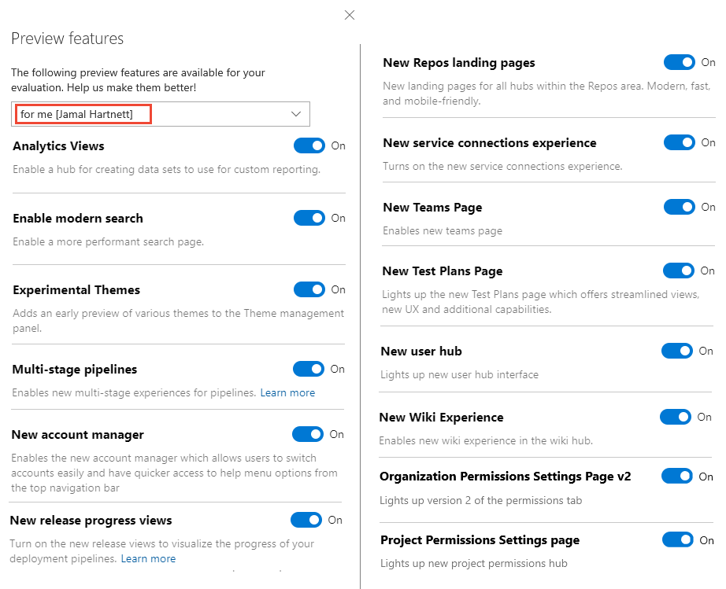
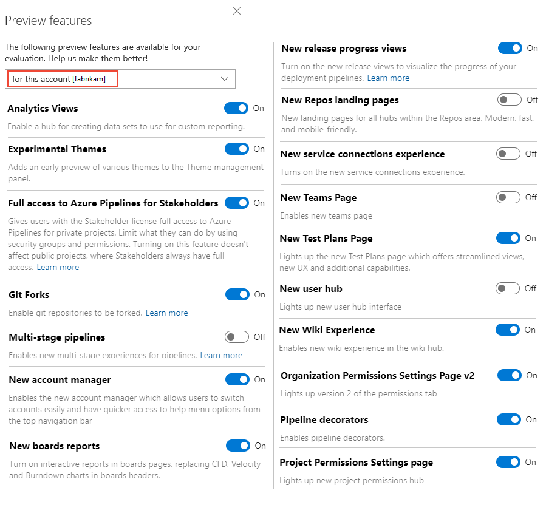

# Enable preview features 

[!INCLUDE [temp](../../_shared/version-vsts-only.md)] 

As new features are introduced, you can turn them on or off. That way, you can try them out, provide feedback, and work with those features that meet your requirements.  

Some features provide a new user interface and functionality, which can be managed per user or team member. Others support a default experience for the account and are managed by an account administrator. 
 
> [!NOTE]   
> You can turn on or off select features for Azure DevOps Services. Preview features become available first on Azure DevOps Services and then become standard features with an update to Azure DevOps Server. At some point, the preview feature moves out of preview status and becomes a regular feature of the web portal.  

Some preview features provide access to entire new functionality. Others reflect a change to the user interface, but little or no change in functionality. 
 
<table valign="top">
<tbody valign="top">
<tr>
<th>Preview features per user</th>
<th>Preview features per organization</th>
</tr>
<tr>
<td width="50%"> 
<ul>
<li><a href="../../report/powerbi/what-are-analytics-views.md">Analytics Views</a></li>
<li>Enable modern search</li>
<li>Experimental themes</li>
<li><a href="../../pipelines/process/stages.md">Multi-stage pipelines</a></li>
<li>New account manager</li>
<li><a href="/azure/devops/release-notes/2019/sprint-155-update#get-insights-into-your-teams-health-with-three-new-azure-boards-reports">New Boards reports</a></li>
<li><a href="/azure/devops/release-notes/2018/may-30-vsts#visualize-release-progress">New release progress views</a></li>
<li><a href="/azure/devops/release-notes/2019/sprint-159-update#new-web-ui-for-azure-repos-landing-pages-preview">New Repos landing pages</a></li>
<li><a href="#account-manager">New account manager</li>
<li><a href="../../organizations/settings/add-teams.md">New Teams page</a></li>
<li><a href="../../test/new-test-plans-page.md">New Test Plans Page</a></li>
<li><a href="../../organizations/accounts/add-organization-users.md">New user hub</a></li>
<li>New Wiki experience</li>
<li><a href="../../organizations/security/set-project-collection-level-permissions.md#collection-level">Organization Permissions Settings Page v2</a></li>
<li><a href="../../organizations/security/set-project-collection-level-permissions.md#project-level">Project Permissions Settings page</a></li>
</ul>
</td>
<td width="50%"> 
<ul>
<li><a href="../../report/powerbi/what-are-analytics-views.md">Analytics Views</a></li>
<li>Experimental themes</li>
<li><a href="../../organizations/security/provide-stakeholder-pipeline-access.md">Full Access to Azure Pipelines for Stakeholders</a></li>
<li><a href="../../repos/git/forks.md">Git Forks</a></li>
<li><a href="../../pipelines/process/stages.md">Multi-stage pipelines</a></li>
<li><a href="#account-manager">New account manager</li>
<li><a href="/azure/devops/release-notes/2019/sprint-155-update#get-insights-into-your-teams-health-with-three-new-azure-boards-reports">New Boards reports</a></li>
<li><a href="/azure/devops/release-notes/2018/may-30-vsts#visualize-release-progress">New release progress views</a></li>
<li><a href="/azure/devops/release-notes/2019/sprint-159-update#new-web-ui-for-azure-repos-landing-pages-preview">New Repos landing pages</a></li>
<li>New service connections experience</li>
<li><a href="../../organizations/settings/add-teams.md">New Teams page</a></li>
<li><a href="../../test/new-test-plans-page.md">New Test Plans Page</a></li>
<li><a href="../../organizations/accounts/add-organization-users.md">New user hub</a></li>
<li>New Wiki experience</li>
<li><a href="../../organizations/security/set-project-collection-level-permissions.md#collection-level">Organization Permissions Settings Page v2</a></li>
<li><a href="../../extend/develop/add-pipeline-decorator.md">Pipeline decorators</a></li>
<li><a href="../../organizations/security/set-project-collection-level-permissions.md#project-level">Project Permissions Settings page</a></li>
</ul>
</td>
</tr>
</tbody>
</table>

## Enable features for your use  

From time to time, a new feature is introduced in Preview mode, which allows you to turn it on or off. 

<a id="account-manager" />

1. To access the Preview features options, open your profile menu, choose the  actions icon, and choose **Preview features**. The profile menu appears as shown below based on whether the **New Account Manager** feature has been enabled or not.  

	#### New Account Manager enabled
	> [!div class="mx-imgBorder"]  
	> 

	Choose **Azure DevOps profile** to access your personal Azure DevOps settings, notifications, usage, and security settings.  

	#### New Account Manager not enabled
	> [!div class="mx-imgBorder"]  
	> 

1. To enable or disable a feature, choose the slider. 

	> [!div class="mx-imgBorder"]  
	>  

## Enable features at the organization level (for all users)  

When you enable a feature at the organization level, you essentially turn it on for all users of your account. Each user can then disable the feature if they so choose.

> [!TIP]  
> If you don't see the **for this account** menu option, then you aren't an account administrator. To get added as one, see [Add administrators, set permissions at the team project or collection level](../../organizations/security/set-project-collection-level-permissions.md).  

> [!div class="mx-imgBorder"]  
> 

## Features now enabled for all Azure DevOps Services 

### General

- [New PAT experience](/azure/devops/release-notes/2018/sprint-140-update#manage-your-personal-access-tokens-with-filtering-and-paging)  
- [New Navigation](https://devblogs.microsoft.com/devops/new-navigation/)

### Azure Pipelines

- [Test tab in new web platform](../../pipelines/test/review-continuous-test-results-after-build.md)
- [Test analytics in new web platform](../../pipelines/test/test-analytics.md)  
- [New builds hub](/azure/devops/release-notes/2018/sep-10-azure-devops-launch#manage-build-pipelines-using-the-new-builds-page)
- [Build with multiple queues](https://github.com/Microsoft/vsts-agent/blob/master/docs/preview/yamlgettingstarted.md)  
- [New Releases Hub](/azure/devops/release-notes/2018/jun-19-vsts#organize-your-release-definitions-in-folders) 
- [Approval gates in releases](../../pipelines/release/approvals/index.md) - [New Release Definition Editor](../../pipelines/release/define-multistage-release-process.md)  
- [Symbol server](../../pipelines/artifacts/symbols.md)  
- [Task tool installers](../../pipelines/process/tasks.md#tool-installers)  

### Azure Boards 

- [New Rich Text Editor](../../boards/queries/share-plans.md#rich-text)- [New Queries Experience](../../boards/queries/view-run-query.md)   
- [New Work Items](../../boards/work-items/view-add-work-items.md)   

### Azure Repos

- [Pull Request Status Policy](../../repos/git/pr-status-policy.md) 

### Azure Artifacts 

- [NuGet.org upstream sources](../../artifacts/nuget/upstream-sources.md) 
- [Updated package experience](../../artifacts/index.yml) 

### Azure Test Plans

- [New Test Plan Experience](/azure/devops/release-notes/2018/jun-19-vsts#test-1)  

### Dashboards and Analytics 

- [Analytics Views](../../report/powerbi/what-are-analytics-views.md)
- [New Dashboards Experience](../../report/dashboards/dashboards.md)  

### Social tools 

- [Wiki](../wiki/add-edit-wiki.md)  
- [Combine email recipients](../../notifications/howto-manage-team-notifications.md) 
- [New experience in Code, Work Item, & Wiki search](/azure/devops/release-notes/2017/oct-06-vsts#code)  
- [Out of the box notifications](../../notifications/howto-manage-personal-notifications.md)   
- [Team expansion for notifications](../../notifications/howto-manage-team-notifications.md)

### Organization, project, and billing management
- [Streamlined User Management](../../accounts/add-account-users-assign-access-levels.md)   

