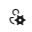
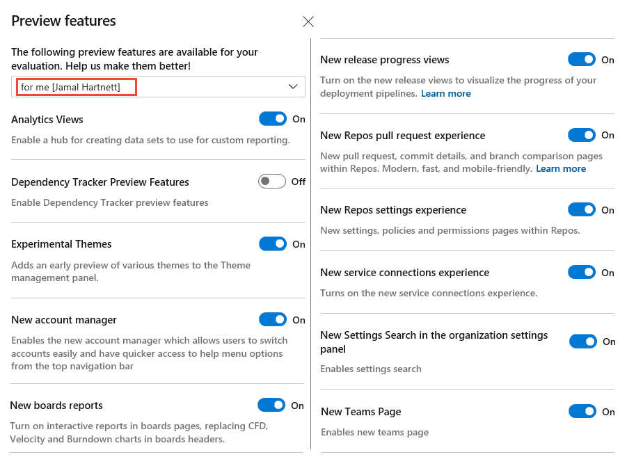
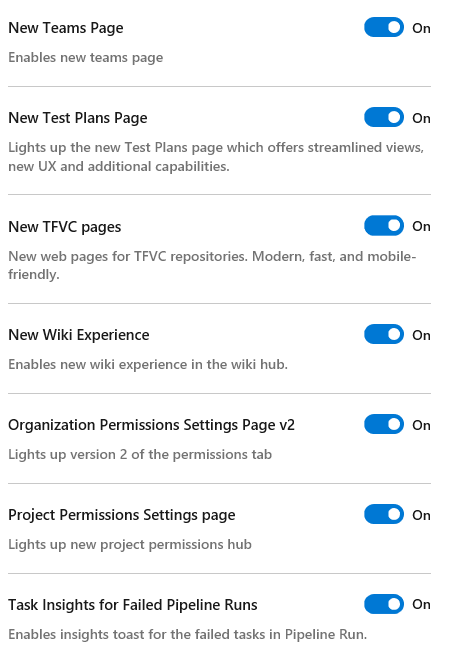
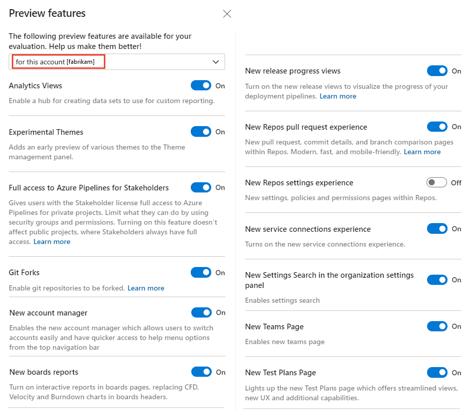
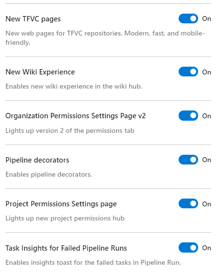

# Enable preview features 

[!INCLUDE [temp](../../includes/version-vsts-only.md)] 

As new features are introduced, you can turn them on or off. That way, you can try them out, provide feedback, and work with those features that meet your requirements.  

Some features provide a new user interface and functionality, which can be managed per user or team member. Others support a default experience for the account and are managed by an account administrator. 
 
> [!NOTE]   
> You can turn on or off select features for Azure DevOps Services. Preview features become available first on Azure DevOps Services and then become standard features with an update to Azure DevOps Server. At some point, the preview feature moves out of preview status and becomes a regular feature of the web portal.  

Some preview features provide access to entire new functionality. Others, such as the New TFVC Page and New Wiki experience, reflect a change to the user interface, but little or no change in functionality. 

---
:::row:::
   :::column span="2":::
      **Preview features**
   :::column-end:::
   :::column span="1":::
      **Per user**
   :::column-end:::
   :::column span="1":::
      **Per organization**
   :::column-end:::
:::row-end:::
---
:::row:::
   :::column span="2":::
      [Analytics Views](../../report/powerbi/what-are-analytics-views.md)  
      [Experimental themes](#experimental-themes)  
      [Full Access to Azure Pipelines for Stakeholders](../../organizations/security/provide-stakeholder-pipeline-access.md)  
      [Git Forks](../../repos/git/forks.md)  
      [New account manager](#account-manager)  
   :::column-end:::
   :::column span="1":::
       :::image type="icon" source="../../media/icons/checkmark.png" border="false":::   
       :::image type="icon" source="../../media/icons/checkmark.png" border="false":::   
      &nbsp;  
      &nbsp;  
       :::image type="icon" source="../../media/icons/checkmark.png" border="false":::   
   :::column-end:::
   :::column span="1":::
       :::image type="icon" source="../../media/icons/checkmark.png" border="false":::   
       :::image type="icon" source="../../media/icons/checkmark.png" border="false":::   
       :::image type="icon" source="../../media/icons/checkmark.png" border="false":::   
       :::image type="icon" source="../../media/icons/checkmark.png" border="false":::   
       :::image type="icon" source="../../media/icons/checkmark.png" border="false":::   
   :::column-end:::
:::row-end:::
:::row:::
   :::column span="2":::
      [New boards reports](../../report/dashboards/overview.md#in-context-reports-work-tracking)  
      [New release progress views](/azure/devops/release-notes/2018/may-30-vsts#visualize-release-progress)  
      [New Repos pull request experience](https://devblogs.microsoft.com/devops/introducing-the-new-pull-request-experience-for-azure-repos/)  
      [New Repos settings experience](/azure/devops/release-notes/2020/sprint-168-update#new-web-platform-conversion--repository-settings)  
      [New service connections experience](../../pipelines/library/service-endpoints.md)  
   :::column-end:::
   :::column span="1":::
       :::image type="icon" source="../../media/icons/checkmark.png" border="false":::   
       :::image type="icon" source="../../media/icons/checkmark.png" border="false":::   
       :::image type="icon" source="../../media/icons/checkmark.png" border="false":::   
       :::image type="icon" source="../../media/icons/checkmark.png" border="false":::   
       :::image type="icon" source="../../media/icons/checkmark.png" border="false":::  
   :::column-end:::
   :::column span="1":::
       :::image type="icon" source="../../media/icons/checkmark.png" border="false":::   
       :::image type="icon" source="../../media/icons/checkmark.png" border="false":::   
       :::image type="icon" source="../../media/icons/checkmark.png" border="false":::   
       :::image type="icon" source="../../media/icons/checkmark.png" border="false":::   
       :::image type="icon" source="../../media/icons/checkmark.png" border="false":::   
   :::column-end:::
:::row-end:::
:::row:::
   :::column span="2":::
      [New Settings Search in the organization settings panel](#search-org-settings)  
      [New Teams page](../../organizations/settings/add-teams.md)  
      [New Test Plans Page](../../test/new-test-plans-page.md)  
      New TFVC Page  
      New Wiki experience  
   :::column-end:::
   :::column span="1":::
       :::image type="icon" source="../../media/icons/checkmark.png" border="false":::   
      &nbsp;  
       :::image type="icon" source="../../media/icons/checkmark.png" border="false":::   
       :::image type="icon" source="../../media/icons/checkmark.png" border="false":::   
       :::image type="icon" source="../../media/icons/checkmark.png" border="false":::   
       :::image type="icon" source="../../media/icons/checkmark.png" border="false":::  
   :::column-end:::
   :::column span="1":::
       :::image type="icon" source="../../media/icons/checkmark.png" border="false":::   
      &nbsp;  
       :::image type="icon" source="../../media/icons/checkmark.png" border="false":::   
       :::image type="icon" source="../../media/icons/checkmark.png" border="false":::   
       :::image type="icon" source="../../media/icons/checkmark.png" border="false":::   
       :::image type="icon" source="../../media/icons/checkmark.png" border="false":::   
   :::column-end:::
:::row-end:::
:::row:::
   :::column span="2":::
      [Organization Permissions Settings Page v2](../../organizations/security/set-project-collection-level-permissions.md#collection-level)  
      [Pipeline decorators](../../extend/develop/add-pipeline-decorator.md)  
      [Project Permissions Settings page](../../organizations/security/set-project-collection-level-permissions.md#project-level)  
      Task Insights for Failed Pipeline Runs 
   :::column-end:::
   :::column span="1":::
       :::image type="icon" source="../../media/icons/checkmark.png" border="false":::   
      &nbsp;  
       :::image type="icon" source="../../media/icons/checkmark.png" border="false":::   
       :::image type="icon" source="../../media/icons/checkmark.png" border="false":::   
   :::column-end:::
   :::column span="1":::
       :::image type="icon" source="../../media/icons/checkmark.png" border="false":::   
       :::image type="icon" source="../../media/icons/checkmark.png" border="false":::   
       :::image type="icon" source="../../media/icons/checkmark.png" border="false":::   
       :::image type="icon" source="../../media/icons/checkmark.png" border="false":::   
   :::column-end:::
:::row-end:::
---

## Enable features for your use  

From time to time, a new feature is introduced in Preview mode, which allows you to turn it on or off. 

<a id="account-manager" />

To access the Preview features options, open your profile menu. The profile menu appears as shown below based on whether the **New Account Manager** feature has been enabled or not.  

#### [New Account Manager enabled](#tab/new-account-enabled)

Choose the  profile icon, and then choose **Preview features**. 

> [!div class="mx-imgBorder"]  
>    

#### [New Account Manager not enabled](#tab/new-account-not-enabled)

Choose your profile menu and then choose **Preview features**. 

> [!div class="mx-imgBorder"]  
> 

---

To enable or disable a feature, choose the slider. 

> [!div class="mx-imgBorder"]  
>  

> [!div class="mx-imgBorder"]  
>  

For information on other user settings and preferences, see [Set user preferences](../../organizations/settings/set-your-preferences.md).

## Enable features at the organization level (for all users)  

When you enable a feature at the organization level, you essentially turn it on for all users of your account. Each user can then disable the feature if they so choose. If you disable a feature at the organization level, user settings are not changed. Users can enable or disable the feature on their own. 

> [!TIP]  
> If you don't see the **for this account** menu option, then you aren't an account administrator. To get added as one, see [Add administrators, set permissions at the team project or collection level](../../organizations/security/set-project-collection-level-permissions.md).  

> [!div class="mx-imgBorder"]  
> 

> [!div class="mx-imgBorder"]  
> 

## Experimental themes  

When you select **Theme** from the Profile menu you can select between **Dark** and **Light** themes for the display of Azure DevOps web portal. 

> [!div class="mx-imgBorder"]  
> 

With **Experimental themes** enabled, you can select among a number of additional themes. 

> [!div class="mx-imgBorder"]  
> 

## New Settings Search in the organization settings panel 

When enabled, you can enter keywords to search all settings within the Organization Settings hub. 

> [!div class="mx-imgBorder"]  
> 

## Features now enabled for all Azure DevOps Services 

### General

- [New user hub](../../organizations/accounts/add-organization-users.md)  
- [New PAT experience](/azure/devops/release-notes/2018/sprint-140-update#manage-your-personal-access-tokens-with-filtering-and-paging)  
- [New Navigation](https://devblogs.microsoft.com/devops/new-navigation/)

### Azure Pipelines

- [Multi-stage pipelines](../../report/powerbi/../../pipelines/process/stages.md)  
- [Test tab in new web platform](../../pipelines/test/review-continuous-test-results-after-build.md)
- [Test analytics in new web platform](../../pipelines/test/test-analytics.md)  
- [New builds hub](/azure/devops/release-notes/2018/sep-10-azure-devops-launch#manage-build-pipelines-using-the-new-builds-page)
- [Build with multiple queues](https://github.com/Microsoft/vsts-agent/blob/master/docs/preview/yamlgettingstarted.md)  
- [New Releases Hub](/azure/devops/release-notes/2018/jun-19-vsts#organize-your-release-definitions-in-folders) 
- [Approval gates in releases](../../pipelines/release/approvals/index.md) - [New Release Definition Editor](../../pipelines/release/define-multistage-release-process.md)  
- [Symbol server](../../pipelines/artifacts/symbols.md)  
- [Task tool installers](../../pipelines/process/tasks.md#tool-installers)  

### Azure Boards 

- [New Rich Text Editor](../../boards/queries/share-plans.md#rich-text)- [New Queries Experience](../../boards/queries/view-run-query.md)   
- [New Work Items](../../boards/work-items/view-add-work-items.md)   

### Azure Repos

- [New Repos landing pages](/azure/devops/release-notes/2019/sprint-159-update#new-web-ui-for-azure-repos-landing-pages-preview)  
- [Pull Request Status Policy](../../repos/git/pr-status-policy.md) 

### Azure Artifacts 

- [NuGet.org upstream sources](../../artifacts/nuget/upstream-sources.md) 
- [Updated package experience](../../artifacts/index.yml) 

### Azure Test Plans

- [New Test Plan Experience](/azure/devops/release-notes/2018/jun-19-vsts#test-1)  

### Dashboards and Analytics 

- [Analytics Views](../../report/powerbi/what-are-analytics-views.md)
- [New Dashboards Experience](../../report/dashboards/dashboards.md)  

### Social tools 

- [Wiki](../wiki/add-edit-wiki.md)  
- [Combine email recipients](../../notifications/howto-manage-team-notifications.md) 
- [New experience in Code, Work Item, & Wiki search](/azure/devops/release-notes/2017/oct-06-vsts#code)  
- [Out of the box notifications](../../notifications/howto-manage-personal-notifications.md)   
- [Team expansion for notifications](../../notifications/howto-manage-team-notifications.md)

### Organization, project, and billing management
- [Streamlined User Management](../../accounts/add-account-users-assign-access-levels.md)   

## Related articles

- [Set user preferences](../../organizations/settings/set-your-preferences.md)
- [Azure DevOps Feature Timeline](/azure/devops/release-notes/features-timeline) 

