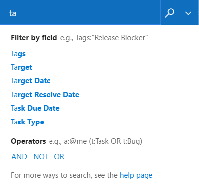

# Search across your code base, work items, or wiki

[!INCLUDE [temp](../../_shared/version-ts-tfs-2015-2016.md)]

::: moniker range=">= tfs-2018"  
With the search box, you can quickly find a code file, work item, or wiki page. 
::: moniker-end  

::: moniker range="tfs-2017"  
With the search box, you can quickly find a code file or work item.  
::: moniker-end  

## Initiate a code search 

[!INCLUDE [temp](../../_shared/navigation.md)] 

# [New navigation](#tab/new-nav)
::: moniker range="vsts"  
To start your search, choose **Code>Files** or other page under **Code**, enter a keyword or phrase in the search box, and press *Enter* or choose the  start search icon. 

> [!div class="mx-imgBorder"]
>  
::: moniker-end  

::: moniker range=">= tfs-2017  <= tfs-2018"  
[!INCLUDE [temp](../../_shared/new-navigation-not-supported.md)]  
::: moniker-end  

# [Previous navigation](#tab/previous-nav)  

0. In the search box, check that the text displays _Search code_. If it doesn't, use the selector to select it.

   

0. Enter a search string in the text box, and press _Enter_ (or choose the 
    icon) to start your search.

---

### Work with code search results  

1. The search page shows a list of the matching code files. The selected file has all
   instances of the search string highlighted. If you see a list of work items, ensure that **Code** is selected in the top left.

	> [!div class="mx-imgBorder"]  
	>  

1. Try assembling more complex search strings using the operators and functions listed in the handy 
   drop-down list. Select the filter function or code type you want to include in your search string from the
   list, and type the criteria value.

	> [!div class="mx-imgBorder"]  
	>      

   * You can find all instances of "ToDo" comments in your code simply by selecting `comment:` and typing `todo`. 

   * You can search in specific locations, such as within a particular path, by using a search string such as `Driver path:MyShuttle/Server`. 

   * You can search for files by name, such as `Driver file:GreenCabs.cs`, or just by file extension. For example, the search string 
    `error ext:resx` could be useful when you want to review all error strings in your code. 
    But even if your plain text search string (without specific file type functions) 
    matches part of a filename, the file appears in the list of found files.

   * You can combine two or more words by using Boolean operators; for example, `validate OR release`.

   * You can find an exact match to a set of words by enclosing your search terms in double-quotes. For example, `"Client not found"`. 

   * You can use the code type search functions with files written in C#, C, C++, Java, and Visual Basic.NET.

To learn more, see [Search code](../search/code-search.md).

## Initiate a work item search 

# [New navigation](#tab/new-nav)

::: moniker range="vsts"  

0. Choose any **Work** page, enter a keyword or phrase in the search box, and press *Enter* or choose the  start search icon. 

	> [!div class="mx-imgBorder"]
	>     

0. Search results are displayed in a snippet view where the matches found are shown in bold.

   

   This is a full text search that uses simple search strings for words or phrases.
   Work item search matches derived forms of your search terms; for example, a search for
   "updating" will also find instances of the word "updated" and "update". Note that searches are _not_ case-sensitive.

0. Select a snippet of a work item to display it in the right window. 
  
   Open the search results in a new browser tab from a search box by
   pressing _Ctrl_ + _Enter_ or by holding _Ctrl_ and clicking  the
    icon.
   In Google Chrome, press _Ctrl_ + _Shift_ + _Enter_ to switch the focus
   to the new browser tab. 

::: moniker-end

::: moniker range=">= tfs-2017  <= tfs-2018"  
[!INCLUDE [temp](../../_shared/new-navigation-not-supported.md)]  
::: moniker-end  

# [Previous navigation](#tab/previous-nav)  

1. In the search box, check that the text says _Search work items_. If it doesn't, use the selector to select it.

      

1. Enter a search string in the text box, and press _Enter_ (or choose the 
    icon) to start your search. 

1. Search results are displayed in a snippet view where the matches found are shown in bold.

   

   This is a full text search that uses simple search strings for words or phrases.
   Work item search matches derived forms of your search terms; for example, a search for
   "updating" will also find instances of the word "updated" and "update". Note that searches are _not_ case-sensitive.

1. Select a snippet of a work item to display it in the right window. 
  
   Open the search results in a new browser tab from a search box by
   pressing _Ctrl_ + _Enter_ or by holding _Ctrl_ and clicking  the
    icon.
   In Google Chrome, press _Ctrl_ + _Shift_ + _Enter_ to switch the focus
   to the new browser tab. 

---

### Fine tune your work item search results 

# [New navigation](#tab/new-nav)

1. Fine tune your search by specifying the fields to search. Enter `a:` and a user name
   to search for all items assigned to that user.

	> [!div class="mx-imgBorder"]  
	>     

   The quick filters you can use are:

   * `a:` for **Assigned to:** 
   * `c:` for **Created by:** 
   * `s:` for **State** 
   * `t:` for **Work item type**

 
1. Start typing the name of a field in your work items; for example, type `ta`.

       

   The dropdown list shows work item field name suggestions 
   that match user input thereby helping the user to complete the search faster. For example, a search such as 
   **tags:Critical** finds all work items tagged 'Critical'. 

1. Add more filters to further narrow your search, and use Boolean operators
   to combine terms if required. For example, 
   **a: Chris t: Bug s: Active** finds all active bugs assigned
   to a user named Chris.

1. Narrow your search to specific types
   and states, by using the drop-down selector lists at the top of the results page.

# [Previous navigation](#tab/previous-nav)  

1. Fine tune your search by specifying the fields to search. Enter `a:` and a user name
   to search for all items assigned to that user.

	> [!div class="mx-imgBorder"]  
	>     

   The quick filters you can use are:

   * `a:` for **Assigned to:** 
   * `c:` for **Created by:** 
   * `s:` for **State** 
   * `t:` for **Work item type**

 
1. Start typing the name of a field in your work items; for example, type `ta`.

       

   The dropdown list shows work item field name suggestions 
   that match user input thereby helping the user to complete the search faster. For example, a search such as 
   **tags:Critical** finds all work items tagged 'Critical'. 

1. Add more filters to further narrow your search, and use Boolean operators
   to combine terms if required. For example, 
   **a: Chris t: Bug s: Active** finds all active bugs assigned
   to a user named Chris.

1. Narrow your search to specific types
   and states, by using the drop-down selector lists at the top of the results page.

---

To learn more, see [Search work items](../search/work-item-search.md)

::: moniker range=">=tfs-2018"
## Initiate a wiki content search 

With wiki search, you can search within a project wiki or across all wikis created for the organization. Simply select the **Search wiki** option from the search box and type a keyword or phrase within the search box. 
::: moniker-end

::: moniker range="tfs-2018"
> [!NOTE]  
> Wiki search is supported on TFS 2018.2 or later versions. To download TFS 2018.2, see [Team Foundation Server 2018 Update 2 Release Notes](https://docs.microsoft.com/en-us/visualstudio/releasenotes/tfs2018-update2). 
::: moniker-end

# [New navigation](#tab/new-nav)
::: moniker range="vsts"  

> [!div class="mx-imgBorder"]  
>    

The search feature quickly returns wiki pages by title or page content. English language stemming support helps you find the most relevant wiki pages. For example, when you enter *request* in the search box, wiki search will return page results containing related words such as *requesting, requested, requests,* and so on.

> [!div class="mx-imgBorder"]  
>    
> 
::: moniker-end  

::: moniker range=">= tfs-2017  <= tfs-2018"  
[!INCLUDE [temp](../../_shared/new-navigation-not-supported.md)]  
::: moniker-end  

# [Previous navigation](#tab/previous-nav)  

::: moniker range=">= tfs-2018"  

> [!div class="mx-imgBorder"]  
>    

The search feature quickly returns wiki pages by title or page content. English language stemming support helps you find the most relevant wiki pages. For example, when you enter *request* in the search box, wiki search will return page results containing related words such as *requesting, requested, requests,* and so on.

> [!div class="mx-imgBorder"]  
> 

::: moniker-end

---

## Related articles

- [Search code](../search/code-search.md)
- [Search work items](../search/work-item-search.md)
- [Create a wiki for your project](../wiki/wiki-create-repo.md)

