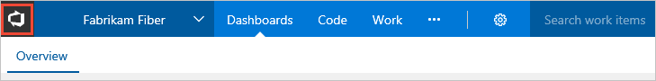
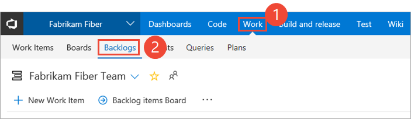
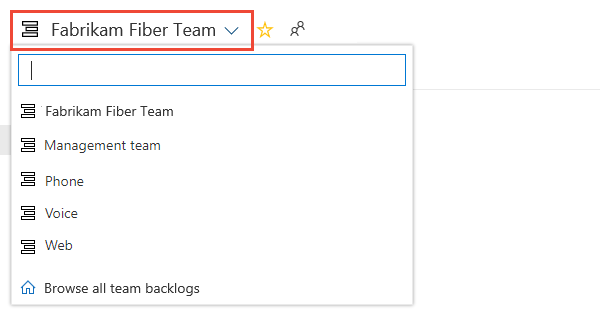
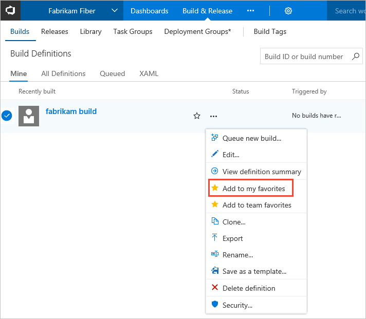

# Work with personal or team favorites    

**VSTS | TFS 2018 | TFS 2017.1**  

<!--- Multiple version topic; need to update with latest screenshots-->  

By favoriting an artifact or view, you can quickly access it. As your code base, work tracking efforts, developer operations, and organization grows, you'll want to be able to quickly navigate to those object of interest to you and your team. Setting favorites allows you to do just that.  

You can set favorites for yourself or your team. You favorite an item for yourself by clicking the  star icon. The favorited item will then show up easily from one or more directory lists.  

You can set favorites for the following objects from the indicated hub or tab. 

::: moniker range="vsts"

> [!div class="mx-tdCol2BreakAll"]        
> |Service area |     Artifacts        | Hub/tab |
> |---------------|---------|---------| 
> | Organization & projects | Projects and teams | **Home page>Projects**  (personal favorites only)  |  
> | Dashboard | Team dashboards  | **Dashboards** (requires enabling the [**New Dashboards Experience**](preview-features.md)) | 
> | Code | Repositories | **Code>Branches**  (personal favorites only) | 
> | Work, Agile tools for a team | Backlogs, boards, sprint backlogs, sprint taskboards | **Work>Queries** (requires enabling the [**New Navigation** or **New Navigation**](preview-features.md)) | 
> | Work  | Queries | **Work>Queries** |
> | Work | Delivery plans |  **Work>Plans** (personal favorites only, requires installation of the [Delivery Plans extension](../../work/scale/review-team-plans.md)) | 
> | Build and Release | Pipeline definitions | **Build & Release>Build** or **Release**  | 
> | Test | Test plans | **Test>Test Plans** (personal favorites only) |

::: moniker-end

::: moniker range=">= tfs-2017 <= tfs-2018"

> [!div class="mx-tdCol2BreakAll"]  
> > |Service area |  Artifacts  | Hub/tab |
> |---------------|---------|---------| 
> | Organization & projects | Projects and teams | **Home page>Projects**  (personal favorites only)  |  
> | Code | Repositories | **Code>Branches**  (personal favorites only) | 
> | Work  | Queries | **Work>Queries** |
> | Work | Delivery plans |  **Work>Plans** (personal favorites only, requires installation of the [Delivery Plans extension](../../work/scale/review-team-plans.md)) | 
> | Build and Release | Pipeline definitions | **Build & Release>Build** or **Release**  | 
> | Test | Test plans | **Test>Test Plans** (personal favorites only) |

::: moniker-end

<!---
In this article you'll learn how to:

>[!div class="checklist"]  
> * Favorite a repository, build definition, shared query, delivery plan, or test plan 
> * Favorite a team or project 
> * View your personal favorites  
> * Unfavorite an object 
--> 

## Favorite a team or team project   
 
0. From your web portal, open your home page by choosing the  VSTS icon.

	 

	::: moniker range="tfs-2017"
	> [!NOTE]
	> To view the home page requires TFS 2017.1 or later version. 
	::: moniker-end
0. You'll see something similar to the following welcome page.

	 

0. From the **Projects** page, choose the  star icon next to the team or project you want to favorite.

## View personal favorites   

From your home page, choose **My Favorites** to quickly access any object or item that you've marked as a favorite. 

> [!div class="mx-imgBorder"]  
>    

::: moniker range="vsts"
If, you have enabled the [**New Navigation**](preview-features.md) preview feature, you can access your favorites by choosing the  inbox icon, and then choosing **Favorites**. 

> [!div class="mx-imgBorder"]  
>  
::: moniker-end
::: moniker range="vsts"
## Favorite an Agile tool 

If you have [enabled the **New Navigation** preview features](preview-features.md), you'll be able to favorite several of the Agile tools for a team. 

1. From the **Work** hub, choose the tab of interest, such as **Boards**, **Backlogs**, or **Sprints**.  

	For example, here we choose (1) **Work** and then (2) **Backlogs**.

	> [!div class="mx-imgBorder"]  
	> 

	To choose a specific team backlog, open the selector and select a different team or choose the  **Browse all team backlogs** option. Or, you can enter a keyword in the search box to filter the list of team backlogs for the project.

	> [!div class="mx-imgBorder"]  
	>  

2.  Choose the  star icon to favorite a team backlog. Favorited artifacts ( favorited icon) appear appear on your **Favorites** page and towards the top of the team backlog selector menu.

::: moniker-end

::: moniker range="vsts"
## Favorite a team dashboard 

If you have [enabled the **New Dashboards Experience** preview feature](preview-features.md), you'll be able to favorite a team dashboard. 

1. From the **Dashboards** hub, open the selector and choose the **Browse all dashboards** option. 
 
	> [!div class="mx-imgBorder"]  
	>   

2. The **Mine** page shows your favorited dashboards, and all dashboards of teams that you belong to. The **All** page (shown below) lists all dashboards defined for the project in alphabetical order. You can filter the list by team or by keyword.   
 
	> [!div class="mx-imgBorder"]  
	>   

	> [!TIP]
	> You can change the sort order of the list by choosing the column label.   
	 
3. To favorite a dashboard, hover over the dashboard and choose the .  

	> [!div class="mx-imgBorder"]  
	>   

	Favoriting a dashboard will cause it to appear on your **Favorites** page and towards the top in the **Dashboards** selection menu.
   
::: moniker-end

## Favorite a repository

From your web browser, open the **Code** hub, open the repository menu and choose the  star icon next to the repository you want to favorite. 

 

## Favorite a build pipeline  

From your web browser, open the **Build-Release** hub, **Builds>All Definitions** page.  Choose the  star icon next to the build definition you want to favorite. Or, open the context menu of the build definition you want to favorite, and then select **Add to my favorites** or **Add to team favorites**.  

## Favorite a shared query 

From your web browser, open the **Work** hub, **Queries** tab. From the 

::: moniker range="vsts"
To set a team favorite, open the  actions icon menu and choose **Add to Team Favorites**, and then select from the list of teams. 

> [!div class="mx-imgBorder"]  
>  

Or, to set it as a personal favorite, simply choose the  star icon. You can also set a query as a personal favorite by opening the query and choosing the  star icon.

> [!div class="mx-imgBorder"]  
>  

::: moniker-end

::: moniker range=">= tfs-2017 <= tfs-2018"

Next, open the  actions icon menu of the shared query you want to favorite, and then select **Add to my favorites** or **Add to team favorites**.  

::: moniker-end

## Favorite a Delivery Plan 

To mark a Delivery Plan as a favorite, open the **Work>Plans** page and choose the  star icon next to the Delivery Plan.

## Favorite a test plan    

To mark a test plan as a favorite, open the **Test>Test Plans** page and choose the  star icon next to a test plan from the menu that shows All test plans. 

## Unfavorite an object

You can unfavorite an object from your account hub by going to your account hub **Favorites** page and choose the  favorited icon of a currently favorited object. 

Similarly, you can unfavorite an object from the same page where you favorited it. 

<!---

## Set team favorites 
Team favorites are a quick way for members of your team to quickly access shared resources of interest. You can define team favorites for the following:

- **Code hub/Explorer**: Add repos or folders to team favories  
- **Work hub/Queries**: A  [Shared work item queries](../../work/track/using-queries.md) to team favorites    
- **Build hub/Explorer**: Add build definitions to team favorites   

From your team context, drag shared queries, builds, and folders to Team favorites to provide quick access to those items. Or, choose the Add to team favorites option from the context menu for the item. You must be [added as a team admin](../../work/scale/add-team-administrator.md) to manage team favorites.  

  

-->

## Try this next  

> [!div class="nextstepaction"]
> [Work effectively from the account home page](../../user-guide/account-home-pages.md)
> or
> [Manage personal notifications](../../notifications/manage-personal-notifications.md)
