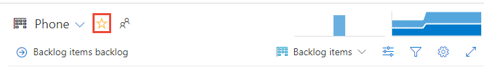
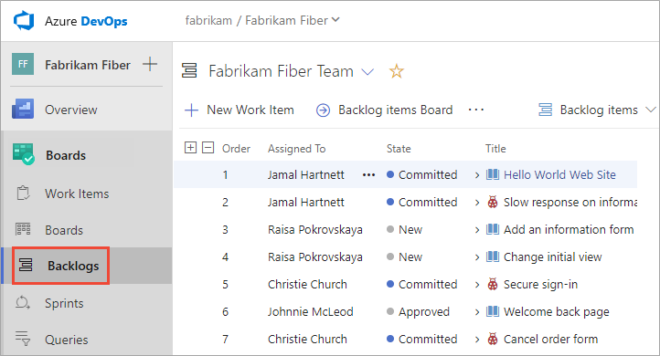
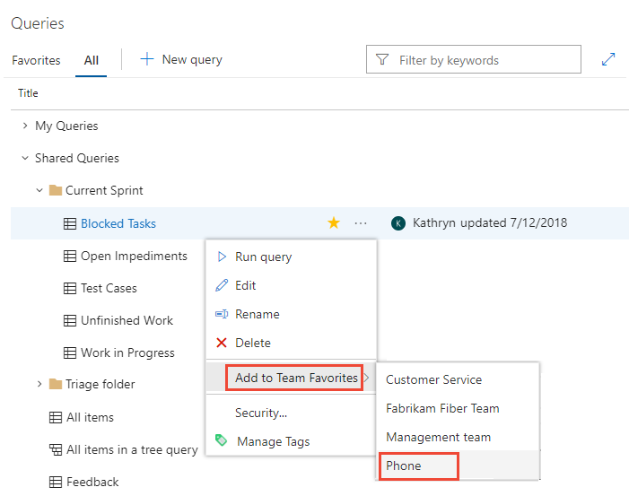
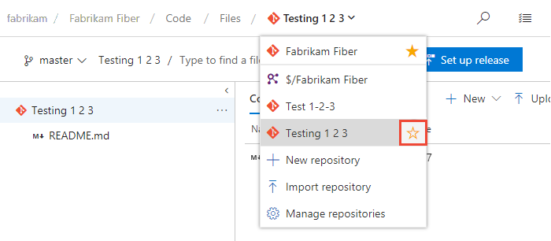
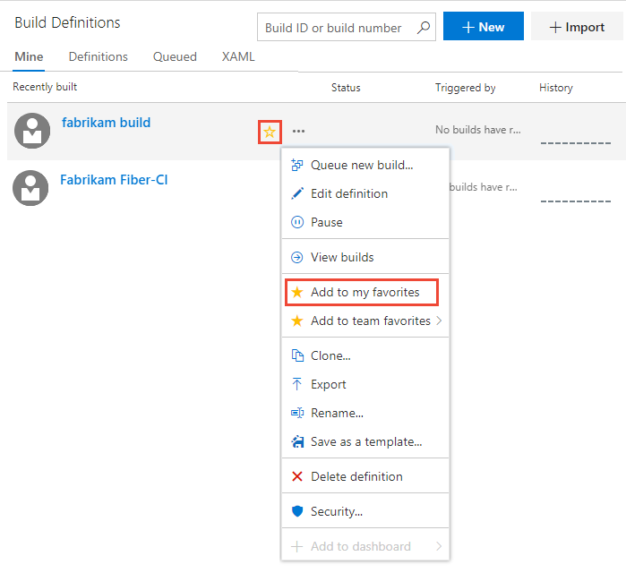

# Set personal or team favorites    

[!INCLUDE [version-lt-eq-azure-devops](../../includes/version-lt-eq-azure-devops.md)]

As your code base, work tracking, developer operations, and organization grow, quickly navigating to important views becomes essential, which setting favorites helps with.

Favorite  the views you frequently access. You can favorite various Azure DevOps features and tools, such as projects, repositories, build pipelines, dashboards, backlogs, boards, or queries. Favorites can be set for yourself or your team.

Team favorites allow members to quickly access shared resources. Favorite an item for yourself by selecting the :::image type="icon" source="../../media/icons/icon-favorite-star.png" border="false"::: star icon. The favorite item appears in one or more directory lists. Set team favorites through the context menu for the definition, view, or artifact.

## Prerequisites

| Category | Requirements |
|--------------|-------------|
| **Permissions** | Member of the **Contributors** group or an administrative security group for the project.  |
| **Access levels** | - To favorite projects, backlogs, boards, queries, dashboards, or pipeline views: At least **Stakeholder** access.   - To favorite repositories or delivery plans: At least **Basic** access.   - To favorite test plans:  **Basic + Test Plans** or equivalent. |

For more information, see [About access levels](../../organizations/security/access-levels.md). 

## View personal favorites   

Access your personal favorites by choosing the :::image type="icon" source="../../media/icons/inbox.png" border="false"::: inbox icon, and then choosing **Favorites**. 

> [!div class="mx-imgBorder"]  
>  

> [!NOTE]  
> If a service is disabled, then you can't favorite an artifact or view of that service. For example, if **Boards** is disabled, then the favorite groups&mdash;Plans, Boards, Backlogs, Analytics views, Sprints, and Queries and all Analytics widgets&mdash;are disabled. To re-enable a service, see [Turn an Azure DevOps service on or off](../../organizations/settings/set-services.md).

## Favorite a project or team  

1. To favorite a project, open the project **Summary** page and choose the  star icon.

	> [!div class="mx-imgBorder"]  
	>   

2. To favorite a team artifact, open **Boards** > **Boards** or **Boards**> **Backlogs**. Select the team you want to favorite from the team selector and choose the :::image type="icon" source="../../media/icons/icon-favorite-star.png" border="false"::: star icon.

	> [!div class="mx-imgBorder"]  
	> 

3. To favorite other team artifacts, choose the :::image type="icon" source="../../media/icons/team.png" border="false"::: team icon, and then choose the :::image type="icon" source="../../media/icons/icon-favorite-star.png" border="false"::: star icon next to one of the listed artifacts. 

	> [!div class="mx-imgBorder"]  
	>  

::: moniker-end

## Favorite a dashboard 

1. From **Overview** > **Dashboards**, open the selector and choose the **Browse all dashboards** option. 
 
	> [!div class="mx-imgBorder"]  
	>   

2. The **Mine** page shows your favorite dashboards, and all dashboards of teams that you belong to. The **All** page lists all dashboards defined for the project in alphabetical order. You can filter the list by team or by keyword.   
 
	> [!div class="mx-imgBorder"]  
	>   

	> [!TIP]
	> You can change the sort order of the list by choosing the column label.  

3. To favorite a dashboard, hover over the dashboard and choose the :::image type="icon" source="../../media/icons/icon-favorite-star.png" border="false"::: star icon.  

	> [!div class="mx-imgBorder"]  
	>   

	Favoriting a dashboard causes it to appear on your **Favorites** page and towards the top in the **Dashboards** selection menu.

## Favorite a team's backlog, board, or other view

You can favorite several Agile tools for a team from a **Boards** page.

1. Choose **Boards**, and then choose the page of interest, such as **Boards**, **Backlogs**, or **Sprints**.  

	For example, here we choose (1) **Work** and then (2) **Backlogs**.

	> [!div class="mx-imgBorder"]  
	>   

	To choose a specific team backlog, open the selector and select a different team or choose the :::image type="icon" source="../../media/icons/home-icon.png" border="false"::: **Browse all team backlogs** option. Or, you can enter a keyword in the search box to filter the list of team backlogs for the project.

	> [!div class="mx-imgBorder"]  
	>  

2.  Choose the :::image type="icon" source="../../media/icons/icon-favorite-star.png" border="false"::: star icon to favorite a team backlog. Favorite artifacts (:::image type="icon" source="../../media/icons/icon-favorited.png" border="false"::: favorite icon) appear on your **Favorites** page and towards the top of the team backlog selector menu.

## Favorite a shared query 

Open **Boards** > **Queries** and choose the **All** page. Expand a folder as needed. Choose the :::image type="icon" source="../../media/icons/icon-favorite-star.png" border="false"::: star icon next to the query you want to favorite. 

Or, open the context menu of the query, and then select **Add to Team Favorites**, and then select from the list of teams. 

> [!NOTE]  
> Be a member of at least one team for the **Add to Team Favorites** option to be visible. If not visible, ask your project administrator or team administrator to add you to a team.

> [!div class="mx-imgBorder"]  
> 

You can also set a query as a personal favorite by opening the query and choosing the :::image type="icon" source="../../media/icons/icon-favorite-star.png" border="false"::: star icon.

> [!div class="mx-imgBorder"]  
>  

## Favorite a delivery plan 

To learn more about delivery plans, see [Review team Delivery Plans](../../boards/plans/review-team-plans.md).

To mark a delivery plan as a favorite, open the **Boards** > **Plans** page and choose the :::image type="icon" source="../../media/icons/icon-favorite-star.png" border="false"::: star icon next to the Delivery Plan. 

## Favorite a repository

From any **Repos** page, open the repository selector and choose the :::image type="icon" source="../../media/icons/icon-favorite-star.png" border="false"::: star icon for the repository you want to favorite.

> [!div class="mx-imgBorder"]  
> 

## Favorite a build pipeline  

Open **Pipelines** > **Builds** and choose either **Mine** or **Definitions**. Choose the :::image type="icon" source="../../media/icons/icon-favorite-star.png" border="false"::: star icon next to the build definition you want to favorite. Or, open the context menu of the build definition, and then select **Add to my favorites** or **Add to team favorites**.  

> [!div class="mx-imgBorder"]  
> 

::: moniker-end

## Favorite a test plan 

To learn more about test plans, see [Create a test plan and test suite](../../test/create-a-test-plan.md).

To mark a test plan as a favorite, open **Test Plans** > **Test Plans** and choose the :::image type="icon" source="../../media/icons/icon-favorite-star.png" border="false"::: star icon next to a test plan from the menu that shows All test plans. 

## Unfavorite a view

You can unfavorite an artifact from your **Favorites** page. Choose the :::image type="icon" source="../../media/icons/inbox.png" border="false"::: inbox icon, and then choose **Favorites**. Choose the :::image type="icon" source="../../media/icons/icon-favorited.png" border="false"::: favorite icon of a favorite artifact. 

> [!div class="mx-imgBorder"]  
>  

Similarly, you can unfavorite an artifact from the same page where you marked it as a favorite. 

## Next steps
> [!div class="nextstepaction"]
> [Follow a user story, bug, issue, or other work item or pull request](../../boards/work-items/follow-work-items.md)

## Related articles

- [Manage personal notifications](../../organizations/notifications/manage-your-personal-notifications.md) 
- [Set your preferences](../../organizations/settings/set-your-preferences.md)
