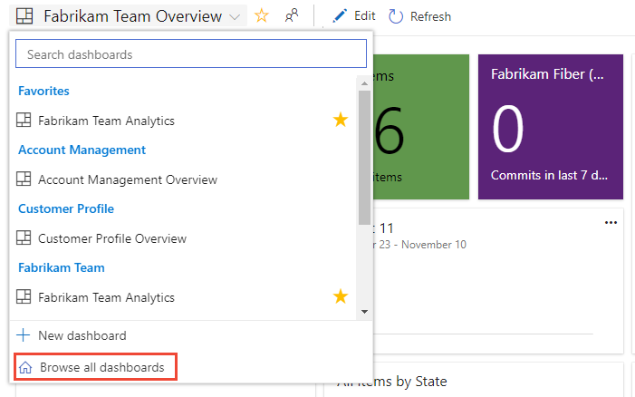
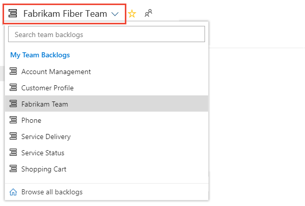

# Tutorial: Set personal or team favorites    

[!INCLUDE [temp](../../_shared/version-tfs-2017-through-vsts.md)]

Favorite  those views that you frequently access. You can favorite all sorts of Azure DevOps features and tools&mdash;such as a project, repository, build pipeline, dashboard, backlog, board, or query. You can set favorites for yourself or your team. 

As your code base, work tracking efforts, developer operations, and organization grows, you'll want to be able to quickly navigate to those view of interest to you and your team. Setting favorites allows you to do just that.  

Team favorites are a quick way for members of your team to quickly access shared resources of interest. You favorite an item for yourself by choosing the  star icon. The favorited item will then show up easily from one or more directory lists. You set favorites for a team through the context menu for the definition, view, or artifact. 

In this tutorial you'll learn how to view your personal favorites and to favorite or unfavorite the following views: 

::: moniker range=">= azure-devops-2019"

> [!div class="checklist"]   
> * Project or team
> * Dashboard
> * Team backlog, board, shared query, or other Azure Boards view
> * Repository
> * Build and release definition   
> * Test plans  

::: moniker-end

::: moniker range=">= tfs-2018 <= tfs-2018"

> [!div class="checklist"]   
> * Project 
> * Shared query 
> * Repository
> * Build and release definition   
> * Test plans  

::: moniker-end

## Prerequisites

::: moniker range="azure-devops"

* You must connect to a project through the web portal. If you don't have a project yet, [create one](/azure/devops/boards/get-started/sign-up-invite-teammates). To connect to the web portal, see [Connect to a project](../../organizations/projects/connect-to-projects.md).
* You must be a member of the **Contributors** or an administrators security group of the project. To get added, [Add users to a project or team](/azure/devops/organizations/security/add-users-team-project). 
* To favorite projects, backlogs, boards, queries, dashboards, or pipeline views, you must have **Stakeholder** access or higher.
* To favorite repositories, or delivery plans, you must have **Basic** access or higher. 
* To favorite test plans, you must have **Basic+Test Plans** access level or equivalent.  

::: moniker-end

::: moniker range="<= azure-devops-2019"

* You must connect to a project through the web portal. If you don't have a project yet, [create one](/azure/devops/organizations/projects/create-project). To connect to the web portal, see [Connect to a project](../../organizations/projects/connect-to-projects.md).
* You must be a member of the **Contributors** or an administrators security group of the project. To get added, [Add users to a project or team](/azure/devops/organizations/security/add-users-team-project). 
* To favorite projects, backlogs, boards, queries, dashboards, or pipeline views, you must have **Stakeholder** access or higher.
* To favorite repositories, or delivery plans, you must have **Basic** access or higher. 
* To favorite test plans, you must have **Basic+Test Plans** access level or equivalent.   

::: moniker-end 

For details about the different access levels, see [About access levels](/azure/devops/organizations/security/access-levels). 

## View personal favorites   

::: moniker range=">= azure-devops-2019"

Access views that you have favorited by choosing the  inbox icon, and then choosing **Favorites**. 

> [!div class="mx-imgBorder"]  
>  

> [!NOTE]  
> If a service is disabled, then you can't favorite an artifact or view of that service. For example, if **Boards** is disabled, then the favorite groups&mdash;Plans, Boards, Backlogs, Analytics views, Sprints, and Queries and all Analytics widgets&mdash;are disabled. To re-enable a service, see [Turn an Azure DevOps service on or off](../../organizations/settings/set-services.md).

::: moniker-end

::: moniker range=">= tfs-2017 <= tfs-2018"

0. Access views that you have favorited by choosing the  Azure DevOps logo to open **Projects**. 

	> [!div class="mx-imgBorder"]  
	>    

0. Choose **My Favorites** to quickly access any view or item that you've marked as a favorite. 

	> [!div class="mx-imgBorder"]  
	>    

::: moniker-end

::: moniker range=">= azure-devops-2019"

## Favorite a project or team  

1. To favorite a project, open the project **Summary** page and choose the  star icon.

	> [!div class="mx-imgBorder"]  
	>   
<a id="team-artifact" />
0. To favorite a team artifact, open **Boards>Boards** or **Boards>Backlogs**. Select the team you want to favorite from the team selector and choose the  star icon.

	> [!div class="mx-imgBorder"]  
	> 

0. To favorite other team artifacts, choose the  team icon, and then choose the  star icon next to one of the listed artifacts. 

	> [!div class="mx-imgBorder"]  
	>  

::: moniker-end

::: moniker range=">= tfs-2017 <= tfs-2018"

## Favorite a project

To favorite a project, open the project **Summary** page and choose the  star icon.

> [!div class="mx-imgBorder"]  
> 

Or, you can favorite a project from the **Projects** page by choosing the  star icon next to the project. 

::: moniker-end

::: moniker range=">= azure-devops-2019"

## Favorite a dashboard 

1. From **Overview>Dashboards**, open the selector and choose the **Browse all dashboards** option. 
 
	> [!div class="mx-imgBorder"]  
	>   

2. The **Mine** page shows your favorited dashboards, and all dashboards of teams that you belong to. The **All** page (shown below) lists all dashboards defined for the project in alphabetical order. You can filter the list by team or by keyword.   
 
	> [!div class="mx-imgBorder"]  
	>   

	> [!TIP]
	> You can change the sort order of the list by choosing the column label.  

3. To favorite a dashboard, hover over the dashboard and choose the  star icon.  

	> [!div class="mx-imgBorder"]  
	>   

	Favoriting a dashboard will cause it to appear on your **Favorites** page and towards the top in the **Dashboards** selection menu.
   
::: moniker-end  

::: moniker range=">= azure-devops-2019"

## Favorite a team's backlog, Kanban board, or other view

You can favorite several Agile tools for a team from a **Boards** page. 
1. Choose **Boards**, and then choose the page of interest, such as **Boards**, **Backlogs**, or **Sprints**.  

	For example, here we choose (1) **Work** and then (2) **Backlogs**.

	> [!div class="mx-imgBorder"]  
	>   

	To choose a specific team backlog, open the selector and select a different team or choose the  **Browse all team backlogs** option. Or, you can enter a keyword in the search box to filter the list of team backlogs for the project.

	> [!div class="mx-imgBorder"]  
	>  

2.  Choose the  star icon to favorite a team backlog. Favorited artifacts ( favorited icon) appear on your **Favorites** page and towards the top of the team backlog selector menu.

::: moniker-end

## Favorite a shared query 

::: moniker range=">= azure-devops-2019"

Open **Boards>Queries** and choose the **All** page. Expand a folder as needed. Choose the  star icon next to the query you want to favorite. 

Or, open the context menu of the query, and then select **Add to Team Favorites**, and then select from the list of teams. 

> [!div class="mx-imgBorder"]  
> 

You can also set a query as a personal favorite by opening the query and choosing the  star icon.

> [!div class="mx-imgBorder"]  
>  

::: moniker-end

::: moniker range=">= tfs-2017 <= tfs-2018"

Open **Work>Queries**. Next, open the  actions icon menu of the shared query you want to favorite, and then select **Add to my favorites** or **Add to team favorites**.  

::: moniker-end

## Favorite a delivery plan 

To learn more about delivery plans, see [Review team Delivery Plans](../../boards/plans/review-team-plans.md).

::: moniker range=">= azure-devops-2019"  

To mark a delivery plan as a favorite, open the **Boards>Plans** page and choose the  star icon next to the Delivery Plan. 
::: moniker-end  

::: moniker range=">= tfs-2017 <= tfs-2018"  

To mark a delivery plan as a favorite, open the **Work>Plans** page and choose the  star icon next to the Delivery Plan.

::: moniker-end

## Favorite a repository

::: moniker range=">= azure-devops-2019"

From any **Repos** page, open the repository selector and choose the  star icon for the repository you want to favorite.

> [!div class="mx-imgBorder"]  
>   

::: moniker-end

::: moniker range=">= tfs-2017 <= tfs-2018"

From any **Code** page, open the repository selector and choose the  star icon next to the repository you want to favorite. 

> [!div class="mx-imgBorder"]  
>  

::: moniker-end

## Favorite a build pipeline  

::: moniker range=">= azure-devops-2019"

Open **Pipelines>Builds** and choose either **Mine** or **Definitions** page. Choose the  star icon next to the build definition you want to favorite. Or, open the context menu of the build definition, and then select **Add to my favorites** or **Add to team favorites**.  

> [!div class="mx-imgBorder"]  
> 

::: moniker-end

::: moniker range=">= tfs-2017 <= tfs-2018"

Open **Build and Release>Builds** and choose either **Mine** or **Definitions** page. Choose the  star icon next to the build definition you want to favorite. Or, open the context menu of the build definition, and then select **Add to my favorites** or **Add to team favorites**.  

> [!div class="mx-imgBorder"]  
> 

::: moniker-end

## Favorite a test plan 

To learn more about test plans, see [Create a test plan and test suite](../../test/create-a-test-plan.md).

::: moniker range=">= azure-devops-2019"  

To mark a test plan as a favorite, open **Test Plans>Test Plans** and choose the  star icon next to a test plan from the menu that shows All test plans. 

::: moniker-end  

::: moniker range=">= tfs-2017 <= tfs-2018"

To mark a test plan as a favorite, open the **Test>Test Plans** page and choose the  star icon next to a test plan from the menu that shows All test plans. 

::: moniker-end

## Unfavorite a view you've favorited

::: moniker range=">= azure-devops-2019"

You can unfavorite an artifact from your **Favorites** page. Choose the  inbox icon, and then choose **Favorites**. Choose the  favorited icon of a currently favorited artifact. 

> [!div class="mx-imgBorder"]  
>  

Similarly, you can unfavorite an artifact from the same page where you favorited it. 

::: moniker-end

::: moniker range=">= tfs-2017 <= tfs-2018"

You can unfavorite an artifact from the **Projects>Favorites** page and choose the  favorited icon of a currently favorited artifact. 

Similarly, you can unfavorite an artifact from the same page where you favorited it. 

::: moniker-end

## Try this next
> [!div class="nextstepaction"]
> [Follow a user story, bug, issue, or other work item or pull request](../../boards/work-items/follow-work-items.md)

## Related articles

- [Manage personal notifications](../../notifications/howto-manage-personal-notifications.md) 
- [Set your preferences](../../organizations/settings/set-your-preferences.md) 

<!---

## What views can I favorite?

You can set favorites for the following artifacts from the indicated page. 

::: moniker range=">= azure-devops-2019"

> [!div class="mx-tdCol2BreakAll"]        
> |Service/area |     Artifacts        | Page |
> |---------------|---------|---------| 
> | Organization & projects | Projects | **Projects**  (personal favorites only)  |  
> | Dashboard | Team dashboards  | **Overview>Dashboards**  | 
> | Code | Repositories | **Repos>Branches**  (personal favorites only) | 
> | Work, Agile tools for a team | Backlogs, boards, sprint backlogs, sprint taskboards | **Boards>Boards** or **Backlogs**, or **Sprints** | 
> | Work  | Queries | **Boards>Queries** |
> | Work | Delivery plans |  **Boards>Plans** (personal favorites only, requires installation of the [Delivery Plans extension](../../boards/plans/review-team-plans.md)) | 
> | Build and Release | Pipeline definitions | **Pipelines>Builds** or **Releases**  | 
> | Test | Test plans | **Test Plans>Test Plans** (personal favorites only) |

::: moniker-end  

::: moniker range=">= tfs-2017 <= tfs-2018"

> [!div class="mx-tdCol2BreakAll"]  
> > |Service/area |  Artifacts  | Page |
> |---------------|---------|---------| 
> | Organization & projects | Projects and teams | **Projects**  (personal favorites only)  |  
> | Code | Repositories | **Code>Branches**  (personal favorites only) | 
> | Work  | Queries | **Work>Queries** |
> | Work | Delivery plans |  **Work>Plans** (personal favorites only, requires installation of the [Delivery Plans extension](../../boards/plans/review-team-plans.md)) | 
> | Build and Release | Pipeline definitions | **Build & Release>Build** or **Release**  | 
> | Test | Test plans | **Test>Test Plans** (personal favorites only) |

::: moniker-end

-->