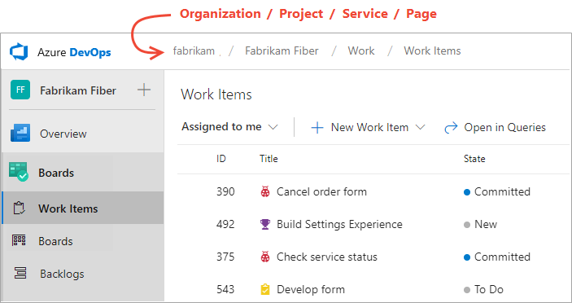
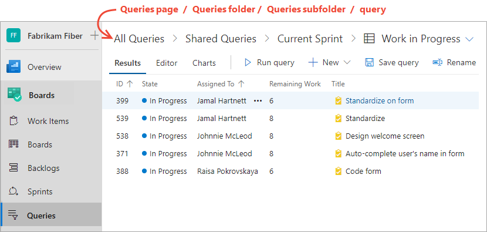

::: moniker range=">= azure-devops-2019"
# Use breadcrumbs, selectors, and directories to navigate and open artifacts 
::: moniker-end

::: moniker range=">= tfs-2017 <= tfs-2018"
# Use breadcrumbs and selectors to navigate and open artifacts 
::: moniker-end

[!INCLUDE [temp](../../_shared/version-tfs-2017-through-vsts.md)] 

To quickly navigate to a feature or artifact&mdash;such as a dashboard, repository, product backlog, Kanban board, build pipeline&mdash;you can use breadcrumbs, selectors, and directories. 

## Organization and project breadcrumbs 

::: moniker range=">= azure-devops-2019"

To navigate to the project summary page, choose the project link within the breadcrumbs. To navigate to the organization page with all projects defined for the organization, choose the organization link. 

::: moniker-end

::: moniker range=">= tfs-2017 <= tfs-2018"

Horizontal navigation doesn't provide a breadcrumb structure for the organization and project levels. Instead, you can select a recent team or project from the project/team selector. 

 

Choosing **Browse all** [opens the **projects** page](work-across-projects.md). 

::: moniker-end

## Selectors 

::: moniker range=">= azure-devops-2019"
Selectors are used to select an artifact within the current page. Most Agile tools are defined for a team and therefore require selection of the team artifact or tool.  
::: moniker-end

::: moniker range=">= tfs-2017 <= tfs-2018"
Selectors are used to select an artifact within the current page. Most Agile tools are defined for a team and therefore require selection of the team as well as the specific page.  
::: moniker-end

> [!NOTE]  
> When you navigate to a specific page or artifact, the system remembers your selection. You use selectors to choose a different artifact within the current page. 

### Example: Dashboard selector 

::: moniker range=">= azure-devops-2019"

Within **Dashboards**, you open a specific dashboard from the selector. 

> [!div class="mx-imgBorder"]  
>  

This particular selector features these navigational elements: 

- Search box for filtering dashboards based on a team name or keyword 
- Two pages you can choose from:
	- **Mine** (dashboards you created) which are organized by team
	- **All** (dashboards created by everyone) which are listed alphabetically
- Dashboards you've favorited will appear at the top of the selector 
- **Add new dashboard** feature
- **Browse all dashboards** - opens **Dashboards>All** 

::: moniker-end

::: moniker range=">= tfs-2017 <= tfs-2018"

Within **Dashboards**, you select the team whose dashboards you want to view. 

Then, choose the name of the dashboard to view it. 

For example, here we open the *Work in Progress* dashboard. 

> [!div class="mx-imgBorder"]  
>   

::: moniker-end

### Example: Backlogs 

::: moniker range=">= azure-devops-2019"

From the **Boards>Backlogs** page, you use the selector to switch to another team's backlog. Again, favorited backlogs appear towards the top of the menu. You can also filter the list based on a team name or keyword.  

> [!div class="mx-imgBorder"]  
>  

Or, choose **Browse all team backlogs** to open the **Backlogs>All** page.

::: moniker-end

::: moniker range=">= tfs-2017 <= tfs-2018"

(1) Select the team from the project/team selector, choose (2) **Work**, (3) **Backlogs**, and then (4) the product backlog, which is **Backlog items** (for Scrum), **Stories** (for Agile), or **Requirements** (for CMMI). 

> [!div class="mx-imgBorder"]
>  

To choose another team, open the project/team selector and select a different team or choose the **Browse** option. 

> [!div class="mx-imgBorder"]  
>  

::: moniker-end

## Artifact breadcrumbs and selectors  

Within select pages, breadcrumbs are provided to support navigating within the page or opening an artifact.  

::: moniker range=">= azure-devops-2019"

### Example: Queries folders and breadcrumbs
For example, when working in the **Queries** pages, you can navigate to a subfolder, folder, or page.

Also, you can choose a query that you've favorited from the selector menu, Or, you can choose to browse all queries which returns you to the **All Queries** page. 
  
> [!div class="mx-imgBorder"]  
>  

::: moniker-end

### Example: Pipeline folders and breadcrumbs
Breadcrumb-and-selector navigation elements are used within most services that support defining and organizing artifacts within folders. This includes **Pipelines** or **Build and Release** applications pages. 

::: moniker range=">= azure-devops-2019"

> [!div class="mx-imgBorder"]  
>  

::: moniker-end

::: moniker range=">= tfs-2017 <= tfs-2018"

Choose the **Deployment** breadcrumb link to return to the *Deployment* folder. 

> [!div class="mx-imgBorder"]  
> 
>  
::: moniker-end

::: moniker range=">= azure-devops-2019"

## Directories 

Directories provide a filterable list of all artifacts defined for a service area. Often times when you navigate to an application, it will open the application's directory. 

For example, here is the **Boards>Boards** directory. 

> [!div class="mx-imgBorder"]  
> 

It lists boards in the following order: 
- Your last visited board
- Your favorited boards
- All boards of teams that you belong to
- All boards defined for the project in alphabetical order. 

Choose the  filter icon to filter the list as described in [Filter basics](filter-basics.md).

From a specific page, you can open the directory from the breadcrumbs or a selector. For example, choose **Browse all boards** from the Boards selector. 

> [!div class="mx-tdCol2BreakAll"]  
> | Open from breadcrumb | Open from selector |
> |------|---------|
> | ||

::: moniker-end

::: moniker range=">= azure-devops-2019"
## Team profiles

- Open a team profile to quickly access items defined for a team. The team profile is available from the **Overview>Dashboards**, **Boards>Boards**, **Boards>Backlogs**, and **Boards>Sprints** pages. 

	> [!div class="mx-imgBorder"]  
	> 

	A panel opens that shows all items defined for the team. 

	> [!div class="mx-imgBorder"]  
	> 

- You can filter the list to show only **Dashboards**, **Boards**, **Backlogs**, or  **Sprints** by choosing from the menu. 

	> [!div class="mx-imgBorder"]  
	> 

- To view the team admins and members of the team, choose **Members**. 

	> [!div class="mx-imgBorder"]  
	> 

- To view or change the team configuration, choose **Team Settings**.  
	You can then add [team members](../../organizations/security/add-users-team-project.md#add-team-members), [team admins](../../organizations/settings/add-team-administrator.md), or navigate to [team notifications](../../notifications/howto-manage-team-notifications.md), or team [iterations](../../organizations/settings/set-iteration-paths-sprints.md#open-team-settings) and [area paths](../../organizations/settings/set-area-paths.md#open-team-settings). 

See also [Manage and configure team tools](../../organizations/settings/manage-teams.md).

::: moniker-end

## Related articles

- [About teams and Agile tools](../../organizations/settings/about-teams-and-settings.md )
- [Add an artifact or team](add-artifact-team.md) 
- [Set favorites](set-favorites.md) 
- [Open a service or page](go-to-service-page.md) 
- [Filter basics](filter-basics.md) 
