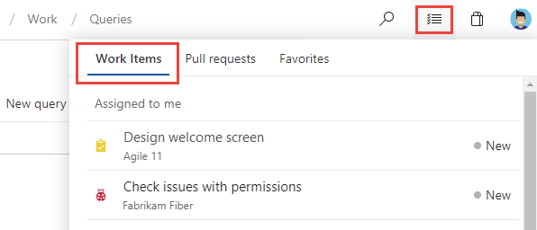
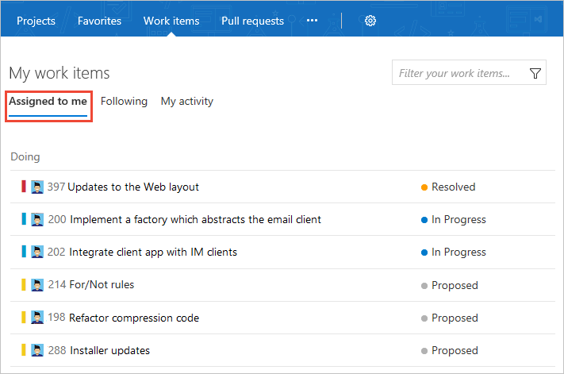
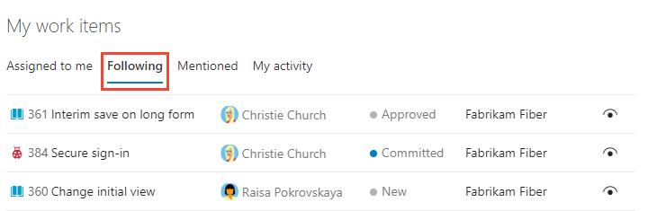
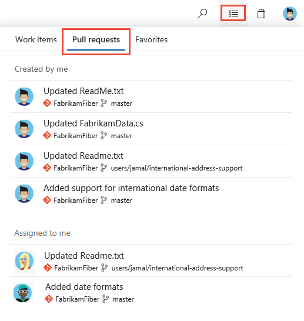
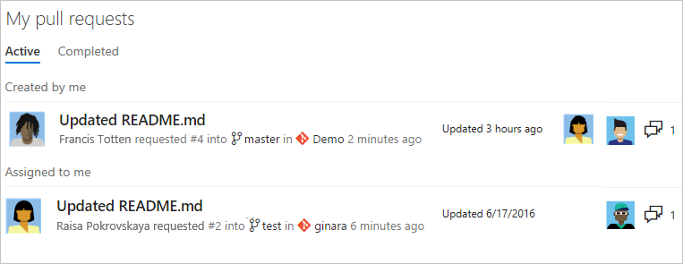
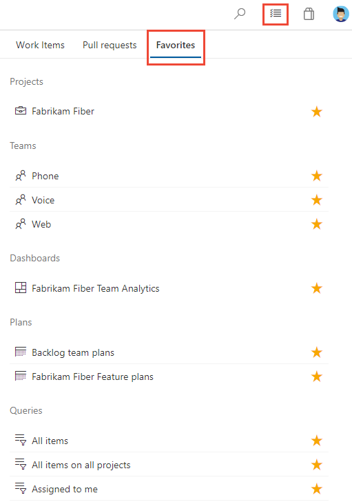
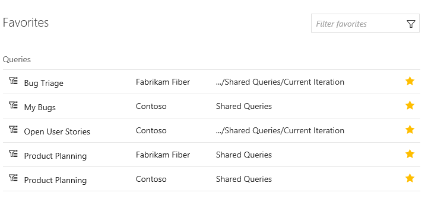
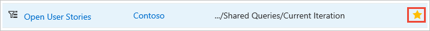
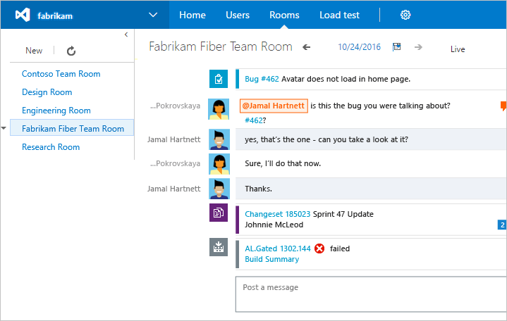

---
title: Work across projects 
titleSuffix: Azure DevOps
description: How to access work items, pull requests, team projects, and more using your account home page in Azure DevOps
ms.custom: navigation, cross-project
ms.technology: devops-collab
ms.assetid: B4406575-4D4D-42E3-88FD-93830546B67F
ms.topic: conceptual
ms.author: kaelli   
author: KathrynEE
monikerRange: '>= tfs-2017'
ms.date: 11/16/2020
--- 

# Work across projects

[!INCLUDE [temp](../../includes/version-tfs-2017-through-vsts.md)] 

When you work on several projects, you can use select pages to support your cross-project work. These pages provide quick access and filter functions to support your work within a single project or work you're doing across several projects.  

For example, you can quickly access and navigate to the following artifacts defined across projects.  

::: moniker range=">= azure-devops-2019"
- **Projects**: Projects defined for an organization in Azure DevOps
- **Work items**: Work items assigned to you
- **Pull requests**: Pull requests you've initiated or that are relevant to you across all team projects you work in
- **Favorites**: Artifacts&mdash;such as projects, teams, repositories, shared queries, and more &mdash;that you've favorited

::: moniker-end  

::: moniker range="tfs-2018"
- **Projects**: Team projects and teams within the projects that you work in  
- **Favorites**: Items&mdash;such as build definitions, repositories, shared queries, and more &mdash;that you've favorited  
- **Work items**: Work items assigned to you, that you're following, or that you've recently viewed or updated  
- **Pull requests**: Pull requests you've initiated or that are relevant to you across all team projects you work in   

::: moniker-end

::: moniker range="tfs-2017"
- **Projects**: Team projects and teams within the projects that you work in  
- **Favorites**: Items&mdash;such as build definitions, repositories, shared queries, and more &mdash;that you've favorited  
- **Work items**: Work items assigned to you, that you're following, or that you've recently viewed or updated  
- **Pull requests**: Pull requests you've initiated or that are relevant to you across all team projects you work in   
- **Rooms**: Team rooms you use to collaborate with other team members.  

> [!NOTE]  
> The features described in this article require TFS 2017.1 and later versions. To upgrade to TFS 2017.1, go to the [Visual Studio downloads page](https://visualstudio.microsoft.com/downloads/download-visual-studio-vs).  

::: moniker-end

To switch to another project, see [Switch project, repository, or team](go-to-project-repo.md). 

For additional notes on working across projects, see [Work across projects FAQs](../work-across-projects-faqs.yml). 

## Prerequisites 
 
* You must be added to a project as a member of the **Contributors** or administrator security group. To get added, [Add users to a project or team](../../organizations/security/add-users-team-project.md). 
 
::: moniker range="azure-devops"  
> [!NOTE]  
> Users added to the **Project-Scoped Users** group can only access those projects they've been explicitly added to. To learn more, see [About projects and scaling your organization, Project-scoped Users group ](../../organizations/projects/about-projects.md#project-scoped-user-group). 
  ::: moniker-end  

## View and open work items

::: moniker range=">= azure-devops-2019"

To view work items assigned to you across projects, choose the :::image type="icon" source="../../media/icons/inbox.png" border="false"::: inbox icon, and then choosing **Work Items**. 

> [!div class="mx-imgBorder"]  
>  

To view work items assigned to you for a specific project, [open **Work>Work Items>Assigned to Me**](../../boards/work-items/view-add-work-items.md). 

::: moniker-end

::: moniker range=">= tfs-2017 <= tfs-2018"

Choose the :::image type="icon" source="../../media/icons/project-icon.png" border="false"::: Azure DevOps logo to open **Projects**. 

> [!div class="mx-imgBorder"]  
>    

::: moniker-end

::: moniker range=">= tfs-2017 <= tfs-2018"
Choose **Work items** to access the set of work items assigned to you or followed by you. The lists available from each page span all team projects that you work in.

The **Assigned to me** page lists all work items assigned to you in the order they were last updated. To open or update a work item, choose its title.

 

::: moniker-end

### Work you're following

Choose **Following** to open the page that lists all the work items [you've marked to follow](../../boards/work-items/follow-work-items.md). To stop following an item and remove it from your list, choose the  following icon.

::: moniker range=">= azure-devops-2019"
> [!div class="mx-imgBorder"]  
>   
::: moniker-end

::: moniker range=">= tfs-2017 <= tfs-2018"
 
::: moniker-end

::: moniker range=">= azure-devops-2019"
### My activity

Choose **My activity** to open the page that lists all work items that you have recently viewed or updated.  

> [!div class="mx-imgBorder"]  
>  

::: moniker-end 

### Filter the list of work items

Similar to the Favorites page, you can filter the work pages by typing a keyword in the *Filter your work items...* box. The list will filter based on keyword matches to the work item ID, title, state, or team project name.

## View and open pull requests

::: moniker range=">= azure-devops-2019"

To view pull requests you created  or that are assigned to you across projects, choose the :::image type="icon" source="../../media/icons/inbox.png" border="false"::: inbox icon, and then choosing **Pull requests**. 

> [!div class="mx-imgBorder"]  
>  

::: moniker-end  

::: moniker range=">= tfs-2017 <= tfs-2018"

Open the **Projects>Pull requests** page to access any pull request that's relevant to you across all projects you work in. Choose **Active** or **Completed** to pivot between the active or completed set of pull requests. To initiate a pull request, choose **New pull request**.

 

From each page, you're one choice away from navigating to the branch or repository for a pull request. This mirrors capabilities on the  project **Code>Pull Requests** page.

### Filter the list of pull requests

Similar to the Favorites page, you can filter the list by typing a keyword in the *Filter pull requests* box.

::: moniker-end

## View and open favorites 

You can view favorites you've set across projects. To learn more about working with favorites, see [Set personal or team favorites](set-favorites.md).

::: moniker range=">= azure-devops-2019" 

Choose the :::image type="icon" source="../../media/icons/inbox.png" border="false"::: inbox icon, and then choosing **Favorites**. 

> [!div class="mx-imgBorder"]  
>  

::: moniker-end  

::: moniker range=">= tfs-2017 <= tfs-2018"
Open the **Favorites** page to quickly access any object or item that you've marked as a favorite.

> [!div class="mx-imgBorder"]  
> 

To learn more about working with favorites, see [Set personal and team favorites](set-favorites.md). 

### Favorite and unfavorite an item

To mark any item as a favorite, choose the :::image type="icon" source="../../media/icons/icon-favorite-star.png" border="false"::: star icon next to the object. 

To remove an item from your favorites list, choose the favorited icon.

### Filter the list of favorites

To filter the list, type a keyword in the *Filter favorites* box. The list will filter based on keyword matches to the title or team project name associated with the favorited item.

::: moniker-end

::: moniker range="tfs-2017"
## Open a team room

To open a team room, choose **Projects>Rooms**. You'll see all the team rooms defined for collection of projects. Choose the name of a team room which you have access. You only have access to those team rooms of which you are a team member.  

  

To learn more about team rooms, see [Collaborate in a team room](/previous-versions/azure/devops/notifications/collaborate-in-a-team-room).

> [!NOTE]  
> Team Rooms are no longer supported for TFS 2018 and later versions as described in [Deprecation of Team Rooms](https://blogs.msdn.microsoft.com/devops/2017/01/04/deprecation-of-the-team-rooms-in-team-services-and-tfs/) blog post. Several good solutions are available that integrate well with TFS that support notifications and chat, such as [Microsoft Teams](../../service-hooks/services/teams.md) and [Slack](../../service-hooks/services/slack.md). 
 
::: moniker-end

## Related articles

- [Work across projects FAQs](../work-across-projects-faqs.yml)
- [Manage or enable features](preview-features.md)  
- [Connect to team projects](../../organizations/projects/connect-to-projects.md)  
