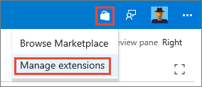

# Set up and administer Code Search, Wiki Search and Work Item Search

[!INCLUDE [version-header](../../_shared/version-tfs-2017-through-vsts.md)]

In this topic:

* **Configure Search (Code, Work Item and Wiki) in Azure DevOps Services**
  - [Install Search extension in Azure DevOps Services](#config-ts-azuredevops)
  - [Uninstall Search extension in Azure DevOps Services](#uninstall-ts-azuredevops)

* **Configure Search (Code, Work Item and Wiki) in Team Foundation Server (TFS)**
  - [Install Search extension](#install-tfs)
  - [Configure Search](#config-tfs)
  - [Secure Search](#secure-search)
  - [Upgrade Search](#upgrading-search)
  - [Manage Search](#manage-tfs)
  - [Uninstall Search](#uninstall-tfs)
  - [Limitations of Search](#limit-tfs)
  - [Troubleshoot Search](#trouble-tfs)

Also see [Install and configure TFS](../../tfs-server/install/get-started.md)
and [TFS requirements and compatibility](/tfs/server/requirements).

>Users with at least a **Basic** access can use Code Search. 
Stakeholders do not have access to code, and therefore no access to Code Search. 
All users have access to Work Item and Wiki Search.

##  Install Search extension in Azure DevOps Services

For Work Item and Wiki search, there is no installation involved as these come as TFS built-in extensions.
For Code Search, go to [Azure DevOps Marketplace](https://marketplace.visualstudio.com/)
to install Code Search extension in Azure DevOps as an administrator.
Non-administrative users can also go here to request the extension be added to Azure DevOps. 

For more details, see [Install an extension](../../marketplace/install-extension.md) in the Marketplace documentation.

## Uninstall Search extension in Azure DevOps Services

For Work Item and Wiki search, users cannot uninstall them as these come as TFS built-in extensions.
For Code Search, see [Uninstall or disable an extension](../../marketplace/uninstall-disable-extensions.md) 
in the Marketplace documentation. 

## Install Search extension

Code Search is available in TFS 2017 and later.
Work Item Search is available in TFS 2017 Update 2 and later.
Wiki Search is available in TFS 2018 Update 2 and later.
Work Item and Wiki search are both TFS built-in extensions, and they are installed by default
during Search configuration. Code Search is an opt-in feature and if users wish, they can install
Code Search later from Local Gallery.

For installing Code Search, go to **Local Gallery** (http://{Server}/tfs/_gallery)
in TFS as an administrator.
Non-administrative users can also go here to request the extension be added to TFS. 

For more details, see [Install an extension](../../marketplace/get-tfs-extensions.md) in the Marketplace documentation.

## Configure Search

Configure the Search service using the dedicated pages in the TFS Configuration Wizard
as you install TFS. You can also [configure and unconfigure Search](#uninstall-tfs)
afterwards by running the TFS Configuration Wizard again or launching the Search Configuration Wizard.

### Hardware recommendations

Search can be used on any size physical server or virtual machine that runs 
TFS 2017 or above. It can be configured on the same server as the TFS,
or on a separate server dedicated to Search.
When configuring Search on the same server as TFS,
you must consider the existing CPU utilization
factor due to TFS itself.

**For production environments we recommend you configure Search on a separate server.**

For acceptable performance in multi-user scenarios, consider the 
following recommendations:

* Less than 250 users with Search co-located on the TFS (typically used for demonstration and trial purposes):
  - Quad core processor, 8 GB (minimum) RAM
  - CPU Utilization factor less than 50%
  - Fast hard drive backed by Solid State Drive (SSD) storage

* Less than 500 users with Search located on a [separate server](#separate-server): 
  - Dual core processor, 8 GB (minimum) RAM
  - Fast hard drive backed by Solid State Drive (SSD) storage

* Less than 1,000 users with Search located on a [separate server](#separate-server):
  - Quad core processor, 16 GB (minimum) RAM
  - Fast hard drive backed by Solid State Drive (SSD) storage

* More than 1,000 users with Search located on a [separate server](#separate-server):
  - Quad core processor, 16 GB (minimum) RAM
  - Fast hard drive backed by Solid State Drive (SSD) or Storage Area Network (SAN) storage

* TFS with Multiple ATs: 
  - Install Search on a [separate server](#separate-server)

* TFS CPU utilization greater than 50% before installing Search:
  - Install Search on a [separate server](#separate-server)

**Disk space requirement**:

The amount of disk space taken up by Search depends mainly on the type and size of files that will be indexed. 
For Code search, since many times repositories can be large and can have different
code files in version control, disk space requirement could be significant. As a general guideline,
allocate up to 150% of the size of all the repositories that will be indexed. From TFS 2018 Update 3 onwards, users can exclude desired folders from their repositories during the time of indexing if they want to optimize the disk space consumed by search.

### Software Dependencies

Search has the following dependencies, which are installed automatically
as part of the configuration:

* [Elasticsearch](https://www.elastic.co/products/elasticsearch) by Elasticsearch BV (see Notes 1 and 2)
* [Elasticsearch NEST client](https://www.elastic.co/guide/en/elasticsearch/client/net-api/current/index.html) 
* [Azul Zulu OpenJDK](https://www.azul.com/downloads/zulu/zulu-windows/) (see Java installation notes below)
* [Markdowndeep](http://www.toptensoftware.com/markdowndeep/) by Topten Software
* [Roslyn](https://github.com/dotnet/roslyn) compiler platform
* [ANTLR](http://www.antlr.org/) language recognition parser

**NOTES**:
 
1. A modified version of Elasticsearch ships with TFS. 
   Search will work only with this version of Elasticsearch.  
2. A newer version of Elasticsearch ships with TFS 2018 Update 2 and above. Upgrading from an older version of Search will result in all content being re-indexed after the installation.
   Depending on the volume of content (code files, work items, and wiki pages), re-indexing can take some time to complete.
3. The system or TFS administrator must ensure that Server JRE is
  maintained and updated in line with the software provider's recommendations. 
  Also see the [Java installation notes](#java-notes) that follow.

#### Java installation notes

If the Search configuration wizard does not detect a working installation of 
Java Server JRE, it provides an option to download and install the latest version. 
Internet connectivity is required to download this from the Java website.
If the target server does not have Internet connectivity, you must download 
and install Server JRE manually before attempting to install Search.

During installation, the wizard sets the **JAVA\_HOME** environment variable 
to point to the Server JRE installation folder. The configuration wizard may fail 
to detect an existing Server JRE installation if it is not correctly configured, 
or if the **JAVA\_HOME** setting points to an earlier version than that required 
by Search. 

If there is a version of Server JRE **earlier** than the minimum required by  
Search, and the **JAVA\_HOME** variable is set to that version, we recommend 
you install Search on a separate server because changing the value 
of the **JAVA\_HOME** variable may cause other installed software to fail.

If there is a version of Server JRE **equal to or later** than the minimum required 
by Search, and it is not recognized by the configuration wizard, you
must set the value of the **JAVA\_HOME** variable to that version as described in
the **[Zulu Installation Guide](http://docs.azul.com/zulu/zuludocs/index.htm)**,
and then rerun the configuration wizard. 

If you cannot install the version of Java required by Search due to other dependencies, you can:

* Install TFS and Search together on a different server that does
  not have Java installed (not recommended for more than 250 users or CPU utilization greater than 50% or multiple ATs).

* Install Search and Java on a [separate server](#separate-server) from TFS.

> [!NOTE]
> * Search does not use or support any of the commercial features of Server JRE 8. Therefore, during Search configuration on TFS,
the commercial features of the Server JRE are neither activated nor unlocked.
> * TFS Search will support both Azul Zulu OpenJDK and Oracle JRE, allowing you to choose between them based on your needs.
> * If you choose to continue with Oracle JRE, then please contact Oracle for a [Java SE Subscription](https://www.oracle.com/java/java-se-subscription.html), 
so that you can continue to receive JRE updates. If you choose to use Azul Zulu OpenJDK, please visit Zulu OpenJDK [downloads](https://www.azul.com/downloads/zulu/zulu-windows/) for updates.
> * Existing users of TFS Search can easily switch from Oracle JRE to Azul Zulu OpenJDK without incurring any TFS downtime 
in a few simple steps, as explained in the diagram below. You can find detailed step-by-step guidance based on the TFS version 
[here](https://github.com/msftazdev/Code-Search/tree/master/Java%20Migration).

> * Note that from the release of TFS (Azure DevOps Server 2019), 
customers selecting installation of Java during install time will be defaulted to Azul Zulu OpenJDK 8.

### Installation considerations

Consider the following when configuring Search:

* Both Work Item and Wiki search are enabled by default when Search is Configured. These extensions can 
  be later removed if required from **Manage Extensions** page of your source TFS instance.

* The Code Search extension must be installed for each TFS collection where you want to use it. 
  When initially configuring Search, you can set a checkbox to **Automatically install Code Search extension 
  for existing and new Project Collections** to automate this process.

* If you do not set the checkbox to install the Code Search extension for all your Project Collection, while 
  configuring Search, your Project Collection administrator can install it from Local Gallery. Make 
  sure you navigate to the Local Gallery from your TFS portal page. 

* The search index folder should be located on a separate fast hard drive backed by fast storage such
  as a solid-state drive (SSD) or Storage Area Network (SAN) to maximize search performance.
  As a general guideline, allocate up to 150% of the size of all the repositories that will be indexed. 
  That is the worst-case scenario; the actual space consumed is dictated by the amount and type of code files, amount of work items and wiki pages in that collection.

* Unless specified, the indexing service and Elasticsearch engine use the network service account during 
  installation to create and access the index files. If you choose a different account, it must have **Log on as a service**
  permission. 

* Restrict the permissions for the index disk and folder to protect the index
  from accidental or malicious modification or deletion, and configure appropriate 
  [security settings](#secure-search) for the service.

* When configuring Search for a TFS with **multiple application tiers (ATs)**, make sure Search is installed on a [separate server](#separate-server). After Search is installed 
  on the remote server, use the Configuration wizard on any one of the ATs to link the search instance with your TFS instance. When unconfiguring Search in future 
  you must use the Configuration wizard on the same AT where configuration was done.

* If you are performing a **pre-production upgrade** on a TFS where Search is already configured, you must fully
  reconfigure Search again to avoid corrupting your production instance of Search. For this reason, there is no option to configure 
  Search as part of a pre-production upgrade. Instead, configure it after the pre-production upgrade is complete. 
  As this is a pre-production upgrade, you can choose to uncheck **Automatically install and configure Code Search for all existing and new collections**
  during configuration, and instead install the Code Search extension for just one or two of your collections after configuration is complete.

* If you are performing a **production upgrade** on a TFS where Search is already configured, and want to retain the Search feature, 
  you must set the checkbox to **Install and Configure Search**. At this point the wizard will detect your existing Search instance and 
  automatically select the **Use existing Search instance** option and pre-populate your current Search service URL.
  Use the **Install a new Search instance** option only if you want to set up a new instance of Search on the same TFS.
  Setting up a new instance causes all your code, work item and wiki to be indexed again, which - depending on the size of the collections - can take some time.
  During indexing, users may see partial search results. 

* If you are **upgrading your TFS to new hardware**,
  depending on how Search was previously configured, you have two options:

  - If Search was configured on a separate server, you must select **Install and Configure Search** in the TFS wizard,
    and subsequently select **Use an existing Search instance** 
    and provide the URL of your existing Search instance to complete the Search configuration. 
    
  - If Search was configured alongside your TFS instance on the old server, you must select **Install and Configure Search**
    in the TFS wizard, and subsequently select **Install a new Search instance** 
    again on the new TFS if you want to continue to co-host Search and TFS.
    This will cause all Search indexes for all collections to be re-created which,
    depending on the size of each collection, might take some time.

    
* If you are **detaching a collection** from one TFS instance in order to attach it to another TFS instance, ensure that:

  - Search has been configured on the target TFS instance.
  - Before you detach the collection, you have uninstalled the Search extension (Code, Work Item or Wiki) for that collection from the **Manage Extensions** page of your source TFS instance.
  - After you attach the collection to the target TFS instance, you install the Search extension (Code, Work Item or Wiki) for that collection from the Local Gallery by browsing to it from that TFS instance.

### Installing or Updating Search on a separate server

To install or update  Search on a separate (remote) server, typically when you have more than 250 users,
follow these steps:

1. As you install TFS on the primary server, set the **Install and configure Search** checkbox 
   in the **Search** page of the TFS Configuration Wizard.

1. Select the option to **Use an existing Search service**. 

1. Use the **Search service package** link provided in the wizard to access a set of Search installer files 
   on the local machine, and then copy these files to the remote server.

   

1. Follow the instructions in the **Readme.txt** file located in the set of 
   installer files to install or update the Search service on the remote server.

1. After the installation of the Search service on the remote server is complete,
   copy the resulting Search server URL into the **Search URL** field of the 
   configuration wizard running on the TFS.

1. When both installations are complete, configure appropriate 
   [security settings](#secure-search) for both servers.

## Secure Search

The Search service uses a modified version of 
[Elasticsearch](https://www.elastic.co/products/elasticsearch) 
(the terms "Search" and "Elasticsearch" are used 
interchangeably for the remainder of this section). 
TFS Admins will need to provide credentials as part of configuring Search feature 
(through Server or Search configuration wizard) whether Search service 
is on the same machine as TFS,
or on a separate machine. These are new set of credentials (not related to any pre-existing account / TFS credentials) 
and are used to set up and connect to Search service.
These new set of credentials will enable basic authentication in search service. 

   

In case of an upgrade from TFS 2018 Update 1.1 to TFS 2018 Update 3 or in case of search re-configuration, 
only the user information gets auto-populated and TFS Admins will need to provide password credentials. 
TFS Admins have an option to provide different username and 
password if they desire to do so. If Search service is 
on the same machine as TFS and Admins want to change the credentials,
they just need to provide a new set of credentials in the configuration wizard and Search service will be setup. 
But if Search service is on a remote machine and TFS Admins want to change the username and password, 
they need to provide the new credentials first to the Search service setup script.

**Note**: 
1. Username and password values should both be between 8 and 64 characters in length. While password can be assigned any value,
username can only contain alphanumeric/underscore characters. 
2. Search credentials will only authenticate the users and makes 
sure that unauthenticated users cannot access the Elasticsearch endpoint. 
But since Elasticsearch does not support HTTPS, these auth credentials are sent 
over the network as Base64 encoded strings. If you think there is a possibility of 
someone sniffing the credentials, it is vital that you configure appropriate security 
settings based on your corporate security and compliance requirements.
3. Irrespective of the TFS version that you use, you should aim to limit access to both searching and indexing 
to specific users or user groups for which we recommend using encryption through IPSec. 
Consider the following techniques for using IPSec to secure Elasticsearch on a Windows server.

#### Configure security with authentication only

This ensures only authorized users can access 
the Elasticsearch port. It requires only service-side
rules (firewall rules on only on the server running 
Elasticsearch).

**Prerequisite**: TFS must be configured with a domain account.

Follow the steps in [Creating Firewall Rules that Allow IPsec-protected Network Traffic](https://technet.microsoft.com/library/cc754873%28v%3Dws.10%29.aspx).

#### Configure security with authentication, integrity protection, and encryption

This ensures encryption and integrity protection 
are applied along with authentication. It requires 
both client-side and service-side rules (firewall rules
on the server running Elasticsearch and all
TFS App Tier servers).

**Prerequisite**: TFS must be configured with a domain account.

Follow the steps in [Isolating a Server by Requiring Encryption and Group Membership](https://technet.microsoft.com/library/cc772460%28v%3Dws.10%29.aspx).

## Upgrade Search

TFS 2017 Update 1 includes updated Search components. If the Search
service was configured in TFS 2017 RTM then, during an upgrade, the
Search service components will be updated automatically if the Search
service was configured on the TFS that is being upgraded.
If Search was configured on a remote server, follow
[these instructions](#separate-server) to update it.

TFS 2017 Update 2 includes Work items Search. It uses the same Search service as Code Search.
If the Search service was configured in TFS 2017 RTM/Update1 then, during an upgrade, the
Search service components will be updated automatically if the Search
service was configured on the TFS that is being upgraded.
If Search was configured on a remote server, follow
[these instructions](#separate-server) to update it.

TFS 2018 Update 2 includes updated Search components and Wiki Search. If the Search service was configured in TFS 2017 RTM, Update1, Update2, or TFS 2018 RTM then, during an upgrade, the
Search service components will be updated automatically if the Search
service was configured on the TFS that is being upgraded.
If Search was configured on a remote server, follow
[these instructions](#separate-server) to update it. In both cases, all existing content (code files and work items) will be automatically re-indexed to support the updated components after configuration. Depending on the volume of content, this might take some time to complete.

TFS 2018 Update 1.1 and TFS 2018 Update 3 include basic authentication for the communication 
between the TFS and Search service to make it more secure. Any user installing or upgrading 
to TFS 2018 Update 1.1 or TFS 2018 Update 3 will need to provide credentials as part of configuring Search feature 
(through Server or Search configuration wizard).

## Manage Search

Search is managed by running PowerShell and SQL scripts. All of
these scripts are available to download from 
**[this GitHub repository](https://github.com/Microsoft/Code-Search)**.
You may wish to download all of the scripts into a local folder on your TFS
server using the **Download ZIP** option. The PowerShell scripts require the SQL script files, so ensure 
the **SqlScripts** folder and its contents is present, along with the PowerShell scripts.

> [!NOTE]
> When executing scripts, ensure you run the appropriate script for your TFS version:
> 
> * [TFS 2017 RTM](https://github.com/Microsoft/Code-Search/tree/master/TFS_2017RTW)
> * [TFS 2017 Update 1](https://github.com/Microsoft/Code-Search/tree/master/TFS_2017Update1)
> * [TFS 2017 Update 2](https://github.com/Microsoft/Code-Search/tree/master/TFS_2017Update2)
> * [TFS 2017 Update 3](https://github.com/Microsoft/Code-Search/tree/master/TFS_2017Update3)
> * [TFS 2018 RTM](https://github.com/Microsoft/Code-Search/tree/master/TFS_2018RTW)
> * [TFS 2018 Update 1](https://github.com/Microsoft/Code-Search/tree/master/TFS_2018Update1)
> * [TFS 2018 Update 2](https://github.com/Microsoft/Code-Search/tree/master/TFS_2018Update2)
> * [TFS 2018 Update 3](https://github.com/Microsoft/Code-Search/tree/master/TFS_2018Update3)

### Check indexing status for TFS 2017 RTM

(For TFS 2017 Update 1, see the [next section](#index-update1))

To check the indexing status after Search is configured, or after the extension is installed for a collection:

1. Execute the **CheckIndexingStatus.ps1** script with administrative privileges. 
   You will be prompted to enter:

   - The SQL server instance name where the TFS configuration database resides.
   - The name of the TFS collection database.
   - The name of the TFS configuration database.
   - The name of the collection.
   - The number of previous days to check indexing status.

1. Check the following outputs:
 
   - **Collection indexing was triggered successfully**: Indicates that 
     indexing is in progress. If it is displayed, check the following outputs.
     If it is not displayed, go to step 3 below. 

   - **Repositories Indexing Completed**: The repositories whose indexing 
      has been completed and are now searchable.  

   - **Repositories in File Discovery Phase**: The repositories where files
      are yet to be discovered. The files are indexed after this stage. 
      Repositories in this state are not yet searchable. The number of 
      files already discovered for indexing in each repository is shown, and this 
      number should be increasing as more files are discovered. 

   - **Repositories Indexing In Progress**: These repositories are partially
     indexed and should be searchable now, even if the results are only partial.

 
1. It takes some time for indexing to complete. Execute the **CheckIndexingStatus.ps1** script
   at intervals to check indexing progress.

1. If indexing is not occurring, or indexing is in progress but the number of 
   files pending or the number of files discovered has not changed for some time,
   or no results are returned for a search, trigger indexing again by running 
   the **TriggerCollectionIndexing.ps1** script in a PowerShell window with administrative permission. 

1. If the problem persists, contact customer support at the address shown at the end of this topic. 

### Check indexing status for TFS 2017 Update 1 and above

To check the indexing status after Search is configured, or after the extension is installed for a collection:

1. Execute the **ExtensionInstallIndexingStatus.ps1** script with administrative privileges. 
   You will be prompted to enter:

   - The SQL server instance name where the TFS configuration database resides.
   - The name of the TFS collection database.
   - The name of the TFS configuration database.
   - The name of the collection.
   - The number of previous days to check indexing status.

 
1. Check the following outputs:

   - **Collection indexing was triggered successfully**: Indicates that 
     indexing is in progress. If it is displayed, check the following outputs.
     If it is not displayed, go to step 3 below. 

   - **Repositories completed indexing**: The number of repositories for which indexing has completed and are searchable.
    
   - **Status of repositories currently indexing**: A list of the names of all the repositories that are still being indexed and are partially searchable.

 
1. It takes some time for indexing to complete. Execute the **RecentIndexingActivity.ps1** script at intervals to check indexing progress. This script takes the same parameters as the **ExtensionInstallIndexingStatus.ps1** script.

   - **Repositories completed fresh indexing**: The number of repositories for which indexing has completed within the specified time interval.

   - **Count of repositories with fresh indexing in progress**: The number of repositories for which indexing has not yet completed. These repositories are still being indexed and are partially searchable.

   - **Repositories completed continuous indexing**: The number of commits processed in the specified time interval. The number may not exactly match the total number of pushes to the repository because merges are committed as they are indexed.

   - **Count of repositories with continuous indexing in progress**: The number of repositories for which the commits are still being processed. These repositories will show incomplete results until indexing is completed.

   
   - **Count of indexing job failures**: The number of indexing jobs that failed. Repositories associated with these indexing jobs could potentially show incomplete results until subsequent indexing jobs for the same repositories have patched the failed indexing.

### Pause indexing

To pause all indexing, execute the script **PauseSearchIndexing.ps1** 
with administrative privileges. Useful if you see spikes in CPU utilization after configuring Search.

You will be prompted to enter:

* The SQL server instance name where the TFS configuration database resides.
* The name of the TFS configuration database.

### Resume indexing

If indexing was paused, execute the script **StartSearchIndexing.ps1**
with administrative privileges, to start indexing again. 
You will be prompted to enter:

* The SQL server instance name where the TFS configuration database resides.
* The name of the TFS configuration database.

### Re-index a repository or collection

To re-index a Git or TFVC repository, execute the appropriate
version of the script **Re-IndexingRepository.ps1** for your TFS version
with administrative privileges. You will be prompted to enter:

* The SQL server instance name where the TFS configuration database resides.
* The name of the TFS collection database.
* The name of the TFS configuration database.
* The type of re-indexing to execute. This can be one of the values:
  - **Git\_Repository**
  - **TFVC\_Repository**
* The name of the collection.
* The name of the repository to re-index.

To re-index a **collection**, execute the script **TriggerCollectionIndexing.ps1**
with administrative privileges. You will be prompted to enter:

* The SQL server instance name where the TFS configuration database resides.
* The name of the TFS collection database.
* The name of the TFS configuration database.
* The name of the collection.

Re-indexing a collection can take from a few minutes 
to a few hours, depending on the size of the collection. 

Also see **[Troubleshoot Search](#trouble-tfs)**.

## Uninstall Search

In cases such as a pre-production upgrade, production upgrade, new hardware migration, cloning,
or other maintenance operation, the TFS wizard will unconfigure Search in a way that makes it easy to re-configure it after the TFS maintenance operation is complete.

However, there might be cases where you no longer want to use Search or you want to perform a new and clean
install. This requires multiple steps, depending on whether Search is configured
[on the same server as TFS ](#unconfig-same-server) or on a [separate server](#unconfig-separate-server).

### Unconfigure Search on the machine configured as your TFS

1. Uninstall the Search extension for each collection where it is installed.
   Do this by navigating to the **Manage Extensions** page of each collection in
   your TFS:

# [New navigation](#tab/new-nav)

   

# [Previous navigation](#tab/previous-nav)

   

---

1. Remove the Search feature:

   1. Open the TFS Administration Console.
   1. In the left pane, select the name of the TFS.
   1. In the right pane, choose **Remove Feature**.
   1. In the Remove Feature dialog, select **TFS Search service** and choose **Remove**.

  
1. Remove the Elasticsearch service:

   1. Open **Command Prompt** as an administrator
   1. Change directory: 

      For TFS 2017 RTM, `cd "C:\Program Files\Microsoft Team Foundation Server 15.0\Search\ES\elasticsearch-1.7.1-SNAPSHOT\bin"`

      For TFS 2017 Update 1, `cd "C:\Program Files\Microsoft Team Foundation Server 15.0\Search\ES\elasticsearch-2.4.1\bin"`
      
      For TFS 2018 Update 2 and above, `cd "C:\Program Files\Microsoft Team Foundation Server 15.0\Search\ES\elasticsearch-5.4.1\bin"`

   1. Remove the service:

      For TFS 2017, `"service.bat remove"`

      For TFS 2018, `"elasticsearch-service.bat remove"`
    
1. Remove Search data:

   * Delete the contents of the location described by the environment variable `SEARCH_ES_INDEX_PATH`

    
1. Remove environment variables:

   1. Delete the environment variable `"SEARCH_ES_INDEX_PATH"`
   1. Delete the environment variable `"ES_HEAP_SIZE"`(This environment variable is obsolete for TFS 2018 Update 2 and above)

    
### Unconfigure Search when its configured on a separate server

1. Uninstall the Search extension (Code, Work Item, or Wiki) for each collection where it is installed. Do this by navigating to the **Manage Extensions** page of each collection in
your TFS.

# [New navigation](#tab/new-nav)

   

# [Previous navigation](#tab/previous-nav)

   

---

1. Remove the Search feature:

   1. Open the TFS Administration Console.
   1. In the left pane, select the name of the TFS.
   1. In the right pane, choose **Remove Feature**.
   1. In the Remove Feature dialog, select **Team Foundation Search service** and choose **Remove**.

1. Remove the Elasticsearch service and data

   1. Open **PowerShell** as an administrator
   1. Go to the folder where **Configure
   
   Search.ps1** is installed along with the rest of the files required for a remote install of Search.
   1. Run the script again with the remove option: 
   
      For TFS 2017 RTM, `"Configure
      Search.ps1 -RemoveTFSSearch"`

      For TFS 2017 Update1 and above, `"ConfigureTFSSearch.ps1 -remove"`

  

## Limitations of Search

Search for TFS has the following limitations: 

* If you perform a disaster recovery (DR) operation and move your TFS back 
  to an earlier snapshot of your SQL database, you will need to re-index all your collections [re-index the collections](#re-index).  

## Troubleshoot Search

* [Search is configured but the Search box is not displayed](#no-search-box)
* [No search results are shown after installing or configuring Search](#no-results-install)
* [How do I know if indexing was triggered for all the collections?](#indexing-status-for-collections)
* [Search stops working and no results are shown](#no-results-later)
* [Search does not show the expected results](#unexpected-results)
* [TFS overall performance is affected](#server-slow)
* ["Unexpected error in Search service" message](https://blogs.msdn.microsoft.com/tapas_sahoos_blog/2017/09/11/resetting-search-index-in-team-foundation-server/)

**Search is configured but the Search box is not displayed**

1. The search box is shown only in the context of a project page. 
   Navigate to a project and check if the search box is displayed at the top right. 

1. If the search box is not shown, verify that the extension is installed for the collection. 
   If not, [install](#config-ts) or [configure](#config-tfs) the extension.

**No search results are shown after installing or configuring Search**

1. Wait until you are sure sufficient time has elapsed
   after installing or configuring Search. It typically takes
   less than one hour for Search to index a collection, but 
   it may take up to 12 hours depending on 
   the size and number of code files, work items, or wiki pages.

1. If no results are shown after this period, 
   [check indexing status](#check-index). 

**How do I know if indexing was triggered for all the collections?**

* [Check indexing status](#check-index) separately for each collection.

**Search stops working and no results are shown**

Follow these steps. Replace "SearchServer" with the 
name of the server where Search is installed:

1. Access the URL `http://SearchServer:9200` from a web browser
   on a computer in the same domain as the server running Search.
   - If the status returned is `200 - OK`, go to step 2.
   - If any other status is returned, contact support at 
     the address shown at the end of this topic.
   - If you don't get a response, verify that the 
     **elasticsearch-service-x64** service is running on 
     the server where Search is configured. If the service
     is stopped, start it and access the Search server again.  
     If you still get no response, or a response other than
     `200 - OK`, contact support at 
     the address shown at the end of this topic.

1. If the status is 200, access the URL `http://SearchServer:9200/_cat/health?v`
   from a web browser on a computer in the same domain as the server running Search.
   - If the status column shows green/OK, and 
     Search is still not working, contact support at 
     the address shown at the end of this topic. 
   - If the status column shows red/fault, look at the value
     in the **init** or **unassigned** columns. If these are 
     greater than zero, wait for 30 minutes and then
     repeat this step. If the values are unchanged, go to step 3.

1. Access the URL `http://SearchServer:9200/_cat/shards?v`
   from a web browser on a computer in the same domain as the server running Search.
   - Make a note of the values in the **Shard** column for the 
     rows with a **state** value of **unassigned** and contact 
     support at the address shown at the end of this topic.

**Search does not show the expected results**

1. If the files were added in the last few minutes,
   wait for ten minutes or so while they are indexed.
1. [Check indexing status](#check-index) for the collection. 
1. If the files are still not shown in the results, 
   [re-index the repository or collection](#re-index)
   where the files are located.

**TFS overall performance is affected**

1. [Pause all indexing](#pause-index) and see if performance recovers.
1. If performance does recover, consider locating Search 
   on a separate server if you have not already done so.

[!INCLUDE [shared-got-feedback](_shared/shared-got-feedback.md)]
